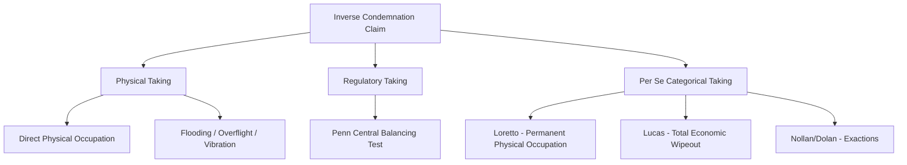

## Inverse Condemnation Claims

### Overview

Inverse condemnation is a cause of action by which a property owner seeks compensation for a governmental taking of property when the government has not initiated formal eminent domain proceedings. It "inverts" the ordinary condemnation posture: rather than the government suing to condemn and pay compensation, the property owner sues the government to establish that a taking has already occurred and to compel payment of just compensation under the Fifth Amendment's Takings Clause (applied to the states via the Fourteenth Amendment) or analogous state constitutional provisions.

**Key Points**

- Inverse condemnation is a remedial doctrine, not an independent substantive taking theory — the plaintiff must still establish that a "taking" occurred under one of the recognized takings frameworks (physical, regulatory, or per se categorical).
- The action is typically initiated by the *property owner*, distinguishing it from a direct condemnation action initiated by the *condemning authority*.
- Ripeness and exhaustion doctrines historically posed significant procedural barriers, substantially narrowed by *Knick v. Township of Scott* (2019).

---

### Doctrinal Foundations

#### Constitutional Basis

The Fifth Amendment provides that private property shall not "be taken for public use, without just compensation." Inverse condemnation actions enforce this guarantee directly, often relying on the self-executing nature of the Takings Clause — the constitutional right to compensation exists independent of any statute authorizing suit.

#### Elements a Plaintiff Must Generally Establish

1. **Property interest**: Plaintiff holds a cognizable property interest (fee ownership, leasehold, easement, or in some jurisdictions a lesser interest) recognized under state property law.
2. **Government action**: The action or omission is attributable to a governmental entity (state, local, or federal) or an entity exercising delegated governmental authority.
3. **Taking**: The government action constitutes a taking under one of the recognized frameworks (see below).
4. **Causation**: The government action proximately caused the loss of value, use, or possession.
5. **No formal compensation paid**: Distinguishes inverse condemnation from a direct condemnation award.

---

### Categories of Takings Underlying Inverse Condemnation Claims

#### 1. Physical Takings

Occur when the government physically occupies, invades, or authorizes a third party to occupy private property. Classic inverse condemnation fact patterns include:

- Government-induced flooding of private land (e.g., *United States v. Causby*, 328 U.S. 256 (1946), addressing low-altitude military overflights as a taking of an air easement).
- Government construction causing water runoff, erosion, or debris flow onto private property.
- Utility or infrastructure installation without a formal easement or condemnation.

#### 2. Regulatory Takings

Occur when a regulation, though not physically invasive, goes "too far" in restricting the use or value of property. Governed principally by the ad hoc, multi-factor balancing test from *Penn Central Transportation Co. v. New York City*, 438 U.S. 104 (1978), considering:

- The economic impact of the regulation on the claimant.
- The extent of interference with distinct, investment-backed expectations.
- The character of the government action (e.g., whether it resembles a physical invasion or is a public program adjusting benefits and burdens of economic life).

#### 3. Per Se (Categorical) Takings

Certain government actions are takings as a matter of law without the *Penn Central* balancing inquiry:

- **Permanent physical occupation**: *Loretto v. Teleprompter Manhattan CATV Corp.*, 458 U.S. 419 (1982) — any permanent physical occupation, however minor, is a per se taking.
- **Total regulatory wipeout**: *Lucas v. South Carolina Coastal Council*, 505 U.S. 1003 (1992) — a regulation denying all economically beneficial use of land is a per se taking, subject to a background-principles-of-property-law defense.
- **Unconstitutional conditions/exactions**: *Nollan v. California Coastal Commission*, 483 U.S. 825 (1987), and *Dolan v. City of Tigard*, 512 U.S. 374 (1994) — permit conditions requiring dedication of property interests must have an "essential nexus" and be "roughly proportional" to the impact of the proposed development, extended to monetary exactions in *Koontz v. St. Johns River Water Management District*, 570 U.S. 595 (2013).

---

### Procedural Posture and Ripeness: Pre- and Post-*Knick*

| Aspect | Pre-*Knick* (Williamson County, 1985) | Post-*Knick* (2019) |
| --- | --- | --- |
| State compensation exhaustion | Required plaintiff to seek compensation via state procedures before federal suit | No longer required; federal claim ripens at the moment of the taking |
| Federal court access | Effectively precluded because state court judgment often triggered preclusion (the "*Williamson County* trap") | Property owners may proceed directly to federal court under 42 U.S.C. §1983 |
| State inverse condemnation actions | Still available in parallel | Remain available; *Knick* did not abolish state remedies, only removed the federal exhaustion bar |

*Knick v. Township of Scott*, 588 U.S. 180 (2019), overruled the state-litigation requirement of *Williamson County Regional Planning Commission v. Hamilton Bank*, 473 U.S. 172 (1985), holding that a Fifth Amendment taking is complete at the time of the government action, so a property owner may bring a federal claim immediately without first pursuing state compensation remedies.

[Inference] Although *Knick* opened the federal forum, plaintiffs may still find state inverse condemnation statutes procedurally advantageous in some jurisdictions (e.g., mandatory attorney's fee-shifting provisions), so the choice of forum after *Knick* is now a strategic decision rather than a jurisdictional necessity.

---

### Distinguishing Inverse Condemnation from Related Actions

| Action | Initiated By | Formal Proceeding? | Compensation Question |
| --- | --- | --- | --- |
| Direct (eminent domain) condemnation | Government | Yes | Determined in the same proceeding |
| Inverse condemnation | Property owner | No prior formal action | Owner must prove a taking occurred, then obtain compensation |
| §1983 civil rights action (post-*Knick*) | Property owner | No | Federal constitutional claim for just compensation |
| Tort/nuisance claim | Property owner | No | Compensatory damages, not constitutional "just compensation"; different elements and defenses (e.g., governmental immunity may bar tort claims but not takings claims) |

**Example**

> A municipality redesigns a stormwater drainage system for a public roadway. Following construction, a downstream landowner's property experiences recurring flooding during ordinary rainfall events that did not occur before the redesign. The landowner did not receive any easement negotiation or condemnation notice. The landowner may bring an inverse condemnation claim alleging a physical taking via induced flooding, analogous to the overflight-easement theory in *Causby*, seeking just compensation for the diminution in value or a permanent flowage easement taken by the government's design choice.

---

### Just Compensation Measure and Remedies

- **Standard measure**: Fair market value of the property interest taken, generally assessed as of the date of the taking.
- **Partial takings**: Compensation may include severance damages to the remainder parcel when only part of the property is physically or functionally taken.
- **Temporary takings**: A regulation later invalidated or rescinded can still give rise to compensation for the period during which it was in effect, per *First English Evangelical Lutheran Church v. County of Los Angeles*, 482 U.S. 304 (1987).
- **Remedy mechanism**: Unlike a direct condemnation action (which determines compensation before or concurrent with the taking), an inverse condemnation judgment typically orders payment after the fact, sometimes structured as a court-ordered easement or "taking" being formalized retroactively.

$$\text{Just Compensation} = FMV_{\text{before}} - FMV_{\text{after}} + \text{Severance Damages (if applicable)}$$

[Unverified] The precise valuation methodology, applicable interest rate on delayed compensation, and availability of consequential damages vary by jurisdiction and by whether the claim proceeds under federal or state law, so practitioners should verify the controlling state inverse condemnation statute and case law for the specific claim.

---

### Diagram: Inverse Condemnation Procedural Flow (svg_diagram)

<svg xmlns="http://www.w3.org/2000/svg" viewBox="0 0 560 260">
<text x="280" y="20" font-size="14" text-anchor="middle" font-weight="bold">Inverse Condemnation Procedural Flow (svg_diagram)</text>
<rect x="20" y="50" width="140" height="50" fill="#dbeafe" stroke="#1e3a8a" stroke-width="2" />
<text x="90" y="80" text-anchor="middle" font-size="11">Government Action</text>
<rect x="210" y="50" width="140" height="50" fill="#fde68a" stroke="#92400e" stroke-width="2" />
<text x="280" y="75" text-anchor="middle" font-size="11">No Formal</text>
<text x="280" y="90" text-anchor="middle" font-size="11">Condemnation Filed</text>
<rect x="400" y="50" width="140" height="50" fill="#fecaca" stroke="#7f1d1d" stroke-width="2" />
<text x="470" y="80" text-anchor="middle" font-size="11">Property Impact/Loss</text>
<line x1="160" y1="75" x2="210" y2="75" stroke="#000" stroke-width="2" marker-end="url(#a1)" />
<line x1="350" y1="75" x2="400" y2="75" stroke="#000" stroke-width="2" marker-end="url(#a1)" />
<rect x="210" y="150" width="140" height="50" fill="#dcfce7" stroke="#166534" stroke-width="2" />
<text x="280" y="175" text-anchor="middle" font-size="11">Owner Files Inverse</text>
<text x="280" y="190" text-anchor="middle" font-size="11">Condemnation Suit</text>
<line x1="470" y1="100" x2="280" y2="150" stroke="#000" stroke-width="2" marker-end="url(#a1)" />
<rect x="210" y="230" width="140" height="30" fill="#e0e7ff" stroke="#3730a3" stroke-width="2" />
<text x="280" y="250" text-anchor="middle" font-size="11">Just Compensation Awarded</text>
<line x1="280" y1="200" x2="280" y2="230" stroke="#000" stroke-width="2" marker-end="url(#a1)" />
</svg>

---

### Common Defenses Raised by Government Defendants

- **No cognizable property interest**: Argues the plaintiff's asserted interest is not a protected property right under state law (relevant for easements, licenses, or expectancy interests).
- **Background principles of property/nuisance law**: Under *Lucas*, a regulation merely codifying a pre-existing common-law nuisance limitation is not a taking, even if it eliminates all economic use.
- **Causation gap**: Argues an independent or intervening cause (e.g., natural flooding unrelated to the government project) produced the harm.
- **Statute of limitations**: Inverse condemnation claims are subject to limitations periods that vary by jurisdiction and may be tied to accrual at the date of injury or the date the taking becomes "stabilized" (particularly relevant in gradual-flooding or erosion cases).
- **Sovereign immunity carve-outs**: While sovereign immunity generally does not bar constitutional takings claims (the Takings Clause is self-executing), procedural immunities and notice-of-claim statutes may still apply to related state-law tort theories pled alongside the takings claim.

---

### Related Topics

- Regulatory Takings: The *Penn Central* Balancing Test in Depth
- Per Se Takings: *Loretto*, *Lucas*, and the Background Principles Defense
- Exactions Doctrine: *Nollan*, *Dolan*, and *Koontz*
- *Knick v. Township of Scott* and the Collapse of the *Williamson County* Ripeness Bar
- Flowage Easements and Government-Induced Flooding Claims
- Temporary Takings and *First English* Compensation Theory