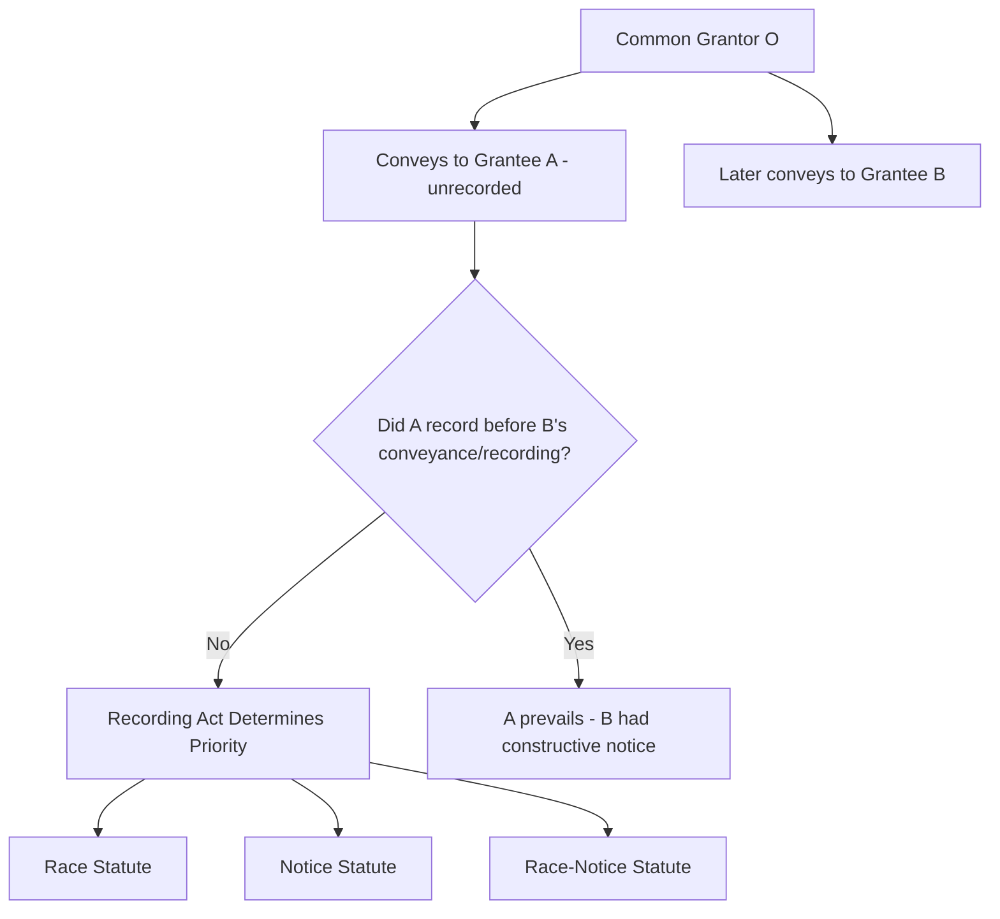

## Recording Acts: Race, Notice, and Race Notice Statutes

### Overview

Recording acts are state statutes that govern the priority of competing claims to the same real property interest, principally by determining when a subsequent purchaser or encumbrancer takes free of, or subject to, a prior unrecorded conveyance or servitude. At common law, priority followed the maxim "first in time, first in right" — but recording acts modify this default to protect subsequent good-faith purchasers and to incentivize prompt recording, which serves the broader title-assurance function underlying the entire public recording system. Three statutory models — **race**, **notice**, and **race-notice** — govern nearly all U.S. jurisdictions, each allocating risk differently between prior grantees who fail to record and subsequent purchasers who fail to search or discover competing claims.

**Key Points**

- Recording acts do not themselves make an unrecorded deed void — an unrecorded conveyance remains valid and enforceable between the original parties; the statutes only determine priority against subsequent competing claimants.
- All three statutory models require a subsequent purchaser problem: a common grantor conveys (or purports to convey) the same interest to two or more parties.
- "Bona fide purchaser" (BFP) status — value plus lack of notice — is the central qualifying concept for protection under notice and race-notice statutes.

---

### The Common-Law Baseline and the Recording Problem

Absent a recording act, a grantor who conveys property to Grantee A and then wrongfully conveys the same property to Grantee B would leave B with nothing, since A's earlier interest controls under first-in-time principles. Recording acts intervene to protect innocent subsequent purchasers who reasonably rely on the public record, provided certain conditions are met. The statutes thus create an exception to first-in-time priority, contingent on the statutory type and the subsequent party's conduct.

---

### 1. Race Statutes

Under a pure race statute, priority goes to whichever party records first, regardless of notice. A subsequent purchaser who records before the prior grantee prevails even if the subsequent purchaser knew of the earlier unrecorded conveyance.

- **Governing rule**: First to record wins — notice is irrelevant.
- **Rationale**: Maximizes certainty and administrability; the public record alone determines the outcome, eliminating costly and unpredictable litigation over actual or inquiry notice.
- **Prevalence**: Only a small minority of states retain pure race statutes, generally limited to specific instrument types (e.g., North Carolina's race statute for most conveyances; Louisiana's registry-based civil law system operates on functionally similar principles for certain recorded instruments). [Unverified] The exact list of pure race jurisdictions should be confirmed against current state statutory text, as classification schemes in secondary sources occasionally differ on borderline states.

**Example**

> O conveys Blackacre to A, who does not record. O then conveys Blackacre to B, who knows of the prior conveyance to A but records immediately. Under a pure race statute, B prevails over A because B recorded first — B's actual knowledge of A's claim is irrelevant to the race inquiry.

---

### 2. Notice Statutes

Under a notice statute, a subsequent bona fide purchaser (one who takes for value and without notice of the prior conveyance) prevails over a prior grantee who failed to record, **regardless of whether the subsequent purchaser records at all**.

- **Governing rule**: Subsequent BFP wins if they lacked notice at the time of their purchase, even if they never record.
- **Rationale**: Protects the reasonable reliance interest of an innocent purchaser who searched the record (or would have found nothing had they searched) at the time of purchase; recording is not itself a race but a means of establishing constructive notice for future purchasers.
- **Majority approach**: Notice statutes are followed by a substantial number of U.S. states.

**Example**

> O conveys Blackacre to A, who does not record. O then conveys Blackacre to B, who pays value and has no actual, constructive, or inquiry notice of A's claim. B does not record either. Under a notice statute, B still prevails over A, because B qualified as a BFP at the moment of purchase — B's own failure to record does not defeat B's priority against A (though it exposes B to a subsequent BFP, C, who might later defeat B).

---

### 3. Race-Notice Statutes

A race-notice statute is a hybrid: the subsequent purchaser must satisfy **both** conditions — (1) be a bona fide purchaser without notice at the time of purchase, **and** (2) record before the prior grantee records.

- **Governing rule**: Subsequent BFP wins only if they record first, in addition to lacking notice.
- **Rationale**: Combines the certainty benefits of the race approach with the fairness protections of the notice approach, but imposes the additional burden of prompt recording on the subsequent purchaser to actually secure protection.
- **Prevalence**: Followed by a substantial number of U.S. states, alongside notice statutes, as one of the two dominant models.

**Example**

> O conveys Blackacre to A, who does not record. O then conveys Blackacre to B, a BFP without notice of A's claim. B delays recording. A discovers the situation and records first. Under a race-notice statute, A now prevails over B — even though B was a BFP without notice at the time of purchase, B failed to satisfy the "race" component by recording first.

---

### Comparative Table

| Statute Type | BFP/Notice Required? | Must Record First? | Prevailing Standard |
| --- | --- | --- | --- |
| Race | No | Yes | First to record, period |
| Notice | Yes | No | Last BFP without notice at time of purchase |
| Race-Notice | Yes | Yes | Last BFP without notice **and** first to record |

---

### The Central Qualifying Concept: Bona Fide Purchaser Status

To claim protection under a notice or race-notice statute, a subsequent party must generally establish:

1. **Status as a purchaser**: Most jurisdictions require the subsequent party to be a purchaser for value (or, under many statutes, a mortgagee or judgment lien creditor extending value); a donee or heir typically does not qualify as a BFP because they gave no value.
2. **Payment of value**: Nominal or token consideration is generally insufficient; the value must be more than nominal, though it need not equal full fair market value.
3. **Lack of notice**, assessed across three recognized categories:
   - **Actual notice**: Direct, subjective knowledge of the prior claim.
   - **Constructive (record) notice**: Notice imputed by law because the prior instrument was properly recorded and discoverable through a reasonable title search within the chain of title.
   - **Inquiry notice**: Notice imputed where circumstances (e.g., visible possession by a third party inconsistent with the record title, or a recorded reference triggering a duty to investigate further) would have led a reasonable purchaser to investigate further, and such investigation would have revealed the prior claim.

**Comparison Table: Notice Categories**

| Notice Type | Source | Triggering Fact |
| --- | --- | --- |
| Actual | Subjective knowledge | Purchaser was directly told or otherwise personally aware |
| Constructive | Public record | Prior instrument recorded within the searchable chain of title |
| Inquiry | Physical/circumstantial facts | Visible possession, unrecorded reference, or other red flag requiring further investigation |

---

### The Shelter Rule

A grantee who takes from a protected BFP generally "steps into the shoes" of that BFP and takes the same priority protection, even if the subsequent grantee personally had notice of the earlier competing claim. This shelter rule prevents a chain-of-title deadlock and allows a BFP's protected title to pass freely to later transferees regardless of the later transferee's own notice status.

**Example**

> Continuing the notice-statute example above: B (a BFP without notice) later sells Blackacre to C, who has actual knowledge of A's earlier unrecorded deed. Under the shelter rule, C nonetheless takes free of A's claim because C is sheltered by B's BFP status — C need not independently qualify as a BFP.

---

### The Chain of Title Problem

Recording alone does not guarantee constructive notice; an instrument must be recorded *within the searchable chain of title* to impute notice to later searchers. Two recurring doctrinal problems arise:

- **Wild deed**: A deed recorded outside the chain of title (e.g., recorded before the grantor's own interest is recorded, so a standard grantor-grantee index search would not locate it) generally does not impute constructive notice to subsequent purchasers.
- **Shelter vs. estoppel by deed interactions**: Some jurisdictions treat after-acquired title and estoppel-by-deed doctrines as creating exceptions to strict chain-of-title searching, which can complicate notice analysis in title examinations. [Inference] Because these doctrines interact differently across jurisdictions, a title examiner's practical search methodology (grantor-grantee index vs. tract index) materially affects what counts as being "within the chain of title" for constructive notice purposes, so the analysis is jurisdiction- and system-dependent rather than uniform.

---

### Diagram: BFP Qualification Decision Path (svg_diagram)

<svg xmlns="http://www.w3.org/2000/svg" viewBox="0 0 560 300">
<text x="280" y="20" font-size="14" text-anchor="middle" font-weight="bold">BFP Qualification Decision Path (svg_diagram)</text>
<rect x="210" y="40" width="140" height="40" fill="#dbeafe" stroke="#1e3a8a" stroke-width="2" />
<text x="280" y="65" text-anchor="middle" font-size="11">Subsequent Purchaser</text>
<line x1="280" y1="80" x2="280" y2="110" stroke="#000" stroke-width="2" marker-end="url(#ar)" />
<rect x="200" y="110" width="160" height="40" fill="#fde68a" stroke="#92400e" stroke-width="2" />
<text x="280" y="135" text-anchor="middle" font-size="11">Gave Value?</text>
<line x1="280" y1="150" x2="280" y2="180" stroke="#000" stroke-width="2" marker-end="url(#ar)" />
<rect x="200" y="180" width="160" height="40" fill="#fde68a" stroke="#92400e" stroke-width="2" />
<text x="280" y="205" text-anchor="middle" font-size="11">No Actual/Constructive/</text>
<text x="280" y="218" text-anchor="middle" font-size="10">Inquiry Notice?</text>
<line x1="280" y1="220" x2="280" y2="250" stroke="#000" stroke-width="2" marker-end="url(#ar)" />
<rect x="200" y="250" width="160" height="40" fill="#dcfce7" stroke="#166534" stroke-width="2" />
<text x="280" y="275" text-anchor="middle" font-size="11">BFP Status Qualified</text>
</svg>

---

### Application to Easements and Servitudes (Chapter Cross-Reference)

Recording acts are directly relevant to easement priority disputes: an unrecorded easement grant is generally enforceable between the original grantor and grantee, but a subsequent bona fide purchaser of the servient estate may take free of that easement under a notice or race-notice statute if the purchaser lacked notice of it. This is why title examiners conduct exhaustive record searches — and physical inspections for inquiry notice (e.g., visible utility lines, worn footpaths, or fence lines suggesting an easement) — before closing, since an easement invisible in the record but discoverable on inspection can still bind a subsequent purchaser through inquiry notice even under a notice or race-notice regime.

---

### Related Topics

- Chain of Title Analysis and the Wild Deed Problem
- Grantor-Grantee Index Systems vs. Tract Index Systems
- Inquiry Notice from Visible Possession and Unrecorded Easements
- Title Insurance and Its Relationship to Recording Act Protection
- Marketable Title Acts and Curative Recording Statutes
- Priority Disputes Involving Mortgages, Judgment Liens, and Mechanics' Liens