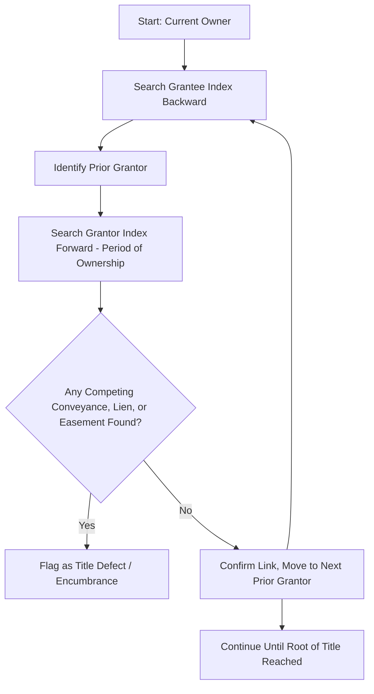

## Chain of Title Examination

### Overview

Chain of title examination is the systematic process of tracing the successive conveyances, encumbrances, and other recorded instruments affecting a parcel of real property to establish a continuous, unbroken record of ownership from a recognized root of title to the present owner. The examination underpins nearly every real estate transaction, title insurance issuance, and easement or servitude dispute, since the legal effect of recording acts (race, notice, race-notice) depends entirely on whether an instrument was recorded *within* the discoverable chain. An examiner's conclusions determine what encumbrances (including easements, covenants, and liens) bind the current owner and are typically compiled into an abstract of title or title opinion.

**Key Points**

- The chain of title is a *derivative* concept — it exists relative to whichever indexing system (grantor-grantee or tract) is used to search the public record, not as an objective, self-evident fact.
- A properly recorded instrument that falls *outside* the searchable chain of title generally does not impute constructive notice to subsequent purchasers (the "wild deed" problem).
- Chain of title examination is the mechanism by which servitudes (easements, covenants, profits) are discovered and their priority against subsequent purchasers determined.

---

### Indexing Systems Used to Construct the Chain

#### 1. Grantor-Grantee Index System

The traditional and still-dominant U.S. indexing method, consisting of two parallel alphabetical indices:

- **Grantor index**: Lists instruments alphabetically by the name of the grantor (the party conveying an interest), organized by recording date.
- **Grantee index**: Lists instruments alphabetically by the name of the grantee (the party receiving an interest), organized by recording date.

To trace a chain of title, an examiner searches the **grantee index backward in time** to find how the current owner acquired title, identifying each prior grantor, then searches the **grantor index forward in time** for each identified grantor to confirm that grantor did not convey the same interest to someone else before conveying to the next link in the chain (this second search also reveals competing conveyances, liens, and easements granted by that owner during their period of ownership).

#### 2. Tract Index System

Organizes recorded instruments by the specific parcel (tract) of land they affect, typically indexed by legal description, subdivision lot/block, or parcel number, rather than by party name.

- **Advantage**: Directly reveals all instruments affecting a specific tract without requiring the examiner to reconstruct a name-by-name chain, substantially reducing the risk of missed instruments due to name variations, common surnames, or indexing errors.
- **Prevalence**: Used in a minority of U.S. jurisdictions (several states and some individual counties maintain tract indices, sometimes as an official or supplemental system), while the grantor-grantee index remains the dominant national standard. [Unverified] The specific list of tract-index jurisdictions should be verified against current county/state recording office practices, as some jurisdictions maintain both systems in parallel or have transitioned between systems over time.

**Comparison Table**

| Feature | Grantor-Grantee Index | Tract Index |
| --- | --- | --- |
| Organized by | Party name | Parcel/legal description |
| Search method | Iterative backward/forward name search | Direct parcel lookup |
| Risk of missed instruments | Higher (name variants, common names, indexing errors) | Lower |
| Prevalence in U.S. | Dominant / majority | Minority |
| Wild deed vulnerability | Higher | Lower |

---

### The Root of Title and Search Period

An examiner does not search back to the sovereign (government) grant in every transaction; instead, most jurisdictions and title insurance underwriting practices define a **root of title** — a conveyance of record, generally at least a specified minimum number of years old (commonly around 30–40 years under many state marketable title acts), from which the forward search begins.

- **Marketable Title Acts**: Many states have enacted statutes that extinguish certain old defects, claims, and interests not re-recorded or preserved within a specified period after the root of title, simplifying searches by cutting off stale claims. [Inference] Because marketable title acts contain jurisdiction-specific exceptions (commonly excluding easements, mineral rights, or governmental interests from extinguishment), an examiner cannot assume all older servitudes are cut off without checking the specific statutory exceptions applicable in that state.
- **Full search vs. limited search**: A full chain-of-title search traces every link back to the original sovereign grant or earliest available record; a limited search (common in title insurance practice) traces back only to a marketable root of title meeting the statutory or underwriting minimum period.

---

### What the Examiner Searches For

1. **Deeds and conveyances**: Warranty deeds, quitclaim deeds, deeds of trust, and any instrument transferring an interest in the property.
2. **Easements and servitudes**: Express grants, reservations, and releases of easements, profits, covenants, and equitable servitudes affecting the parcel.
3. **Mortgages and liens**: Recorded mortgages, deeds of trust, mechanics' liens, judgment liens, and tax liens, together with any releases or satisfactions.
4. **Probate and estate records**: Wills, intestate succession records, and estate administration documents where title passed by inheritance.
5. **Litigation records**: Lis pendens notices, quiet title judgments, partition actions, and foreclosure records affecting the chain.
6. **Plats and surveys**: Recorded subdivision plats establishing lot boundaries, easements dedicated to public use, and covenants imposed at subdivision.
7. **Name variations and marital status changes**: Name changes (marriage, divorce, legal name change) that could obscure the connection between successive instruments referencing the same individual.

---

### Common Title Defects Discovered During Examination

| Defect Type | Description | Typical Resolution |
| --- | --- | --- |
| Gap in chain | Missing link between a grantee's acquisition and a later conveyance by that same party | Curative affidavit, quiet title action, or corrective deed |
| Wild deed | Instrument recorded outside the searchable chain | Re-recording with proper referencing, or judicial confirmation |
| Unreleased lien/mortgage | Satisfied debt instrument lacking a recorded release/satisfaction | Obtain and record a release or satisfaction of mortgage |
| Undisclosed easement | Easement of record burdening the parcel not disclosed in the transaction | Disclosure and adjustment of purchase terms, or negotiated release |
| Boundary/legal description discrepancy | Conflicting legal descriptions across successive deeds | Survey, boundary line agreement, or reformation action |
| Defective acknowledgment/execution | Improperly notarized or executed instrument | Curative statute reliance, re-execution, or quiet title |
| Forged or fraudulent instrument | Instrument executed without authority or through fraud | Quiet title action; generally void even against a subsequent BFP |

**Example**

> An examiner tracing title to Parcel A finds that Owner 1 conveyed to Owner 2 in 1985, but the grantor index search for Owner 2's period of ownership (1985–2005) reveals a recorded easement granted by Owner 2 to a utility company in 1998 for an underground pipeline, never referenced in the current owner's 2020 deed. Because the easement was properly recorded within Owner 2's chain-of-title period, it imputes constructive notice to all subsequent purchasers, including the current owner, regardless of whether the current deed mentions it.

---

### Diagram: Chain of Title Search Sequence (svg_diagram)

<svg xmlns="http://www.w3.org/2000/svg" viewBox="0 0 580 240">
<text x="290" y="20" font-size="14" text-anchor="middle" font-weight="bold">Chain of Title Search Sequence (svg_diagram)</text>
<rect x="20" y="80" width="100" height="50" fill="#dbeafe" stroke="#1e3a8a" stroke-width="2" />
<text x="70" y="100" text-anchor="middle" font-size="10">Root of Title</text>
<text x="70" y="115" text-anchor="middle" font-size="10">(e.g., 1985)</text>
<rect x="160" y="80" width="100" height="50" fill="#dcfce7" stroke="#166534" stroke-width="2" />
<text x="210" y="100" text-anchor="middle" font-size="10">Owner 2</text>
<text x="210" y="115" text-anchor="middle" font-size="10">1985-2005</text>
<rect x="300" y="80" width="100" height="50" fill="#fde68a" stroke="#92400e" stroke-width="2" />
<text x="350" y="100" text-anchor="middle" font-size="10">Owner 3</text>
<text x="350" y="115" text-anchor="middle" font-size="10">2005-2020</text>
<rect x="440" y="80" width="120" height="50" fill="#fecaca" stroke="#7f1d1d" stroke-width="2" />
<text x="500" y="100" text-anchor="middle" font-size="10">Current Owner</text>
<text x="500" y="115" text-anchor="middle" font-size="10">2020-present</text>
<line x1="120" y1="105" x2="160" y2="105" stroke="#000" stroke-width="2" marker-end="url(#cta)" />
<line x1="260" y1="105" x2="300" y2="105" stroke="#000" stroke-width="2" marker-end="url(#cta)" />
<line x1="400" y1="105" x2="440" y2="105" stroke="#000" stroke-width="2" marker-end="url(#cta)" />
<line x1="210" y1="130" x2="210" y2="170" stroke="#dc2626" stroke-width="2" stroke-dasharray="4,3" />
<text x="210" y="185" text-anchor="middle" font-size="10" fill="#dc2626">1998 Easement Grant</text>
<text x="210" y="198" text-anchor="middle" font-size="10" fill="#dc2626">(binds all later owners)</text>
</svg>

---

### Work Product: Abstract of Title and Title Opinion

- **Abstract of title**: A chronological compilation summarizing every recorded instrument found during the examination, without offering a legal conclusion as to marketability.
- **Title opinion (attorney's opinion of title)**: A legal conclusion, prepared by an examining attorney based on the abstract, stating whether title is marketable and identifying specific defects, liens, or encumbrances requiring curative action.
- **Title insurance commitment**: In jurisdictions where title insurance dominates the market, the title company's own examination (often performed by in-house or contract abstractors) generates a commitment to insure, listing exceptions to coverage (Schedule B items) rather than a formal attorney opinion, though attorney opinions remain standard or required in some states.

---

### Relationship to Recording Acts and Servitude Priority (Cross-Reference)

Chain of title examination is the practical mechanism through which the constructive notice doctrine operates under race, notice, and race-notice statutes. An easement or covenant recorded *within* the chain of title binds subsequent purchasers via constructive notice; one recorded *outside* the chain (a wild deed) generally does not, regardless of the underlying recording act's statutory type. This is why examiners must search both indices, and both directions (backward for acquisition, forward for encumbrances created during each owner's tenure) — a search limited to only the grantee index would miss easements and liens the current chain-of-title owners granted to third parties during their respective periods of ownership.

---

### Related Topics

- Recording Acts: Race, Notice, and Race-Notice Statutes
- Marketable Title Acts and Statutory Curative Periods
- Wild Deeds and Instruments Outside the Chain of Title
- Title Insurance: Schedule B Exceptions and Policy Coverage
- Quiet Title Actions to Resolve Chain-of-Title Defects
- Easement Discovery Through Plat and Survey Records