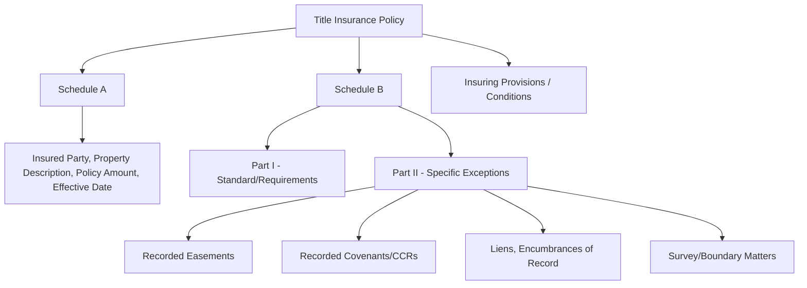
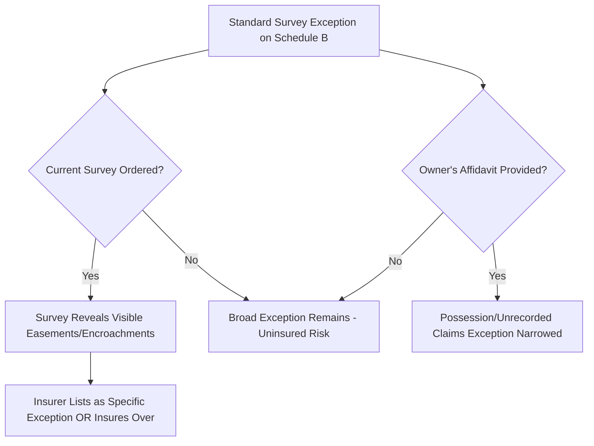

## Title Insurance and Easement Disclosure

### Overview

Title insurance is a contract of indemnity by which a title insurer agrees to compensate an insured (owner or lender) for specified losses arising from defects in title, including undisclosed liens, competing ownership claims, and — centrally for this chapter — easements and other servitudes that impair the insured's expected use or value of the property. Unlike other forms of insurance, which indemnify against future events, title insurance indemnifies primarily against **past** defects existing at or before the policy date, based on the insurer's examination of the public record. Easement disclosure operates through the policy's **Schedule B exceptions**, which list matters the insurer excludes from coverage, making Schedule B the primary interface between chain-of-title examination and the property owner's actual notice of servitudes burdening the land.

**Key Points**

- Title insurance is retrospective (defects existing at policy issuance), not prospective — it does not insure against future third-party claims arising after the policy date except in narrow circumstances (e.g., certain covenant/CCR enforcement risks under enhanced policies).
- Easements discovered in the chain of title examination are typically listed as *specific exceptions* on Schedule B, removing them from coverage rather than triggering a claim.
- An owner's policy and a lender's (loan) policy are distinct contracts with different insureds, different coverage amounts, and potentially different exception schedules.

---

### Structure of a Title Insurance Policy

#### Schedule A

Identifies the parties insured, the legal description of the property, the amount of insurance, and the effective date of the policy.

#### Schedule B

Lists matters excluded from coverage. Divided (in most standard ALTA-form policies) into:

- **Standard exceptions / requirements**: Boilerplate items such as rights of parties in possession not shown of record, unrecorded easements not disclosed by inspection or survey, and unfiled mechanics' liens — these are frequently *removed* through affirmative underwriting steps (e.g., a survey, an owner's affidavit) rather than accepted as permanent exclusions.
- **Specific exceptions**: Items identified during the chain-of-title examination as actually encumbering the specific parcel, most importantly **recorded easements, covenants, restrictions, and reservations** found in the record.

**Example**

> A title commitment for Blackacre lists as a Schedule B specific exception: "Easement for ingress, egress, and utilities in favor of Parcel C, recorded [Book/Page], granted [date]." This discloses to the buyer, before closing, that a recorded easement burdens the parcel; the policy will not cover any loss the buyer suffers *because* that easement exists — the buyer takes title subject to it, with full notice.

---

### The Disclosure Function of Schedule B

Schedule B serves two simultaneous purposes in the transaction: (1) it defines the scope of what the insurer will and will not cover, and (2) as a practical matter, it functions as the primary disclosure document alerting a buyer or lender to encumbrances discovered in the chain-of-title search — including easements the buyer might otherwise never independently discover.

- **Buyer reliance**: Because most residential and commercial buyers do not personally conduct a chain-of-title search, the title commitment (issued before closing) is frequently the buyer's first and only notice of a recorded easement affecting the parcel.
- **Negotiation leverage**: Discovery of an undisclosed or unexpected easement in the commitment gives the buyer an opportunity to renegotiate price, demand removal/subordination, or terminate the transaction under a title contingency clause in the purchase agreement, before the exception becomes a permanent, accepted feature of the closed transaction.
- **Post-closing consequence**: Once closing occurs with the easement listed as an accepted Schedule B exception, the buyer generally cannot later claim a covered loss based on that easement's existence, since the policy expressly excludes it from coverage.

---

### Easements That May NOT Appear on Schedule B (Coverage Gaps)

Certain easements can burden a property without appearing in the chain-of-title search, creating a coverage and disclosure gap that title insurance does not automatically close:

| Easement Type | Why It May Be Missed | Typical Mitigation |
| --- | --- | --- |
| Prescriptive easement | Not created by a recorded instrument; arises from use, not a document | Physical inspection, neighbor interviews, survey showing visible use (path, fence, driveway) |
| Easement by necessity | May arise from severance history not apparent in current deed | Full chain-of-title search back through the severance event |
| Unrecorded express easement | Never recorded by the parties despite being validly created between them | Owner's affidavit, estoppel certificate, physical inspection |
| Easement implied from prior use | Arises from historical apparent use predating current instruments | Survey and site inspection revealing physical evidence (utility lines, shared driveways) |

[Inference] Because these easement types are not artifacts of the recorded chain of title, a standard title search alone cannot disclose them; insurers typically address this gap by requiring a current survey and by retaining a standard exception for "matters that would be disclosed by an accurate survey or inspection," shifting at least part of the discovery burden back onto the insured unless that exception is affirmatively removed.

---

### Removing the Survey/Unrecorded-Matters Exception

A standard title commitment often includes a broad exception for unrecorded easements, boundary discrepancies, and encroachments "that would be disclosed by an accurate survey." This exception can typically be narrowed or removed through:

1. **Current ALTA/NSPS survey**: A professional boundary and improvement survey meeting insurer-specified standards, which discloses visible easements, encroachments, and improvements, allowing the insurer to either except them specifically (with full disclosure) or insure over them if acceptable.
2. **Owner's affidavit**: A sworn statement by the seller disclosing any known unrecorded claims, parties in possession, or recent improvements, which the insurer relies on to remove certain standard exceptions.
3. **Zoning/survey endorsements**: Additional ALTA endorsements (e.g., Zoning 3.1, Survey endorsement, Access endorsement) that provide affirmative coverage for specific easement-adjacent risks, such as confirming legal access to a public street.

---

### Owner's Policy vs. Lender's Policy: Easement Coverage Differences

| Feature | Owner's Policy | Lender's (Loan) Policy |
| --- | --- | --- |
| Insured party | Property owner/buyer | Mortgage lender |
| Coverage amount | Purchase price (typically) | Loan amount |
| Duration | As long as owner (or heirs) retains an interest | Generally until loan is satisfied/assigned |
| Easement exception effect | Directly limits owner's use/value protection | Primarily protects lender's lien priority, not owner's use rights |
| Endorsements for access/easement risk | Available (e.g., access endorsement) | Often required by lender as a closing condition |

An easement exception on a lender's policy protects the lender's security interest priority but does nothing for the owner's own risk of losing value or use due to that easement; owners should separately obtain (or negotiate favorable exceptions/endorsements on) an owner's policy to protect their own interest.

---

### Diagram: Easement Disclosure Flow in a Title Insurance Transaction (svg_diagram)

<svg xmlns="http://www.w3.org/2000/svg" viewBox="0 0 580 260">
<text x="290" y="20" font-size="14" text-anchor="middle" font-weight="bold">Easement Disclosure Flow in Title Insurance (svg_diagram)</text>
<rect x="20" y="60" width="130" height="50" fill="#dbeafe" stroke="#1e3a8a" stroke-width="2" />
<text x="85" y="80" text-anchor="middle" font-size="10">Chain of Title</text>
<text x="85" y="95" text-anchor="middle" font-size="10">Search</text>
<rect x="200" y="60" width="130" height="50" fill="#fde68a" stroke="#92400e" stroke-width="2" />
<text x="265" y="80" text-anchor="middle" font-size="10">Recorded Easement</text>
<text x="265" y="95" text-anchor="middle" font-size="10">Discovered</text>
<rect x="380" y="60" width="130" height="50" fill="#dcfce7" stroke="#166534" stroke-width="2" />
<text x="445" y="80" text-anchor="middle" font-size="10">Listed as Schedule</text>
<text x="445" y="95" text-anchor="middle" font-size="10">B Exception</text>
<line x1="150" y1="85" x2="200" y2="85" stroke="#000" stroke-width="2" marker-end="url(#ed)" />
<line x1="330" y1="85" x2="380" y2="85" stroke="#000" stroke-width="2" marker-end="url(#ed)" />
<line x1="445" y1="110" x2="445" y2="150" stroke="#000" stroke-width="2" marker-end="url(#ed)" />
<rect x="380" y="150" width="130" height="50" fill="#fecaca" stroke="#7f1d1d" stroke-width="2" />
<text x="445" y="170" text-anchor="middle" font-size="10">Buyer Reviews</text>
<text x="445" y="185" text-anchor="middle" font-size="10">Before Closing</text>
<line x1="380" y1="175" x2="200" y2="175" stroke="#000" stroke-width="2" marker-end="url(#ed)" />
<rect x="60" y="150" width="130" height="50" fill="#e0e7ff" stroke="#3730a3" stroke-width="2" />
<text x="125" y="170" text-anchor="middle" font-size="10">Negotiate, Accept,</text>
<text x="125" y="185" text-anchor="middle" font-size="10">or Terminate</text>
</svg>

---

### Claims Involving Undisclosed Easements

If an easement burdening the property was **not** listed on Schedule B and was discoverable through the standard record search the policy purports to cover, the insured may have a valid claim against the title insurer for the resulting loss in value or use, subject to the policy's insuring provisions and any applicable exclusions (e.g., matters known to the insured but not disclosed to the insurer, which are typically excluded under the policy's standard exclusions from coverage).

- **Claim process**: The insured tenders a notice of claim to the insurer, which then has a duty to defend (in the case of a third-party assertion of easement rights) and/or indemnify for the loss, subject to policy limits.
- **Insurer's defenses**: Common defenses include arguing the easement was a standard excepted matter, that it was discoverable by survey/inspection and thus falls within the survey exception, or that the insured had independent knowledge not disclosed at underwriting.

[Unverified] The precise scope of an insurer's duty to defend versus merely indemnify, and the specific exclusions applicable to undisclosed easement claims, depend on the exact ALTA policy form and any state-specific policy variations in effect at issuance, so the governing policy language must be reviewed directly for any actual claim analysis.

---

### Practical Due Diligence Checklist for Easement-Related Title Review

**Next Steps**

- Review Schedule B in full for both "requirements" and "specific exceptions," not just the specific exceptions section, since standard exceptions can also conceal easement-related risk.
- Order a current ALTA/NSPS survey to disclose unrecorded, prescriptive, or physically apparent easements not found in the record search.
- Request an owner's affidavit addressing possession, recent improvements, and any known unrecorded agreements.
- Cross-reference each Schedule B easement exception against the actual recorded instrument (book/page or document number) to confirm scope, location, and beneficiaries — exception language is often summarized and may omit material restrictions.
- Consider requesting an access endorsement or other ALTA endorsements where legal access depends on an easement rather than direct frontage on a public way.
- For commercial transactions, confirm whether the lender's policy exceptions match the owner's policy exceptions, since discrepancies can signal an incomplete search or a negotiated removal on only one policy.

### Related Topics

- Chain of Title Examination
- Recording Acts: Race, Notice, and Race-Notice Statutes
- ALTA Survey Standards and Endorsements
- Marketable Title Acts and Statutory Curative Periods
- Prescriptive Easements and Easements Implied from Prior Use
- Quiet Title Actions to Resolve Undisclosed Encumbrances