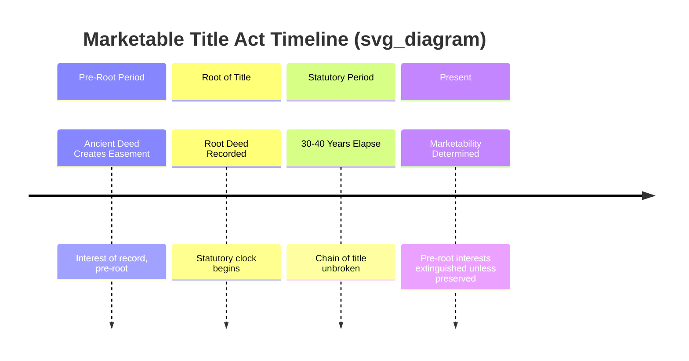
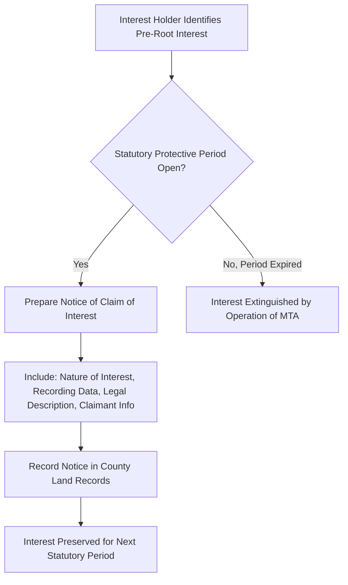

## Marketable Title Acts

### Overview

A Marketable Title Act (MTA) is a state statute that extinguishes certain older interests in real property once a specified period (typically 20-40 years) has elapsed since the recording of a "root of title," unless the interest holder rerecords or files a notice of claim within a statutory window. MTAs are curative recording statutes designed to limit title searches to a fixed retrospective period, thereby simplifying due diligence and increasing marketability of land.

MTAs are distinct from recording acts (which govern priority between competing purchasers) and from adverse possession or prescription (which extinguish rights through possessory conduct). An MTA extinguishes stale interests purely through the passage of time and the recording chain, regardless of possession.

### Statutory Framework

**Key Points**

- Origin: Model Marketable Title Act (1960s, Allison Dunham), adopted in some form by roughly 20 U.S. states, including Ohio, Michigan, Illinois, Indiana, Iowa, Florida, Minnesota, Nebraska, North Carolina, and others.
- Core mechanism: A person with an unbroken chain of title of record for the statutory period (the "root of title") holds marketable record title, free of interests predating the root, except for interests specifically preserved by the act.
- Purpose: to cap title search depth, cure ancient defects, and reduce the burden of searching "back to the sovereign."

### Core Definitions

**Root of Title**

The root of title is the most recent recorded conveyance or other title transaction purporting to create or transfer the estate in question, which has been of record for the statutory period (commonly 30 or 40 years) as of the date marketability is being determined. It must be a title transaction, not merely a mortgage discharge, lis pendens, or similar instrument (varies by state).

$$T_{root} \leq T_{present} - P_{statutory}$$

Where $T_{root}$ is the recording date of the root instrument, $T_{present}$ is the date of the search, and $P_{statutory}$ is the statutory period (e.g., 30 years).

**Title Transaction**

Any recorded document affecting title, including deeds, mortgages, wills (duly probated), decrees, and other instruments that create, transfer, or affect an interest in land. State statutes enumerate what qualifies.

**Chain of Title**

The unbroken sequence of title transactions from the root of title to the present, all of record, establishing continuous record ownership.

### Operative Effect

An MTA operates in two stages:

1. **Establishment of marketable record title.** A person who holds an unbroken chain of title of record for the statutory period, traced from a root of title, is deemed to have marketable record title to the estate, subject only to:
   - Interests inherent in the muniments of the chain of title itself (post-root encumbrances).
   - Interests specifically excepted by the statute (see Preserved Interests below).
   - Interests preserved by timely rerecording or notice filing.
2. **Extinguishment of prior interests.** All interests, claims, and charges that existed prior to the root of title — including easements, restrictive covenants, mineral reservations, future interests, and possibilities of reverter — are extinguished unless preserved.

### Preserved Interests (Statutory Exceptions)

Most MTAs exclude certain interests from extinguishment regardless of age, including:

- Interests of the United States government.
- Easements or interests evidenced by physical, visible use (e.g., utility lines, railroad rights-of-way) — varies significantly by state; some states extinguish even visible easements absent a rerecorded notice.
- Mineral interests (many states carve out separate, longer preservation periods or exempt them entirely — a major point of litigation).
- Interests of a person in possession of the land.
- Restrictions or covenants imposed by a governmental entity (zoning, conservation easements in many states).
- Interests recorded or noticed within the "protective period" prior to expiration.

**Key Points**

- The interaction between MTAs and recorded easements is the single most litigated area. Courts split on whether visible, physical use of an easement is sufficient to preserve it, or whether a notice of claim must still be filed.
- Mineral rights severed from surface estates are frequently subject to special MTA carve-outs due to lobbying by resource industries; several states (e.g., Michigan's Dormant Minerals Act) have separate statutes layered on top of general MTAs.

### Notice of Claim / Preservation Mechanism

To preserve an interest that would otherwise be extinguished, the holder must record a **notice of claim of interest** (terminology varies: "notice to preserve," "affidavit of claim") within the statutory period, referencing:

- The nature of the claimed interest.
- The recording data of the instrument creating it.
- A legal description of the affected land.
- The claimant's name and address.

Filing restarts or extends the protective window, depending on the statute's specific mechanics — some acts require periodic rerecording (e.g., every 40 years), functioning similarly to UCC continuation statements.

### Interaction with Other Title Doctrines

| Doctrine | Relationship to MTA |
| --- | --- |
| Recording Acts (race, notice, race-notice) | MTA operates independently; a validly recorded but ancient interest can still be extinguished by MTA even if properly recorded under the jurisdiction's recording act |
| Adverse Possession | MTA is title-based (record chain); adverse possession is possession-based. The two can produce different outcomes on the same facts |
| Title Insurance Underwriting | Title insurers rely heavily on MTAs to limit search depth, but typically except from coverage any interest the underwriter believes is preserved or ambiguous under the act |
| Torrens System | MTAs are largely irrelevant in Torrens (registered title) jurisdictions since the register itself is conclusive |

### Worked Example

**Example**

Facts:

- 1958: Deed recorded creating a mineral reservation ("Grantor reserves all mineral rights") — this predates the root.
- 1975: Warranty deed recorded conveying the surface estate, silent as to minerals, forming the root of title.
- 1975–2026: Unbroken chain of record title in surface owner's successors (51 years, exceeding a hypothetical 40-year statutory period).
- No notice of claim of mineral interest was ever recorded by the original grantor's heirs.

Analysis:

1. Identify the root: the 1975 deed qualifies as a title transaction and has been of record for more than the statutory period.
2. Trace the chain: unbroken record chain from 1975 to present.
3. Check pre-root interests: the 1958 mineral reservation predates the root and is not referenced in the chain of title transactions after 1975.
4. Check exceptions: assume the jurisdiction has no special mineral-interest carve-out and no notice of claim was filed.

Conclusion under the MTA: The mineral reservation is extinguished; the current surface owner holds marketable record title inclusive of the minerals, subject to state-specific exceptions.

**Conclusion**

This result is why mineral, timber, and royalty interest holders in MTA states must maintain rerecording calendars — failure to file a timely notice of claim can result in total loss of a severed interest, even one that was properly recorded when created. [Inference: exact extinguishment outcome depends on the specific state's mineral carve-out, if any, and courts have reached conflicting results on similar facts across jurisdictions.]

### Due Diligence Implications

**Key Points**

- Title examiners in MTA states typically search back only to a valid root of title plus the statutory period, rather than to the sovereign — this is the act's primary practical benefit.
- Examiners must still confirm: (1) the identified instrument actually qualifies as a "root of title" under the statute's definition; (2) the chain from root to present is genuinely unbroken; (3) no notices of claim were filed against pre-root interests; (4) no statutory exception (possession, easement visibility, government interest) applies.
- Title insurance commitments in MTA states commonly cite the act as basis for limiting the search period, but underwriters frequently except "rights of parties who may have preserved interests by recorded notice" out of caution.

### Litigation and Constitutional Considerations

MTAs have faced due process and takings challenges on the theory that they extinguish vested property interests without direct notice to the interest holder (constructive notice via publication of the statute itself is generally deemed sufficient). Most state courts have upheld MTAs against such challenges, reasoning that:

- The statute provides a public, generally applicable rule.
- A grace/protective period gives holders a reasonable opportunity to preserve their interest.
- Extinguishment serves a legitimate public purpose (marketability, reduced search costs).

[Unverified: outcomes in specific state supreme court cases vary and should be confirmed against current case law for the jurisdiction in question, as this area continues to see active litigation, particularly around mineral and easement interests.]

### Sample Notice of Claim Structure

### Comparative State Variation

**Key Points**

- Statutory period length varies: 20 years (some states), 30 years (Ohio, Nebraska), 40 years (Michigan, Illinois, Florida, Minnesota, North Carolina).
- Some states (e.g., Iowa) apply MTAs broadly with few exceptions; others carve out extensive exceptions that substantially narrow practical effect.
- A minority of states have no MTA at all, relying solely on common-law doctrines (adverse possession, laches, estoppel) and standard recording acts to address stale interests.

**Next Steps**

- Recording Acts (Race, Notice, Race-Notice Statutes)
- Chain of Title and Title Search Methodology
- Root of Title Determination and Defects
- Severed Mineral Interests and Dormant Mineral Acts
- Easements: Creation, Preservation, and Termination
- Adverse Possession and Prescriptive Easements
- Title Insurance Policy Exceptions and Underwriting Standards
- Torrens Title Registration Systems
- Curative Acts and Statutes of Limitations in Real Property Law
- Due Process Challenges to Property Extinguishment Statutes