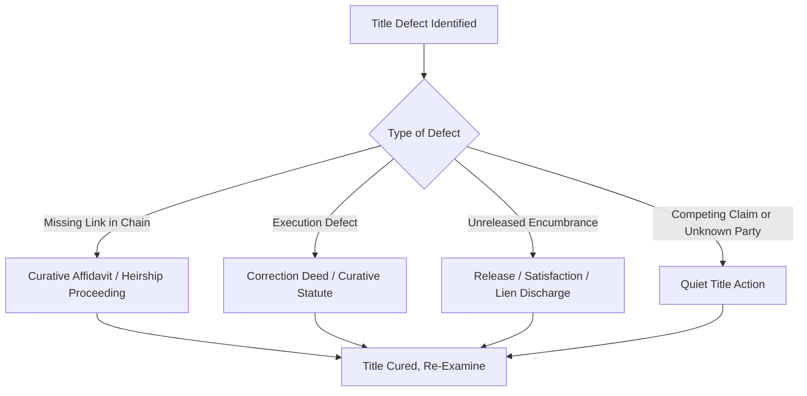
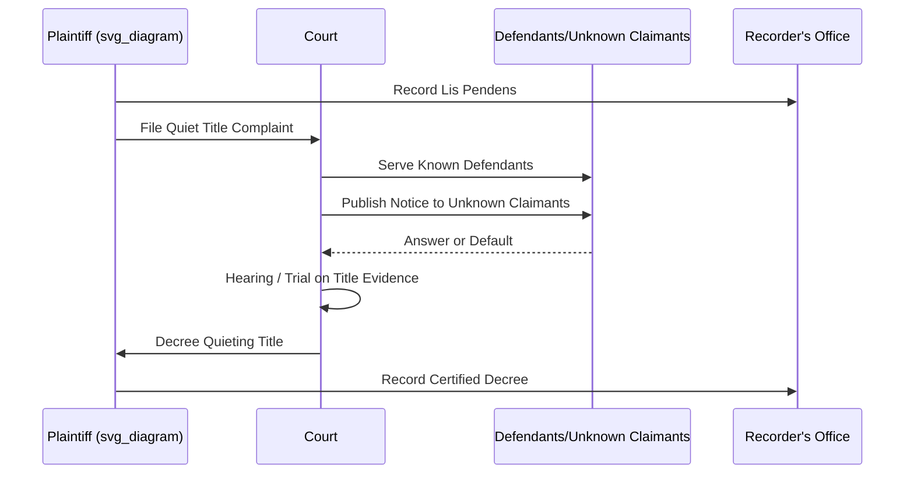

## Curative Title Procedures

### Overview

Curative title procedures are the legal mechanisms used to resolve defects, clouds, or irregularities in a chain of title so that real property can be conveyed, insured, or financed with marketable title. Defects arise from missing conveyances, defective acknowledgments, unresolved liens, unprobated estates, boundary ambiguities, and similar recording-system imperfections. Curative procedures range from self-executing statutory cures to affirmative litigation.

### Categories of Title Defects

**Key Points**

- Defects generally fall into four categories: (1) missing or broken links in the chain of title; (2) instrument execution defects (improper acknowledgment, missing signatures, defective legal descriptions); (3) unresolved encumbrances (unreleased mortgages, unsatisfied liens, unpaid taxes); (4) competing or unknown claimants (heirship issues, boundary disputes, adverse claims).
- Each category typically has a corresponding curative tool, ranging from administrative (affidavits) to judicial (quiet title actions).

### Curative Affidavits

An affidavit of facts (sometimes "curative affidavit," "affidavit of heirship," or "affidavit of identity") is a sworn statement recorded in the land records to resolve minor ambiguities without litigation. Common uses:

- **Affidavit of identity**: resolves discrepancies where a grantor's name appears differently across instruments (e.g., "Robert J. Smith" vs. "Bob Smith").
- **Affidavit of heirship**: establishes the heirs of a deceased titleholder when no formal probate occurred, often used in states permitting non-probate transfer after a statutory waiting period.
- **Affidavit of continuous marriage/non-marriage**: clarifies marital status affecting dower, curtesy, or community property/homestead rights.
- **Affidavit of possession**: supports adverse possession or boundary line claims by documenting continuous use.

**Key Points**

- Affidavits are generally admissible as prima facie evidence of the facts stated but do not themselves transfer title — they clarify or supplement the existing record.
- Many states have specific statutes governing the evidentiary weight and required contents of curative affidavits (e.g., "Marketable Record Title Act" affidavits, or state-specific "Title Standards" published by bar associations).

### Correction (Scrivener's) Deeds

A correction deed (or "deed of correction," "confirmatory deed," "scrivener's affidavit") is used to fix minor errors in a previously recorded and delivered deed without needing new consideration or full re-execution, such as:

- Misspelled names.
- Incorrect legal descriptions (typographical, not substantive changes to the parcel conveyed).
- Missing marital status recitations.
- Incorrect recording references.

**Key Points**

- A correction deed generally requires execution by the original grantor (or grantor's successors) — it cannot unilaterally be executed by the grantee.
- Some states permit a "scrivener's affidavit" by the drafting attorney or title agent alone for purely clerical errors, without requiring grantor re-execution — the availability and scope of this shortcut is state-specific. [Unverified: confirm against the specific state's title standards, as the line between "clerical" and "substantive" error is a frequent source of dispute.]
- A correction deed relates back to the effective date of the original deed for purposes of priority, assuming no intervening bona fide purchaser rights are affected.

### Quiet Title Actions

A quiet title action is a judicial proceeding to establish clear title against all other claimants, resolving disputes that cannot be cured administratively.

**Procedural Elements**

1. **Complaint**: plaintiff pleads their claim of title and names all known adverse claimants (mortgagees, lienholders, heirs, prior grantors).
2. **Unknown parties**: for unknown or unlocatable claimants, service is typically made by publication pursuant to statutory notice requirements.
3. **Lis pendens**: a notice of pending action is recorded against the property to give constructive notice to third parties during litigation.
4. **Hearing/trial**: court examines evidence of title, chain of title, and any competing claims.
5. **Judgment/decree**: court issues a decree quieting title in the plaintiff, which is then recorded and becomes part of the permanent chain of title.

**Key Points**

- Quiet title is used when: heirs cannot be located; a prior conveyance is void or voidable and needs judicial resolution; boundary disputes require adjudication; tax sale purchasers need to eliminate redemption rights and prior owner claims; adverse possession claims need formal confirmation.
- Statute of limitations for bringing or defending a quiet title action varies by state and by the nature of the underlying claim (often tied to adverse possession periods or general real property limitations periods).
- A quiet title judgment binds only parties properly joined and served (or properly served by publication); it does not create title good against the entire world in the way that Torrens registration does.

### Curative Statutes (Ancient Instruments / Curative Acts)

Many states enact specific curative statutes that automatically validate certain categories of defective instruments after a set period, without requiring affidavit or litigation:

- **Ancient document/instrument statutes**: instruments recorded for a specified number of years (often 10-30) are presumed valid despite minor defects in acknowledgment or execution.
- **Curative acts for defective acknowledgments**: retroactively validate deeds where the notary's acknowledgment was technically defective (e.g., missing venue, expired commission) if the deed has been of record for a statutory period.
- **Married women's/coverture curative acts**: historical statutes validating conveyances that failed to comply with now-abolished spousal joinder requirements.

**Key Points**

- These statutes operate similarly to Marketable Title Acts but target a narrower category of defect (execution/acknowledgment formality) rather than broadly extinguishing all pre-root interests.
- Title examiners rely on published title standards (often maintained by state bar real property sections) to determine which categories of defects are cured by statute versus which still require an affidavit or judicial action.

### Tax Title Curative Procedures

Title acquired through tax sale is frequently considered unmarketable by title insurers due to due process concerns (notice to prior owner, redemption rights). Common curative steps:

- **Quiet title action** naming the prior owner and all interested parties, specifically addressing the tax sale's compliance with statutory notice requirements.
- **Statutory "tax deed curative period"**: some states impose a limitations period after which challenges to a tax deed's validity are barred.
- **Title insurance "starter" requirement**: many underwriters require a specified holding period after a tax sale (or a quiet title judgment) before insuring over a tax title.

### Probate and Heirship Curative Procedures

When a titleholder dies without a will being probated (or probate was defective), curative options include:

- **Ancillary or delayed probate**: opening probate late to formally transfer title through the estate.
- **Affidavit of heirship**: in states permitting non-probate transfer of real property after a statutory waiting period (often paired with an affidavit regarding debts/estate tax clearance).
- **Determination of heirship proceeding**: a judicial (often summary) proceeding specifically to adjudicate heirs without full estate administration.
- **Small estate affidavit**: statutory procedure for estates below a value threshold.

### Mortgage/Lien Release Curative Procedures

- **Satisfaction of mortgage**: recorded release from lender; if the lender is defunct or unresponsive, some states provide statutory procedures (affidavit of non-response after notice, bonding, or judicial discharge) to clear "ancient mortgages" presumed paid.
- **Lien statute of limitations**: many liens (mechanic's liens, judgment liens) automatically expire or become unenforceable after a statutory period even without a formal release, and this can be documented in the title opinion rather than requiring affirmative action.
- **Discharge/bonding of contested liens**: some jurisdictions allow a property owner to post a bond to discharge a lien from title while the underlying dispute is litigated separately.

### Boundary Line Curative Tools

- **Boundary line agreement**: adjoining owners execute and record an agreement fixing a disputed or ambiguous boundary, often paired with a survey.
- **Deed of correction for legal description errors**: as above, for purely clerical description errors.
- **Judicial boundary determination**: litigation (often combined with a quiet title action) when adjoining owners cannot agree.

### Worked Example

**Example**

Facts: A 1962 deed in the chain of title was acknowledged before a notary whose commission had expired three months prior. The current owner has held record title, paid taxes, and possessed the property openly since 1962. A sale is now pending and the title examiner flags the defective acknowledgment.

Curative analysis:

1. Check for an applicable curative/ancient instrument statute — many states validate instruments of record for a specified period (e.g., 20+ years) despite defective acknowledgment.
2. If no automatic statutory cure applies, obtain a curative affidavit from the original notary or a party with personal knowledge confirming the facts of execution.
3. If the original parties are unavailable, use adverse possession/quiet title as a fallback, since 60+ years of open, continuous possession likely independently establishes title regardless of the deed's formal validity.

**Conclusion**

In most jurisdictions this defect would be resolved through the applicable ancient-instrument curative statute alone, without need for litigation, since (a) a substantial statutory period has elapsed and (b) possession is consistent with record title. [Inference: the specific outcome depends on the jurisdiction's exact curative statute language, which varies significantly.]

### Interaction with Title Insurance

**Key Points**

- Title insurers frequently require curative action (affidavit, correction deed, or quiet title judgment) as a condition to removing a specific exception from a title commitment before issuing a clean policy.
- "Insuring over" a defect (issuing a policy with indemnity for a known risk rather than requiring it be cured) is an alternative underwriting approach used when the defect is old, low-risk, and litigation would be disproportionately costly.
- Curative work is often driven by underwriting requirements rather than by the parties' independent legal necessity — closing timelines frequently dictate which curative tool (affidavit vs. litigation) is used.

**Next Steps**

- Marketable Title Acts
- Chain of Title and Title Search Methodology
- Quiet Title Actions: Pleading and Service by Publication
- Adverse Possession Elements and Proof
- Title Insurance Commitments and Exception Clearance
- Probate and Intestate Succession Affecting Real Property
- Lis Pendens: Effect and Recording Requirements
- Tax Sales and Tax Deed Validity
- Boundary Disputes and Survey Reconciliation
- Recording Acts and Constructive Notice Doctrine