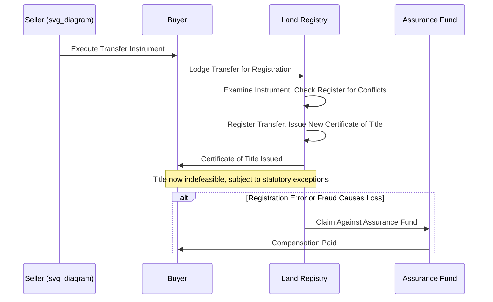

## Torrens Title Registration System


### Overview

The Torrens system is a land registration model in which the government maintains a conclusive register of title, and the register itself — not the historical chain of deeds — is the definitive evidence of ownership. Named after Sir Robert Torrens, who introduced it in South Australia in 1858, the system replaces the "recording" model (where documents are recorded and title is proven by tracing a chain of conveyances) with a "registration" model (where the state guarantees the accuracy of a single certificate of title).

### Core Principles

**Key Points**

- **The Mirror Principle**: the register reflects, accurately and completely, all currently subsisting interests affecting the land. A purchaser need only examine the register itself.
- **The Curtain Principle**: the register is the sole source of title information; a purchaser need not look behind it to historical deeds, wills, or prior transactions ("the curtain" is drawn over the pre-registration history).
- **The Insurance Principle**: the state guarantees the accuracy of the register and compensates (via an assurance fund) any party who suffers loss due to registration error or fraud.

```mermaid
graph TD
    A[Mirror Principle: Register Reflects All Interests] 
    B[Curtain Principle: No Need to Search Behind Register]
    C[Insurance Principle: State Guarantees Accuracy]
    A --> D[Torrens System Integrity (svg_diagram)]
    B --> D
    C --> D
```

### Contrast with Recording (Deeds Registration) Systems

| Feature | Torrens (Title Registration) | Recording/Deeds System |
| --- | --- | --- |
| What is registered | Title itself (state-guaranteed) | Documents/instruments (evidentiary only) |
| Proof of ownership | Certificate of title | Chain of title built from recorded deeds |
| Search scope | Current register entry only | Full historical chain, often decades |
| State guarantee | Yes, typically via assurance fund | No — reliance on title insurance (private) |
| Effect of registration | Generally indefeasible, subject to statutory exceptions | Constructive notice only; does not itself validate title |
| Risk of forged deed | Bears on assurance fund / indefeasibility exceptions | Can void the chain entirely (voidable/void distinction) |

### Indefeasibility of Title

The central legal feature of Torrens is **indefeasibility**: once registered, the registered proprietor's title is generally immune from prior unregistered claims and defects in the chain, even defects that would have voided title under a common-law deeds system.

**Key Points**

- **Immediate indefeasibility**: title is indefeasible from the moment of registration, even if the registration itself resulted from a forged or fraudulent instrument (the innocent registered proprietor is protected; the defrauded prior owner's remedy is against the assurance fund or the fraudster, not recovery of the land).
- **Deferred indefeasibility**: indefeasibility attaches only to a subsequent bona fide purchaser for value who registers after the fraudulent transaction, not to the immediate fraudulent registrant. This model gives an intermediate victim a window to recover the land before it passes to an innocent subsequent registered owner.
- Jurisdictions differ (and have shifted over time) between these two models; Australian states, for example, moved toward immediate indefeasibility, while some other Torrens jurisdictions retain deferred indefeasibility for certain fraud scenarios. [Unverified: the specific model in force should be confirmed against the current statute and case law of the jurisdiction in question, as this is an area of ongoing judicial refinement.]

### Statutory Exceptions to Indefeasibility

No Torrens system provides absolute, unqualified indefeasibility. Common statutory and common-law exceptions include:

- **Fraud**: a registered proprietor who personally participated in fraud does not obtain indefeasible title against the defrauded party.
- **In personam claims**: equitable claims arising from the registered owner's own conduct (e.g., a contractual obligation, trust, or estoppel) remain enforceable against that specific owner, even though not on the register.
- **Short-term leases/tenancies**: many statutes except unregistered short-term leases (often under a specified duration) from the indefeasibility guarantee, treating them as binding regardless of registration.
- **Easements by prescription or implication not on the register**: some jurisdictions except visible/apparent easements even if unregistered.
- **Overriding statutory interests**: e.g., certain tax liens, government charges, or native/indigenous title claims (a significant and evolving area in jurisdictions like Australia).
- **Wrong description of boundaries/parcels not affecting the true owner**: correction of clerical registration errors.

### Registration Process



**Key Points**

- Registration, not the transfer instrument's execution or delivery, is the operative act that passes indefeasible legal title (a key departure from common-law deed systems, where delivery of a valid deed passes title).
- Registrars typically conduct an examination of the lodged instrument for compliance with formal requirements and consistency with the existing register, but this examination does not amount to a full historical title search — it is prospective/administrative, not retrospective.
- Each parcel is assigned a unique folio/title reference, and the certificate of title (paper historically, now typically electronic in modern systems) is the record examined by purchasers, lenders, and title professionals.

### Initial Registration ("Bringing Land Under the Act")

Converting land from an unregistered (deeds/common-law) title to Torrens title typically requires:

1. **Application**: the applicant submits an application with supporting evidence of title (often the full historical deeds chain).
2. **Examination**: a government examiner of titles reviews the evidence and may require a survey.
3. **Notice/advertisement**: public notice is given, and a caveat/objection period is provided for adverse claimants.
4. **Adjudication**: contested claims may be resolved via an administrative tribunal or court.
5. **First registration**: upon resolution, the land is entered on the register, and (in many systems) the state's indefeasibility guarantee attaches, extinguishing unregistered prior claims not raised during the process (subject to exceptions).

**Key Points**

- Initial registration is often the most litigation-intensive phase, since it is where pre-existing common-law claims are tested against the new registered system.
- Some jurisdictions historically used compulsory conversion (mandatory Torrens registration by statute in a given area/date), while others use voluntary conversion (landowner-initiated application).

### Caveats

A **caveat** is a statutory notice lodged against a Torrens title to warn third parties of an unregistered interest (e.g., an unregistered contract of sale, equitable mortgage, or beneficial interest under a trust) and to prevent registration of dealings inconsistent with the caveator's claimed interest until resolved.

**Key Points**

- A caveat does not itself create or perfect an interest — it is a protective/notice mechanism for an interest that already exists in equity.
- Lodging a caveat without a genuine caveatable interest can expose the caveator to liability for damages caused by wrongful lodgment (common in Torrens statutes as a check against abuse).
- Caveats typically lapse after a statutory period unless the caveator commences proceedings to establish the underlying claim.

### Assurance Fund (Compensation for Loss)

**Key Points**

- Most Torrens statutes establish an assurance fund (funded by registration fees or government appropriation) to compensate persons who lose an interest in land due to the operation of the indefeasibility principle (e.g., a defrauded former owner whose land was fraudulently transferred and registered to an innocent third party).
- Claims against the fund are typically subject to conditions: exhaustion of remedies against the wrongdoer first, statutory limitation periods, and caps on recoverable amounts in some jurisdictions.
- The existence of the fund is central to the system's legitimacy — it is the mechanism by which the state's "guarantee" under the Insurance Principle is made concrete rather than aspirational.

### Torrens Systems in Practice by Jurisdiction

**Key Points**

- **Australia**: the origin jurisdiction; all Australian states operate Torrens systems, now largely electronic (e.g., PEXA e-conveyancing platform), with well-developed case law on indefeasibility.
- **England and Wales**: HM Land Registry operates a title registration system with strong Torrens-family characteristics (state-guaranteed title, indemnity fund), though it developed somewhat independently and retains some distinct doctrinal features (e.g., overriding interests).
- **Canada**: most provinces (except parts of the Maritimes) use Torrens or Torrens-influenced systems.
- **United States**: Torrens registration exists only in a minority of states (e.g., limited use in Massachusetts, Minnesota, Hawaii, and a few others) and has generally not displaced the dominant recording-act/title-insurance model. Many U.S. jurisdictions that once offered Torrens registration have phased it out due to low adoption and administrative cost. [Unverified: current operational status of Torrens registration should be confirmed on a state-by-state basis, as several states have discontinued new Torrens registrations while grandfathering existing registered parcels.]
- **New Zealand, Singapore, and various other Commonwealth-influenced jurisdictions**: widespread Torrens or Torrens-derived systems.

### Worked Example

**Example**

Facts: A owns Torrens-registered land. B forges A's signature on a transfer instrument and registers the transfer to himself. B then sells to C, an innocent purchaser for value who has no knowledge of the fraud and registers the transfer.

Analysis under immediate indefeasibility: Even though B's registration was procured by fraud, once C — an innocent party — registers, C obtains indefeasible title. A's remedy is not recovery of the land from C, but a claim against B personally (if solvent and locatable) and/or a claim against the state's assurance fund for compensation.

Analysis under deferred indefeasibility: B, the immediate fraudulent registrant, does not obtain indefeasible title (A could potentially recover from B). However, once C registers as an innocent subsequent purchaser, indefeasibility attaches at that point, and A's remedy again shifts to compensation rather than recovery of the land.

**Conclusion**

In both models the innocent ultimate purchaser (C) is protected once registered, which is the core commercial value proposition of Torrens: title certainty for purchasers who rely on the register in good faith. The models differ only in whether an intermediate victim can recover the land from the immediate wrongdoer before a subsequent innocent purchaser intervenes.

### Practical and Due Diligence Implications

**Key Points**

- In a mature Torrens jurisdiction, due diligence is comparatively simple: examine the current certificate of title, check for registered encumbrances and caveats, and confirm no in personam claims exist against the specific seller — no historical chain-of-title search is required.
- Conveyancers/solicitors in Torrens jurisdictions still conduct searches beyond the register itself for matters the register does not capture: local government/planning searches, unregistered short-term tenancies, physical inspection for undisclosed easements or encroachments, and outstanding rates/charges.
- Title insurance exists in some Torrens jurisdictions (particularly for risks outside the state guarantee, such as boundary/survey discrepancies or fraud gaps), but plays a much smaller role than in U.S.-style recording systems.

**Next Steps**

- Recording Acts and Constructive Notice Doctrine (Comparative Contrast)
- Indefeasibility of Title: Immediate vs. Deferred Models
- Caveats and Equitable Interests in Registered Land
- Assurance Fund Claims and Compensation Procedures
- E-Conveyancing Platforms and Electronic Torrens Registration
- Overriding Interests in the English Land Registration Model
- Native/Indigenous Title Claims Against Torrens Registers
- Fraud and Forgery in Registered Land Systems
- Boundary and Survey Discrepancies Under Title Registration
- First Registration and Conversion from Deeds to Torrens Title