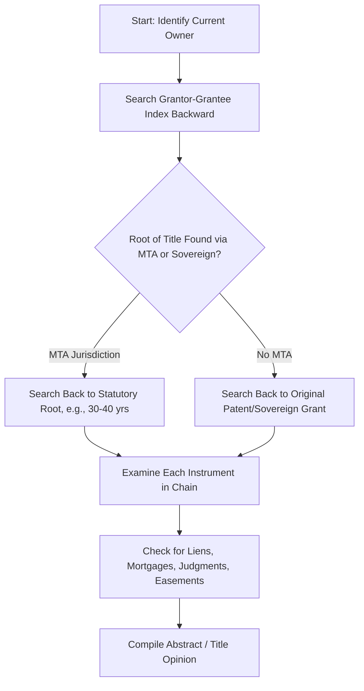
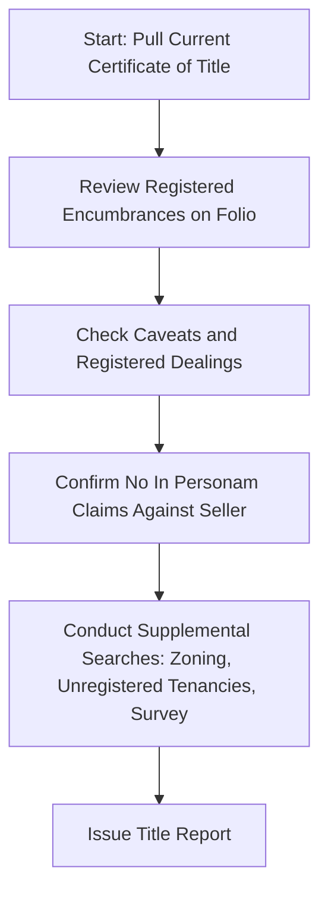

## Deeds Registration versus Title Registration


### Overview

Land registration systems worldwide fall into two dominant models: **deeds registration** (also called a "recording system"), in which the government records instruments (deeds, mortgages, liens) as evidence of transactions, and **title registration** (the Torrens model), in which the government maintains a state-guaranteed register of current title itself. The distinction determines how ownership is proven, how due diligence is conducted, how risk is allocated, and what role private title insurance plays.

### Fundamental Conceptual Distinction

**Key Points**

- **Deeds registration** records *documents*. The register is an archive of instruments; legal title is established by the purchaser (or their attorney/title examiner) reconstructing an unbroken chain of valid conveyances from those documents. The recording itself does not validate the underlying transaction — it merely provides constructive notice and establishes priority among competing claimants under the jurisdiction's recording act.
- **Title registration** records *title*. The register is the operative source of legal ownership. Registration is the act that transfers or creates the interest, and the state generally guarantees the register's accuracy (subject to statutory exceptions), typically backed by an assurance/indemnity fund.

```mermaid
graph LR
    subgraph Deeds System (svg_diagram)
    A1[Deed Executed] --> A2[Deed Recorded]
    A2 --> A3[Constructive Notice Given]
    A3 --> A4[Title Proven by Historical Chain Search]
    end
    subgraph Title Registration System
    B1[Transfer Instrument Executed] --> B2[Lodged for Registration]
    B2 --> B3[Registrar Examines and Registers]
    B3 --> B4[Title Itself Transfers Upon Registration]
    B4 --> B5[Register Is Conclusive Evidence of Title]
    end
```

### Comparative Matrix

| Dimension | Deeds Registration | Title Registration (Torrens) |
| --- | --- | --- |
| What is recorded/registered | Instruments/documents | The estate/title itself |
| Legal effect of filing | Constructive notice, priority | Creates/transfers the legal interest |
| Proof of ownership | Chain-of-title search back through history | Current certificate/register entry |
| State guarantee of accuracy | None (state records but does not warrant) | Yes, typically with assurance fund |
| Risk allocation for defects | Private risk, mitigated by title insurance | State-guaranteed, mitigated by indemnity fund |
| Search burden | Extensive (decades of instruments) | Minimal (current register snapshot) |
| Role of title insurance | Central and heavily relied upon | Marginal, supplemental for register-blind risks |
| Forged instrument in chain | Can void chain; subsequent good-faith recording generally does not cure | Innocent registered proprietor generally protected via indefeasibility |
| Initial system cost/complexity | Lower entry cost, ongoing search costs borne per-transaction | High initial conversion cost, low ongoing per-transaction search cost |
| Predominant jurisdictions | United States (nearly all states), most of Continental deed-based systems | Australia, New Zealand, most Canadian provinces, England/Wales (Land Registry), Singapore |

### Recording Acts: The Deeds System's Core Mechanism

In a deeds registration jurisdiction, priority among competing claimants to the same land is governed by a **recording act**, typically one of three types:

- **Race statute**: priority goes to whoever records first, regardless of notice of a prior unrecorded conveyance.
- **Notice statute**: a subsequent bona fide purchaser without notice of a prior unrecorded conveyance prevails, even if they record later.
- **Race-notice statute**: a subsequent bona fide purchaser without notice prevails only if they also record first.

$$\text{Priority} = f(\text{Notice}, \text{Recording Order})$$

**Key Points**

- Recording acts govern priority between competing claimants but do not validate a defective or fraudulent instrument itself — a forged deed remains void even if recorded, and generally conveys nothing regardless of a subsequent purchaser's good faith (a key structural weakness relative to Torrens indefeasibility).
- Because recording does not guarantee validity, deeds-system purchasers rely on either (a) a full historical title search (often supplemented by Marketable Title Acts limiting search depth) or (b) private title insurance to shift residual risk.

### Title Insurance as the Deeds System's Risk-Shifting Mechanism

**Key Points**

- Because no government guarantee exists in a deeds system, title insurance emerged as the dominant private mechanism to allocate risk of undiscovered defects (forged prior deeds, missing heirs, recording errors, undisclosed liens).
- Title insurance is a one-time premium, retrospective indemnity product: it insures against defects existing as of the policy date, not future events (contrast with Torrens' assurance fund, which compensates for loss caused by operation of the registration system itself, prospectively as well as retrospectively).
- In Torrens jurisdictions, title insurance still exists but typically covers narrower residual risks: survey/boundary discrepancies, unregistered short-term tenancies, fraud gaps, and matters the register does not capture (zoning compliance, access rights).

### Search Methodology Contrast

**Deeds System Search Process**



**Title Registration Search Process**



**Key Points**

- The deeds-system search is retrospective and cumulative — every historical instrument potentially matters unless cured by a Marketable Title Act or curative statute.
- The Torrens search is a point-in-time snapshot — historical defects prior to registration are generally irrelevant once the "curtain" principle applies, dramatically reducing search time and professional liability exposure per transaction.

### Hybrid and Transitional Systems

**Key Points**

- Some jurisdictions combine elements of both systems. England and Wales operate a title-registration model but retain certain deeds-registration characteristics for unregistered land (a shrinking category as compulsory first registration triggers convert parcels over time) and for "overriding interests" not reflected on the register.
- A handful of U.S. states offer optional Torrens registration alongside the dominant deeds/recording system, creating a dual-track structure where some parcels are Torrens-registered "islands" within a broader deeds-based jurisdiction.
- Converting from a deeds system to a title system (see "bringing land under the Torrens Act") is typically a one-time, resource-intensive administrative/judicial process per parcel, which is why full national conversion has historically taken decades where attempted.

### Economic and Policy Trade-Offs

**Key Points**

- **Deeds registration** has lower state administrative cost and setup complexity but imposes recurring, transaction-by-transaction search and insurance costs on private parties — a cost that compounds as chains lengthen over time (mitigated by Marketable Title Acts and curative statutes).
- **Title registration** requires significant upfront state investment (adjudication, surveying, digitization) but yields lower marginal transaction costs once established, and shifts systemic risk from thousands of private search/insurance transactions to a centralized, actuarially-managed assurance fund.
- [Inference: the choice between systems in a given jurisdiction is often path-dependent — historically driven by colonial legal inheritance, land tenure history, and the political feasibility of large-scale cadastral surveying — rather than purely by which model is theoretically superior.]

### Worked Comparative Example

**Example**

Scenario: A buyer is purchasing a parcel with a 90-year-old chain of title in which one intermediate deed (recorded in year 40) was later discovered to have been forged.

In a deeds registration jurisdiction: the forged deed is void from inception. Every subsequent conveyance in the chain derives from a void instrument and conveys nothing, regardless of the good faith of later purchasers or the passage of time — unless a Marketable Title Act, adverse possession, or curative statute independently cures the defect. The current owner's title is at serious risk, and this is precisely the kind of loss title insurance is designed to cover.

In a Torrens title registration jurisdiction: once the forged transfer was registered and (depending on immediate vs. deferred indefeasibility rules) an innocent subsequent purchaser registered afterward, the current registered owner's title is generally indefeasible. The defrauded original owner's remedy shifts to a claim against the assurance fund rather than recovery of the land.

**Conclusion**

The same underlying fact pattern (a forged instrument in the historical chain) produces materially different outcomes depending on the registration model: private insured risk and potential title failure in a deeds system, versus state-guaranteed purchaser protection with a compensation-fund remedy for the original victim in a title registration system. This divergence is the clearest illustration of why the two models are not merely administrative variants but reflect fundamentally different allocations of title risk.

**Next Steps**

- Torrens Title Registration System (Detailed Mechanics)
- Recording Acts: Race, Notice, and Race-Notice Statutes
- Marketable Title Acts
- Title Insurance Policy Structure and Underwriting
- Indefeasibility of Title and Statutory Exceptions
- Chain of Title Search Methodology
- First Registration and Conversion Between Systems
- Curative Title Procedures
- Comparative Cadastral Survey Systems
- Assurance Fund Claims and Compensation Procedures