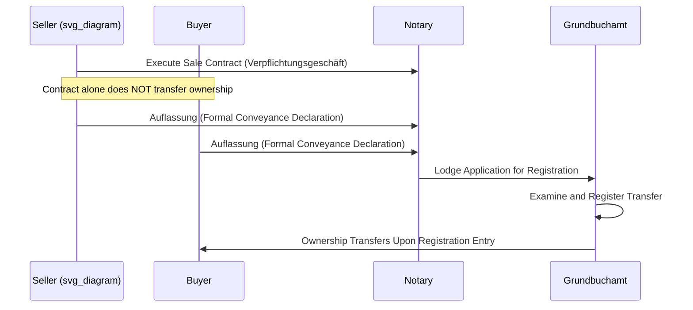

## Civil Law Approaches to Land Registration


### Overview

Civil law jurisdictions — those descended from Roman law traditions and codified private law (France, Germany, Spain, much of Latin America, many parts of Continental Europe, and civil-law-influenced jurisdictions elsewhere) approach land registration through structures distinct from both the Anglo-American deeds recording system and the Torrens title registration system, though they share conceptual overlap with the latter. Civil law systems are generally grounded in a codified body of property law (a Civil Code) that defines the numerus clausus of real rights, and land registers exist to give those codified rights public effect (opposability) against third parties.

### Foundational Civil Law Property Concepts

**Key Points**

- **Numerus clausus of real rights**: civil law systems limit real property rights (rights "in rem," enforceable against the world) to a fixed, code-defined list — ownership, usufruct, servitude/easement, mortgage/hypothec, superficies, emphyteusis, and a small number of others. Parties cannot create novel real rights by contract; this contrasts with common law's more flexible, judicially-evolved catalog of estates and interests.
- **Distinction between obligation (personal right) and real right**: a sale contract creates a personal obligation between buyer and seller; the transfer of the real right (ownership) is a separate juridical act, governed by its own formal requirements (which is where registration systems intervene).
- **Public faith/publicity function**: registration exists primarily to make real rights *opposable* to third parties (i.e., enforceable against and binding upon persons who were not party to the underlying transaction), rather than merely to create evidence of a transaction.

### Two Civil Law Registration Models

Civil law jurisdictions split broadly into two registration philosophies:

**1. Constitutive (Registration-as-Transfer) Systems**

In constitutive systems (paradigmatically Germany, and several jurisdictions following the German Grundbuch model), registration is not merely declaratory of a prior transfer — it is the operative act that creates or transfers the real right. Absent registration, no real right passes, even between the immediate parties to a valid sale contract (though a personal/contractual claim for conveyance may exist).

**2. Declarative (Registration-as-Notice) Systems**

In declarative systems (paradigmatically France, and jurisdictions following the French Napoleonic Code tradition), ownership transfers by the underlying contract itself (consensual transfer — "solo consensu"), and registration serves only to make that already-completed transfer opposable to third parties who lack actual knowledge. Registration is not required to transfer ownership between the parties, only to protect the transfer against competing subsequent claimants.

```mermaid
graph TD
    A[Sale Contract Executed] --> B{Registration Model}
    B -->|Constitutive - German Model| C[Ownership Does NOT Transfer]
    C --> D[Registration in Grundbuch]
    D --> E[Ownership Transfers Upon Registration (svg_diagram)]
    B -->|Declarative - French Model| F[Ownership Transfers Immediately Between Parties]
    F --> G[Registration for Opposability to Third Parties Only]
```

### The German Grundbuch Model (Constitutive Registration)

**Key Points**

- The Grundbuch (land register) is maintained by local courts (Grundbuchamt) and operates on a folio-based system similar in structure to Torrens: each parcel has its own register sheet recording ownership, encumbrances, and charges.
- German law separates the underlying obligatory contract (Verpflichtungsgeschäft — e.g., the sale agreement) from the real transfer act (Verfügungsgeschäft — the conveyance itself), a principle known as the **Abstraktionsprinzip** (abstraction principle): the validity of the real transfer is legally independent of the validity of the underlying obligatory contract. Even if the sale contract is later found void, the real transfer (if separately valid and registered) may stand, with the disadvantaged party limited to a claim in unjust enrichment rather than automatic recovery of the property itself.
- The transfer of real property additionally requires **Auflassung** — a formal, simultaneous declaration of conveyance by both parties before a notary — as a precondition to registration.
- Registration carries a **public faith (öffentlicher Glaube)** presumption: a good-faith third party may rely on the register's accuracy, and can acquire good title even from a registered but non-owning party, subject to statutory exceptions (similar in effect to Torrens indefeasibility, though doctrinally derived differently).



### The French Model (Declarative Registration / Publicité Foncière)

**Key Points**

- Under Article 1583 of the French Civil Code (and equivalents in jurisdictions following this tradition), a valid sale contract transfers ownership immediately upon agreement on the thing and the price (consensual transfer), without need for delivery or registration, as between the parties.
- The **publicité foncière** (land publicity) system, however, requires that transfers be registered at the Service de la Publicité Foncière to be opposable against third parties (competing purchasers, creditors with mortgages). An unregistered transfer remains fully valid between buyer and seller but risks being defeated by a subsequently registered competing claim.
- This creates a declarative-priority dynamic conceptually similar to a common-law race or race-notice recording act, but layered on top of a civil law consensual-transfer default rule rather than a title-by-deed-delivery default rule.
- Notarial involvement is mandatory for real estate transfers in France: a notaire (public officer with quasi-judicial authentication authority) must prepare and authenticate the transfer deed (acte authentique) before registration, providing a strong layer of ex-ante verification distinct from either common-law attorney practice or Torrens registrar examination.

### Notarial Function as a Structural Feature

**Key Points**

- A defining structural feature across most civil law land registration systems (French, German, Spanish, Italian, Latin American) is the mandatory involvement of a **notary public** (a distinct, highly regulated legal profession, not equivalent to the common-law notary) who drafts, authenticates, and often directly transmits the deed to the registry.
- The notary performs an independent verification role — checking capacity, consent, existing encumbrances, and tax compliance — before authentication, functioning as a quasi-judicial gatekeeper. This front-loads much of the risk-reduction work that in common-law deeds systems is performed later and privately by title examiners and title insurers.
- Because of this front-loaded verification, private title insurance is far less prevalent in most civil law jurisdictions than in the U.S. — the notarial function substitutes for much of what title insurance underwriting does in a deeds-recording system.

### Cadastral Systems and Their Relationship to Legal Registration

**Key Points**

- Most civil law jurisdictions maintain a **cadastre** — a parcel-based survey and fiscal/administrative record of land (boundaries, area, use classification) — which is historically and functionally distinct from the *legal* ownership register (Grundbuch, publicité foncière register, etc.), though many modern systems have integrated or closely linked the two (e.g., Germany's Liegenschaftskataster feeding into the Grundbuch; unified cadastre-registry systems increasingly common in Spain and parts of Latin America).
- The cadastre's original purpose was often fiscal (property tax assessment) rather than establishing legal title, which historically created a structural gap between "what the cadastre shows as the parcel" and "who the register shows as the legal owner" — a distinction of continuing practical importance in due diligence in many civil law jurisdictions.

### Comparative Table: Civil Law Models vs. Common Law Systems

| Feature | German (Constitutive) | French (Declarative) | Common Law Deeds System | Torrens (Title Registration) |
| --- | --- | --- | --- | --- |
| Ownership transfer trigger | Registration | Contract (consensual) | Delivery of valid deed | Registration |
| Registration required between parties | Yes | No (only for third-party opposability) | No | Yes (transfer is void/inoperative at law until registered) |
| Good-faith reliance on register | Yes (öffentlicher Glaube) | Limited | No state guarantee | Yes (indefeasibility) |
| Mandatory professional gatekeeper | Notary | Notary | Attorney (varies by state) / Title Agent | Registrar (administrative) |
| Underlying rights framework | Codified numerus clausus | Codified numerus clausus | Judicially evolved estates/interests | Judicially evolved estates/interests (registered) |

### Worked Example

**Example**

Scenario: A seller in Germany signs a private sale agreement for a parcel of land with a buyer, and the buyer pays the full purchase price, but the parties never complete the Auflassung or register the transfer before the seller later (fraudulently) sells and registers the same parcel to a second, good-faith buyer.

Analysis: Under the Abstraktionsprinzip and the constitutive registration requirement, the first buyer never acquired real ownership despite having a valid contract and having paid in full — only a personal (contractual) claim against the seller existed. The second buyer, having completed Auflassung and registration in good faith, acquires indefeasible legal ownership under the public faith principle. The first buyer's remedy is a personal claim against the seller for breach of contract and restitution of the purchase price (and potentially damages), not recovery of the land itself.

**Conclusion**

This outcome — a fully-paid, contractually valid buyer losing the land to a later good-faith registrant — starkly illustrates the practical consequence of the constitutive model's strict separation between contractual obligation and real transfer, and explains why civil law practice places such heavy emphasis on prompt notarial completion and registration rather than relying on contractual execution alone. [Inference: exact remedies and any criminal liability for the fraudulent seller depend on the specific civil code and criminal code provisions of the jurisdiction.]

### Easements and Servitudes Under Civil Law

**Key Points**

- Civil law jurisdictions generally recognize **servitudes** (the civil law analog to common law easements) as a numerus clausus real right, categorized typically as predial servitudes (attached to land, benefiting a dominant estate) or personal servitudes (usufruct, use, habitation — benefiting a specific person).
- Servitudes are generally registrable (and in constitutive systems, registration may be required for the servitude to bind third parties or, in some formulations, to exist as a real right at all), following the same constitutive/declarative logic as ownership transfers in the relevant jurisdiction.
- Civil codes often specify servitudes arising by operation of law (e.g., rights of way of necessity for landlocked parcels — servitude de passage in French law) independent of any registered instrument, paralleling common law easements by necessity.

**Next Steps**

- Torrens Title Registration System
- Deeds Registration versus Title Registration
- Numerus Clausus and the Catalog of Real Rights
- Notarial Practice in Property Conveyancing
- Cadastral Survey Systems and Fiscal Land Records
- Servitudes and Easements in Civil Law Jurisdictions
- Mortgage and Hypothec Registration Systems
- Comparative Good-Faith Purchaser Protections
- Marketable Title Acts
- Curative Title Procedures