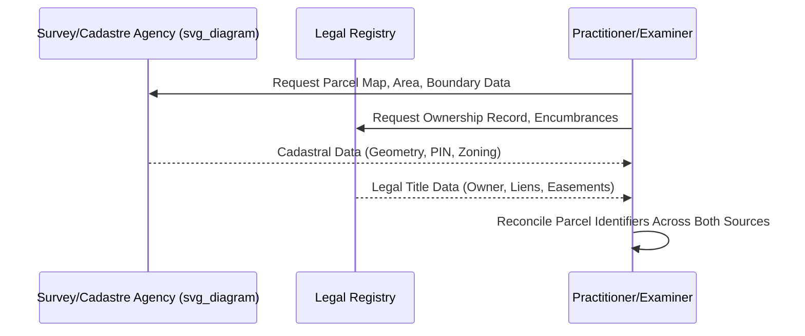

## Cadastral Systems and Land Administration


### Overview

A cadastre (cadastral system) is a parcel-based, authoritative inventory of land within a jurisdiction, recording the geometric boundaries, location, area, and often the ownership, use classification, and value of each parcel. Land administration is the broader institutional and technical framework — encompassing surveying, registration, valuation, and land-use control — through which a jurisdiction manages the relationship between people and land. Cadastral systems are foundational infrastructure underlying taxation, registration (deeds or Torrens), planning, and dispute resolution, and are distinct from, though often integrated with, the legal ownership register itself.

### Core Functions of a Cadastre

**Key Points**

- **Fiscal function**: the original and historically dominant purpose — establishing parcel boundaries and values for property tax assessment (the term "cadastre" derives from the Latin *capitastrum*, a register for capitation/poll tax).
- **Legal function**: supporting security of tenure by providing an authoritative record of parcel boundaries referenced by ownership registers (deeds or title systems).
- **Multipurpose/planning function**: modern cadastres increasingly serve land-use planning, environmental management, infrastructure planning, and resource management functions (the "multipurpose cadastre" concept).
- These functions can exist independently — a jurisdiction may have a robust fiscal cadastre with a comparatively weak or disconnected legal ownership register, or vice versa, which is a significant due diligence consideration in comparative practice.

```mermaid
graph TD
    A[Cadastral System (svg_diagram)] --> B[Fiscal Function: Tax Assessment]
    A --> C[Legal Function: Boundary Reference for Ownership Register]
    A --> D[Planning Function: Land Use, Zoning, Resource Management]
    B --> E[Property Tax Rolls]
    C --> F[Deeds Register or Title Register]
    D --> G[Zoning Maps, Environmental Overlays, Infrastructure Planning]
```

### Core Components of a Cadastral Record

**Key Points**

- **Parcel identifier**: a unique reference number/code assigned to each mapped parcel (e.g., a Parcel Identification Number/PIN, folio number, or cadastral reference), used as the linking key across tax, planning, and legal registration systems.
- **Geometric description**: boundary coordinates, typically referenced to a national or regional geodetic datum, historically represented as metes-and-bounds narrative descriptions or plat maps, now increasingly captured as georeferenced digital polygons (GIS-based).
- **Area and classification**: parcel size and designated land-use category (agricultural, residential, commercial, forest, etc.).
- **Attribute linkage**: connections to the ownership register, valuation roll, zoning designation, and any registered encumbrances.

### Cadastral Surveying Methods

| Method | Description | Typical Use Context |
| --- | --- | --- |
| Metes and bounds | Narrative description using directions, distances, and monuments/landmarks from a point of beginning | Older U.S. jurisdictions (particularly original 13 colonies), irregular historical parcels |
| Rectangular (Public Land Survey System) | Grid-based system dividing land into townships, sections, and fractional subdivisions | U.S. public lands (most states west of the original colonies), parts of Canada and Australia |
| Plat/subdivision mapping | Formal platted lots within a recorded subdivision plan | Modern residential/commercial developments |
| Coordinate-based/geodetic survey | Boundaries fixed by precise coordinate points tied to a national geodetic reference system | Modern cadastres, particularly title-registration and civil law jurisdictions |

**Key Points**

- Metes-and-bounds descriptions are inherently prone to ambiguity over time (monuments disappear, adjoining descriptions may not perfectly close, natural boundary features shift), a recurring source of boundary litigation and a key due diligence risk factor for older parcels.
- The Public Land Survey System (PLSS), used across most of the U.S. interior and western states, divides land into 6-mile-square townships, subdivided into 36 one-mile-square sections, each further divisible into halves, quarters, and smaller fractional aliquot parts — providing a systematic, rectangular alternative to metes-and-bounds description.

$$1 \text{ section} = 640 \text{ acres} = \frac{1}{36} \text{ township}$$

### Land Administration Institutional Models

**Key Points**

- **Unified/integrated model**: a single agency maintains both the cadastral map and the legal ownership register (common in many Torrens and civil-law title-registration jurisdictions, e.g., integrated land registries in parts of Scandinavia, Australia, and increasingly Spain and Latin America).
- **Separated model**: cadastral mapping (often under a ministry of finance, survey department, or tax authority) and legal ownership registration (often under a ministry of justice or separate registry office/courts) are maintained by different institutions with only administrative linkage — historically common in many civil law jurisdictions (e.g., historically in France and Germany, though increasingly integrated) and in many U.S. states, where the county assessor's parcel maps and the county recorder's deed records are separate systems cross-referenced by parcel number.
- The degree of integration significantly affects due diligence efficiency: in separated systems, a title search and a cadastral/boundary/tax search are distinct exercises that must both be conducted and reconciled.



### Digital and Multipurpose Cadastre Evolution

**Key Points**

- Modern cadastral administration has largely transitioned from paper plats and manual ledgers to **Geographic Information System (GIS)**-based digital cadastres, enabling spatial query, overlay analysis (combining ownership, zoning, environmental, and infrastructure layers), and integration with satellite/aerial imagery and, increasingly, drone-based and LiDAR survey data.
- The **multipurpose cadastre** concept (formally articulated in land administration literature since the 1980s, notably in work supported by bodies like the International Federation of Surveyors, FIG) envisions the cadastre as core spatial infrastructure supporting not just ownership and taxation but comprehensive land and resource management.
- The **Land Administration Domain Model (LADM)**, standardized as ISO 19152, provides an international conceptual schema for modeling land administration data (parties, rights/restrictions/responsibilities, spatial units) to support interoperability between national cadastral and registration systems. [Unverified: specific national implementations and current adoption status of LADM/ISO 19152 vary and should be confirmed against current standards documentation for any jurisdiction-specific due diligence.]

### Fit-for-Purpose and Continuum of Land Rights Approaches

**Key Points**

- In many developing-country contexts, formal, survey-accurate cadastral systems are cost-prohibitive to implement at full national scale. The **"fit-for-purpose" land administration** approach (promoted by organizations including the World Bank, UN-Habitat, and the Global Land Tool Network) advocates flexible, lower-cost, incrementally improvable cadastral methodologies (e.g., using satellite imagery-based general boundaries rather than precise coordinate surveys) prioritizing rapid, affordable coverage over surveying precision.
- The **continuum of land rights** concept recognizes that formal registered freehold title is one point on a spectrum that also includes customary tenure, informal occupation with de facto recognition, group/communal tenure, and leasehold — and that cadastral/land administration systems should be capable of recording and protecting rights across this spectrum rather than only fully formalized title.
- [Inference: the practical adoption and effectiveness of fit-for-purpose approaches vary substantially by country and are the subject of ongoing empirical study; specific program outcomes should be verified against current development-agency reporting rather than assumed uniformly successful.]

### Boundary Disputes and Cadastral Discrepancies

**Key Points**

- A recurring due diligence issue is discrepancy between the cadastral map (used for tax/administrative purposes) and the legal description in the ownership register/deed — particularly common where the two systems developed independently or where older metes-and-bounds descriptions have not been reconciled with modern coordinate-based cadastral resurveys.
- Common resolution tools include boundary line agreements between adjoining owners, licensed survey reconciliation, and (where agreement cannot be reached) judicial boundary determination, often combined with a quiet title action.
- Discrepancies frequently surface at the point of sale or development, when a current survey is commissioned and reveals encroachments, gaps ("gores"), or overlaps relative to either the cadastral map or the adjoining parcel's record description.

### Worked Example

**Example**

Facts: A parcel's 1940s metes-and-bounds deed description references a "large oak tree" and an adjoining creek bank as boundary monuments. A 2026 survey, commissioned before sale, finds the oak tree long gone and the creek has migrated approximately 15 feet from its historical position due to natural erosion. The county cadastral/GIS map, digitized from a 1990s aerial resurvey, shows the parcel boundary in a location that does not precisely match either the original deed description or the creek's current position.

Analysis:

1. The surveyor must apply boundary-location priority rules (jurisdiction-specific, but commonly: natural monuments > artificial monuments > courses and distances > area/acreage stated, when these conflict).
2. Since the creek is a natural monument, its *historical* location (if determinable, e.g., via historical aerial imagery or survey records) generally controls over the current eroded position, unless the jurisdiction applies a doctrine of gradual accretion/erosion shifting the boundary with the watercourse (a separate doctrinal question from monument interpretation).
3. The cadastral GIS layer is administrative/fiscal in nature and does not itself control legal boundary location — it is evidence, not conclusive proof, in a deeds-based jurisdiction (contrast with title-registration systems where the register may be more directly authoritative).

**Conclusion**

Resolving the discrepancy likely requires a licensed retracement survey reconciling the historical monument evidence with current conditions, potentially followed by a recorded boundary line agreement with the adjoining owner or a corrective instrument, since no single data source (deed, survey, or cadastral map) is automatically controlling. [Inference: the specific priority hierarchy for resolving conflicting boundary evidence is jurisdiction-specific and should be confirmed against local survey/property law standards.]

### Land Administration and Registration System Interaction

**Key Points**

- The cadastre supplies the *spatial* definition of a parcel; the registration system (deeds or title) supplies the *legal* definition of rights in that parcel. Effective land administration depends on reliable cross-referencing between the two — a weak or unintegrated linkage is a common source of both administrative inefficiency and title risk in comparative practice.
- Efforts toward integration (cadastre-registry unification, unique parcel identifiers used consistently across tax, zoning, and title records, GIS-linked title registers) are a major ongoing theme in land administration modernization globally, particularly in jurisdictions transitioning from paper-based to digital systems.

**Next Steps**

- Deeds Registration versus Title Registration
- Torrens Title Registration System
- Civil Law Approaches to Land Registration
- Boundary Disputes and Survey Reconciliation
- Public Land Survey System and Metes-and-Bounds Description
- GIS Integration in Modern Land Registries
- Fit-for-Purpose Land Administration and Customary Tenure
- Quiet Title Actions
- Property Tax Assessment and Valuation Rolls
- Land Administration Domain Model (ISO 19152)