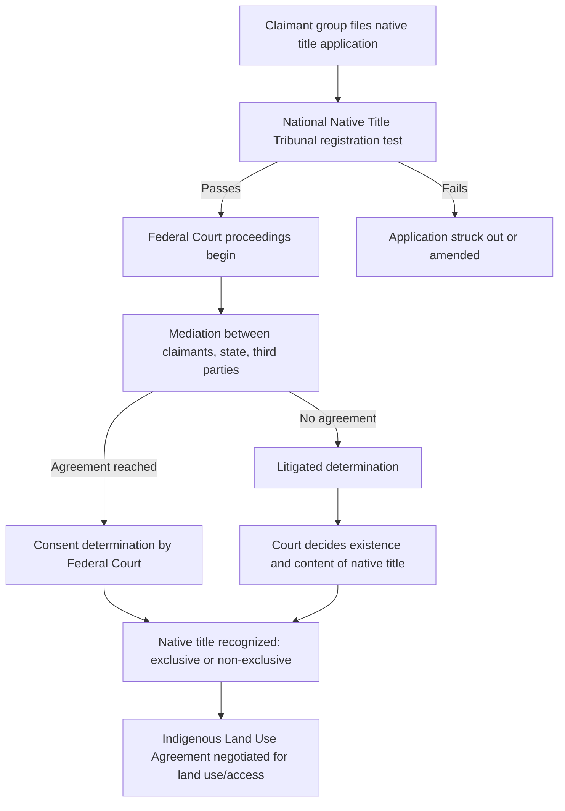

## Aboriginal Title and Native Land Claims


### Definition and Legal Nature

Aboriginal title is a common-law doctrine recognizing that Indigenous peoples hold pre-existing rights to land arising from their occupation, use, and possession prior to the assertion of sovereignty by a colonizing state. It is distinct from title granted by the state — it is *sui generis* (of its own kind), not reducible to either a fee simple estate or a mere personal/usufructuary right. It arises from historical fact (occupation), not from a Crown grant, treaty, or statute, though those instruments may later recognize, define, extinguish, or convert it.

Key doctrinal features:

- **Source**: prior occupation, not state grant
- **Content**: a right to the land itself (not just to specific resource-use activities), including the right to choose how the land is used, subject to an internal limit (see below)
- **Communal nature**: title is generally held collectively, not individually
- **Inalienability (in most jurisdictions)**: aboriginal title typically cannot be sold to private parties; it may only be surrendered to the Crown/state
- **Inherent limit**: many jurisdictions hold that uses of the land must not be irreconcilable with the nature of the group's attachment to it (this varies by jurisdiction and is contested)

### Historical and Doctrinal Origins

**Doctrine of Discovery / Terra Nullius**

Colonial powers historically justified land acquisition through the doctrine of discovery and, in some jurisdictions, the fiction of *terra nullius* ("nobody's land"), treating Indigenous-occupied land as legally unowned. Aboriginal title jurisprudence developed substantially in the 20th century as courts repudiated or narrowed these fictions.

**Foundational cases by jurisdiction:**

- **United States**: *Johnson v. M'Intosh* (1823) established that Indigenous nations held a right of occupancy that could only be extinguished by the federal government, not sold to private individuals — an early recognition of a real, if limited, aboriginal interest, embedded within a discovery-doctrine framework that subordinated it to federal sovereign title.
- **Canada**: *Calder v. British Columbia* (1973) recognized aboriginal title could exist independent of any statute or proclamation. *Delgamuukw v. British Columbia* (1997) defined the test for proving title and clarified its content, including the inherent limit. *Tsilhqot'in Nation v. British Columbia* (2014) was the first case to grant a declaration of aboriginal title over a specific territory (rather than merely site-specific rights), confirming title includes the right to proactively use and manage the land, including for economic purposes.
- **Australia**: *Mabo v. Queensland (No 2)* (1992) overturned *terra nullius* and recognized native title under Australian common law, leading to the *Native Title Act 1993* (Cth).
- **New Zealand**: The *Treaty of Waitangi* (1840) and its later reinterpretation (via the Treaty of Waitangi Act 1975 and Waitangi Tribunal) form the backbone of Māori land claims, alongside common-law aboriginal title recognized in cases like *Ngati Apa v Attorney-General* (2003) (foreshore and seabed).

### Elements Required to Establish Aboriginal Title

Requirements vary by jurisdiction but commonly include:

1. **Occupation**: The group occupied the land prior to the assertion of sovereignty (Canada) or prior to colonization/annexation (other jurisdictions).
2. **Continuity**: Present-day occupation/connection is substantially continuous with the pre-sovereignty occupation, though courts generally do not require an unbroken, uninterrupted chain.
3. **Exclusivity**: At the relevant time, the group had the intention and capacity to exclude others from the land (this can be satisfied by shared exclusivity among allied groups).
4. **Sufficiency**: Occupation must be sufficient — courts may accept both physical presence and, in some jurisdictions, regular use of land for hunting, fishing, or ceremonial purposes as evidence, especially for semi-nomadic peoples.

**[Inference]** The precise weighting of these elements — particularly how "sufficiency" is assessed for nomadic vs. sedentary societies — remains one of the more contested and fact-intensive areas of the doctrine, and outcomes are highly jurisdiction- and fact-specific.

### Extinguishment

Aboriginal title can potentially be extinguished, though the standards for this differ sharply by jurisdiction:

- **Canada**: Requires "clear and plain" intention by the Crown; post-1982, extinguishment of existing aboriginal rights is constitutionally constrained by section 35 of the *Constitution Act, 1982*, which recognizes and affirms existing aboriginal and treaty rights — the Crown can no longer unilaterally extinguish title but may infringe it if justified under the *Sparrow* test (valid legislative objective + consistency with the honour of the Crown).
- **United States**: Congress has plenary power to extinguish aboriginal title; compensation is not constitutionally required for extinguishment of aboriginal title itself (as opposed to "recognized" title), per *Tee-Hit-Ton Indians v. United States* (1955) — a doctrine frequently criticized by scholars as inconsistent with just-compensation norms applied elsewhere.
- **Australia**: Native title can be extinguished by grants of freehold or other acts inconsistent with its continued existence; the *Native Title Act 1993* codifies "past act" and "future act" regimes governing when extinguishment occurs and what validation or compensation processes apply.

### The Honour of the Crown and Fiduciary Duty

In Commonwealth jurisdictions (particularly Canada), the **honour of the Crown** is a foundational constitutional principle requiring the state to act with honesty, good faith, and diligence in its dealings with Indigenous peoples. It gives rise to:

- **Duty to consult and accommodate**: Where the Crown has knowledge (actual or constructive) of a potential aboriginal right or title and contemplates conduct that might adversely affect it, a duty to consult arises — scaled to the strength of the claim and the seriousness of the potential adverse impact (*Haida Nation v. British Columbia*, 2004).
- **Fiduciary duty**: In certain contexts (e.g., surrender of reserve land, management of Indigenous-held assets), the Crown owes enforceable fiduciary obligations.
- **Treaty interpretation**: Ambiguities in historical treaties are generally interpreted in favor of Indigenous signatories, and treaties are interpreted in a manner that reflects their historical and cultural context rather than strict contractual formalism.

### Native Title vs. Treaty Rights vs. Statutory Land Rights

These are frequently conflated but are legally distinct:

| Concept | Source | Nature |
| --- | --- | --- |
| Aboriginal/Native Title | Prior occupation (common law) | Proprietary interest in land itself |
| Treaty Rights | Negotiated agreement between Crown/state and Indigenous nation | Rights defined by treaty text (may include land, hunting/fishing rights, self-government) |
| Statutory Land Rights | Legislation (e.g., Native Title Act, land rights acts) | Rights created or codified by statute, which may recognize, supplement, or replace common-law title |
| Aboriginal Rights (non-title) | Prior practices integral to distinctive culture | Site- or activity-specific (e.g., a right to fish in a particular location), narrower than title |

### Comparative Snapshot: Native Title Claims Process (Australia)



### Conceptual Diagram: Bundle of Rights Model (svg_diagram)

<svg xmlns="http://www.w3.org/2000/svg" viewBox="0 0 640 360">
<rect x="0" y="0" width="640" height="360" fill="#ffffff" />
<text x="320" y="28" text-anchor="middle" font-size="16" font-weight="bold" fill="#1a1a1a">Aboriginal Title as a Bundle of Rights (svg_diagram)</text>
<circle cx="320" cy="200" r="110" fill="none" stroke="#2b6cb0" stroke-width="2" />
<text x="320" y="195" text-anchor="middle" font-size="13" fill="#2b6cb0" font-weight="bold">Aboriginal Title</text>
<text x="320" y="212" text-anchor="middle" font-size="11" fill="#2b6cb0">(sui generis interest)</text>
<g font-size="12" fill="#1a1a1a">
<rect x="30" y="60" width="150" height="40" rx="6" fill="#ebf8ff" stroke="#2b6cb0" />
<text x="105" y="84" text-anchor="middle">Right to Occupy</text>
<line x1="180" y1="80" x2="250" y2="140" stroke="#2b6cb0" />



```
<rect x="30" y="150" width="150" height="40" rx="6" fill="#ebf8ff" stroke="#2b6cb0" />
<text x="105" y="174" text-anchor="middle">Right to Use Resources</text>
<line x1="180" y1="170" x2="230" y2="190" stroke="#2b6cb0" />

<rect x="30" y="240" width="150" height="40" rx="6" fill="#ebf8ff" stroke="#2b6cb0" />
<text x="105" y="264" text-anchor="middle">Right to Exclude Others</text>
<line x1="180" y1="260" x2="250" y2="230" stroke="#2b6cb0" />

<rect x="460" y="60" width="150" height="40" rx="6" fill="#fff5f5" stroke="#c53030" />
<text x="535" y="84" text-anchor="middle">Right to Economic Use</text>
<line x1="460" y1="80" x2="400" y2="140" stroke="#c53030" />

<rect x="460" y="150" width="150" height="40" rx="6" fill="#fff5f5" stroke="#c53030" />
<text x="535" y="174" text-anchor="middle">Decision-Making Authority</text>
<line x1="460" y1="170" x2="410" y2="190" stroke="#c53030" />

<rect x="460" y="240" width="150" height="40" rx="6" fill="#fff5f5" stroke="#c53030" />
<text x="535" y="264" text-anchor="middle">Inherent Limit: Uses Must Not Degrade Group Attachment</text>
<line x1="460" y1="260" x2="400" y2="230" stroke="#c53030" />
```

</g>
<text x="320" y="340" text-anchor="middle" font-size="11" fill="#4a5568">Note: specific rights and limits vary substantially by jurisdiction</text>
</svg>

### Practical Example: Litigating a Claim (Illustrative)

**Example**

A First Nation in Canada seeks a declaration of aboriginal title over a forested watershed used historically for hunting, trapping, and seasonal fishing camps.

- **Evidence assembled**: oral history testimony from elders, historical fur-trade journals referencing the group's presence, archaeological evidence of settlement sites, maps of trap lines and travel routes, expert anthropological reports on land-use patterns.
- **Legal test applied**: court assesses occupation at the date of Crown sovereignty assertion, continuity to the present, and exclusivity (including whether shared use with an allied neighboring nation defeats exclusivity — under *Tsilhqot'in*, it does not necessarily).
- **Outcome pathways**: (a) declaration of title over all or part of the claimed territory; (b) recognition of narrower, site-specific aboriginal rights (e.g., a right to hunt) rather than full title; (c) claim dismissed for insufficient evidence of continuity or exclusivity.
- **Post-declaration consequences**: government must obtain consent or justify infringement (per the *Sparrow*/*Tsilhqot'in* framework) for any future development (e.g., logging, mining permits) within the declared territory.

**[Unverified]** Outcomes in any actual pending litigation are fact-specific and jurisdiction-specific; the above is a generalized illustrative pattern, not a summary of a particular real case.

### Interaction with Resource Development and Third-Party Interests

Aboriginal title claims frequently intersect with:

- **Mining and energy permits**: governments/regulators may owe a duty to consult before issuing permits within claimed or established title lands.
- **Forestry licenses**: similar consultation obligations; in some jurisdictions, title holders have an effective veto over certain land uses inconsistent with the group's relationship to the land.
- **Private landholders**: aboriginal title generally cannot be asserted against land validly granted in fee simple before recognition, though this depends on jurisdiction-specific extinguishment doctrine (particularly relevant in Australia's "past act" regime).
- **Environmental and conservation regimes**: co-management arrangements (e.g., joint management boards, Indigenous Protected Areas) are increasingly used as a negotiated middle ground between full title recognition and state-controlled management.

### International Legal Framework

- **UN Declaration on the Rights of Indigenous Peoples (UNDRIP, 2007)**: Article 26 recognizes Indigenous peoples' right to the lands, territories, and resources they have traditionally owned, occupied, or used. UNDRIP is not a binding treaty but has been incorporated into domestic law in some jurisdictions (e.g., Canada's *United Nations Declaration on the Rights of Indigenous Peoples Act*, British Columbia's parallel provincial statute).
- **ILO Convention No. 169** (Indigenous and Tribal Peoples Convention, 1989): a binding instrument for ratifying states, recognizing rights of ownership and possession over traditionally occupied lands.
- **Inter-American human rights system**: the Inter-American Court of Human Rights has developed significant jurisprudence recognizing communal Indigenous property rights under the American Convention on Human Rights (e.g., *Mayagna (Sumo) Awas Tingni Community v. Nicaragua*, 2001).

### Key Points

- Aboriginal title is a distinct, communal, *sui generis* property interest arising from prior occupation, not state grant.
- Its existence, content, and vulnerability to extinguishment vary significantly across common-law jurisdictions.
- Establishing title generally requires proof of occupation, continuity, and exclusivity at a legally defined critical date.
- The honour of the Crown and associated duties to consult are central to how modern states must interact with asserted or established title, particularly in Canada.
- International instruments like UNDRIP and ILO 169 increasingly inform (without always binding) domestic recognition of these rights.

### Related Topics

- Duty to Consult and Accommodate Doctrine
- Extinguishment Tests and the *Sparrow*/*Tsilhqot'in* Justification Framework
- Native Title Act 1993 (Australia) — Past Acts and Future Acts Regimes
- Treaty Rights Interpretation and the Honour of the Crown
- Comparative Analysis: *Terra Nullius* Repudiation Across Commonwealth Jurisdictions
- Indigenous Co-Management and Joint Governance Frameworks
- UNDRIP Domestic Implementation Statutes
- Free, Prior, and Informed Consent (FPIC) in Resource Development