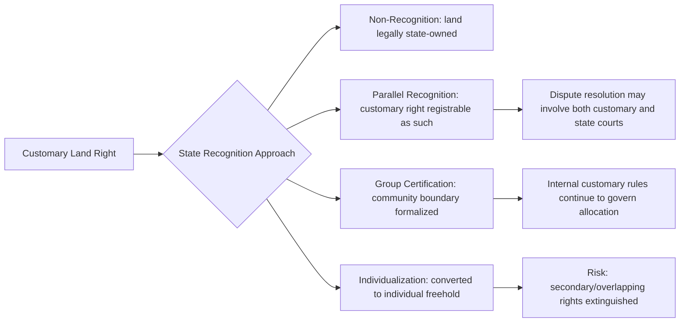

## Customary Land Tenure Systems

### Definition and Core Characteristics

Customary land tenure refers to systems of land holding, allocation, use, and transfer governed by the unwritten (or partially codified) rules, norms, and institutions of a particular community, developed and legitimized through long-standing practice rather than formal state law. It is the dominant form of land governance across much of sub-Saharan Africa, Melanesia, parts of Asia, and among Indigenous and tribal communities worldwide, even where it lacks full formal legal recognition.

Core characteristics:

- **Community-based legitimacy**: rights derive from social recognition and custom, not a state-issued title deed.
- **Layered/nested rights**: multiple people or groups can hold different, overlapping rights to the same parcel (e.g., a family holds primary rights, a lineage holds residual/reversionary rights, and community members hold secondary grazing or gathering rights).
- **Administered by customary authorities**: chiefs, elders, councils, clan heads, or other traditional leaders typically allocate, adjudicate, and record (often orally) land rights.
- **Flexibility and negotiability**: rules can adapt to social change, negotiation, and circumstance, in contrast to the fixity of registered title.
- **Embeddedness in social relationships**: land rights are frequently tied to kinship, marriage, lineage membership, or residency status rather than being a purely economic asset.

**[Inference]** Because customary systems are highly localized and often uncodified, generalizing "the" customary tenure system for an entire country or region tends to obscure substantial internal variation; the frameworks below describe common patterns rather than universal rules.

### The Bundle-of-Rights Model

Customary tenure is best understood not as binary ownership/non-ownership but as a **bundle of rights** that can be held by different parties simultaneously:

| Right | Description | Typical Holder |
| --- | --- | --- |
| Access | Right to enter the land | Community members generally |
| Withdrawal | Right to extract resources (crops, water, firewood) | Family/household |
| Management | Right to decide how land is used or improved | Household head or lineage |
| Exclusion | Right to determine who else may access | Lineage/clan authority |
| Alienation | Right to sell, lease, or transfer permanently | Often restricted or communal-only |

This model (drawing on Schlager and Ostrom's common-property rights typology) explains why "ownership" in customary contexts is frequently a spectrum rather than a single fixed status, and why comprehensive rights (including alienation) are often reserved to the collective rather than the individual.

### Typology of Customary Tenure Arrangements

1. **Communal/collective tenure**: land held by the entire community (e.g., grazing commons, sacred forests); use rights allocated by custom, no individual alienation right.
2. **Lineage/clan tenure**: land held by an extended family or clan group; usage rights distributed among members, often patrilineally or matrilineally, with a lineage head or council as trustee.
3. **Household/individual usufruct**: individuals or households hold long-term, often heritable, use rights over specific parcels (e.g., farmland) while ultimate/residual title remains with the lineage or community.
4. **Chieftaincy/traditional authority allocation**: a chief or traditional ruler holds land in trust for the community and allocates parcels to subjects, often under systems with strong historical continuity (e.g., certain West African stool/skin land systems, Pacific Islander customary land).
5. **Sacred/restricted-use land**: land set aside for ritual, burial, or spiritual purposes, generally inalienable and subject to strict customary prohibitions.

### Gender Dimensions

Customary systems frequently mediate access to land through marriage, lineage, and household headship rather than granting direct, independent ownership to women, resulting in significant documented disparities:

- In many patrilineal systems, women gain land access through a husband or male relative, with rights vulnerable to loss upon divorce or widowhood.
- In matrilineal systems, women (or their lineage) may hold stronger customary claims, though management authority is often still exercised by a maternal uncle or male lineage figure.
- Reform efforts (e.g., statutory protections for widows' land rights, joint titling requirements) increasingly attempt to correct these disparities, with mixed implementation success.

**[Unverified]** The practical effectiveness of any particular statutory gender-equity reform in altering customary practice on the ground is highly context-dependent and contested in the empirical literature; broad claims of success or failure should not be generalized across countries.

### Formalization and Legal Recognition Approaches

States have adopted varying strategies to interface customary tenure with formal law:

- **Non-recognition**: customary tenure treated as having no legal status; land legally vested in the state (historically common under colonial "public land" doctrines).
- **Adaptive/parallel recognition**: customary tenure recognized as a valid legal category alongside statutory freehold/leasehold (e.g., certain African land acts recognizing "customary land rights" as registrable interests).
- **Certification without individualization**: group or community-level certificates issued (e.g., Communal Land Rights certificates, group ranches) preserving collective structure while providing a documented, state-recognized boundary.
- **Individualization/titling programs**: customary land converted into individual freehold title, often through systematic land registration programs — controversial because it can extinguish overlapping/secondary rights (e.g., women's or grazing rights) not visible to registration surveys.

### Dispute Resolution Mechanisms

Customary land disputes are commonly resolved through:

- **Customary/traditional courts**: chiefs, elders' councils, or village tribunals applying customary law, often prioritizing reconciliation and social cohesion over strict rights adjudication.
- **Hybrid/statutory customary courts**: state-sanctioned courts empowered to apply customary law within a formal judicial hierarchy, with appeal routes into the general court system.
- **Land boards/commissions**: administrative bodies (sometimes mixed traditional-authority and state-official membership) responsible for allocation disputes and boundary conflicts.
- **Formal courts**: engaged where customary mechanisms fail, where the dispute crosses into constitutional or statutory rights questions, or on appeal.

**Example**

A widow is evicted from her deceased husband's farmland by his brothers, who assert customary inheritance rules vesting land in the patrilineage rather than the widow. She may pursue:

1. Mediation before a village elders' council citing local customary protections for widows (if recognized locally);
2. Escalation to a statutory customary court if available, potentially invoking a national law that overrides discriminatory customary inheritance rules;
3. Constitutional litigation if the jurisdiction's constitution contains an equality clause that has been held to override conflicting customary law (as has occurred in some African constitutional courts).

The outcome depends heavily on (a) whether the jurisdiction's constitution subordinates customary law to constitutional equality guarantees, and (b) whether statutory law explicitly addresses the conflict.

### Customary Tenure and Land Registration: Key Tensions

| Tension | Customary System Tendency | Formal Registration Tendency |
| --- | --- | --- |
| Boundaries | Fluid, negotiated, sometimes seasonal | Fixed, surveyed, cadastral |
| Rights holder | Multiple/overlapping (household, lineage, community) | Singular/discrete (individual or corporate) |
| Evidence | Oral testimony, communal memory, witnesses | Documentary record, registry entry |
| Transfer | Governed by kinship/social rules | Governed by contract and registered conveyance |
| Adaptability | High — evolves with social negotiation | Low — requires formal amendment process |
| Dispute forum | Elders, chiefs, customary councils | Courts, land registries, tribunals |

### Diagram: Layered Rights Structure (svg_diagram)

<svg xmlns="http://www.w3.org/2000/svg" viewBox="0 0 640 320">
<rect x="0" y="0" width="640" height="320" fill="#ffffff" />
<text x="320" y="26" text-anchor="middle" font-size="16" font-weight="bold" fill="#1a1a1a">Layered Customary Rights Over a Single Parcel (svg_diagram)</text>
<rect x="140" y="60" width="360" height="220" fill="#f0fff4" stroke="#2f855a" stroke-width="2" />
<text x="320" y="80" text-anchor="middle" font-size="12" fill="#2f855a" font-weight="bold">Community / Clan Domain</text>
<rect x="170" y="100" width="300" height="150" fill="#ebf8ff" stroke="#2b6cb0" stroke-width="2" />
<text x="320" y="120" text-anchor="middle" font-size="12" fill="#2b6cb0" font-weight="bold">Lineage Territory</text>
<rect x="200" y="140" width="240" height="90" fill="#fffaf0" stroke="#c05621" stroke-width="2" />
<text x="320" y="160" text-anchor="middle" font-size="12" fill="#c05621" font-weight="bold">Household Usufruct Plot</text>
<text x="320" y="185" text-anchor="middle" font-size="10" fill="#744210">Rights: farm, build, pass to heirs</text>
<text x="320" y="202" text-anchor="middle" font-size="10" fill="#744210">Cannot sell without lineage consent</text>
<text x="320" y="270" text-anchor="middle" font-size="10" fill="#2c5282">Grazing/gathering rights extend to all lineage members</text>
<text x="320" y="300" text-anchor="middle" font-size="10" fill="#22543d">Sacred grove and reversionary title held at community level</text>
</svg>

### Interaction with Investment, Land Grabs, and Development

Customary tenure's informal or partially recognized status has made it particularly vulnerable in large-scale land acquisitions ("land grabs"):

- Land classified by the state as "unused," "vacant," or "public" is frequently customarily occupied and used (e.g., for shifting cultivation, grazing, or seasonal foraging), leading to conflicts when leased or sold for agribusiness, mining, or infrastructure.
- Free, Prior, and Informed Consent (FPIC) standards (drawn from international Indigenous rights frameworks) are increasingly invoked as a benchmark for legitimate engagement with customary landholders, though FPIC's legal bindingness varies by jurisdiction and instrument.
- Compensation frameworks often undercompensate customary holders because valuation methods calibrated for formal title (e.g., market comparables) poorly capture communal, non-transactable, or spiritual value.

### Key Points

- Customary tenure operates through community-recognized rules rather than state-issued title, but constitutes a legally significant, often legally recognizable, property system.
- Rights are typically layered and overlapping (bundle-of-rights model) rather than singular and absolute.
- Gender and secondary-rights holders are especially vulnerable during formalization/individualization processes.
- States adopt a spectrum of recognition strategies, from outright denial to full parallel registration.
- Tensions between customary flexibility and formal registration's fixity are a central practical and policy challenge in land law reform.

### Related Topics

- Bundle-of-Rights Theory in Property Law (Schlager–Ostrom Framework)
- Land Titling and Registration Reform Programs
- Free, Prior, and Informed Consent (FPIC) Standards
- Gender and Customary Inheritance Law Reform
- Constitutional Supremacy vs. Customary Law Conflicts
- Land Grabbing and Large-Scale Land Acquisitions
- Communal Land Rights Certification Systems
- Comparative Customary Tenure: Sub-Saharan Africa vs. Melanesia vs. South Asia