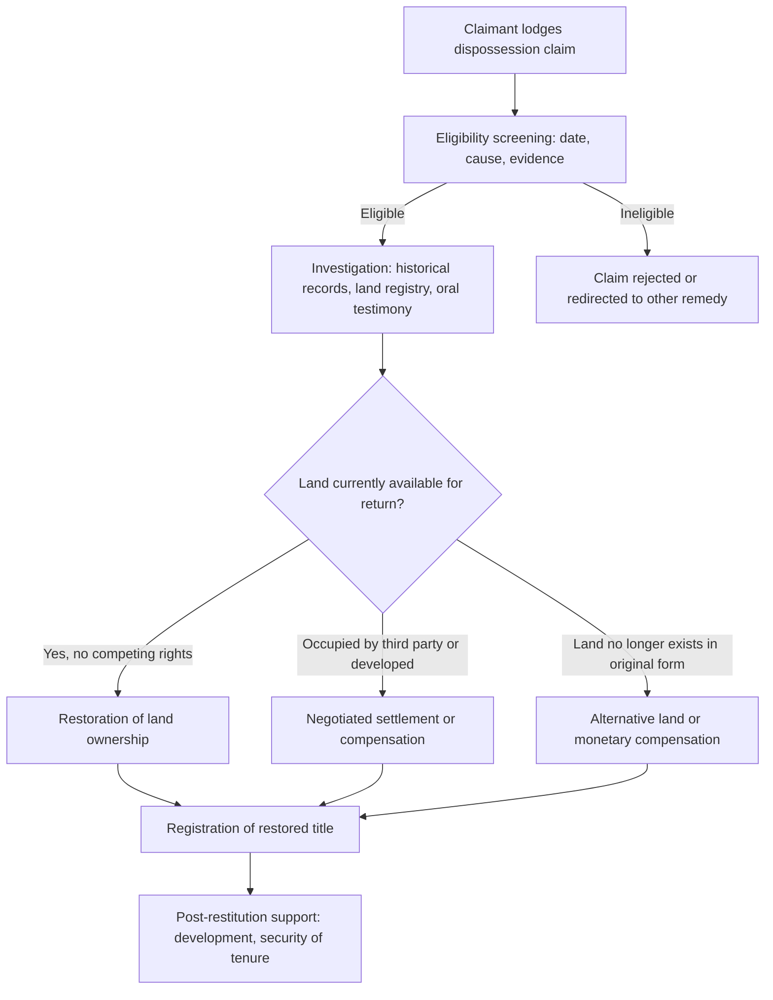

## Land Restitution and Historical Dispossession

### Definition and Conceptual Framework

Land restitution refers to legal and administrative processes by which land taken from individuals or communities — through colonization, forced removal, discriminatory legislation, armed conflict, or state expropriation — is returned to the original owners or their descendants, or otherwise remedied through compensation or alternative relief. It sits within the broader field of **transitional justice** and **historical redress**, addressing dispossession as a continuing legal and moral wrong rather than a closed historical event.

Restitution is conceptually distinct from, but often combined with, other remedial mechanisms:

| Mechanism | Core Action | Example Context |
| --- | --- | --- |
| Restitution | Physical return of the specific land | South Africa's land restitution program |
| Compensation | Monetary payment in lieu of or alongside return | Native American land claims settlements |
| Rehabilitation | Alternative land or resettlement support | Where original land is now unavailable |
| Recognition | Formal acknowledgment of title/rights without transfer | Some Indigenous land rights declarations |
| Reconciliation measures | Non-material remedies (apology, memorialization) | Truth and Reconciliation Commission processes |

### Historical Bases of Dispossession

Dispossession claims commonly arise from:

- **Colonial land seizure**: appropriation of Indigenous or native lands under doctrines like *terra nullius* or discovery, followed by settler allocation.
- **Racially discriminatory legislation**: laws formally dispossessing a group on the basis of race or ethnicity (e.g., South Africa's Natives Land Act 1913 and Group Areas Act 1950; various historical U.S. and Canadian statutes restricting Indigenous and minority landholding).
- **Forced removals and resettlement**: physical displacement of populations for segregation, security, agricultural, or infrastructure purposes.
- **War and conflict-related displacement**: seizure or abandonment of land during armed conflict, occupation, or ethnic cleansing.
- **State expropriation without adequate process or compensation**: even absent explicit racial or ethnic targeting, procedurally deficient takings can found restitution claims where they disproportionately affected a particular community.

### Comparative Frameworks

**South Africa**

The post-apartheid *Restitution of Land Rights Act 1994* established a claims process for people or communities dispossessed of property rights after 19 June 1913 as a result of racially discriminatory laws or practices. Key institutional features:

- **Commission on Restitution of Land Rights**: investigates and facilitates claims.
- **Land Claims Court**: specialized court adjudicating contested claims.
- Remedies include restoration of the land, provision of alternative land, compensation, or preferential access to state development programs.
- **[Unverified]** Specific current backlog figures, claim-resolution timelines, and the precise legislative status of proposed constitutional amendments to permit expropriation without compensation change frequently and should be checked against current official sources rather than relied on as fixed facts.

**Canada**

The **Specific Claims** process addresses grievances arising from Canada's alleged failure to fulfill treaty obligations or from unlawful disposal of First Nations reserve land or assets; the **Specific Claims Tribunal** (established 2008) can issue binding compensation decisions (monetary, not land return, is the typical remedy). This runs alongside broader modern treaty and comprehensive claims processes addressing unceded territories without historical treaties.

**Australia**

Native title recognition (post-*Mabo*) functions partly as a restitution-adjacent mechanism, though it operates through recognition of surviving title rather than "return" of extinguished title; separate state-based Aboriginal land rights acts (e.g., the *Aboriginal Land Rights (Northern Territory) Act 1976*) provided direct grant/transfer mechanisms distinct from native title litigation.

**United States**

Claims have proceeded through varied and evolving channels:

- The **Indian Claims Commission** (1946–1978) processed historical claims against the federal government, generally awarding monetary compensation rather than land return.
- Ongoing land-into-trust processes allow tribes to have land placed into federal trust status, restoring a protected land base (though this is an administrative acquisition mechanism, not strictly "restitution" for a specific historical wrong).
- Notable negotiated settlements (e.g., involving specific tribal nations and federal or state governments) have combined monetary compensation with land transfers; details vary substantially by settlement and should be verified against primary sources for any specific case.

**Colombia**

The *Victims and Land Restitution Law (Law 1448 of 2011)* created a specialized administrative and judicial process (including Restitution Judges and a national restitution unit) to return land to victims of forced displacement during the internal armed conflict — a prominent example of restitution embedded within a broader transitional justice and peace-process framework.

### The Restitution Claims Process (Generalized Model)

### Core Legal and Evidentiary Challenges

1. **Evidentiary burden across time**: historical records may be destroyed, falsified, or never created (especially where dispossession targeted groups whose customary or informal tenure was never registered); oral history and expert historical testimony often substitute for documentary proof.
2. **Cut-off dates**: nearly all restitution regimes impose a temporal boundary (e.g., South Africa's 1913 cut-off) that inherently excludes earlier dispossession (e.g., 17th–19th century colonial land seizure), a frequent source of political and legal controversy.
3. **Competing current occupants**: land may now be held by third parties who acquired it in good faith, long after the original dispossession — raising difficult questions about balancing restitution against innocent third-party reliance interests.
4. **Valuation and adequacy of compensation**: determining "just" compensation for land whose value has changed dramatically (through development, resource discovery, or urbanization) since dispossession is technically and politically fraught.
5. **Group vs. individual claims**: dispossession often occurred at a community level (e.g., a village, clan, or tribe), requiring restitution mechanisms capable of handling collective claims and complex questions of internal group representation and benefit distribution.
6. **Statute of limitations and finality**: legal systems must balance the principle that historical wrongs deserve remedy against the destabilizing effect of unlimited retrospective claims on current property markets and legal certainty.

**[Inference]** The tension between finality/certainty in land markets and corrective justice for historical dispossession is arguably the single most persistent structural challenge across virtually all restitution regimes, regardless of jurisdiction; how each system resolves it (via cut-off dates, compensation caps, or procedural bars) reflects a policy compromise rather than a doctrinally compelled outcome.

### Restitution vs. Compensation: Comparative Considerations

| Factor | Favors Restitution (Return of Land) | Favors Compensation |
| --- | --- | --- |
| Cultural/spiritual significance of specific land | Strong factor favoring return | Less relevant |
| Land currently vacant/state-held | Feasible | N/A |
| Land now heavily developed/occupied | Impractical | More feasible |
| Claimant community seeks land-based livelihood restoration | Strong factor favoring return | Less relevant |
| Administrative speed/finality prioritized | Slower (survey, eviction, transfer) | Often faster |
| Risk of displacing current innocent occupants | High if land occupied | Avoided |

### Example: Illustrative Case Pattern

**Example**

A rural community was forcibly removed from ancestral farmland in the mid-20th century under a racially discriminatory land law, and the land was subsequently allocated to private commercial farmers. Decades later, under a restitution statute, the community's descendants file a claim.

Process considerations:

1. **Eligibility**: claim must fall within the statute's date range and be causally linked to a recognized category of discriminatory dispossession.
2. **Evidence**: land registry records, historical removal orders, community oral testimony, expert historical reports establishing pre-removal occupation.
3. **Current status assessment**: the land is now a productive commercial farm under third-party private ownership — triggering a negotiated buy-out, alternative land allocation, or compensation rather than immediate physical restoration.
4. **Outcome design**: agencies may combine partial land transfer (where feasible) with financial compensation and development support (irrigation, agricultural extension services) to make restored land economically viable, since land returned without complementary support has, in some jurisdictions, produced adverse socioeconomic outcomes for restitution beneficiaries.

**[Unverified]** This is a generalized illustrative composite for teaching purposes, not a summary of any specific real case; real-world claims involve substantially more procedural and evidentiary complexity.

### Relationship to Transitional Justice Mechanisms

Restitution frequently operates alongside:

- **Truth and Reconciliation Commissions**: establishing the historical record of dispossession, which can support (but does not substitute for) individual restitution claims.
- **Reparations programs**: broader remedial frameworks of which land restitution may be one component alongside financial reparations, educational support, or infrastructure investment.
- **Constitutional and human rights litigation**: restitution claims increasingly interact with constitutional property clauses, equality guarantees, and international human rights instruments (e.g., regional human rights court jurisprudence recognizing communal property rights, as seen in Inter-American Court of Human Rights case law).

### Key Points

- Land restitution addresses historical dispossession as an ongoing legal wrong, generally through statutory claims processes with defined eligibility criteria and cut-off dates.
- Restitution, compensation, rehabilitation, and recognition are distinct but often combined remedies.
- Evidentiary burdens, competing third-party interests, and the tension between corrective justice and legal certainty are recurring structural challenges across jurisdictions.
- Comparative examples (South Africa, Canada, Australia, United States, Colombia) show markedly different institutional designs shaped by each country's particular history of dispossession.
- Restitution frequently functions as one component of a broader transitional justice and reconciliation framework rather than a standalone remedy.

### Related Topics

- Truth and Reconciliation Commission Land Findings
- Specific Claims and Comprehensive Claims Processes (Canada)
- Expropriation Without Compensation: Comparative Constitutional Debates
- Valuation Methodologies for Historical Land Claims
- Group Rights and Collective Claim Representation in Restitution Law
- Post-Restitution Land Use and Economic Sustainability
- International Human Rights Jurisprudence on Communal Property
- Statutes of Limitation in Historical Rights Claims