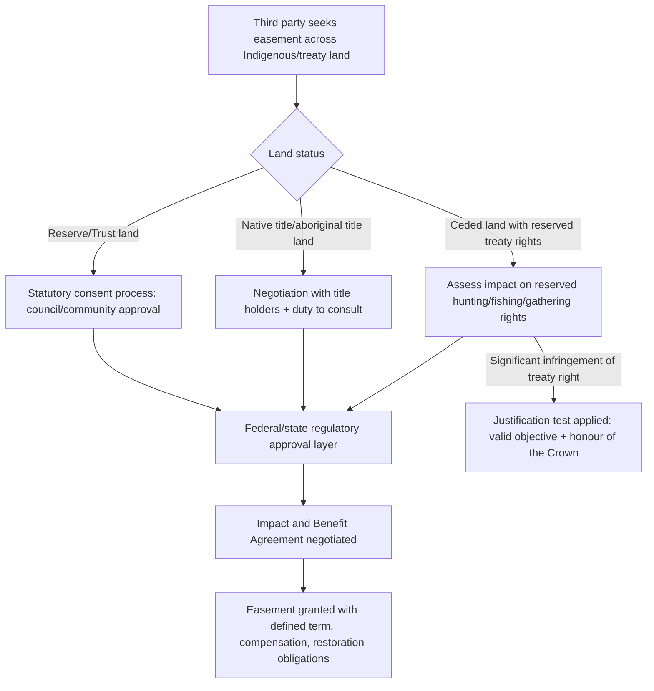

## Treaty Rights and Easements on Indigenous Lands

### Definition and Conceptual Overview

This topic addresses the intersection of two distinct legal categories: **treaty rights** (rights held by Indigenous nations arising from negotiated agreements with a colonizing or successor state) and **easements** (non-possessory rights to use another's land for a specific purpose, such as access, utility corridors, or resource extraction) as they apply on, across, or adjacent to Indigenous lands. The interaction between these two frameworks raises distinctive legal questions because easements — a creature of settler property law — must be reconciled with treaty-protected rights that often predate, and are constitutionally or internationally protected above, ordinary property interests.

Key conceptual distinctions:

- **Treaty rights** are rights *of* the Indigenous nation (e.g., to hunt, fish, gather, or access ceded or reserved territory) that bind the state and often third parties.
- **Easements over Indigenous land** are rights granted *to* third parties (governments, utilities, private companies) to use Indigenous or reserve land for a defined purpose, which may burden or conflict with treaty rights or reserve integrity.
- **Easements reserved by treaty** are a specific and important sub-category: rights of way, access corridors, or resource-use rights explicitly reserved *for* the Indigenous nation within land otherwise ceded to the state (e.g., a treaty ceding land but reserving the right to hunt and fish on it "as long as the rivers flow").

### Treaty Rights: Legal Nature and Interpretation

Treaty rights are typically treated in common-law jurisdictions not as simple contracts but as *sui generis* agreements between sovereigns (or between a sovereign and a nation with an inherent, pre-existing form of sovereignty), warranting distinctive interpretive principles:

- **Liberal, purposive interpretation**: courts generally interpret treaty language as the Indigenous signatories would have understood it at the time, rather than through strict, technical settler-legal construction.
- **Resolution of ambiguity in favor of the Indigenous party**: consistent with the honour of the Crown/state, ambiguities are construed to favor the Indigenous nation's understanding.
- **Extrinsic evidence**: courts routinely admit historical context, oral history, and the negotiation record (not just the written text) to interpret treaty terms, given frequent gaps between what was orally promised and what was formally recorded.
- **"Living tree" or evolving application**: certain treaty rights (e.g., a right to hunt with technology available "at the time of the treaty") are interpreted to permit reasonable modern evolution of the means of exercising the right (e.g., firearms rather than bows), even where this was not contemplated at signing.

### Easements: General Framework Recap (as Applied Here)

An easement is a non-possessory interest allowing a specific use of land owned by another. Categories relevant to Indigenous lands include:

| Easement Type | Typical Purpose | Common Grantee |
| --- | --- | --- |
| Right-of-way | Roads, trails, access routes | Government, neighboring landowners, utilities |
| Utility easement | Power lines, pipelines, telecommunications | Utility companies, state agencies |
| Resource-access easement | Timber removal, mineral extraction transport | Private companies, state agencies |
| Conservation easement | Restriction on development for environmental protection | Conservation trusts, government agencies |
| Treaty-reserved usufructuary right | Hunting, fishing, gathering across ceded land | The Indigenous nation itself (as easement-like burden on the new landowner) |

### The Treaty-Reserved Right as a Quasi-Easement

A significant conceptual feature of many historical treaties is the reservation of usufructuary rights (hunting, fishing, gathering, passage) over land that was otherwise ceded to the state or opened to settlement — functioning, in property-law terms, analogously to an easement burdening the land in favor of the Indigenous nation, though courts are careful to note it is not merely a private-law easement but a constitutionally or treaty-protected right with distinct interpretive and enforcement rules.

**Key illustrative doctrine (Canada/U.S. comparative pattern):**

- In *R. v. Badger* (Canada) and related jurisprudence, treaty rights to hunt "for food" on ceded land were held to survive the transfer of land to private ownership in many circumstances, subject to reasonable regulation and, in some cases, geographic limitation to unoccupied or Crown land.
- In U.S. treaty-rights jurisprudence (e.g., *United States v. Washington*, the "Boldt Decision," 1974, concerning Pacific Northwest fishing rights), treaties reserving "the right of taking fish at usual and accustomed grounds" were held to guarantee a specific allocation (in that case, up to 50%) of harvestable fish, binding even against later state regulation and non-Indigenous fishers — demonstrating how a treaty-reserved right can function as an enforceable burden on public and private resource use, well beyond a conventional private easement's scope.

**[Inference]** The characterization of treaty-reserved usufructuary rights as "easement-like" is a useful conceptual analogy for property-law students, but courts in most jurisdictions are explicit that these rights are not to be reduced to ordinary private-law easement doctrine, precisely because doing so would understate their constitutional or sovereign-to-sovereign character and could subject them to defenses (e.g., abandonment, prescription) inapplicable to treaty rights.

### Easements Granted Across Indigenous/Reserve Lands

Where a government, utility, or private party seeks an easement (e.g., a pipeline right-of-way, transmission line, or road) across land held as a reserve, native title land, or treaty-protected territory, additional layers of process typically apply beyond ordinary easement law:

1. **Consent requirements**: many statutory regimes require the consent of the Indigenous landholding body (band council, native title holders, or equivalent) before an easement can be validly granted — ordinary compulsory-purchase or eminent-domain easement mechanisms available against private landowners frequently do not apply, or apply only with modification, to reserve/title land.
2. **Duty to consult**: even where formal consent is not strictly required by statute, the duty to consult (in jurisdictions like Canada) requires meaningful engagement scaled to the seriousness of the potential impact before the easement is granted.
3. **Federal/state approval layers**: in many jurisdictions (e.g., U.S. reservation land held in trust), easements require approval from a federal agency (e.g., Bureau of Indian Affairs) in addition to, or instead of, ordinary state/local land-use approval.
4. **Compensation and benefit-sharing**: easement grants increasingly require negotiated compensation, ongoing royalty/benefit-sharing arrangements, or Impact and Benefit Agreements (IBAs), rather than a one-time payment typical of conventional easements.
5. **Term and reversibility**: easements over Indigenous land are frequently negotiated with more restrictive terms (defined duration, renewal conditions, decommissioning/restoration obligations) than perpetual easements common in ordinary property transactions.

### Infringement and Justification Analysis

Where a proposed easement, development, or regulatory action would infringe a treaty right, many jurisdictions apply a structured justification test (the Canadian *Sparrow*/*Badger*/*Tsilhqot'in* line of authority is the most developed example):

1. Does the government action constitute a *prima facie* infringement of the treaty or aboriginal right (e.g., meaningful diminishment of the ability to exercise the right)?
2. If so, is there a valid legislative or regulatory objective (e.g., conservation, public safety)?
3. Is the infringement consistent with the honour of the Crown/state — including whether there was adequate consultation, whether the right holder's priority interest was respected, and whether compensation is available?

**[Unverified]** The precise contours of the justification test, and whether it applies at all, differ significantly across the U.S., Canadian, Australian, and other jurisdictions; the sequence above reflects the Canadian model most closely and should not be assumed to transfer directly to other legal systems without jurisdiction-specific verification.

### Conservation Easements and Indigenous Land Stewardship

An increasingly prominent, non-conflictual application of easement law involves conservation easements voluntarily placed by Indigenous title holders themselves (rather than imposed on them) to protect land from future development while retaining underlying ownership — often paired with co-management agreements, Indigenous Protected and Conserved Areas (IPCAs), or guardianship programs that blend customary stewardship practices with formal conservation-easement mechanics.

### Illustrative Example

**Example**

A regional utility proposes a high-voltage transmission line easement crossing land subject to a historical treaty reserving hunting and fishing rights, part of which is now a First Nation reserve and part of which is provincial Crown land opened to settlement.

Analysis pathway:

1. **Segment crossing reserve land**: requires the band council's formal consent under the applicable reserve-lands statute, plus federal/departmental approval; ordinary provincial easement/expropriation law does not directly apply.
2. **Segment crossing ceded Crown land with reserved treaty rights**: the utility and regulator must assess whether construction and operation of the line would meaningfully diminish the ability to hunt or fish in the affected area (e.g., habitat disruption, access blockage).
3. **Consultation**: the Crown (through its regulatory approval role) owes a duty to consult the affected First Nation(s), scaled to the seriousness of the anticipated impact, potentially including accommodation measures like route modification, mitigation funding, or seasonal construction restrictions.
4. **Agreement structure**: final easement grant is likely accompanied by an Impact and Benefit Agreement providing ongoing compensation, employment/contracting commitments, and environmental monitoring rights for the affected community.

**[Unverified]** This is an illustrative composite scenario for teaching purposes; actual outcomes depend heavily on the specific treaty text, applicable statutory regime, and case-specific evidentiary record.

### Key Points

- Treaty rights are interpreted under distinctive, purposive, pro-Indigenous canons of construction, not ordinary contract law.
- Treaty-reserved usufructuary rights function analogously to easements burdening ceded land but are legally distinct, constitutionally/internationally protected interests, not reducible to private-law easement doctrine.
- Granting an easement across reserve, native title, or treaty-protected land typically requires layered consent, consultation, and regulatory approval beyond ordinary easement or expropriation processes.
- Infringement of a treaty right by an easement or development project may trigger a structured justification analysis in jurisdictions with developed doctrine (notably Canada).
- Conservation easements and Indigenous Protected and Conserved Areas represent a growing, cooperative use of easement-like mechanisms initiated by Indigenous landholders themselves.

### Related Topics

- Duty to Consult and Accommodate Doctrine
- Impact and Benefit Agreements (IBAs) in Resource Development
- Aboriginal Title and Native Land Claims
- Reserve Land Governance and Statutory Consent Regimes
- Fishing and Hunting Rights Allocation Disputes (e.g., *United States v. Washington*)
- Indigenous Protected and Conserved Areas (IPCAs)
- Eminent Domain and Expropriation on Trust/Reserve Land
- Treaty Interpretation Canons and the Honour of the Crown