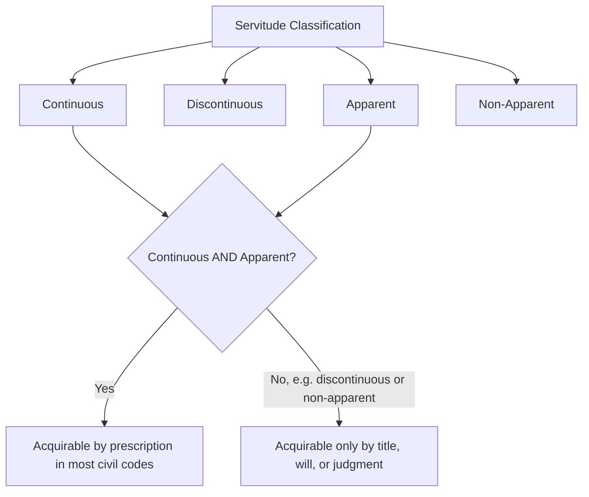
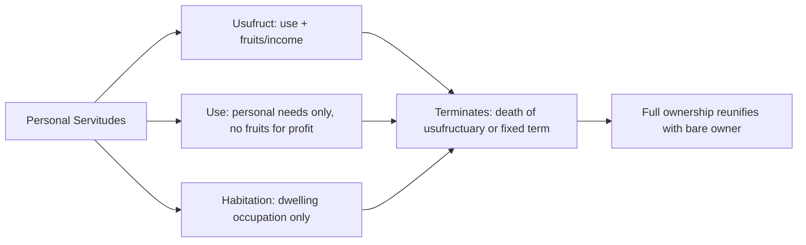

## Servitude Law in Civil Law Jurisdictions

### Definition and Conceptual Foundation

In civil law systems (deriving substantially from Roman law and codified in instruments like the French *Code Civil*, German *Bürgerliches Gesetzbuch* (BGB), and their descendants), a **servitude** (*servitude*, *Grunddienstbarkeit*, *servidumbre*, *servitù*) is a real right (*ius in re aliena*) burdening one immovable property (the **servient estate**) for the benefit of another immovable property (the **dominant estate**) or, in the case of personal servitudes, for the benefit of a specific person. Civil law servitude doctrine is structurally more systematized and codified than the common-law law of easements, reflecting the civil law tradition's preference for exhaustive statutory categorization of property rights (*numerus clausus* of real rights).

Core structural principle: **"servitus servituti esse non potest"** and the maxim that a servitude cannot exist for the benefit of the servient estate's own owner over their own land (*nemini res sua servit* — no one can have a servitude over their own property), reflecting Roman-law origins.

### The Roman Law Foundations

Roman law originally recognized two broad categories, still foundational to modern civil codes:

- **Praedial (real) servitudes** (*servitutes praediorum*): attached to land itself, benefiting whichever person owns the dominant estate at any given time, and burdening whichever person owns the servient estate — running with the land automatically upon transfer.
- **Personal servitudes** (*servitutes personarum*): rights attached to a specific person rather than to land ownership, including usufruct (*ususfructus*), use (*usus*), and habitation (*habitatio*), which terminate on the death of the beneficiary (or a fixed term) rather than transferring with land ownership.

Roman law further divided praedial servitudes into **rustic** (*servitutes praediorum rusticorum* — e.g., rights of way, water rights) and **urban** (*servitutes praediorum urbanorum* — e.g., rights of light, support, drainage between buildings), a classificatory distinction still echoed, though not always formally retained, in modern codes.

### Comparative Codification Models

| Jurisdiction | Code | Key Servitude Provisions | Notable Features |
| --- | --- | --- | --- |
| France | Code Civil | Arts. 637–710 (servitudes) | Distinguishes servitudes established by law, by natural situation of premises, and by act of man |
| Germany | BGB | §§ 1018–1093 | Separately codifies *Grunddienstbarkeit* (real servitude), *Nießbrauch* (usufruct), and *beschränkte persönliche Dienstbarkeit* (limited personal servitude) |
| Spain | Código Civil | Arts. 530–604 | Continuous/discontinuous and apparent/non-apparent classification central to acquisition by prescription |
| Italy | Codice Civile | Arts. 1027–1099 | Distinguishes voluntary, legal (*legali*), and by destination of the head of family (*destinazione del padre di famiglia*) servitudes |
| Louisiana (mixed/civil) | Civil Code | Arts. 646–774 | Explicit predial/personal servitude dichotomy, heavily influenced by French doctrine but codified in English |
| Quebec (mixed/civil) | Civil Code of Québec | Arts. 1177–1194 (real servitudes); usufruct/use separately codified | Blends French civilian structure with common-law neighboring influence |

**[Inference]** While the underlying Roman-derived conceptual architecture is broadly shared, the precise statutory taxonomy, terminology, and procedural mechanics differ meaningfully enough across these codes that practitioners should consult the specific code text rather than assume direct interchangeability of doctrine between, for example, French and German servitude law.

### The Essential Requirements of a Praedial Servitude

Civil codes generally require:

1. **Two distinct immovables**: a dominant and a servient estate, under different ownership (with narrow exceptions, e.g., servitudes by destination discussed below).
2. **Utility to the dominant estate**: the servitude must confer an objective advantage on the dominant land itself (not merely a personal convenience to its current owner) — this "real utility" requirement is central to distinguishing a true servitude from a personal contractual arrangement.
3. **Perpetuity or durability in principle**: unlike a lease or license, a servitude is generally intended to be permanent (subject to termination by non-use, merger, or agreement), reflecting its character as a real right rather than an obligation.
4. **Passivity of the servient owner (mostly)**: the servient owner's obligation is generally to tolerate (*pati*) the exercise of the right or refrain (*non facere*) from acting, rather than to perform a positive act — an important structural distinction from ordinary contractual obligations (though most codes permit narrow exceptions, such as an accessory obligation to maintain a structure enabling the servitude, e.g., maintaining a wall or channel).

### Classification Framework

**By apparent/non-apparent:**

- **Apparent (*apparentes*)**: revealed by an external, visible sign (a path, a window, a pipe) — relevant because many codes allow apparent servitudes to be acquired by prescription or through destination of the head of family.
- **Non-apparent (*non apparentes*)**: no visible external sign (e.g., a prohibition on building above a certain height) — generally can only be established by title (contract, will) or judgment, not by prescription, since there is no visible fact from which continuous possession could be inferred.

**By continuous/discontinuous:**

- **Continuous (*continues*)**: exercised without need for repeated human intervention (e.g., a drainage servitude, a servitude of view via a permanently open window).
- **Discontinuous (*discontinues*)**: requires an actual human act each time it is exercised (e.g., a right of way requires someone to walk or drive across the land each time).

This apparent/continuous matrix is doctrinally significant because most civil codes permit acquisition by prescription (long, uninterrupted, peaceful possession) only for servitudes that are **both continuous and apparent** — discontinuous or non-apparent servitudes typically cannot be acquired merely through long use, only by title.

### Modes of Establishment (Titre, Destination, Prescription, Law)

Civil codes typically recognize several distinct sources of servitude creation:

1. **By title (contract or will)**: express agreement between the dominant and servient owners, or a testamentary disposition, registered as required by the applicable land-registration system.
2. **By destination of the owner / "destination du père de famille"**: where a single owner of two parcels (or two parts of one property) establishes a durable arrangement between them (e.g., a permanent drainage channel from one section to another), and subsequently divides ownership between two different parties, the pre-existing factual arrangement can crystallize into a legal servitude automatically upon division, without any express grant — a distinctively civilian doctrine with no precise common-law equivalent (though it functions analogously to the common-law "quasi-easement" that ripens upon severance).
3. **By prescription**: long, continuous, uninterrupted, and unequivocal exercise (subject to the continuous/apparent limitation above) for the statutory period (varies by code — commonly ranging from 10 to 30 years depending on jurisdiction, good/bad faith, and whether title-based or extraordinary prescription applies).
4. **By operation of law ("legal servitudes")**: certain servitudes are imposed directly by the code itself, irrespective of the parties' agreement, typically to serve public interest or basic neighborly necessity — most importantly the **servitude of enclosure** (*servitude de passage pour cause d'enclave* / right of way for landlocked land), obliging a neighboring landowner to grant passage to an otherwise inaccessible parcel, generally subject to compensation.

### Legal (Statutory) Servitudes — Key Categories

| Legal Servitude | Purpose | Typical Compensation Rule |
| --- | --- | --- |
| Right of way for enclosed land | Ensures landlocked parcels have access to a public road | Compensation generally owed, proportionate to damage caused |
| Natural drainage servitude | Lower land must receive natural water flow from higher land | No compensation (natural, not artificially created, flow) |
| Boundary/fencing and party-wall rules | Regulates shared walls, fences, and boundary structures | Cost-sharing rules vary by code |
| Distance and view restrictions | Minimum distances for windows, plantings near boundary | No compensation; regulatory in nature |
| Support servitudes | Prevents undermining of neighboring structures | Regulatory; damages available for breach |

### Personal Servitudes: Usufruct, Use, and Habitation

Distinct from praedial servitudes, personal servitudes attach to a person rather than running with dominant land ownership:

- **Usufruct (*ususfructus*)**: the right to use another's property and enjoy its fruits/income (*fructus*) while preserving its substance, leaving "bare ownership" (*nue-propriété* / *nuda proprietas*) with the underlying owner. Terminates typically on the usufructuary's death (if a natural person) or after a fixed term (if a legal person, often capped by statute, e.g., 30 years in several codes).
- **Use (*usus*)**: a narrower right, typically limited to personal needs of the holder and their household, generally non-transferable and without the right to lease the property to third parties for profit.
- **Habitation (*habitatio*)**: a right to occupy a dwelling for personal residential use, the narrowest of the three, commonly arising in succession law contexts (e.g., a surviving spouse's statutory right of habitation in the family home).

### Extinction of Servitudes

Civil codes generally recognize the following extinguishing events:

1. **Confusion/merger (*confusio*)**: dominant and servient estates come under single ownership.
2. **Non-use (*non usus*)**: failure to exercise the servitude for the statutory prescriptive period (commonly the same period applicable to acquisitive prescription, e.g., 10, 20, or 30 years depending on code).
3. **Impossibility**: the servient or dominant estate is destroyed, or the physical circumstance enabling the servitude ceases to exist.
4. **Renunciation**: express waiver by the dominant owner.
5. **Term expiration or resolutive condition**: where the servitude was established for a fixed term or subject to a condition.
6. **Expropriation for public purpose**: state taking of the servient estate for public use, generally with compensation to the dominant owner for loss of the servitude's value.

### Servitudes vs. Obligations: A Structural Distinction

A recurring examination point in civil law property courses is distinguishing a true servitude (a real right, binding successors, effective *erga omnes*) from a **personal obligation** (a contractual right binding only the original parties, absent registration/notice mechanisms making it opposable to successors):

| Feature | Servitude (Real Right) | Personal Obligation (Contractual) |
| --- | --- | --- |
| Binds successors in title | Yes, automatically | Only if expressly assumed or specially registered |
| Requires registration for third-party opposability | Yes, in most systems | Yes, but under different formal requirements |
| Content | Generally passive (tolerate/refrain) | Can require positive performance |
| Termination by mere non-use | Yes (extinctive prescription) | Governed by ordinary contract/obligation rules |
| Numerus clausus constraint | Yes — must fit a recognized statutory category | No — parties have broad contractual freedom |

### Illustrative Example

**Example**

An owner (A) of a rear parcel with no direct road access negotiates passage across a neighboring parcel (B) to reach the public road.

- If A and B execute a formal notarized deed granting passage, registered in the land registry — this is a **conventional servitude by title**, binding future owners of both parcels once properly registered.
- If A's parcel is genuinely landlocked (*enclave*) and no agreement is reached, A may invoke the **statutory right of way for enclosed land**, which the servient owner (B) cannot refuse, subject to A paying compensation proportionate to the damage the passage causes to B's parcel — the location and modality of the route being determined by the shortest/least damaging path, per most codes, not the most convenient for A.
- If A's family has used an established path across B's land, marked by a visible worn track (apparent) and used every day without interruption for the statutory prescriptive period, A may claim to have **acquired the servitude by prescription**, provided the right of way qualifies as both continuous (debatable — many codes classify a foot/vehicle path as discontinuous since it requires a human act each use, meaning prescription may not be available for this specific type without an apparent, continuous feature such as a permanently open gate mechanism).

**[Unverified]** The classification of a right of way as continuous or discontinuous — and hence its eligibility for acquisitive prescription — is a genuinely contested and code-specific question; some jurisdictions have carved out specific statutory exceptions, so this element of the example should be verified against the specific code in question rather than treated as a uniform rule.

### Key Points

- Civil law servitude doctrine is built on Roman law's praedial/personal servitude dichotomy and is far more exhaustively codified than common-law easement doctrine.
- The apparent/non-apparent and continuous/discontinuous classification matrix determines eligibility for acquisition by prescription.
- Distinctive civilian doctrines — most notably "destination of the owner" — have no precise common-law equivalent.
- Legal (statutory) servitudes, especially the right of way for landlocked land, impose real rights independent of any agreement, generally subject to compensation.
- Personal servitudes (usufruct, use, habitation) form a structurally separate category from praedial servitudes, tied to a person rather than to dominant-estate ownership.

### Related Topics

- Roman Law Origins of Real Rights (*Ius in Re Aliena*)
- Numerus Clausus Principle in Civil Law Property Systems
- Usufruct: Rights and Obligations of the Usufructuary
- Acquisitive and Extinctive Prescription in Civil Codes
- Comparative Easement Law: Common Law vs. Civil Law Servitudes
- Party Wall and Boundary Regulation Under Civil Codes
- Land Registration Systems and Opposability to Third Parties
- Expropriation and Compensation for Extinguished Servitudes