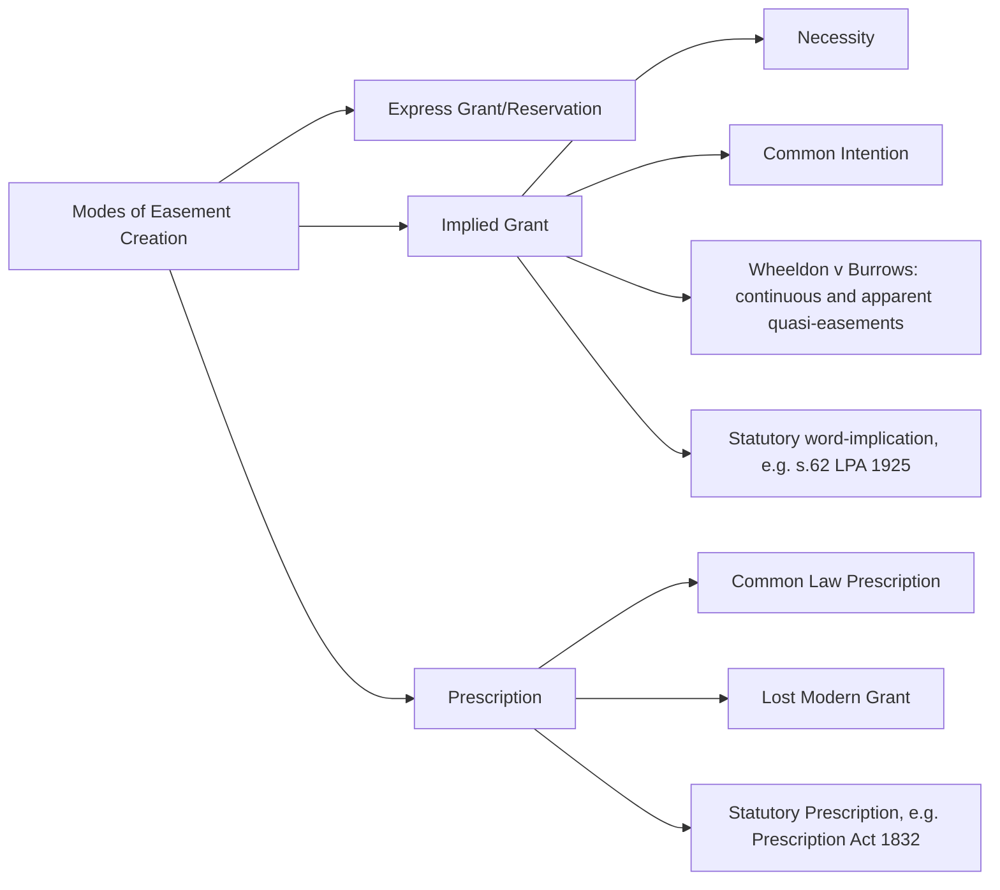

## Easement Concepts in English and Commonwealth Law


### Definition and Doctrinal Position

An easement in English common law (and across Commonwealth jurisdictions inheriting it — Australia, Canada, New Zealand, and, with local statutory modification, much of the former British Empire) is a right attached to land (a "dominant tenement") allowing its owner to use, or restricting the use of, neighboring land (a "servient tenement") owned by someone else. Easements are proprietary interests capable of binding successive owners of the servient land, distinguishing them from personal licenses or contractual arrangements that bind only the original parties.

Unlike the civilian tradition's exhaustively codified servitude taxonomy, English easement law developed incrementally through case law, organized around a small number of foundational tests rather than a fixed statutory list — though it shares substantial conceptual overlap with civil law servitudes (dominant/servient tenement structure, running with the land, generally passive burden on the servient owner).

### The Four Essential Characteristics (Re Ellenborough Park Test)

The leading formulation of what qualifies as a valid easement comes from *Re Ellenborough Park* [1956] Ch 131 (England and Wales), requiring:

1. **There must be a dominant and a servient tenement.** An easement cannot exist "in gross" (i.e., benefiting a person independently of land ownership) under traditional doctrine — it must benefit specific land, not merely a person.
2. **The easement must accommodate the dominant tenement.** The right must confer a benefit connected to the normal use and enjoyment of the dominant land itself, not merely a personal advantage to whoever currently owns it (e.g., a right to use a neighboring garden was held to accommodate a dominant tenement of houses built around it, since it enhanced the normal enjoyment of the houses as houses).
3. **Dominant and servient tenements must be owned or occupied by different persons.** Analogous to the civilian rule that no one can hold a servitude over their own land.
4. **The right must be capable of forming the subject matter of a grant.** This sub-test itself contains several requirements:
   - There must be a capable grantor and grantee (both must have the legal capacity to grant/receive an interest in land).
   - The right must be sufficiently definite (not too vague, e.g., a vague "right to a view" or "right to privacy" generally fails).
   - The right must fall within the general nature of rights traditionally recognized as easements (courts are cautious, though not absolutely closed, about recognizing genuinely novel categories).
   - The right must not amount to a claim of exclusive possession or joint occupation of the servient land — this is the critical line distinguishing an easement from a lease or an invalid claim of ownership (a right that effectively excludes the servient owner from reasonable use of their own land is not a valid easement).

```mermaid
flowchart TD
    A[Claimed Right] --> B{Dominant + Servient Tenement Exist?}
    B -->|No| Z1[Not an easement - may be a right "in gross" or personal license]
    B -->|Yes| C{Does it accommodate the dominant tenement?}
    C -->|No, merely personal benefit| Z2[Fails - not an easement]
    C -->|Yes| D{Different owners/occupiers?}
    D -->|No| Z3[Cannot be an easement over own land]
    D -->|Yes| E{Capable of forming subject matter of a grant?}
    E -->|Too vague or amounts to exclusive possession| Z4[Fails - may be a lease, license, or invalid claim]
    E -->|Yes, definite and non-possessory| F[Valid Easement]
```

### Categories of Easements

| Type | Description | Example |
| --- | --- | --- |
| Right of way | Passage across servient land | Footpath, driveway, vehicular access |
| Right of light | Preservation of light reaching a window (often via prescription) | Ancient Lights doctrine (historic, England) |
| Right of support | Support for buildings from adjoining land or structures | Party wall support |
| Right to run services | Passage of pipes, cables, drains, sewers | Utility easements |
| Right to park | Right to park vehicles on servient land | Subject to close scrutiny under the "exclusive possession" limb |
| Right of way for light/air | Preservation of airflow or light access | Increasingly rare in modern doctrine |

**[Inference]** The right-to-park category has generated an unusual volume of modern litigation because parking rights sit close to the boundary between a genuine easement (a limited, non-exclusive right to use servient land for a specific purpose) and an invalid claim of exclusive possession; the outcome tends to be fact-sensitive (e.g., whether the servient owner retains any meaningful concurrent use of the space), and general rules should be checked against current case law in the relevant jurisdiction.

### Modes of Creation

**1. Express grant or reservation**

- By deed (most common in modern conveyancing) — an express easement created in the transfer document itself.
- By separate express deed of easement between neighboring owners.

**2. Implied grant**

- **Necessity**: implied where land would otherwise be unusable (e.g., landlocked parcel), though courts apply this narrowly — the necessity must be absolute, not merely convenient.
- **Common intention**: implied where both parties clearly intended a specific use of land to continue, even though not expressly documented.
- **Rule in *Wheeldon v. Burrows*** [1879] (England and Wales): on a transfer of part of land, "continuous and apparent" quasi-easements previously enjoyed by the transferred part over the retained part (while both were in common ownership) pass automatically to the transferee, provided they were necessary for the reasonable enjoyment of the transferred land and were being used at the time of transfer — the common-law analogue to the civilian "destination of the owner" doctrine.
- **Section 62, Law of Property Act 1925** (England and Wales; analogous statutory provisions exist in various Commonwealth jurisdictions): on a conveyance of land, existing privileges, liberties, and advantages enjoyed with the land (even mere permissions/licenses, not previously easements) can be automatically upgraded into full legal easements, provided there was diversity of occupation (not just diversity of ownership) prior to the conveyance — a distinctively technical and frequently litigated statutory trap for conveyancers.

**3. Prescription (long use)**

Three overlapping common-law/statutory routes typically coexist:

- **Common law prescription**: use "as of right" since time immemorial (fictionally fixed at 1189 in England), rebuttable by any evidence the right could not have existed throughout that period.
- **Doctrine of lost modern grant**: a legal fiction presuming a grant was made and subsequently lost, based on 20 years' continuous use "as of right," designed to overcome the practical impossibility of common law prescription's ancient-use requirement.
- **Prescription Act 1832** (England and Wales, with Commonwealth statutory analogues): provides statutory periods (typically 20 years, or 40 years for an absolute and indefeasible right, with special rules for rights of light) as an alternative route, subject to specific procedural qualifications.

Across all prescription routes, use must generally be **"nec vi, nec clam, nec precario"** — without force, without secrecy, and without permission (i.e., open, peaceable, and non-permissive) — mirroring the civilian requirement of unequivocal, uninterrupted possession.



### Easements vs. Licenses vs. Restrictive Covenants

A recurring examination distinction:

| Feature | Easement | License | Restrictive Covenant |
| --- | --- | --- | --- |
| Proprietary (binds successors) | Yes | No (generally personal only) | Yes, in equity, if requirements met |
| Requires dominant/servient tenement | Yes | No | Yes (benefit must "touch and concern" dominant land) |
| Nature of burden | Generally positive right to use servient land | Mere permission, revocable | Generally negative/restrictive (prohibits an act) |
| Registration requirement | Required for legal easement (registered land systems) | No | Required for enforceability against successors |
| Can require positive action by servient owner | Generally no (with narrow exceptions, e.g., fencing easements) | N/A | No (restrictive covenants cannot compel positive acts; that requires a separate positive covenant regime) |

### Termination of Easements

- **Express release**: dominant owner formally releases the right (typically by deed).
- **Implied release/abandonment**: requires clear evidence of intention to abandon, not merely non-use — English courts set a notably high bar here (mere non-use for a long period, without more, is generally insufficient).
- **Unity of ownership and possession**: where dominant and servient tenements come into the same ownership and possession, the easement is extinguished (though it may revive if the land is later re-divided, depending on how the doctrine of implied grant applies on the subsequent severance).
- **Frustration/impossibility**: destruction of the servient or dominant land, or the purpose becoming impossible.
- **Statutory extinguishment**: certain statutory schemes (e.g., compulsory purchase/land registration provisions) can extinguish easements, generally with compensation.

### Registration and Third-Party Enforceability

In registered land systems (e.g., England and Wales under the Land Registration Act 2002, and equivalent Torrens-title systems across much of Australia, New Zealand, and parts of Canada), the enforceability of an easement against a purchaser of the servient land depends on its registration status:

- **Legal easements created expressly** generally must be registered against both titles to bind successors as legal interests.
- **Equitable easements** (e.g., informally created, or arising from an estoppel) may require protection by notice/caveat on the register to bind a purchaser; unregistered equitable interests risk being defeated by a bona fide purchaser for value without notice, subject to jurisdiction-specific overriding-interest exceptions (e.g., in England, certain easements can still bind as "overriding interests" even without registration, in limited defined circumstances — this is a frequently tested and jurisdiction-specific technical point).

**[Unverified]** The precise scope of overriding-interest protection for unregistered easements has been narrowed by successive legislative reform in England and Wales and differs from the equivalent Torrens-system rules in Australia/New Zealand; students should verify the current statutory position in the specific jurisdiction rather than assume uniformity.

### Illustrative Example

**Example**

A landowner (X) sells the rear portion of a large property to a buyer (Y), retaining the front portion facing the public road. Before the sale, X had regularly used a gravel path across the front portion to access the rear portion by car — a "quasi-easement" since both portions were then in common ownership.

- Under the rule in *Wheeldon v. Burrows*, if the path was continuous and apparent and necessary for the reasonable enjoyment of the rear (now transferred) land, Y automatically acquires a legal easement of way over X's retained front land, even though the conveyance document was silent on the point.
- If instead the facts showed only occasional, informal use of the path by a tenant of the rear portion prior to sale (diversity of occupation), the transaction could instead trigger a **Section 62, Law of Property Act 1925**-style easement, converting what had been mere permission into a full easement upon the conveyance — a distinct legal mechanism.
- If neither the necessity/apparent-use conditions nor the diversity-of-occupation requirement is met, Y would need to negotiate an express grant, or fall back on the (narrower) doctrine of necessity if the rear land would otherwise be landlocked.

### Key Points

- English/Commonwealth easement law centers on the four-part test in *Re Ellenborough Park*, particularly the prohibition on easements amounting to exclusive possession.
- Multiple, overlapping doctrines of implied creation (necessity, common intention, *Wheeldon v. Burrows*, statutory word-implication) frequently produce alternative routes to the same practical outcome and are commonly tested together on the same facts.
- Prescription requires open, peaceable, non-permissive use, historically routed through three parallel doctrines (common law, lost modern grant, statutory) in England, with Commonwealth jurisdictions applying analogous but not identical statutory frameworks.
- Registration status is increasingly determinative of third-party enforceability in modern registered-land and Torrens-title systems, displacing older doctrines based purely on notice.
- Right-to-park and similar borderline categories remain doctrinally unsettled at the margins, particularly regarding the exclusive-possession limitation.

### Related Topics

- *Re Ellenborough Park* and the Four-Part Easement Test
- *Wheeldon v. Burrows* and Implied Quasi-Easements
- Section 62 Law of Property Act 1925 and Word-Implied Easements
- Prescription Doctrines: Common Law, Lost Modern Grant, and Statutory Prescription
- Torrens Title Systems and Easement Registration (Australia/New Zealand)
- Restrictive Covenants and the Rule in *Tulk v. Moxhay*
- Right to Park as a Contested Easement Category
- Comparative Servitude Law: Common Law vs. Civil Law Approaches