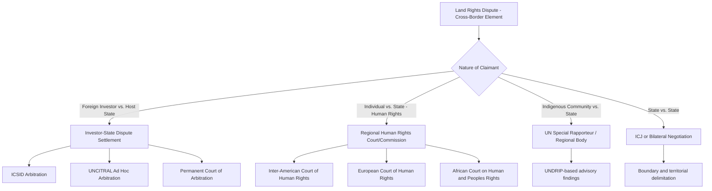

## International Land Rights Frameworks

### Overview

International land rights frameworks comprise the body of treaties, conventions, customary international law norms, and soft-law instruments that govern the recognition, allocation, protection, and transfer of interests in land across jurisdictions and against sovereign or private interference. Unlike domestic property law, which operates within a unified sovereign legal order, international land rights frameworks must reconcile competing sources of authority: state sovereignty over territory, individual and collective property rights, indigenous and customary tenure systems, and cross-border economic activity (investment, conservation, and infrastructure). This body of law sits at the intersection of public international law, human rights law, investment law, and comparative property law.

### Sources of International Land Rights Law

**Treaty Law**

- Bilateral Investment Treaties (BITs) and multilateral investment agreements typically contain protections against expropriation of land-based investments without compensation.
- Regional human rights conventions (American Convention on Human Rights, African Charter on Human and Peoples' Rights, European Convention on Human Rights Protocol 1 Article 1) protect property interests, including land, from arbitrary state interference.
- Specialized conventions address particular land-related concerns: the Ramsar Convention (wetlands), UNESCO World Heritage Convention (cultural/natural sites), and the UN Convention to Combat Desertification.

**Customary International Law**

- The principle of permanent sovereignty over natural resources (affirmed in UNGA Resolution 1803 (1962)) establishes that states hold ultimate authority over land and resources within their territory, subject to obligations toward their population.
- The minimum standard of treatment for aliens' property, developed through state practice and arbitral awards, requires a baseline of protection against uncompensated taking of foreign-owned land interests.

**Soft Law and Guidelines**

- The UN Food and Agriculture Organization's Voluntary Guidelines on the Responsible Governance of Tenure of Land, Fisheries and Forests (VGGT, 2012) is the most comprehensive international instrument addressing land tenure, though non-binding.
- The UN Declaration on the Rights of Indigenous Peoples (UNDRIP, 2007) articulates free, prior, and informed consent (FPIC) standards for land affecting indigenous communities.
- World Bank Environmental and Social Framework (ESF), particularly ESS5 (Land Acquisition, Restrictions on Land Use and Involuntary Resettlement), functions as de facto binding law for World Bank-financed projects.

### Key Legal Doctrines

**Expropriation and Compensation**

International law distinguishes direct expropriation (formal transfer of title) from indirect expropriation (regulatory measures that substantially deprive an owner of the use or value of land without formal taking). The customary standard, often called the *Hull Rule*, requires:

$$C = FMV_{t_0} + I$$

where $C$ is compensation owed, $FMV_{t_0}$ is fair market value immediately before the expropriatory act became public knowledge, and $I$ is accrued interest to the date of payment. This "prompt, adequate, and effective" standard is contested by capital-importing states, many of which favor the *Calvo Doctrine*, under which foreign investors are entitled only to the same treatment as nationals under domestic law, with disputes resolved in local courts rather than international fora.

**Distinguishing Regulatory Takings from Indirect Expropriation**

Investment tribunals (e.g., under ICSID) apply a multi-factor test, generally drawing on:

- The economic impact of the measure on the investor's land-based interest
- The extent of interference with reasonable, investment-backed expectations
- The character of the government action (police powers exception for bona fide public welfare regulation, such as environmental or zoning measures, generally do not require compensation)

**[Inference]** This framework closely parallels the *Penn Central* regulatory takings test in U.S. constitutional law, though tribunals apply it with varying rigor depending on the treaty text and arbitral panel composition.

**Free, Prior, and Informed Consent (FPIC)**

FPIC is the doctrine requiring that indigenous and, increasingly, other affected communities give consent — obtained without coercion, in advance of project approval, and based on full disclosure — before land within their traditional territories is taken, developed, or has its use altered. FPIC appears in:

- ILO Convention No. 169 (Indigenous and Tribal Peoples Convention, 1989), binding on ratifying states
- UNDRIP Articles 10, 19, 28, and 32 (non-binding but widely cited as reflecting emerging custom)
- IFC Performance Standard 7 and equivalent lender safeguard policies

### Comparative Tenure Recognition Models

International frameworks must accommodate at least four broad domestic tenure paradigms:

| Model | Characteristic Feature | Representative Jurisdictions |
| --- | --- | --- |
| Torrens/title registration | State-guaranteed indefeasible title | Australia, much of Commonwealth |
| Deeds registration | Chain-of-title recordation, no state guarantee | Many U.S. states, France |
| Customary/communal tenure | Land held by lineage, clan, or community; often unwritten | Sub-Saharan Africa, Pacific Islands |
| State ownership with use rights | All land vested in state; individuals hold usufruct or lease rights | China (land use rights), Vietnam |

A recurring international law challenge is the **formalization gap**: instruments like the VGGT explicitly recognize customary and informal tenure as legitimate, but domestic implementation frequently requires costly formal registration that customary holders cannot access, producing de facto dispossession despite de jure recognition.

### Dispute Resolution Architecture

**ICSID Arbitration**

The International Centre for Settlement of Investment Disputes, established under the 1965 Washington Convention, is the principal forum for investor-state land disputes arising from BITs. Awards are binding and enforceable in all 150+ contracting states without further domestic court review of the merits (Article 54).

**Regional Human Rights Adjudication**

The Inter-American Court of Human Rights has developed the most extensive jurisprudence on indigenous communal land rights, notably in *Mayagna (Sumo) Awas Tingni Community v. Nicaragua* (2001), which held that Article 21 of the American Convention (right to property) protects indigenous communal property even absent formal state title — establishing that customary occupation itself generates a property right enforceable against the state.

### Illustrative Diagram: Layered Authority Over Land

Below is a schematic representing the overlapping layers of authority that international land rights frameworks must reconcile.

<svg xmlns="http://www.w3.org/2000/svg" viewBox="0 0 640 420">
<text x="320" y="28" text-anchor="middle" font-size="16" font-weight="bold" fill="#1a1a2e">Layered Authority Over Land (svg_diagram)</text>
<circle cx="320" cy="230" r="170" fill="#e3f2fd" stroke="#1565c0" stroke-width="2" />
<circle cx="320" cy="230" r="120" fill="#bbdefb" stroke="#1565c0" stroke-width="2" />
<circle cx="320" cy="230" r="70" fill="#90caf9" stroke="#1565c0" stroke-width="2" />
<text x="320" y="90" text-anchor="middle" font-size="13" fill="#0d47a1">State Sovereignty</text>
<text x="320" y="105" text-anchor="middle" font-size="11" fill="#0d47a1">(Permanent Sovereignty over Resources)</text>
<text x="320" y="150" text-anchor="middle" font-size="13" fill="#0d3d75">Treaty Obligations</text>
<text x="320" y="165" text-anchor="middle" font-size="11" fill="#0d3d75">(BITs, Human Rights Conventions)</text>
<text x="320" y="215" text-anchor="middle" font-size="13" fill="#0a2f5c">Customary / Indigenous</text>
<text x="320" y="230" text-anchor="middle" font-size="11" fill="#0a2f5c">Tenure Norms (FPIC, UNDRIP)</text>
<text x="320" y="250" text-anchor="middle" font-size="11" fill="#0a2f5c">Individual Title</text>
<line x1="320" y1="60" x2="320" y2="400" stroke="#c62828" stroke-width="1.5" stroke-dasharray="6,4" />
<text x="480" y="380" text-anchor="middle" font-size="11" fill="#c62828">Points of Conflict:</text>
<text x="480" y="395" text-anchor="middle" font-size="10" fill="#c62828">Expropriation vs. FPIC vs. Investment Protection</text>
</svg>

### Worked Example: Applying the Expropriation Test

**Scenario**: A foreign agribusiness company holds a 40-year land concession in Country X under a BIT with full protection and security clauses. The host government enacts a new environmental zoning law reclassifying the concession area as a protected watershed, prohibiting further cultivation but not revoking title.

**Analysis**:

1. **Direct expropriation?** No formal taking of title occurred; the investor retains nominal ownership/leasehold.
2. **Indirect expropriation test**:
   - *Economic impact*: If the zoning law eliminates substantially all economic value of the concession (e.g., cultivation was the sole viable use), this weighs toward finding expropriation.
   - *Investment-backed expectations*: If the concession agreement contained specific representations about permitted land use, frustrated expectations strengthen the investor's claim.
   - *Police powers*: A bona fide, non-discriminatory environmental measure applied evenhandedly typically falls within the state's regulatory police powers and does not require compensation — **[Inference]** though tribunals have split on how much deference to give to environmental justifications versus scrutinizing whether the measure was pretextual or disproportionate.
3. **Likely outcome**: Tribunals applying the *Tecmed v. Mexico* proportionality approach would weigh the legitimate public purpose against the severity of economic deprivation; a total prohibition with no offset (compensation, alternative land, or phased transition) increases the likelihood of a finding of compensable indirect expropriation.

### Key Instruments Quick Reference

- **VGGT (2012)**: Voluntary, comprehensive tenure governance standard; widely used as an interpretive benchmark even though non-binding.
- **ILO Convention 169 (1989)**: Binding FPIC and land rights protections for ratifying states (approximately 24 states as of ratification records; primarily Latin America).
- **UNDRIP (2007)**: Non-binding UN General Assembly declaration; cited extensively in domestic courts and regional tribunals as evidence of emerging custom.
- **World Bank ESS5**: De facto binding for Bank-financed land acquisition and resettlement; requires livelihood restoration standards, not merely compensation.
- **New York Convention (1958)**: Governs enforcement of arbitral awards, including those arising from land-related investment disputes, across 170+ contracting states.

### Practical Considerations for Practitioners

- **Due diligence on cross-border land transactions** must map at least three registries: formal state title records, any customary/communal tenure claims (often undocumented), and encumbrances arising from international conservation or heritage designations.
- **Treaty shopping** — structuring investments through corporate vehicles in states with favorable BITs relative to the host state — remains a live strategic consideration, though increasingly constrained by denial-of-benefits clauses in modern treaties.
- **[Unverified]** The precise weight any given ICSID tribunal will assign to VGGT or UNDRIP as interpretive aids is not settled and varies significantly by tribunal composition and the specific treaty's interpretive clauses.

### Related Topics

- Bilateral Investment Treaties and Fair and Equitable Treatment Standard
- Indigenous Land Rights and the Doctrine of Native Title (comparative: Australia, Canada, U.S.)
- Transboundary Water Rights and Riparian Servitudes
- Cross-Border Conservation Easements and Biodiversity Offsets
- ICSID Procedure and Annulment Grounds
- The Restatement (Fourth) of U.S. Foreign Relations Law on Expropriation
- Comparative Torrens Title Systems in Post-Colonial Jurisdictions
- Land Grabbing and the Political Economy of Large-Scale Land Acquisitions