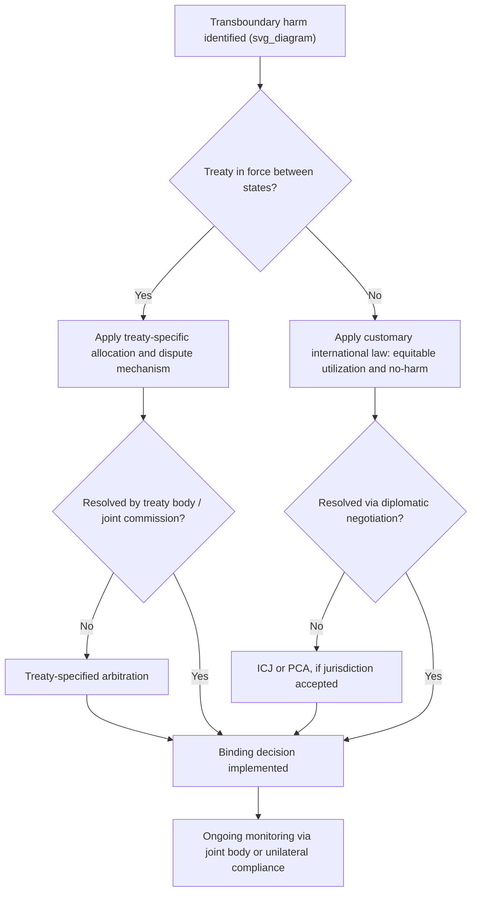

## Transboundary Resources and Cross Border Land Use

### Definition and Scope

Transboundary resource law governs natural resources and land uses that straddle or cross international political boundaries — rivers, lakes, aquifers, migratory wildlife corridors, forests, and mineral deposits that do not respect the cartographic lines dividing sovereign states. Cross-border land use adds the dimension of human activity: agriculture, infrastructure, extraction, and settlement patterns that generate effects (pollution, water diversion, habitat fragmentation) felt in a neighboring jurisdiction. This body of law sits at the intersection of public international law, comparative property law, and environmental law, and it is structurally distinct from domestic servitude law because there is no supranational sovereign to compel compliance — enforcement relies on treaty regimes, customary international law, reciprocity, and (rarely) international adjudication.

### Foundational Legal Principles

**Sovereignty Over Natural Resources**

Each state holds permanent sovereignty over natural resources within its territory, a principle affirmed in UN General Assembly Resolution 1803 (1962). This is the starting point, not the end point — it is qualified by a state's simultaneous duty not to cause harm to other states.

**Sic Utere Tuo Ut Alienum Non Laedas**

The maxim "use your own property so as not to injure another's" is the customary-law backbone of transboundary harm doctrine. Its canonical articulation is the *Trail Smelter Arbitration* (United States v. Canada, 1938/1941), in which a Canadian smelter's sulfur dioxide emissions damaged agricultural land in Washington State. The tribunal held that no state has the right to use or permit the use of its territory in a manner causing injury by fumes to the territory of another, when the case is of serious consequence and the injury is established by clear and convincing evidence.

**No-Harm Principle (Principle 21 / Principle 2)**

Codified in Principle 21 of the 1972 Stockholm Declaration and restated as Principle 2 of the 1992 Rio Declaration: states have the sovereign right to exploit their own resources pursuant to their own environmental policies, and the responsibility to ensure activities within their jurisdiction do not cause damage to the environment of other states or areas beyond national jurisdiction.

**Equitable and Reasonable Utilization**

For shared watercourses specifically, the dominant doctrine is not "no harm" in absolute terms but equitable and reasonable use balanced against the no-harm obligation. This is codified in the 1997 UN Convention on the Law of the Non-Navigational Uses of International Watercourses (UNWC), Articles 5–7.

**Prior Notification and Consultation**

A procedural (rather than substantive) obligation: states planning measures with possible adverse transboundary effects must notify potentially affected states and consult in good faith. This appears in UNWC Articles 11–19 and was central to the ICJ's reasoning in *Pulp Mills on the River Uruguay* (Argentina v. Uruguay, 2010).

### Governing Legal Instruments

| Instrument | Scope | Key Mechanism |
| --- | --- | --- |
| UN Watercourses Convention (1997) | Shared rivers, lakes, connected groundwater | Equitable utilization, no significant harm, notification |
| UNECE Water Convention (1992, opened globally 2016) | Transboundary waters and lakes | Joint bodies, monitoring, emission limits |
| Ramsar Convention (1971) | Wetlands, including transboundary wetlands | Listing, conservation obligations |
| Convention on Biological Diversity (1992) | Transboundary ecosystems, migratory species habitat | National strategies, cooperation duty |
| Bonn Convention / CMS (1979) | Migratory species and their habitats | Range-state agreements |
| UNCLOS (1982) | Shared maritime resources, continental shelf | Delimitation, joint development zones |
| Bilateral/regional treaties (e.g., Indus Waters Treaty, Mekong Agreement, Boundary Waters Treaty) | Specific basin or resource | Allocation formulas, joint commissions |

### Institutional Mechanisms

**Joint Commissions and River Basin Organizations**

States frequently delegate day-to-day management to standing bilateral or multilateral bodies:

- The **International Joint Commission (IJC)**, established by the 1909 Boundary Waters Treaty between the U.S. and Canada, has quasi-judicial authority to approve projects affecting boundary waters and investigate disputes.
- The **Mekong River Commission (MRC)**, established under the 1995 Mekong Agreement, coordinates Cambodia, Laos, Thailand, and Vietnam on mainstream development, though it lacks binding veto power over upstream projects (notably China, which is a dialogue partner, not a full member).
- The **Permanent Indus Commission**, under the 1960 Indus Waters Treaty between India and Pakistan, allocates the six Indus tributaries between the parties and has functioned despite broader bilateral tension, though it has faced recent strain and suspension threats.

**Dispute Resolution Fora**

- **International Court of Justice (ICJ)** — state-to-state disputes; landmark cases include *Gabčíkovo-Nagymaros* (Hungary/Slovakia, 1997) and *Pulp Mills* (Argentina/Uruguay, 2010).
- **Permanent Court of Arbitration (PCA)** — used for boundary and resource arbitrations, e.g., the *Indus Waters Kishenganga Arbitration* (2013).
- **Treaty-specific arbitral panels** — many bilateral treaties create their own dispute mechanisms rather than deferring to the ICJ.

### Categories of Transboundary Resources

**Surface Water (Rivers and Lakes)**

The most heavily litigated and treaty-dense category. Core issues: allocation (how much water each riparian gets), dam and diversion projects, water quality, and seasonal flow regimes. Upstream/downstream asymmetry creates structural bargaining imbalance — upstream states have physical control, downstream states often have greater historical reliance.

**Transboundary Aquifers**

Groundwater bodies crossing borders are governed by weaker and more fragmented law than surface water. The 2008 ILC Draft Articles on the Law of Transboundary Aquifers extend equitable-utilization and no-harm principles to groundwater, but adoption as binding treaty law remains limited. Aquifers present unique problems: invisibility (harder to monitor extraction), slow recharge rates, and risk of irreversible depletion or saline intrusion.

**Migratory Wildlife and Habitat Corridors**

Species that cross borders seasonally (wildebeest, migratory birds, marine mammals) require range-state cooperation since unilateral protection by one state is undermined by hunting or habitat destruction in another. The CMS and regional instruments like the African Convention on the Conservation of Nature and Natural Resources address this.

**Shared Mineral and Hydrocarbon Deposits**

Oil and gas reservoirs straddling a boundary raise "unitization" problems — extraction by one state can drain a reservoir under a neighbor's territory. States address this through joint development zones (e.g., the Malaysia-Thailand Joint Development Area) or unitization agreements requiring joint or coordinated extraction.

**Forests and Land-Based Carbon Sinks**

Increasingly relevant under climate treaties (Paris Agreement Article 5, REDD+ mechanisms), though forest law remains more state-sovereignty-dominated than water law, given the absence of a binding global forests convention.

### Cross-Border Land Use Conflicts

**Border Pollution and Externalities**

Industrial, agricultural runoff, or extractive activity near a border that degrades a neighboring state's land or water — the fact pattern of *Trail Smelter* remains paradigmatic. Modern analogues include cross-border air pollution (haze from land-clearing fires in Southeast Asia) and mining tailings contamination.

**Infrastructure with Extraterritorial Effect**

Dams, pipelines, and large agricultural schemes near a border can alter downstream flow, migration patterns, or land stability. Environmental Impact Assessment (EIA) obligations — recognized by the ICJ in *Pulp Mills* as required by general international law when transboundary harm risk exists — are the primary procedural check.

**Land Grants and Concessions Near Boundaries**

States sometimes grant resource concessions (logging, mining, agribusiness) near contested or ill-defined borders, which can trigger territorial disputes layered on top of resource disputes.

**Indigenous and Traditional Land Rights Crossing Borders**

Indigenous communities whose traditional territories predate colonial-era boundaries (e.g., Sámi reindeer herders across Norway/Sweden/Finland/Russia, or First Nations along the U.S.-Canada border) raise a distinct sub-field where treaty rights, customary use, and modern sovereignty intersect. ILO Convention 169 and the UN Declaration on the Rights of Indigenous Peoples (UNDRIP) inform this area, though enforcement mechanisms remain weak.

### Doctrinal Comparison: Domestic Easements vs. Transboundary Regimes

| Feature | Domestic Easement | Transboundary Resource Regime |
| --- | --- | --- |
| Enforcing authority | Domestic courts, recording systems | Treaty bodies, ICJ, arbitration, reciprocity |
| Source of right | Deed, prescription, necessity | Treaty, custom, general principles |
| Remedy for breach | Injunction, damages | Diplomatic protest, countermeasures, arbitration |
| Binding force | State-backed coercion | Consent-based; withdrawal often possible |
| Standard of use | "Reasonable use" (jurisdiction-specific) | Equitable and reasonable utilization (treaty-defined) |
| Modification | Court order, mutual release | Treaty renegotiation, sometimes unilateral suspension |

### Key Case Law

**Trail Smelter Arbitration (1938/1941)** — established the no-harm principle as customary international law; a Canadian company's emissions damaging U.S. land created state responsibility even absent malice.

**Lac Lanoux Arbitration (France v. Spain, 1957)** — France's proposed diversion of a shared lake did not require Spain's consent, only good-faith consultation, so long as downstream flow was ultimately restored; established that consultation obligations do not amount to a veto right for co-riparian states.

**Gabčíkovo-Nagymaros Project (Hungary v. Slovakia, 1997)** — ICJ addressed unilateral treaty suspension and diversion of the Danube, affirming that both states had breached obligations and that sustainable development principles must inform resource-sharing treaties.

**Pulp Mills on the River Uruguay (Argentina v. Uruguay, 2010)** — ICJ held that customary international law requires environmental impact assessment before undertaking activities with risk of significant transboundary harm, and clarified the relationship between procedural (notification) and substantive (no-harm) obligations.

**Indus Waters Kishenganga Arbitration (Pakistan v. India, 2013)** — PCA balanced India's right to hydroelectric development against Pakistan's downstream flow entitlements under the Indus Waters Treaty, illustrating how treaty-specific dispute mechanisms operationalize equitable utilization.

### Practical Application: Structuring a Transboundary Resource Dispute Analysis

**Example**

A hypothetical: State A builds a dam near its border with State B, reducing dry-season flow to State B's agricultural region by 40%. Analytical framework:

1. **Jurisdictional threshold** — Is there an applicable treaty (bilateral or UNWC-based)? If none, fall back to customary law (equitable utilization, no-harm).
2. **Procedural compliance** — Did State A conduct an EIA and notify State B before construction, per *Pulp Mills*?
3. **Substantive assessment** — Apply the equitable-and-reasonable-use factors from UNWC Article 6: geographic and hydrological factors, social and economic needs of each state, population dependent on the watercourse, effects on other states, existing and potential uses, conservation and cost of protective measures, availability of alternatives.
4. **Harm threshold** — Is the harm "significant" (the UNWC/customary law threshold), not merely any measurable effect?
5. **Remedy pathway** — Diplomatic negotiation first; then treaty-specified arbitration or ICJ referral if both states have accepted jurisdiction; countermeasures only as a last resort under strict proportionality limits.

### Diagram: Transboundary Dispute Resolution Pathway (svg_diagram)

### Emerging Issues

- **Climate-driven resource stress**: glacial melt altering river flow timing, sea-level rise submerging boundary markers and shifting maritime resource zones, desertification pushing agricultural and pastoral land use across borders.
- **Groundwater depletion governance gap**: aquifers remain the least legally protected transboundary resource category relative to their strategic importance for water security. [Inference] Given the non-binding status of the 2008 ILC Draft Articles, this gap is likely to persist absent a dedicated binding convention.
- **Data and monitoring asymmetry**: satellite remote sensing (e.g., GRACE satellite gravimetry for groundwater, satellite hydrology for river flow) increasingly substitutes for cooperative data-sharing where political relations are strained, changing the practical (though not formal legal) balance of information power between riparian states.
- **Resource nationalism vs. cooperative frameworks**: rising unilateral infrastructure projects (dam-building without full consultation) in several major basins signal strain on the consultation-based model that *Lac Lanoux* and the UNWC assume.

**Related Topics**

- International Watercourse Law and the UN Watercourses Convention
- Transboundary Aquifer Governance and the 2008 ILC Draft Articles
- Environmental Impact Assessment Obligations in Customary International Law
- Joint Development Zones for Shared Hydrocarbon Resources
- Indigenous Land Rights Across Colonial-Era Boundaries
- State Responsibility and Countermeasures in Environmental Harm Cases
- Comparative Riparian Rights Doctrines (Prior Appropriation vs. Riparianism) in Domestic vs. International Contexts
- Climate Change Adaptation and Transboundary Resource Treaty Renegotiation