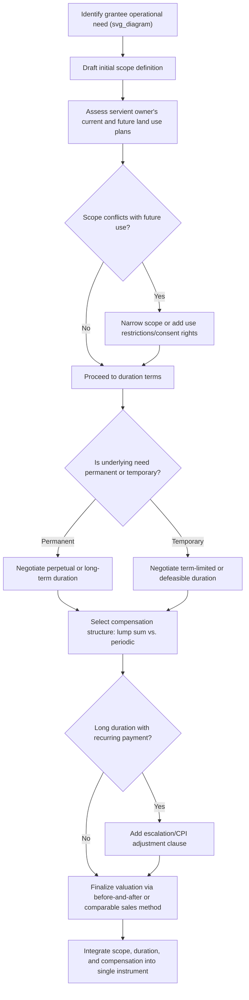

## Negotiating Scope, Duration, and Compensation

### Framing the Negotiation

Easement negotiation differs structurally from a typical bilateral commercial negotiation because the parties are not walking away from each other at closing — the servient owner continues to hold underlying title and lives with the burden indefinitely, while the dominant party (or its successors) continues exercising the right indefinitely. This ongoing-relationship character means that scope, duration, and compensation clauses function less like one-time price terms and more like the architecture of a long-term coexistence arrangement, and poor drafting here surfaces as conflict years or decades after signing rather than immediately.

### Negotiating Scope

**Defining the Boundaries of Permitted Use**

Scope negotiation centers on translating the grantee's operational needs into language precise enough to be enforceable but not so narrow that ordinary maintenance or foreseeable technological change triggers renegotiation or litigation.

**Key Points**

- **Purpose specificity vs. flexibility trade-off**: A narrowly drafted purpose clause (e.g., "for a single overhead electric distribution line") protects the servient owner from scope creep but risks becoming obsolete or triggering disputes when the grantee needs to upgrade infrastructure (undergrounding lines, adding fiber). A broader clause (e.g., "for utility purposes, including electric, communications, and related facilities now or hereafter developed") gives the grantee operational flexibility but concedes more control.
- **Exclusivity**: Whether the servient owner retains any right to use the easement area concurrently (e.g., cross a utility corridor with a driveway) is frequently the single highest-value point of contention in shared or narrow-parcel situations.
- **Ancillary rights**: Access for maintenance vehicles, equipment staging areas, vegetation clearance rights (including whether the grantee may clear trees outside the strict easement width for sightline or safety reasons), and temporary construction easements beyond the permanent footprint.
- **Restrictions on servient owner's use**: Building setback distances from the easement line, prohibitions on structures, fencing, or plantings within the easement area, and limits on grading or excavation that could interfere with buried infrastructure.
- **Reserved rights clause**: An explicit statement that the servient owner retains all rights not expressly granted — this default-in-favor-of-servient-owner framing is a common negotiating anchor since easements are strictly construed and courts generally do not imply additional rights beyond those the language supports.

**Negotiation Leverage Points**

| Grantee Wants | Servient Owner Wants | Common Compromise |
| --- | --- | --- |
| Broad, technology-neutral purpose language | Narrow, specific purpose language | Enumerated list with a defined-terms "similar facilities" clause subject to consent |
| Exclusive use of easement area | Non-exclusive, shared use | Exclusive as to specified activities only (e.g., no other utilities may co-locate without consent) |
| Unrestricted maintenance access | Scheduled or notice-triggered access | Access rights with advance notice requirements except in emergencies |
| Wide vegetation clearance rights | Minimal disturbance to landscaping | Defined clearance zone plus a replanting/restoration obligation |

### Negotiating Duration

**Term Structures**

- **Perpetual easements**: Standard for utility, drainage, and access easements serving permanent infrastructure needs; typically preferred by grantees for financing and long-term investment certainty, and often required by lenders financing infrastructure built in reliance on the easement.
- **Term-limited easements**: Common where the underlying need is inherently temporary (construction staging, temporary access during redevelopment) or where the servient owner has a planned future use of the land that the easement would otherwise permanently foreclose.
- **Defeasible/conditional duration**: Terminates automatically upon a defined event — cessation of the grantee's specific use, abandonment for a stated continuous period (e.g., "two years of continuous nonuse"), or completion of an underlying project.
- **Renewable term structures**: Fixed initial term with renewal options, giving the servient owner periodic renegotiation leverage (particularly over compensation) while giving the grantee continuity if it exercises the option.

**Key Points**

- **Abandonment standard as a duration lever**: Because common-law abandonment doctrine typically requires nonuse plus demonstrated intent to abandon (mere nonuse is usually insufficient), servient owners negotiating for practical exit options often prefer an explicit contractual nonuse-period trigger rather than relying on the higher common-law abandonment bar.
- **Interaction with financing**: Where the dominant estate's use depends on debt financing (e.g., a pipeline or transmission project), lenders typically require perpetual or long-term easements as collateral support; servient owners should anticipate limited flexibility to negotiate shorter terms in financed infrastructure deals.
- **Renegotiation triggers**: Some instruments build in scheduled review points (e.g., every 10 years) for compensation adjustment without disturbing the underlying perpetual grant — this decouples duration certainty (which the grantee needs) from compensation flexibility (which the servient owner needs).

### Negotiating Compensation

**Compensation Structures**

- **Lump-sum payment**: A single upfront payment for a perpetual or long-term grant; standard for permanent utility and access easements. Valuation typically reflects diminution in the servient estate's fair market value, not the dominant estate's benefit received.
- **Periodic/recurring payment**: Annual or periodic payments, more common for term easements, agricultural land use easements, or arrangements where ongoing land value impact is easier to assess incrementally (e.g., wind or solar easements tied to production or acreage).
- **Royalty or production-based compensation**: Common in mineral, pipeline, and renewable energy easements where compensation is tied to throughput, output, or revenue generated by the grantee's use (e.g., per-megawatt-hour payments for wind turbine easements, per-barrel or per-MCF for pipeline throughput).
- **In-kind compensation**: Infrastructure improvements benefiting the servient owner (road paving, drainage improvements, fencing) in lieu of or alongside cash.
- **Hybrid structures**: Upfront payment plus periodic escalation (CPI-indexed or fixed percentage increases) to address inflation risk over long-duration or perpetual grants — particularly relevant where a lump sum was negotiated decades earlier and no adjustment mechanism exists.

**Valuation Methodologies**

- **Before-and-after method**: Fair market value of the servient parcel before the easement grant, minus fair market value after, yields the diminution-in-value baseline for lump-sum compensation. This is the dominant approach in condemnation and eminent domain valuation and is frequently imported into private negotiation as an anchor.
- **Comparable easement sales**: Market data on compensation paid for similar easements (pipeline right-of-way rates per linear foot, utility corridor rates per acre) in comparable geography.
- **Income capitalization**: For agricultural or production-linked easements, capitalizing the income stream the servient owner forgoes or the value the dominant estate derives.
- **Severance damage considerations**: Beyond the direct easement footprint, compensation negotiations often address severance damage — diminished value or utility of the remaining servient parcel caused by the easement's presence (e.g., a pipeline easement bisecting a parcel, complicating future subdivision or development).

**Key Points**

- **Escalation and adjustment clauses**: For long-term or perpetual easements with recurring payments, negotiate CPI-linked or periodic fixed-percentage escalation to prevent real-value erosion over decades.
- **Tax treatment considerations**: [Unverified] The tax characterization of easement compensation (capital gain versus ordinary income, and whether payment reduces basis in the servient property) depends on jurisdiction-specific tax law and the specific structure of the grant, and should be confirmed with a tax advisor before finalizing compensation structure.
- **Condemnation-adjacent leverage**: Where the grantee holds eminent domain authority (utilities, pipelines, certain infrastructure developers), the negotiation occurs "in the shadow of" condemnation valuation standards — the servient owner's realistic alternative to a negotiated deal may be a forced taking at judicially determined "just compensation," which shapes both parties' reservation prices.
- **Non-monetary value drivers**: Servient owners should account for consequential effects beyond direct payment — increased liability exposure, maintenance cost shifting, restrictions on future development or financing (lenders may discount collateral value for encumbered parcels), and aesthetic or nuisance impact.

### Interaction Between Scope, Duration, and Compensation

These three terms are not independently negotiated in practice — they trade off against each other, and skilled negotiators treat them as a single integrated package rather than sequential line items.

**Key Points**

- Broader scope typically justifies higher compensation, since the servient owner bears greater use restriction.
- Longer duration (particularly perpetual grants) typically commands higher lump-sum compensation than term-limited grants, reflecting the permanent loss of alternative use.
- Narrower scope or shorter duration can be traded for lower compensation, useful where the servient owner prioritizes future flexibility over upfront payment.
- Escalating or periodic compensation structures can offset a grantee's request for broad, flexible, technology-neutral scope language by giving the servient owner ongoing (rather than one-time) leverage to revisit terms.

### Negotiation Process Framework

**Diagram: Scope-Duration-Compensation Negotiation Sequence (svg_diagram)**

### Common Negotiation Pitfalls

**Key Points**

- Agreeing to broad scope language without corresponding compensation adjustment, effectively granting future flexibility to the grantee at the servient owner's uncompensated expense.
- Omitting escalation clauses in perpetual easements with periodic payments, leading to real-value erosion over decades.
- Failing to address the interaction between duration and financing — a term-limited easement may be unacceptable to a grantee's lender, stalling deal closure late in negotiations.
- Treating compensation as purely a valuation exercise while ignoring severance damage and consequential impacts on the remainder parcel.
- Under-negotiating maintenance and restoration obligations, which function as a form of ongoing, non-cash compensation risk if left vague.

**Next Steps**

- Draft a term sheet allocating scope, duration, and compensation as an integrated package before drafting full instrument language
- Commission an appraisal using the before-and-after method for lump-sum valuation baseline
- Confirm grantee's financing requirements early, since lender requirements often constrain duration flexibility
- Consult tax counsel on compensation structure before finalizing payment mechanics
- Cross-reference negotiated terms against the key clauses framework (granting clause, scope-of-use clause, duration/termination clause, compensation is typically addressed in a separate consideration/payment clause) to ensure consistency between negotiated business terms and final instrument language

**Related Topics**

- Valuation Methodologies for Easement Compensation (Before-and-After vs. Income Capitalization)
- Eminent Domain Shadow Negotiation and Just Compensation Standards
- Escalation and CPI-Indexed Payment Clauses in Long-Term Land Agreements
- Severance Damages in Partial Land-Use Encumbrances
- Financing Considerations and Lender Requirements for Infrastructure Easements
- Renewable Energy Easements: Royalty and Production-Based Compensation Models
- Abandonment and Nonuse Triggers as Negotiated Duration Mechanisms