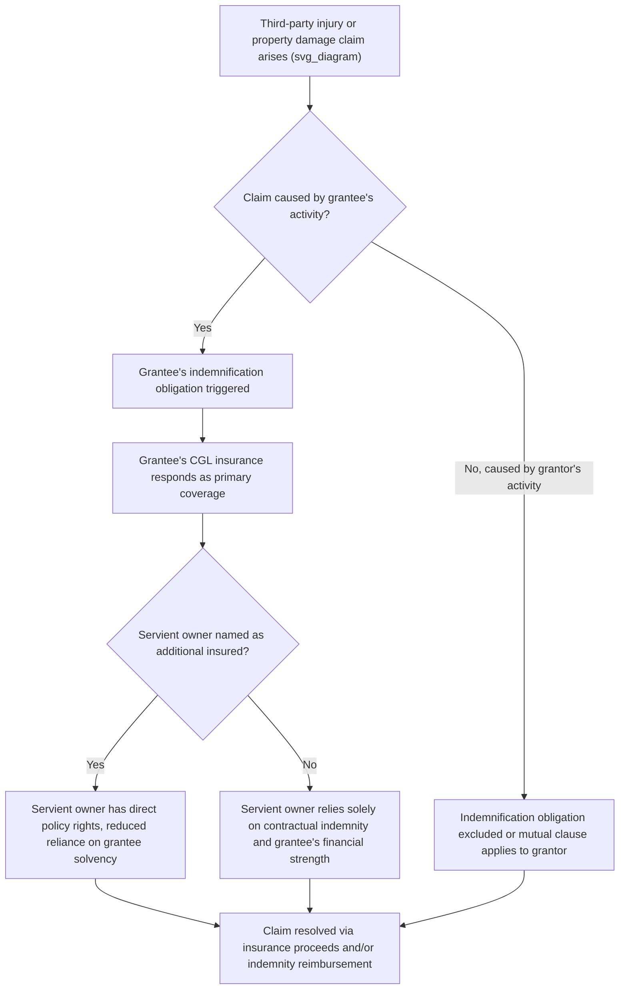

## Indemnification and Insurance Provisions

### Purpose and Function

Indemnification and insurance clauses allocate the financial risk of loss, injury, and property damage arising from an easement's use, separate from the property-rights questions of scope and duration. Where scope clauses answer "what may the grantee do," indemnification and insurance clauses answer "who pays when something goes wrong." These provisions matter disproportionately in easement instruments compared with ordinary contracts because the relationship is perpetual or long-term and the servient owner retains underlying liability exposure (as landowner) even for injuries caused by the grantee's activity, making explicit risk-shifting language essential rather than optional.

### Indemnification Clauses

**Core Structure**

An indemnification clause requires one party (the indemnitor) to compensate the other (the indemnitee) for specified losses, and typically bundles three related obligations: to indemnify (reimburse), to defend (pay for or provide legal defense), and to hold harmless (not pursue the indemnitee for the underlying loss). These are distinct obligations, and well-drafted clauses address all three explicitly rather than relying on "indemnify and hold harmless" boilerplate alone, since some jurisdictions construe "hold harmless" as adding nothing beyond "indemnify," while others treat "defend" as requiring immediate defense-cost advancement rather than reimbursement after the fact.

**Key Points**

- **Directionality**: Indemnification may run one-way (grantee indemnifies servient owner, the most common structure since the grantee's activity typically creates the risk) or mutually (each party indemnifies the other for claims arising from its own conduct).
- **Scope trigger language**: Claims "arising out of, resulting from, or in connection with" the grantee's exercise of the easement rights — broader trigger language ("in connection with") captures more attenuated claims than narrower language ("resulting directly from").
- **Third-party claims focus**: Indemnification clauses typically address third-party claims (injury to a member of the public, damage to a neighboring parcel) rather than direct claims between the contracting parties, which are usually addressed through separate breach-of-contract or damages provisions.
- **Negligence carve-outs**: Most jurisdictions will not enforce indemnification for the indemnitee's own gross negligence or willful misconduct as a matter of public policy; well-drafted clauses expressly carve these out to avoid unenforceability risk on the entire provision.
- **Anti-indemnity statutes**: [Unverified] A number of U.S. states have enacted statutes voiding or limiting broad indemnification clauses in construction and land-use contexts (particularly where a party seeks indemnification for its own negligence), and applicability varies significantly by jurisdiction and contract type — the specific statute governing the servient property's location should be checked before finalizing indemnification language.

**Example**

> "Grantee shall indemnify, defend, and hold harmless Grantor from and against any and all third-party claims, damages, losses, and expenses (including reasonable attorneys' fees) arising out of or resulting from Grantee's exercise of the rights granted herein, except to the extent caused by Grantor's negligence or willful misconduct."

### Allocation of Risk Categories

| Risk Category | Typical Allocation | Rationale |
| --- | --- | --- |
| Injury during grantee's construction/maintenance activity | Grantee indemnifies | Grantee controls the activity creating the hazard |
| Pre-existing conditions on servient land | Grantor indemnifies (or excluded from grantee's indemnity) | Grantee has no knowledge of or control over pre-existing hazards |
| Damage to grantee's facilities from grantor's activity | Grantor indemnifies (if mutual clause used) | Grantor's ongoing use of retained land creates this risk |
| Environmental contamination from grantee's operations | Grantee indemnifies, often with separate environmental indemnity clause | Specialized risk warranting distinct treatment, often uncapped or separately capped |
| General third-party public injury within easement area | Grantee indemnifies | Grantee's presence and activity is the proximate risk driver |

### Limitation of Liability Interaction

**Key Points**

- Indemnification obligations are sometimes subject to an overall liability cap, but caps are frequently excluded for indemnification claims, environmental liability, and breaches of core representations — these carve-outs from the cap should be explicit to avoid ambiguity about whether the cap limits indemnity exposure.
- Consequential and punitive damages exclusions are common in the broader agreement but are typically carved back in for third-party indemnification claims, since the indemnitee is often passing through a judgment or settlement it did not control.

### Insurance Requirements Clause

**Function**

Insurance requirements provide a funding mechanism to back up indemnification obligations — an indemnity right is only as valuable as the indemnitor's ability to pay, so requiring insurance (and evidence of it) converts a contractual promise into a practically enforceable financial backstop.

**Key Points**

- **Minimum coverage types and limits**: Commercial General Liability (CGL) is the baseline requirement for nearly all easements; additional coverage types depend on the activity — Pollution Legal Liability for pipeline or industrial easements, Umbrella/Excess Liability layered above CGL limits, Workers' Compensation for grantee's on-site personnel, Builder's Risk during construction phases.
- **Additional insured status**: The servient owner should be named as an additional insured on the grantee's CGL policy (via endorsement, commonly ISO forms CG 20 10 / CG 20 37 or equivalent), which grants the servient owner direct rights under the policy rather than relying solely on contractual indemnification and the grantee's solvency.
- **Waiver of subrogation**: Requiring the grantee's insurer to waive subrogation rights against the servient owner prevents the insurer from stepping into the grantee's shoes to sue the servient owner after paying a claim, which would otherwise undermine the risk allocation the parties negotiated.
- **Primary and non-contributory language**: Specifies that the grantee's insurance responds first and is not merely proportionally shared with any insurance the servient owner independently carries.
- **Certificate of insurance and evidence requirements**: Annual (or periodic) delivery of certificates of insurance evidencing continued compliance; specify notice requirements for cancellation or material change in coverage (commonly 30 days' notice, though standard ACORD certificates often limit insurer notice obligations, so a direct contractual notice obligation on the grantee is the more reliable mechanism).
- **Minimum insurer rating requirements**: Commonly expressed as an A.M. Best rating threshold (e.g., "A-VII or better") to ensure counterparty financial strength of the insurer itself.

**Example**

> "Grantee shall maintain, at its sole cost, Commercial General Liability insurance with limits of not less than $2,000,000 per occurrence and $4,000,000 aggregate, naming Grantor as an additional insured on a primary and non-contributory basis, with the insurer holding an A.M. Best rating of A-VII or better. Grantee shall deliver a certificate of insurance to Grantor annually and provide not less than 30 days' written notice prior to any cancellation or material reduction in coverage."

### Self-Insurance and Financial Assurance Alternatives

**Key Points**

- Large, creditworthy grantees (major utilities, government entities) sometimes negotiate a self-insurance alternative in lieu of third-party commercial insurance, typically conditioned on maintaining a specified minimum net worth or credit rating.
- For higher-risk or lower-creditworthiness grantees, servient owners may require financial assurance instruments — surety bonds, letters of credit, or escrowed funds — as an alternative or supplement to insurance, particularly for decommissioning or restoration obligations at the end of the easement term.

### Interaction With Other Instrument Provisions

**Key Points**

- **Maintenance and repair clause**: Insurance and indemnification should be cross-referenced with maintenance obligations, since disputes often arise over whether damage stemmed from inadequate maintenance (a contract breach issue) versus an insured casualty event (an insurance issue).
- **Duration clause**: Insurance and indemnification obligations should be drafted to survive termination of the easement for claims arising during the term, since a claim may be asserted after the easement itself has expired or been released.
- **Assignment clause**: Insurance and indemnification obligations should expressly bind assignees, since an original grantee's insurance program does not automatically transfer to a successor absent express drafting.

### Risk Allocation Flow

**Diagram: Indemnification and Insurance Risk Flow (svg_diagram)**

### Common Drafting Pitfalls

**Key Points**

- Using "indemnify and hold harmless" without separately addressing the duty to defend, creating ambiguity about whether defense costs are advanced or only reimbursed after resolution.
- Failing to name the servient owner as an additional insured, leaving the servient owner dependent entirely on the grantee's contractual promise and ongoing solvency.
- Omitting a survival clause, leaving uncertainty about whether indemnification applies to claims asserted after the easement terminates but arising from conduct during the term.
- Applying an overall liability cap without carving out indemnification, environmental liability, or gross negligence/willful misconduct claims.
- Failing to require waiver of subrogation, exposing the servient owner to a subrogated claim from the grantee's own insurer.
- Setting insurance minimums without periodic review mechanisms, allowing coverage requirements to become inadequate relative to inflation or changed risk profile over a long-term or perpetual easement.

**Next Steps**

- Cross-check indemnification carve-outs against the anti-indemnity statute (if any) in the jurisdiction governing the servient property
- Confirm additional insured endorsement form and request a copy of the actual endorsement, not merely a certificate of insurance, since certificates do not themselves confer coverage rights
- Align survival provisions in the indemnification/insurance clause with the duration and termination clause
- Consider environmental indemnity as a separate, specifically negotiated provision for easements involving pipelines, mineral extraction, or industrial use

**Related Topics**

- Anti-Indemnity Statutes and Enforceability Limits in Construction and Land-Use Contracts
- Additional Insured Endorsements: ISO Forms and Coverage Scope
- Environmental Indemnification and Contamination Liability in Pipeline Easements
- Waiver of Subrogation Mechanics in Property and Liability Insurance
- Survival Clauses and Post-Termination Liability Exposure
- Self-Insurance and Financial Assurance Alternatives for Government and Utility Grantees
- Duty to Defend vs. Duty to Indemnify: Jurisdictional Variation