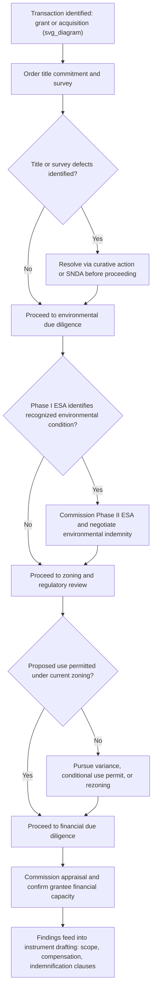

## Due Diligence Before Granting or Acquiring an Easement

### Purpose and Scope of Due Diligence

Due diligence in the easement context is the systematic investigation of title, physical, regulatory, and financial factors undertaken before a party either grants an easement (burdens its own land) or acquires one (obtains rights over another's land). Because easement instruments create long-term or perpetual encumbrances that are difficult and costly to unwind, deficiencies discovered after closing are far more expensive to remedy than deficiencies caught before signature — due diligence is therefore the primary risk-mitigation mechanism in easement transactions, distinct from and preceding the drafting and negotiation of the instrument itself.

### Title Due Diligence

**Function**

Confirms the grantor's actual authority to convey the easement and identifies existing encumbrances that could conflict with, subordinate, or defeat the proposed right.

**Key Points**

- **Title search and title commitment**: Obtain a current title report or commitment covering the servient parcel, reviewing the full chain of title for the grantor's fee ownership and any breaks in the chain.
- **Existing liens and mortgages**: Identify senior mortgages or deeds of trust; a foreclosure by a senior lienholder can extinguish a junior-priority easement, so the acquiring party should assess whether **subordination, non-disturbance, and attornment (SNDA)** agreements from existing lenders are necessary.
- **Existing easements and restrictive covenants**: Review recorded instruments for conflicting or overlapping easements (e.g., a prior exclusive easement over the same area), restrictive covenants limiting permitted uses, and homeowners' association or CC&R restrictions that could constrain the new grant.
- **Boundary and legal description consistency**: Confirm the servient parcel's recorded legal description matches current survey data; discrepancies between recorded descriptions and physical boundaries are a common source of later disputes.
- **Ownership entity authority**: For corporate, trust, or partnership grantors, confirm the signing party has actual authority to convey (board resolutions, trustee powers, partnership agreement provisions) — an easement granted by a party lacking authority may be void or voidable.
- **Co-tenancy and community property issues**: Where the servient estate is held by multiple owners (tenants in common, joint tenants, or spouses in community property jurisdictions), confirm all necessary parties join in the grant, since one co-owner generally cannot unilaterally burden the entire fee.

### Survey and Physical Due Diligence

**Function**

Establishes the precise physical characteristics of the land and confirms the proposed easement area is technically suitable for its intended purpose.

**Key Points**

- **ALTA/NSPS survey (U.S. context) or equivalent boundary survey**: Provides an authoritative depiction of boundaries, existing improvements, easements of record, and encroachments, forming the basis for the legal description exhibit in the instrument.
- **Topographic and geotechnical assessment**: For utility, pipeline, or drainage easements, confirm soil conditions, slope, drainage patterns, and flood zone status are compatible with the intended use.
- **Existing improvements and encroachments**: Identify structures, fences, or landscaping within the proposed easement area that may require removal, relocation, or accommodation.
- **Access verification**: Confirm the easement area actually connects the dominant estate to the intended destination (public road, utility main) without gaps — a surprisingly common defect where a "paper" easement fails to physically connect due to an intervening parcel.
- **Utility locate and existing infrastructure conflicts**: For underground utility easements, conduct utility locates to identify conflicts with existing buried infrastructure not reflected in public records.

### Environmental Due Diligence

**Function**

Identifies contamination or environmental risk that could create liability exposure for either party, or physical constraints on the proposed use.

**Key Points**

- **Phase I Environmental Site Assessment**: Standard baseline investigation (historical records review, site reconnaissance, regulatory database search) to identify recognized environmental conditions; a Phase II (soil and groundwater sampling) may follow if Phase I identifies concerns.
- **Wetlands and protected habitat**: Confirm whether the easement area intersects wetlands, floodplains, or habitat for protected species, which may trigger separate permitting requirements (e.g., Clean Water Act Section 404 permits in the U.S. context) independent of the easement grant itself.
- **Contamination liability allocation**: Where environmental risk exists, due diligence findings directly inform the environmental indemnification provisions negotiated into the instrument — a grantee acquiring rights over contaminated land will typically seek an indemnity from the grantor for pre-existing conditions, and vice versa for contamination the grantee's own activity might introduce.
- **Cultural and archaeological resources**: For undeveloped or historically significant land, assess whether cultural resource surveys are required before ground-disturbing activity.

### Regulatory and Zoning Due Diligence

**Function**

Confirms the proposed easement use is legally permissible under applicable land-use controls, independent of whether the private parties consent to the grant.

**Key Points**

- **Zoning compliance**: Verify the intended use (utility corridor, access road, commercial pipeline) is a permitted or conditional use under the servient parcel's zoning classification.
- **Permits and approvals**: Identify required governmental permits — construction permits, environmental permits, utility commission approvals, or (for cross-border or interstate infrastructure) federal siting approvals.
- **Local subdivision and platting requirements**: Some jurisdictions require easements to be reflected on recorded plats or subject to subdivision review, particularly for access easements serving multiple lots.
- **Comprehensive plan and future land use conflicts**: Assess whether a municipality's long-range planning documents signal future public infrastructure or rezoning that could affect the easement's viability or value over its term.

### Financial and Valuation Due Diligence

**Function**

Establishes the economic basis for compensation negotiation and confirms the transaction is financially sound for both parties.

**Key Points**

- **Appraisal**: Commission a qualified appraisal using the before-and-after method to establish the diminution in value baseline for compensation negotiation.
- **Tax implications**: [Unverified] Assess the tax characterization and consequences of the proposed compensation structure (capital gain treatment, basis reduction, property tax reassessment triggers) with jurisdiction-specific tax counsel, since treatment varies by jurisdiction and transaction structure.
- **Impact on financeability**: For the servient owner, assess whether granting the easement will impair the parcel's value as loan collateral or complicate future financing; for the grantee, confirm the easement terms satisfy any project lender's collateral requirements.
- **Grantee financial capacity**: Where compensation is structured as periodic or royalty-based payments rather than a lump sum, or where indemnification obligations depend on the grantee's ongoing solvency, assess the grantee's financial strength and, where warranted, require financial assurance (bonds, letters of credit) as a risk mitigant.

### Due Diligence Checklist by Category

| Category | Key Documents/Actions | Primary Risk Addressed |
| --- | --- | --- |
| Title | Title commitment, chain of title review, SNDA agreements | Grantor lacks authority; junior priority defeated by foreclosure |
| Survey | ALTA/boundary survey, topographic assessment | Inaccurate legal description; physical unsuitability |
| Environmental | Phase I/II ESA, wetlands/habitat review | Contamination liability; permitting delay |
| Zoning/Regulatory | Zoning verification, permit identification | Use is not legally permissible despite private agreement |
| Financial | Appraisal, tax analysis, grantee creditworthiness review | Inadequate compensation; unenforceable indemnity due to insolvency |

### Due Diligence Process Sequence

**Diagram: Easement Due Diligence Workflow (svg_diagram)**

### Due Diligence Findings and Instrument Drafting

**Key Points**

- Title defects identified during due diligence directly shape the **priority and subordination clause** in the final instrument.
- Survey findings determine the precision and method used in the **legal description and easement area clause**.
- Environmental findings shape the scope and allocation of the **indemnification clause**, particularly whether a separate environmental indemnity is warranted.
- Zoning and regulatory constraints may require the **scope-of-use clause** to be conditioned on obtaining specified permits, with closing contingent on their issuance.
- Financial due diligence findings establish the negotiating baseline for the **compensation clause**.

### Common Due Diligence Failures

**Key Points**

- Proceeding on an outdated or incomplete title search, missing a senior lien that later forecloses and extinguishes the easement.
- Relying on a legal description from an old deed without a current survey, leading to a physical mismatch between the recorded easement area and actual conditions on the ground.
- Skipping environmental assessment on the assumption that an easement (as opposed to a fee transfer) does not trigger environmental liability exposure — indemnification and cleanup liability can attach regardless of the form of interest conveyed.
- Failing to confirm zoning compliance before finalizing compensation, resulting in a signed instrument for a use that cannot lawfully proceed without further approvals.
- Not verifying the grantor's full authority where the servient estate is held in a complex ownership structure (trust, multiple co-tenants, corporate entity requiring board approval).

**Next Steps**

- Assemble a due diligence checklist tailored to the specific easement type (utility, access, conservation, pipeline) before initiating negotiation
- Engage a title company or real estate attorney to order and review the title commitment
- Commission survey and, where environmental risk is plausible, a Phase I ESA early in the process to avoid late-stage transaction delays
- Confirm zoning and permitting requirements before finalizing compensation, since permit denial risk should inform contingency and closing-condition drafting
- Feed all due diligence findings directly into the key clauses of the instrument (title/priority, legal description, indemnification, scope, compensation)

**Related Topics**

- Title Insurance Endorsements for Easement Priority Protection
- ALTA/NSPS Survey Standards and Easement Legal Descriptions
- Phase I and Phase II Environmental Site Assessments in Land Transactions
- SNDA Agreements and Lender Consent Requirements for Easements
- Zoning Variances and Conditional Use Permits for Utility and Access Easements
- Appraisal Methodologies for Easement Compensation
- Authority and Capacity Issues in Trust, Corporate, and Co-Tenancy Grantors