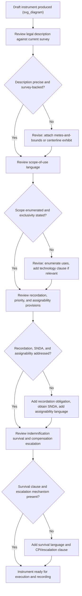

## Common Drafting Pitfalls and How to Avoid Them

### Purpose of a Pitfalls-Focused Review

Easement litigation overwhelmingly traces back to a small, recurring set of drafting failures rather than exotic legal issues. Because easements are strictly construed instruments that govern relationships lasting decades or in perpetuity, defects that would be minor irritants in a short-term contract become entrenched, expensive-to-fix problems once recorded. This review consolidates the highest-frequency drafting failures across the instrument as a whole, cross-referencing the specific clauses where each pitfall originates.

### Pitfall: Vague or Floating Legal Descriptions

**Problem**

Descriptions such as "a reasonable right of way across Grantor's property" or references to unrecorded, informal sketches create disputes over exact location, width, and routing — this is consistently the single highest-litigation-risk defect in easement instruments.

**Consequence**

Courts may need extrinsic evidence (historical use patterns, party testimony) to fix the location, and in some jurisdictions an indefinite description can render the grant void for vagueness. Even where the grant survives, boundary disputes over the "actual" location can persist across successive owners.

**How to Avoid It**

- Commission a metes-and-bounds survey and attach it as a recorded exhibit rather than relying on narrative description.
- Where a floating easement is unavoidable (location genuinely not yet determined at signing), include an explicit location-fixing mechanism — e.g., "the location as constructed" language with an obligation to record a confirmatory survey exhibit once built.
- Cross-reference: see the legal description and easement area clause in the key-clauses framework.

### Pitfall: Ambiguous Scope-of-Use Language

**Problem**

Overly narrow purpose language ("for a single overhead electric line") can exclude reasonably necessary upgrades; overly broad language ("for utility purposes") can be read expansively by a later grantee for uses the original grantor never contemplated (e.g., adding fiber optic cable decades later).

**Consequence**

Because easements are construed narrowly against the grantee at common law, unclear scope tends to resolve against the party who did not anticipate the disputed use — usually costly regardless of who prevails, since the dispute itself requires litigation or renegotiation.

**How to Avoid It**

- Enumerate specific permitted uses rather than relying on a single general term.
- For utility and infrastructure easements likely to face technological change, include a defined "similar facilities" or "after-developed technology" clause, subject to reasonable consent requirements, rather than leaving the question entirely open or entirely closed.
- Expressly state whether the easement is exclusive or non-exclusive — silence on exclusivity is a frequent source of later dispute.

### Pitfall: Missing or Weak Recordation Provisions

**Problem**

An easement that is validly created between the original parties but never properly recorded fails to bind subsequent bona fide purchasers of the servient estate in most jurisdictions, effectively extinguishing the practical value of the right upon a sale.

**Consequence**

A grantee can lose the entire benefit of a validly negotiated easement simply because a successor owner purchased without notice — a purely administrative failure with outsized substantive consequences.

**How to Avoid It**

- Include an express recordation obligation and confirm the instrument is executed in recordable form (proper acknowledgment/notarization per the jurisdiction's recording statute) at signing, not as an afterthought.
- Cross-reference the easement in the chain of title of both the dominant and servient parcels where local recording practice permits dual indexing.

### Pitfall: Undefined or Absent Maintenance Obligations

**Problem**

Silence on who maintains the easement area (road surface, drainage, buried infrastructure) leaves both parties uncertain about responsibility until a maintenance failure causes damage or injury, at which point the dispute is adversarial rather than cooperative.

**Consequence**

Disputes over maintenance responsibility are a common source of neighbor-to-neighbor and utility-to-landowner litigation, particularly for shared-use easements like common driveways.

**How to Avoid It**

- Explicitly allocate routine maintenance versus capital repair responsibility.
- For shared-use easements, include a cost-sharing formula proportional to use or benefited parcels rather than leaving cost allocation implicit.
- Address restoration obligations following maintenance-related disturbance (regrading, reseeding).

### Pitfall: Indemnification Clauses That Don't Survive Termination

**Problem**

Indemnification and insurance obligations drafted without an explicit survival clause create ambiguity about whether they apply to claims asserted after the easement terminates but arising from conduct that occurred during the term.

**Consequence**

A servient owner injured by residual contamination or a latent defect from the grantee's activity may find the indemnification obligation has lapsed along with the easement itself, precisely when the claim is asserted.

**How to Avoid It**

- Draft an express survival provision stating that indemnification and insurance obligations continue to apply to claims arising from conduct occurring during the term, regardless of subsequent termination.
- Cross-reference the indemnification and insurance clause, ensuring the survival language is consistent with the duration and termination clause.

### Pitfall: Insufficient Assignability Language for Easements in Gross

**Problem**

Because the common-law default historically disfavored transferability of personal (in-gross) easements, an instrument silent on assignability may be construed as non-assignable — a significant problem for commercial or utility grantees who anticipate corporate restructuring, sale, or financing that requires transfer of the right.

**Consequence**

A grantee may find itself unable to assign the easement to a successor entity or lender without returning to the original grantor (who may no longer exist, be locatable, or be willing to cooperate) for a fresh grant.

**How to Avoid It**

- Include explicit assignability language for easements in gross, stating whether the right is personal (non-assignable) or freely assignable, and whether it may be divided among multiple assignees.
- Bind successors and assigns expressly in both the granting clause and the miscellaneous/boilerplate provisions.

### Pitfall: No Mechanism for Amending or Relocating the Easement

**Problem**

Long-term or perpetual easements drafted without any relocation or amendment mechanism become rigid even when both parties would benefit from adjustment (e.g., the servient owner wants to develop around a poorly placed access road, or the grantee needs to reroute around new construction).

**Consequence**

Without a contractual mechanism, relocation requires either mutual agreement negotiated from scratch (with no default leverage-balancing framework) or, in jurisdictions that recognize it, reliance on the Restatement (Third) of Property (Servitudes) relocation doctrine, which is not uniformly adopted and imposes its own conditions (no increased burden on the dominant estate, servient owner bears the cost).

**How to Avoid It**

- Include an express relocation clause specifying conditions (e.g., servient owner may relocate at its own cost, provided the relocation does not materially impair the grantee's use, with advance notice and grantee approval rights).
- Address amendment procedure generally in the miscellaneous provisions (writing, signature, and recordation requirements for any modification).

### Pitfall: Priority Not Addressed Relative to Existing Liens

**Problem**

An easement granted without confirming its priority relative to existing mortgages can be extinguished by foreclosure of a senior lien, since foreclosure generally wipes out interests junior to the foreclosing lien.

**Consequence**

A grantee may have paid full compensation for an easement that disappears entirely if the servient owner defaults on a pre-existing mortgage — a risk invisible in the instrument's text alone.

**How to Avoid It**

- Conduct title due diligence identifying all senior liens before closing.
- Obtain subordination, non-disturbance, and attornment (SNDA) agreements from existing mortgagees, or condition the easement grant on lender consent.
- Address this explicitly through a dedicated priority/subordination clause rather than assuming the recording date alone governs.

### Pitfall: Overreliance on Boilerplate "Indemnify and Hold Harmless" Without Addressing Defense Duty

**Problem**

Generic "indemnify and hold harmless" language, without separately addressing the duty to defend, leaves ambiguous whether the indemnitor must advance defense costs as claims arise or only reimburse after final resolution — a distinction with major practical cash-flow consequences during protracted litigation.

**How to Avoid It**

- Draft indemnification, defense, and hold-harmless as three distinct, explicitly stated obligations.
- Expressly carve out the indemnitee's own negligence or willful misconduct to avoid unenforceability risk under jurisdictions applying anti-indemnity statutes.

### Pitfall: No Escalation Mechanism for Long-Term Periodic Compensation

**Problem**

Perpetual or long-term easements with fixed periodic payments (common in pipeline, wind, and agricultural easements) lose real value over decades absent an adjustment mechanism, since the fixed payment does not track inflation.

**How to Avoid It**

- Include a CPI-indexed or fixed-percentage escalation clause for any recurring compensation structure tied to a multi-decade or perpetual term.
- Consider periodic renegotiation windows for compensation even where the underlying grant remains perpetual.

### Pitfall Summary and Cross-Reference Map

| Pitfall | Root Clause | Consequence If Uncorrected |
| --- | --- | --- |
| Vague legal description | Legal description/easement area | Boundary litigation; possible voidness |
| Ambiguous scope | Purpose and scope of use | Narrow construction against grantee; disputes over new uses |
| Missing recordation | Recordation clause | Loses priority against bona fide purchasers |
| Undefined maintenance | Maintenance and repair | Adversarial disputes after damage occurs |
| No survival language | Indemnification and insurance | Post-termination claims uncovered |
| Weak assignability language | Assignability and successors | Grantee unable to transfer or finance |
| No relocation mechanism | Duration/miscellaneous | Rigid instrument, forced litigation to adjust |
| Priority unaddressed | Priority/subordination | Extinguishment by senior lien foreclosure |
| Generic indemnity boilerplate | Indemnification | Ambiguous defense-cost obligations |
| No compensation escalation | Compensation | Real-value erosion over long term |

### Diagram: Pitfall Detection in the Drafting Review Cycle (svg_diagram)

### Process-Level Safeguards Beyond Clause-Level Fixes

**Key Points**

- **Checklist-driven review**: Maintain a standing drafting checklist covering every clause category in the key-clauses framework, reviewed against each new instrument regardless of apparent similarity to prior deals — apparent similarity is itself a risk factor for copy-paste errors carrying forward defects from a prior, differently-situated transaction.
- **Cross-clause consistency check**: Many pitfalls arise not from a single defective clause but from inconsistency between clauses (e.g., a perpetual duration clause paired with compensation language drafted for a term easement) — a final consistency pass across the full instrument catches these.
- **Jurisdiction-specific verification**: [Unverified] Recording formalities, anti-indemnity statute applicability, and relocation doctrine adoption vary by jurisdiction, and drafters should confirm current local requirements rather than relying on a generic template, since template-driven drafting is a common vector for jurisdiction-mismatch errors.
- **Post-execution follow-through**: Confirm actual recording occurs and obtain a recorded copy with recording information (book/page or instrument number) — an executed-but-unrecorded instrument carries the recordation pitfall regardless of how well the substantive clauses were drafted.

**Next Steps**

- Build a standing drafting checklist keyed to the pitfall summary table above
- Institute a mandatory cross-clause consistency review before execution
- Confirm jurisdiction-specific recording and anti-indemnity statute requirements at the outset of each new matter
- Verify recordation completion and retain evidence of recording information post-closing

**Related Topics**

- Strict Construction Doctrine and Its Effect on Ambiguous Easement Language
- Restatement (Third) of Property (Servitudes) Relocation Doctrine
- Recording Statutes and Bona Fide Purchaser Protection Across Jurisdictions
- Drafting Technology-Neutral Scope Clauses for Utility Easements
- Survival Clauses in Long-Term Land Use Agreements
- CPI-Indexed Compensation Structures for Perpetual Easements
- Checklist-Driven Contract Review Methodologies in Real Property Practice