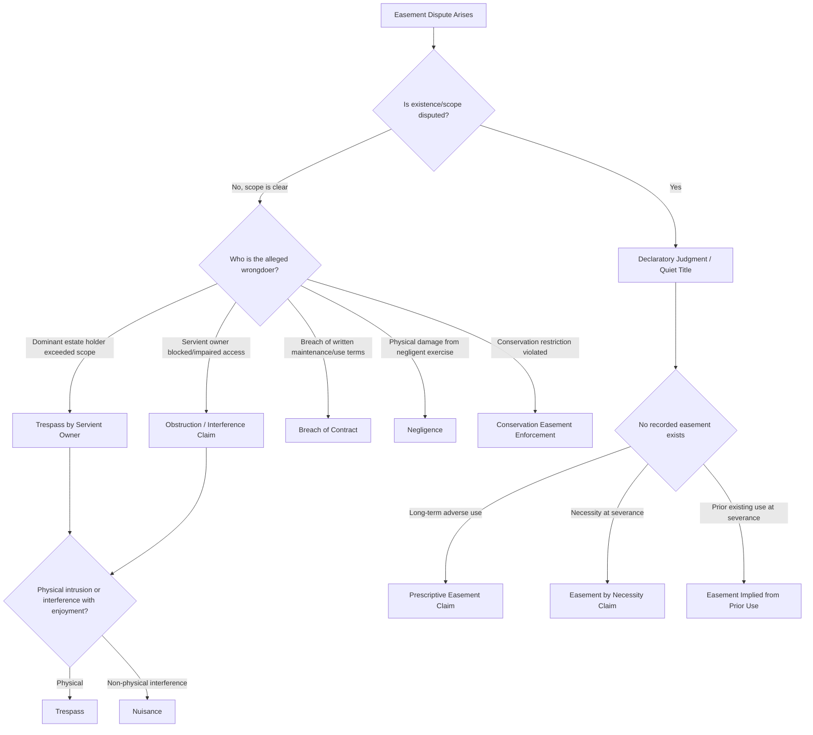

## Common Causes of Action in Easement Disputes

### Overview

Easement litigation arises from disputes over the existence, scope, use, obstruction, or termination of a nonpossessory interest in land. Because easements straddle contract, property, and sometimes tort doctrine, litigants typically plead multiple overlapping causes of action to preserve alternative theories of relief. This reference catalogs the principal causes of action recognized across common law jurisdictions, their elements, typical remedies, and the evidentiary issues that dominate practice.

### Declaratory Judgment to Establish Existence or Scope

**Key Points**

- The most common opening cause of action when the parties dispute *whether* an easement exists or *what* it permits, rather than seeking damages.
- Courts adjudicate the legal relationship without necessarily awarding damages or an injunction, though declaratory relief is frequently combined with injunctive relief in the same complaint.

**Elements**

1. An actual, justiciable controversy regarding rights in land (not a hypothetical future dispute)
2. The plaintiff holds or claims an interest sufficient to have standing (dominant estate owner, servient estate owner, or in some jurisdictions a prospective purchaser or lender)
3. A request for the court to construe the instrument, or determine the existence/scope of a prescriptive, implied, or easement by necessity claim

**Typical Disputes Resolved**

- Ambiguous granting language ("access to the rear parcel" — width unspecified)
- Whether use has expanded beyond the original scope (agricultural access easement later used for commercial trucking)
- Whether an easement was extinguished by merger, abandonment, or the servient estate's adverse possession

### Trespass to Land (Servient Owner as Plaintiff)

**Key Points**

- Filed by the servient estate owner when the easement holder exceeds the scope of the granted or prescriptive right.
- Distinguishes *overburdening* (using the easement beyond its scope) from lawful use, which is a defense.

**Elements**

1. Plaintiff holds title or possessory right to the servient estate
2. Defendant's use of the land exceeded the boundaries or purposes of the easement (or no easement existed at all)
3. Entry or use was intentional (or the result of a failure to act with reasonable care, depending on jurisdiction)
4. Damages, or in many jurisdictions, nominal damages suffice to support injunctive relief

**Common Fact Patterns**

- Widening a right-of-way beyond its historical footprint
- Installing utility lines under an access-only easement
- Parking or storing materials within an easement strip not granted for those purposes
- Increased frequency/intensity of use inconsistent with the "normal development" doctrine (i.e., use that increases beyond what was reasonably contemplated at creation)

### Nuisance (Interference with Use and Enjoyment)

**Key Points**

- Available to either the dominant or servient owner where the other party's conduct substantially and unreasonably interferes with use and enjoyment, independent of a strict boundary violation.
- Frequently pled alongside trespass because the same conduct (e.g., blocking a driveway) can support both theories with different proof burdens.

**Elements**

1. Defendant's conduct caused a substantial interference with plaintiff's use or enjoyment of the easement or servient land
2. The interference was unreasonable under the circumstances (balancing test: gravity of harm vs. utility of defendant's conduct)
3. Causation and damages (or a basis for injunctive relief where damages are inadequate)

**[Inference]** Nuisance theories are often pled as a fallback where the trespass claim may fail on technical grounds (e.g., where the interference is indirect, such as noise or obstruction of light/air rather than a physical intrusion onto the easement strip itself).

### Obstruction / Interference with Easement (Servient Owner as Defendant)

**Key Points**

- The mirror-image claim to trespass: brought by the *dominant* estate holder when the servient owner blocks, narrows, gates, or otherwise impairs the easement.
- The core doctrinal principle is that the servient owner retains full use of the land subject only to *not unreasonably interfering* with the easement holder's rights.

**Elements**

1. Plaintiff holds a valid easement (existence must often be proven or is stipulated)
2. Defendant's action (fence, gate, locked chain, encroaching structure, planted vegetation, parked vehicles) impairs plaintiff's reasonable use of the easement
3. The impairment is more than trivial — most jurisdictions require *substantial* interference, though some allow relief for any interference with express-grant easements
4. Remedy sought: mandatory injunction to remove the obstruction, and/or damages for interim loss of use

**Defenses commonly raised**

- The obstruction (e.g., a locked gate with keys provided to the easement holder) is a reasonable accommodation that does not substantially impair access
- The easement was abandoned or extinguished before the obstruction was placed

### Quiet Title Action

**Key Points**

- Used to resolve competing claims to title or to a claimed easement interest, clearing the record for future transactions.
- Distinct from a declaratory judgment in that quiet title actions are typically statutory, in rem or quasi-in-rem proceedings that bind all parties with a record interest, often requiring notice to lienholders and other encumbrancers.

**Elements**

1. Plaintiff has some claim, title, or interest in the property (including an easement interest)
2. An adverse claim exists that casts a cloud on that interest
3. The adverse claim is invalid, and the court is asked to declare plaintiff's interest superior

**Typical Use Cases**

- Removing a recorded but abandoned or extinguished easement from the chain of title
- Resolving conflicting deeds that describe overlapping or ambiguous easement locations
- Confirming a prescriptive easement's existence for title insurance purposes

### Prescriptive Easement Claims (as Affirmative Claim or Counterclaim)

**Key Points**

- Asserted offensively by a long-term user seeking to establish a legal easement, or defensively as a counterclaim when sued for trespass.
- Elements vary by jurisdiction but generally mirror adverse possession without the requirement of exclusivity.

**Elements** (majority approach)

1. Open and notorious use
2. Continuous and uninterrupted use for the statutory period
3. Adverse/hostile use (without the owner's permission) — note that in **[Unverified]** some jurisdictions, prior permissive use can convert to adverse use upon a clear, communicated change in the nature of the use
4. Under a claim of right (some jurisdictions require good faith; others do not)

**Comparative note**

$$t_{prescriptive} \in \{5, 7, 10, 15, 20\} \text{ years, jurisdiction-dependent}$$

Civil law jurisdictions (e.g., France, Louisiana) generally require a longer prescriptive period and additionally distinguish *continuous and apparent* servitudes (which may be acquired by prescription) from *discontinuous* servitudes (rights of way), which historically could not be acquired by prescription alone under the French Civil Code, requiring a title instead.

### Breach of Contract / Breach of Easement Agreement

**Key Points**

- Where the easement arises from an express written agreement containing affirmative covenants (maintenance obligations, cost-sharing, use restrictions), a breach of those specific terms sounds in contract rather than, or in addition to, property-based theories.

**Elements**

1. A valid, enforceable easement agreement or covenant
2. Defendant's breach of a specific term (failure to maintain a shared driveway, failure to pay a proportional maintenance assessment, use inconsistent with an express restriction)
3. Damages flowing from the breach

**Common Subject Matter**

- Shared driveway/road maintenance agreements with cost-sharing formulas
- Utility easements with restoration obligations after excavation
- Conservation easements with affirmative stewardship covenants (see below)

### Conservation Easement Enforcement Actions

**Key Points**

- A specialized category, typically brought by a land trust, government agency, or (where statutorily permitted) a third-party beneficiary, to enforce restrictions on land use that run with the land in perpetuity.
- Governed in the U.S. by the Uniform Conservation Easement Act (UCEA) and analogous state statutes; enforcement often includes both injunctive relief and, in egregious cases, restoration damages exceeding simple diminution in value.

**Elements**

1. A validly created and recorded conservation easement held by a qualified holder
2. A violation of the easement's specific restrictions (e.g., unauthorized construction, subdivision, timber harvesting, or drainage alteration)
3. Standing of the plaintiff (holder, and in some states, a third-party enforcement right-holder)
4. Remedy: injunction, mandatory restoration, and/or damages measured by cost of restoration rather than mere market diminution — **[Inference]** courts frequently favor restoration-cost measures for conservation easements specifically because market-diminution damages undercompensate the public conservation purpose.

### Negligence (Damage to Servient or Dominant Estate)

**Key Points**

- Applicable where the easement holder's exercise of rights (e.g., utility maintenance, road grading) causes physical damage to the servient estate beyond the scope of the easement's inherent use.

**Elements**

1. Duty of reasonable care in exercising the easement (both the dominant holder toward the servient estate, and vice versa)
2. Breach of that duty (e.g., failing to restore the surface after utility work, as often required by statute or the grant itself)
3. Causation and damages

### Cause of Action Selection Flowchart

### Remedies Matrix

| Cause of Action | Primary Remedy | Secondary/Alternative Remedy |
| --- | --- | --- |
| Declaratory judgment | Judicial construction of rights | Often paired with injunction |
| Trespass | Injunction + damages | Nominal damages if no measurable harm |
| Nuisance | Injunction (if damages inadequate) | Damages for diminished use/enjoyment |
| Obstruction/interference | Mandatory injunction to remove obstruction | Damages for interim loss of access |
| Quiet title | Judgment clearing title | N/A — declaratory in nature |
| Prescriptive easement | Recognition of easement + injunction against interference | N/A |
| Breach of contract | Expectation damages | Specific performance (maintenance obligations) |
| Conservation easement enforcement | Injunction + restoration order | Restoration-cost damages |
| Negligence | Compensatory damages for physical harm | Injunction rare; typically damages-only |

### Worked Example: Pleading Strategy

**Scenario**: Dominant estate owner discovers the servient owner has erected a locked gate across a 30-year-old unrecorded dirt access road, and has also begun plowing and planting crops within the road's historical footprint.

**Recommended pleading approach**:

1. **Count I — Prescriptive Easement**: Establish the underlying right, since no recorded grant exists. Plead open, continuous, adverse use for the statutory period with supporting evidence (aerial photographs over time, utility bills, witness affidavits as to historical use).
2. **Count II — Obstruction/Interference**: Contingent on Count I succeeding, seek a mandatory injunction to remove the gate or compel provision of keys/access codes.
3. **Count III — Trespass (as counterclaim exposure check)**: Anticipate that the servient owner may counter-plead trespass for any entry plaintiff made to clear the road; address scope of the prescriptive right proactively.
4. **Count IV — Damages**: Nominal or actual damages for the interim period of blocked access, particularly if plaintiff incurred costs using an alternate route.

**[Inference]** Pleading the prescriptive easement claim and the interference claim in the alternative (rather than assuming success on Count I) is standard practice, since courts may bifurcate trial on the existence question before reaching remedies.

### Evidentiary Considerations Across Claims

- **Title chain review**: Nearly every cause of action requires establishing the historical chain of title for both estates to determine when severance occurred (critical for necessity and implied-easement theories).
- **Survey evidence**: Precise metes-and-bounds or GPS-based surveys are typically dispositive on scope/boundary disputes and are frequently the single most litigated piece of evidence.
- **Historical use evidence**: Aerial and satellite imagery (often spanning decades via public archives), utility records, tax assessments, and long-term resident testimony are central to prescriptive and implied-easement claims.
- **Behavior may vary by jurisdiction**: statutory prescriptive periods, the presumption of permissive vs. adverse use, and the availability of punitive/treble damages for willful obstruction differ significantly; practitioners must confirm current local statutory and case law before relying on general principles above.

### Related Topics

- Easement by Necessity and Easement Implied from Prior Use — Elements and Proof
- Merger and Abandonment as Easement Extinguishment Theories
- The Uniform Conservation Easement Act and Third-Party Enforcement Rights
- Adverse Possession vs. Prescriptive Easement — Doctrinal Distinctions
- Remedies for Overburdening: Apportionment and Injunctive Limits
- Title Insurance Claims Arising from Undisclosed Easements
- Civil Law Servitudes: Continuous/Discontinuous and Apparent/Non-Apparent Classifications