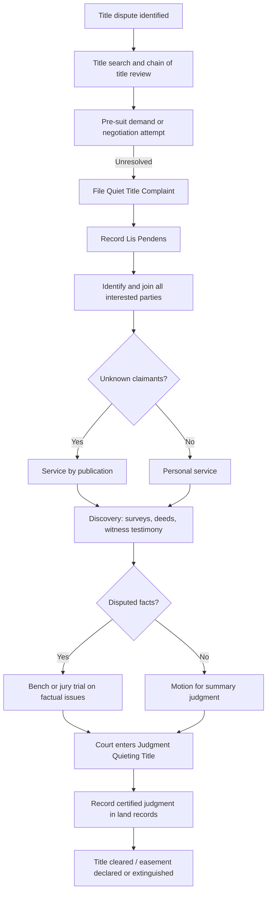

## Quiet Title Actions

### Overview and Purpose

A quiet title action is a civil lawsuit filed to establish or resolve competing claims to real property, "quieting" any challenges or clouds on title so that ownership becomes legally certain and marketable. In the easement context, quiet title actions are the primary judicial mechanism used to: (1) establish the existence and scope of an easement, (2) extinguish an easement that a servient landowner believes is invalid, abandoned, or unenforceable, or (3) resolve conflicting claims between multiple parties asserting rights in the same parcel or easement corridor.

The action is typically brought under state statutory frameworks (most states have a specific "Quiet Title Act" or equivalent code sections) and is fundamentally equitable in nature, though many jurisdictions permit a jury trial on certain factual issues (e.g., adverse possession elements) while reserving equitable relief for the court.

### Legal Basis and Statutory Framework

Quiet title actions derive from both common law equity jurisdiction and modern codification. Key statutory sources include:

- **State quiet title statutes** — e.g., California Code of Civil Procedure §§ 760.010–764.080; New York RPAPL Article 15; Texas Civil Practice & Remedies Code Chapter 22 (styled as "Trespass to Try Title" in some jurisdictions, functionally similar).
- **Federal Quiet Title Act (28 U.S.C. § 2409a)** — governs actions to quiet title against the United States where the government claims an interest (e.g., federal land grants, BLM easements, or reserved mineral/access rights).
- **Uniform frameworks** — some states have adopted variations influenced by the Uniform Land Transactions Act principles, though no single uniform quiet title act has been broadly adopted nationally.

**Key Points**

- The action does not create new title; it declares and clarifies existing rights based on the evidence presented.
- Relief is typically sought as a declaratory judgment plus, where necessary, injunctive relief (e.g., to remove an obstruction from an easement).
- Many states require the plaintiff to have some claim or interest in the property (statutory standing) — a stranger to title cannot bring the action.

### When Quiet Title Actions Apply to Easements

| Scenario | Plaintiff | Relief Sought |
| --- | --- | --- |
| Dominant owner asserts an unrecorded or ambiguous easement | Dominant estate holder | Judicial declaration confirming easement exists, scope, and location |
| Servient owner challenges validity/continued existence | Servient estate holder | Declaration that easement is extinguished, abandoned, or void |
| Boundary/location dispute over an easement's physical path | Either party | Judicial determination of precise metes-and-bounds location |
| Competing/overlapping easement claims from multiple parties | Any claimant | Priority determination and declaration of superior right |
| Cloud from expired, defective, or fraudulent conveyance | Current titleholder | Removal of the recorded instrument as a cloud on title |
| Prescriptive easement confirmation | Claimant who has used the land | Judicial recognition of easement acquired by prescription |

### Elements and Pleading Requirements

A quiet title complaint must generally allege, with particularity:

1. **Description of the property** — a legal description sufficient to identify the parcel and, where relevant, the easement's location (metes and bounds, or reference to a recorded plat).
2. **Plaintiff's title or interest** — the basis of the claim (deed, prescriptive use, implication, necessity, estoppel).
3. **Adverse claims** — identification of the defendant(s) and the nature of the cloud or competing claim, including recording information (book/page or instrument number) if the adverse claim is recorded.
4. **Date as of which relief is sought** — most statutes (e.g., Cal. CCP § 761.020) require the complaint to specify the date to which the determination of title should relate.
5. **Prayer for relief** — a request that the court adjudicate the respective rights of the parties and issue a judgment quieting title.

**Example**

> Plaintiff is the owner of Parcel A, more particularly described as [legal description]. Plaintiff and Plaintiff's predecessors in interest have used a 20-foot-wide strip along the northern boundary of Parcel B for ingress and egress continuously, openly, and without permission since 1998. Defendant, owner of Parcel B, has erected a fence obstructing said strip, thereby denying Plaintiff's easement rights. Plaintiff seeks a judicial declaration that a prescriptive easement exists over the described strip, and an order requiring removal of the obstruction.

### Procedural Requirements

#### Parties and Joinder

All persons having or claiming an interest in the property — including record titleholders, lienholders, lessees, and unknown claimants — must typically be joined as defendants. Failure to join a necessary party can render the judgment non-binding as to that party's interest.

#### Service of Process on Unknown Claimants

Because title disputes may implicate unknown or unlocatable parties, most statutes allow **service by publication** on "all persons unknown, claiming any legal or equitable right, title, estate, lien, or interest in the property." Courts require a diligent-search affidavit before authorizing publication.

#### Lis Pendens

Upon filing, the plaintiff typically records a **notice of pendency of action (lis pendens)** in the county land records. This provides constructive notice to third parties that title is in dispute and protects the plaintiff's priority against intervening transfers or encumbrances during litigation.

#### Statute of Limitations

Limitations periods vary by theory:

- **Adverse possession / prescriptive easement basis** — governed by the state's adverse possession statute (commonly 5–20 years of qualifying use).
- **Fraud-based cloud removal** — often 3–4 years from discovery.
- **Actions against record owner in possession** — many states hold there is **no limitations period** for a quiet title action brought by a party in actual possession, since the cloud is a continuing wrong (the "continuing trespass/nuisance" theory applied to title clouds). [Inference: this varies by jurisdiction and is not universal — confirm local statute and case law.]

### Burden of Proof

The plaintiff generally bears the burden of proving superior title **by a preponderance of the evidence** in most states, though some jurisdictions (notably for adverse possession-based claims) require **clear and convincing evidence** given the disfavored nature of divesting a record owner of title. The plaintiff must prevail on the strength of their own title, not merely on weaknesses in the defendant's claim — reflecting the traditional equitable maxim that "the plaintiff must recover on the strength of their own title, not the weakness of the defendant's."

### Common Theories Litigated Within Quiet Title Actions

#### 1. Express Easement Validity

Disputes over whether a recorded instrument (deed, grant, declaration of covenants) properly created an easement — examining formalities such as a valid grantor/grantee, adequate legal description, and proper recording/acknowledgment.

#### 2. Prescriptive Easement

Requires proof of use that is:

- Open and notorious
- Continuous and uninterrupted for the statutory period
- Adverse/hostile (without owner's permission)
- (In some states) exclusive

#### 3. Easement by Necessity or Implication

Arising from a prior unified ownership and subsequent severance that leaves a parcel landlocked, or from apparent, continuous use existing at the time of severance.

#### 4. Abandonment or Extinguishment

Servient owners often use quiet title actions offensively to extinguish an easement, arguing:

- **Non-use** alone (typically insufficient in most states without additional conduct)
- **Affirmative acts** evidencing intent to abandon (e.g., dominant owner constructing a permanent obstruction on their own alternate access)
- **Merger** of dominant and servient estates under common ownership
- **Release** (express or implied)
- **Adverse possession by the servient owner** against the easement itself
- **Marketable Title Acts** — many states extinguish ancient, unrecorded, or stale interests not re-recorded within a statutory root-of-title period (commonly 30–40 years)

#### 5. Boundary and Location Disputes

Where an easement's general existence is undisputed but its precise physical location is contested — often resolved through survey evidence and the doctrine of **practical location** (long-standing use establishing the boundary by acquiescence).

### Evidentiary Considerations

| Evidence Type | Relevance |
| --- | --- |
| Recorded deeds, plats, and title chain | Establishes record title and any express grant |
| Surveys and metes-and-bounds descriptions | Establishes precise location and dimensions |
| Aerial photographs / historical imagery | Demonstrates duration and visibility of use |
| Witness testimony | Corroborates continuity, notoriety, and character of use |
| Tax records | May show which party paid property taxes (relevant to adverse possession in states requiring "color of title" or tax payment) |
| Maintenance records | Evidence of dominant owner's ongoing exercise of easement rights |
| Title insurance policies/reports | Identifies exceptions and prior cloud disclosures |

### Litigation Process Flow

### Judgment and Its Effect

A final judgment in a quiet title action is generally **in rem or quasi in rem** — it binds the property itself and all parties properly joined (including those served by publication), not merely the named litigants personally. The judgment should:

- Precisely describe the property and/or easement (location, width, purpose, scope)
- State affirmatively who holds title/rights and free the property from the adverse claim, or confirm the easement's validity and terms
- Be recorded in the county recorder's/register of deeds' office to provide constructive notice and correct the public record

**Example**

> IT IS HEREBY ORDERED, ADJUDGED, AND DECREED that Plaintiff holds a valid prescriptive easement for ingress, egress, and utility purposes over the 20-foot strip described in Exhibit A, and that Defendant, Defendant's successors, and all persons claiming under Defendant are permanently enjoined from obstructing said easement.

### Relationship to Related Causes of Action

Quiet title claims are frequently pled alongside:

- **Declaratory judgment** — often overlapping relief; some jurisdictions treat quiet title as a specific subspecies of declaratory relief for real property.
- **Trespass / ejectment** — where physical interference with the easement has occurred, allowing recovery of damages in addition to the declaratory ruling.
- **Injunctive relief** — to remove physical obstructions or prevent interference pending and following judgment.
- **Slander of title** — where a party has recorded a knowingly false or malicious claim of interest, causing pecuniary loss.
- **Partition actions** — distinguished from quiet title in that partition divides jointly-held property among co-owners rather than resolving adverse claims.

### Quiet Title vs. Related Remedies — Comparison

| Feature | Quiet Title Action | Declaratory Judgment | Ejectment | Trespass to Try Title (TX) |
| --- | --- | --- | --- | --- |
| Primary goal | Clear cloud/establish title | Resolve legal uncertainty generally | Recover possession | Recover title and possession |
| Requires possession by plaintiff | Not always required | Not required | Defendant typically in possession | Plaintiff need not be in possession |
| In rem effect | Yes (with proper joinder/publication) | Generally in personam | In personam | In rem-like, statutory |
| Typical use for easements | Establish/extinguish easement rights | Clarify ambiguous easement terms | Remove trespasser blocking easement | Texas-specific equivalent to quiet title |

### Defenses Commonly Raised

- **Laches** — unreasonable delay causing prejudice, particularly relevant where plaintiff seeks to establish long-dormant rights.
- **Statute of limitations** — where applicable to the underlying theory.
- **Bona fide purchaser status** — defendant acquired the property for value without notice (actual, constructive, or inquiry) of the competing claim.
- **Estoppel** — plaintiff's own conduct induced reliance inconsistent with the claim now asserted.
- **Failure to join necessary parties** — jurisdictional/procedural defense.
- **Marketable title act extinguishment** — the claimed easement was not preserved by a timely re-recorded notice of claim.

### Strategic Considerations for Practitioners

**Key Points**

- Order a full title search and 30–50 year chain-of-title review before filing; undisclosed intervening conveyances or liens can defeat joinder completeness.
- Commission a boundary/ALTA survey early — location disputes are often won or lost on survey precision and monument evidence.
- Consider whether mediation or a boundary line agreement (recorded) can resolve the matter more efficiently than litigation, given the cost of publication service and multi-party joinder.
- Evaluate whether title insurance coverage applies, as the title insurer may have a duty to defend or indemnify.
- In federal-interest cases, check for sovereign immunity issues and the notice/venue requirements under 28 U.S.C. § 2409a before filing against the United States.

### Illustrative Diagram: Competing Claims Resolved via Quiet Title

<svg xmlns="http://www.w3.org/2000/svg" viewBox="0 0 640 320">
<text x="320" y="24" text-anchor="middle" font-size="15" font-weight="bold" fill="#1f2937">Quiet Title Action Structure (svg_diagram)</text>
<rect x="40" y="60" width="160" height="70" rx="8" fill="#e0f2fe" stroke="#0369a1" stroke-width="1.5" />
<text x="120" y="88" text-anchor="middle" font-size="12" fill="#0c4a6e">Dominant Estate</text>
<text x="120" y="105" text-anchor="middle" font-size="11" fill="#0c4a6e">Claims easement</text>
<text x="120" y="119" text-anchor="middle" font-size="11" fill="#0c4a6e">right (ingress/egress)</text>
<rect x="440" y="60" width="160" height="70" rx="8" fill="#fee2e2" stroke="#b91c1c" stroke-width="1.5" />
<text x="520" y="88" text-anchor="middle" font-size="12" fill="#7f1d1d">Servient Estate</text>
<text x="520" y="105" text-anchor="middle" font-size="11" fill="#7f1d1d">Disputes/denies</text>
<text x="520" y="119" text-anchor="middle" font-size="11" fill="#7f1d1d">easement validity</text>
<rect x="230" y="160" width="180" height="70" rx="8" fill="#fef3c7" stroke="#b45309" stroke-width="1.5" />
<text x="320" y="188" text-anchor="middle" font-size="12" fill="#78350f">Quiet Title Action</text>
<text x="320" y="205" text-anchor="middle" font-size="11" fill="#78350f">Court adjudicates</text>
<text x="320" y="219" text-anchor="middle" font-size="11" fill="#78350f">competing claims</text>
<line x1="120" y1="130" x2="290" y2="165" stroke="#374151" stroke-width="1.5" marker-end="url(#arrow1)" />
<line x1="520" y1="130" x2="350" y2="165" stroke="#374151" stroke-width="1.5" marker-end="url(#arrow1)" />
<rect x="230" y="270" width="180" height="40" rx="8" fill="#dcfce7" stroke="#15803d" stroke-width="1.5" />
<text x="320" y="294" text-anchor="middle" font-size="12" fill="#14532b">Recorded Judgment</text>
<line x1="320" y1="230" x2="320" y2="268" stroke="#374151" stroke-width="1.5" marker-end="url(#arrow1)" />
</svg>

### Multi-Jurisdictional Notes

- **California** — CCP §§ 760.010 et seq.; requires publication for unknown claimants and imposes strict pleading content requirements (§ 761.020).
- **Texas** — historically uses "Trespass to Try Title" (Tex. Prop. Code Ch. 22) rather than "quiet title," with distinct pleading and proof burdens, though modern practice increasingly blends the two.
- **New York** — RPAPL Article 15 governs; requires a detailed statement of facts constituting each party's claim.
- **Federal land** — 28 U.S.C. § 2409a requires notice pleading with particularity of the right, title, or interest claimed and waives sovereign immunity only for the specific relief described in the statute (does not waive immunity for money damages beyond stated exceptions).

[Unverified] Specific limitations periods, pleading thresholds, and publication procedures vary significantly by state; practitioners should confirm current statutory text and recent appellate decisions in the controlling jurisdiction before filing.

**Related Topics**

- Adverse Possession Elements and Burden of Proof
- Easement by Necessity and Implication
- Boundary Line Disputes and Practical Location Doctrine
- Marketable Title Acts and Stale Claims Extinguishment
- Lis Pendens: Requirements, Effect, and Expungement
- Declaratory Judgment Actions in Real Property Disputes
- Service by Publication on Unknown Claimants
- Title Insurance Claims and Duty to Defend
- Easement Abandonment and Extinguishment Doctrines
- Federal Quiet Title Act (28 U.S.C. § 2409a) Procedure