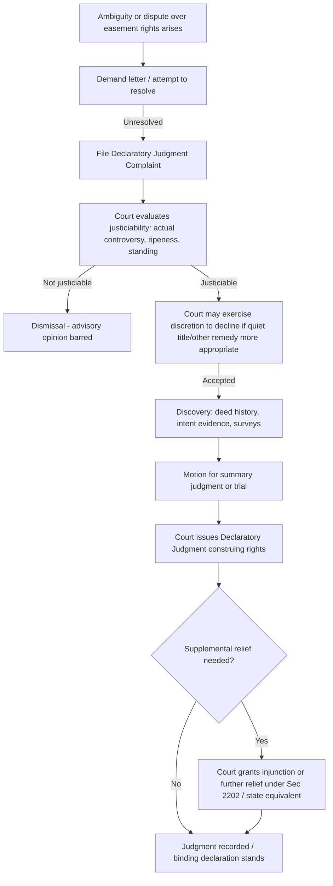

## Declaratory Judgment Actions

### Overview and Purpose

A declaratory judgment action is a civil proceeding in which a party asks a court to declare the parties' legal rights, duties, or status **without necessarily awarding damages or ordering enforcement**. In easement and land rights litigation, declaratory judgment actions are frequently used to resolve ambiguity — such as the scope, location, permissible uses, or maintenance obligations of an easement — before a breach or physical confrontation escalates into damages litigation.

Unlike a quiet title action, which is specifically structured to resolve adverse claims to title and clear clouds on record ownership, a declaratory judgment action is a more flexible, general-purpose vehicle for resolving **any** justiciable controversy over legal rights, including interpretive disputes where title itself is not contested.

### Legal Basis and Statutory Framework

- **Federal Declaratory Judgment Act** — 28 U.S.C. §§ 2201–2202, authorizing federal courts to "declare the rights and other legal relations of any interested party" in a case of actual controversy, subject to federal subject-matter jurisdiction (diversity or federal question).
- **State Uniform Declaratory Judgments Act (UDJA)** — most states have adopted a version of the Uniform Declaratory Judgments Act (1922) or a similar state-specific statute (e.g., Texas Civil Practice & Remedies Code Chapter 37; California Code of Civil Procedure § 1060; New York CPLR § 3001).
- Declaratory relief is generally **discretionary** — courts may decline to exercise jurisdiction even where the statutory prerequisites are met, particularly if another adequate remedy (such as quiet title) is pending or more appropriate.

**Key Points**

- Declaratory relief does not require a prior breach; it may be sought proactively to clarify rights before a dispute ripens into damages.
- The action must present an actual, existing "case or controversy" — courts will not issue advisory opinions on hypothetical or speculative disputes.
- Many state UDJA statutes expressly authorize declaratory relief to determine "any question of construction or validity arising under a deed" — directly covering easement instruments.

### Requirements for Justiciability

1. **Actual Controversy** — a real, substantial dispute between parties having adverse legal interests, not a hypothetical or moot question.
2. **Ripeness** — the dispute must be sufficiently concrete; courts will dismiss actions seeking rulings on contingent future events.
3. **Standing** — the plaintiff must have a legally protectable interest in the outcome (e.g., an ownership or easement interest in the affected land).
4. **Adverse Parties** — all parties whose rights would be affected by the declaration should be joined, similar to quiet title practice.

**Example**

> Plaintiff and Defendant are adjoining landowners. Plaintiff holds a recorded easement for "ingress and egress" over a driveway on Defendant's parcel. Defendant has informed Plaintiff that the easement does not permit installation of underground utility lines. Plaintiff seeks a declaration that the easement's scope includes the right to install and maintain utility lines reasonably necessary to service Plaintiff's parcel.

### Common Applications in Easement Disputes

| Dispute Type | Declaratory Relief Sought |
| --- | --- |
| Ambiguous easement language | Judicial construction/interpretation of deed or grant terms |
| Scope-of-use disputes | Declaration of permitted uses (e.g., pedestrian vs. vehicular, residential vs. commercial) |
| Maintenance/repair obligations | Declaration of which party bears responsibility and cost allocation |
| Easement termination triggers | Declaration of whether a condition precedent/subsequent has occurred |
| Applicability to successors | Declaration of whether the easement runs with the land and binds successors-in-interest |
| Conflicting deed provisions | Resolution of internal inconsistency within recorded instruments |
| Zoning/regulatory overlay conflicts | Declaration of how an easement interacts with local land use restrictions |

### Declaratory Judgment vs. Quiet Title vs. Injunction — Comparative Table

| Feature | Declaratory Judgment | Quiet Title | Injunction |
| --- | --- | --- | --- |
| Core function | Clarify legal rights/status | Resolve adverse title claims | Compel or prohibit specific conduct |
| Requires breach | No | No (may address clouds without breach) | Often requires threatened/actual harm |
| In rem effect | Generally in personam | In rem/quasi in rem | In personam |
| Typical easement use | Interpret scope/terms | Establish or extinguish existence | Stop obstruction or compel removal |
| Often combined with | Injunctive relief, quiet title | Declaratory relief | Declaratory judgment |
| Discretionary for court | Yes (may decline) | Less discretionary once elements met | Requires equitable factors (irreparable harm, balance of equities) |

### Pleading Requirements

A declaratory judgment complaint concerning an easement should typically allege:

1. **Existence of an actual controversy** between plaintiff and defendant regarding a specific legal right or relationship.
2. **The instrument or source of the right** — the deed, easement grant, prescriptive use history, or implied easement basis.
3. **The competing interpretations** — a clear statement of how each party construes the disputed term or right.
4. **The relief requested** — a specific declaration the plaintiff wants the court to issue (not merely "please resolve our dispute").
5. Often paired with a request for **supplemental relief** under 28 U.S.C. § 2202 or the state equivalent, allowing the court to grant further necessary or proper relief (such as an injunction) once the declaratory rights are established.

### Procedural Flow

### Interpretive Principles Applied by Courts

When a declaratory judgment action turns on construing ambiguous easement language, courts generally apply these principles, in rough order of priority:

1. **Plain meaning of the instrument** — if the grant's language is unambiguous, courts enforce it as written without resort to extrinsic evidence.
2. **Four corners / intent of the original parties** — where ambiguity exists, courts look to the deed as a whole to discern intent at the time of creation.
3. **Circumstances surrounding creation** — extrinsic evidence such as the physical condition of the property, contemporaneous correspondence, or the purpose for which the easement was granted.
4. **Course of conduct** — how the parties and their successors have historically used and understood the easement (practical construction doctrine).
5. **Rule of reasonable use** — for easements without a precisely defined scope (e.g., a general "right of way"), courts apply a standard of use that is reasonably necessary and consistent with the easement's original purpose, without unreasonably burdening the servient estate.
6. **Strict construction against the drafter** — in some jurisdictions, ambiguity is construed against the party who drafted the instrument (contra proferentem), though this is applied more cautiously in real property instruments than in contracts generally.

**Key Points**

- Courts are generally reluctant to expand an easement's scope beyond what the original grant reasonably supports, particularly regarding the *type* of use (e.g., converting a foot-path easement into a full vehicular right-of-way) or increase in the *burden* on the servient estate (e.g., subdivision-driven traffic increases).
- Changes in technology (e.g., extending a general "utility easement" to fiber-optic or broadband lines) are frequently litigated; many courts apply a "reasonably foreseeable use" or "changed conditions" framework, though outcomes vary by jurisdiction. [Inference: some courts favor a flexible/evolving-use interpretation while others hold strictly to the technology in existence at the time of grant — practitioners should research controlling precedent.]

### Discretionary Abstention and the "Adequate Remedy" Doctrine

Courts may decline declaratory relief where:

- A **quiet title action** or other more specific statutory remedy would definitively resolve the matter and is already available or pending.
- The declaratory action is being used for **improper procedural fencing** — i.e., a race to the courthouse to select a favorable forum before the natural plaintiff (e.g., an injured party) files their own damages suit.
- Parallel state court proceedings exist covering substantially the same issues (relevant to federal declaratory actions under the *Brillhart/Wilton* abstention doctrine in the U.S.).
- The dispute is not yet ripe — e.g., a landowner seeks a declaration about hypothetical future development that may never occur.

### Combining Declaratory Judgment with Other Claims

Declaratory judgment actions in easement litigation are routinely combined with:

- **Injunctive relief** — a declaration of rights alone may not stop ongoing interference; plaintiffs often seek a permanent injunction contingent on the declaratory finding.
- **Quiet title** — where both interpretive ambiguity and adverse ownership claims exist simultaneously.
- **Breach of covenant / contract claims** — where the easement arises from or is embedded within a broader agreement (e.g., a reciprocal easement agreement (REA) in commercial developments).
- **Damages claims** — for interference or breach occurring prior to the declaratory judgment, though the declaratory count itself remains forward-looking/status-clarifying.

**Example**

> Count I: Declaratory Judgment — Plaintiff seeks a declaration that the recorded utility easement permits burial of fiber-optic cable.
>
> Count II: Permanent Injunction — Plaintiff seeks an order enjoining Defendant from further obstructing installation once the declaratory right is confirmed.
>
> Count III: Damages — Plaintiff seeks compensation for delay costs incurred due to Defendant's initial refusal.

### Binding Effect and Appealability

- A declaratory judgment is a **final, appealable order** once entered, carrying the same res judicata and collateral estoppel effect as any other final judgment on the merits.
- It binds only the **named parties and privies** (in personam effect) — unlike a quiet title judgment obtained with proper publication service, it does not automatically bind unknown or unjoined claimants to the property.
- Because of this narrower binding effect, practitioners frequently pair declaratory judgment with quiet title when a fully in rem resolution (binding against the world) is desired.

### Illustrative Diagram: Declaratory Judgment vs. Quiet Title Selection Logic

<svg xmlns="http://www.w3.org/2000/svg" viewBox="0 0 640 360">
<text x="320" y="24" text-anchor="middle" font-size="15" font-weight="bold" fill="#1f2937">Choosing the Remedy (svg_diagram)</text>
<rect x="230" y="50" width="180" height="55" rx="8" fill="#e0e7ff" stroke="#4338ca" stroke-width="1.5" />
<text x="320" y="73" text-anchor="middle" font-size="12" fill="#312e81">Dispute over easement</text>
<text x="320" y="90" text-anchor="middle" font-size="12" fill="#312e81">rights arises</text>
<line x1="320" y1="105" x2="320" y2="135" stroke="#374151" stroke-width="1.5" marker-end="url(#arrow2)" />
<rect x="220" y="135" width="200" height="55" rx="8" fill="#fef9c3" stroke="#a16207" stroke-width="1.5" />
<text x="320" y="158" text-anchor="middle" font-size="12" fill="#713f12">Is ownership/existence</text>
<text x="320" y="175" text-anchor="middle" font-size="12" fill="#713f12">of the right disputed?</text>
<line x1="230" y1="180" x2="110" y2="230" stroke="#374151" stroke-width="1.5" marker-end="url(#arrow2)" />
<text x="150" y="210" font-size="11" fill="#374151">Yes</text>
<rect x="30" y="230" width="180" height="55" rx="8" fill="#dcfce7" stroke="#15803d" stroke-width="1.5" />
<text x="120" y="253" text-anchor="middle" font-size="12" fill="#14532b">Quiet Title Action</text>
<text x="120" y="270" text-anchor="middle" font-size="11" fill="#14532b">(binds all claimants, in rem)</text>
<line x1="410" y1="180" x2="530" y2="230" stroke="#374151" stroke-width="1.5" marker-end="url(#arrow2)" />
<text x="470" y="210" font-size="11" fill="#374151">No - just interpretation</text>
<rect x="440" y="230" width="180" height="55" rx="8" fill="#fee2e2" stroke="#b91c1c" stroke-width="1.5" />
<text x="530" y="253" text-anchor="middle" font-size="12" fill="#7f1d1d">Declaratory Judgment</text>
<text x="530" y="270" text-anchor="middle" font-size="11" fill="#7f1d1d">(clarifies scope/terms)</text>
<rect x="220" y="310" width="200" height="40" rx="8" fill="#f3f4f6" stroke="#374151" stroke-width="1.5" />
<text x="320" y="334" text-anchor="middle" font-size="11" fill="#111827">Often filed together</text>
<line x1="120" y1="285" x2="280" y2="312" stroke="#9ca3af" stroke-width="1" stroke-dasharray="4,3" />
<line x1="530" y1="285" x2="360" y2="312" stroke="#9ca3af" stroke-width="1" stroke-dasharray="4,3" />
</svg>

### Federal Jurisdiction Considerations

Where a declaratory judgment action concerning easement rights is filed in or removed to federal court, note:

- The Declaratory Judgment Act **does not itself confer subject-matter jurisdiction** — an independent basis (diversity of citizenship with amount in controversy exceeding $75,000, or a federal question) is required.
- Real property disputes are overwhelmingly matters of **state law**; federal jurisdiction typically arises only through diversity (e.g., out-of-state easement holder vs. in-state servient owner) or where federal land/agency interests are implicated (e.g., BLM right-of-way easements, requiring analysis under federal APA or Quiet Title Act frameworks instead).
- The **local action doctrine** in federal courts generally requires that suits directly affecting title to real property be brought in the federal district where the property is located, regardless of the parties' citizenship.

### Strategic Considerations for Practitioners

**Key Points**

- Declaratory judgment is often the **faster and less expensive** vehicle when the core dispute is interpretive rather than a true ownership contest, since it avoids the publication-service and full-joinder burdens of quiet title.
- Consider filing declaratory judgment **proactively** before a servient owner's obstruction escalates into self-help remedies or physical confrontation — courts favor early clarification over reactive litigation.
- Evaluate whether a **request for supplemental injunctive relief** should be pled concurrently, since declaratory relief alone provides no direct enforcement mechanism if the losing party continues to interfere.
- Watch for **abstention risk** — filing a declaratory action merely to gain a favorable forum ahead of an anticipated damages suit by the other party may be dismissed or stayed under procedural fencing doctrines.
- Where both interpretive ambiguity and title-clouding issues coexist, plead **both** declaratory judgment and quiet title counts to secure both immediate interpretive clarity and durable in rem effect.

[Unverified] Specific abstention doctrines, jurisdictional thresholds, and UDJA provisions vary by state and federal circuit; confirm current statutory text and controlling appellate authority before filing.

**Related Topics**

- Quiet Title Actions
- Contract and Deed Interpretation Principles (Plain Meaning vs. Extrinsic Evidence)
- Injunctive Relief for Easement Interference
- Reciprocal Easement Agreements (REAs) in Commercial Development
- Scope-of-Use Disputes and the Reasonable Use Doctrine
- Federal Abstention Doctrines (Brillhart/Wilton, Colorado River)
- Easement Interpretation and Technological Change (Utility/Fiber-Optic Expansion)
- Ripeness and Standing in Real Property Litigation
- Res Judicata and Collateral Estoppel in Property Disputes
- Reciprocal Relief: Combining Declaratory and Injunctive Claims