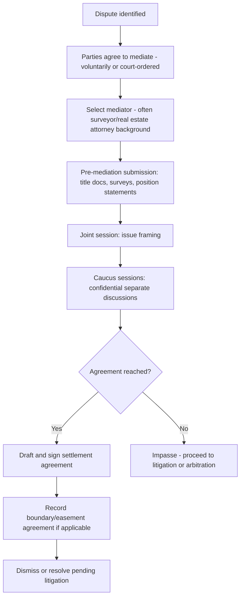

## Alternative Dispute Resolution for Land Conflicts

### Overview and Purpose

Alternative Dispute Resolution (ADR) encompasses processes used to resolve land rights and easement disputes outside of traditional courtroom litigation, including negotiation, mediation, arbitration, and hybrid mechanisms. In the land rights and easement context, ADR is particularly valuable because these disputes often involve **ongoing neighbor or business relationships**, **highly fact-specific and localized issues** (survey data, historical use patterns), and **costs of litigation that can dwarf the value of the disputed strip of land itself** — all factors that favor faster, less adversarial resolution mechanisms.

ADR does not replace the underlying substantive law of easements and land rights; rather, it provides an alternative **forum and process** for applying that law (or for parties to negotiate outcomes independent of a strict legal ruling).

### Spectrum of ADR Mechanisms

| Mechanism | Binding? | Neutral's Role | Typical Use in Land Disputes |
| --- | --- | --- | --- |
| Direct negotiation | Voluntary/contractual once agreed | None (parties or counsel only) | Boundary line agreements, easement scope clarifications |
| Mediation | Non-binding (unless settlement signed) | Facilitates communication, no decision-making authority | Neighbor disputes, family co-ownership conflicts, pre-litigation resolution |
| Early Neutral Evaluation (ENE) | Non-binding | Provides non-binding assessment of likely outcome | Complex title disputes with uncertain merits |
| Arbitration | Binding (with limited judicial review) or non-binding, per agreement | Renders a decision (award) after hearing evidence | Disputes arising under contracts with arbitration clauses (e.g., REAs, development agreements) |
| Med-Arb | Binding after conversion | Mediates first; arbitrates unresolved issues | Complex multi-issue land use/development disputes |
| Judicial settlement conference | Non-binding | Judge or magistrate facilitates settlement | Court-annexed, often mandatory before trial |
| Boundary line agreements (statutory) | Binding once recorded | N/A (direct party agreement, sometimes surveyor-assisted) | Resolving ambiguous or disputed boundary/easement location |

### Why ADR Is Favored in Land Rights Disputes

**Key Points**

- **Relationship preservation** — adjoining landowners typically must continue coexisting after the dispute; adversarial litigation can permanently damage a neighborly or commercial relationship that ADR is more likely to preserve.
- **Technical/local knowledge** — mediators or arbitrators can be selected for subject-matter expertise (surveying, title examination, local land use practice), often producing more informed resolutions than a generalist judge or jury.
- **Cost proportionality** — litigation costs (expert surveys, title searches, publication service, multiple rounds of motions) frequently exceed the economic value of the disputed easement strip, making ADR's relative efficiency especially compelling.
- **Confidentiality** — mediation and arbitration proceedings are generally private, avoiding public record of sensitive family, business, or valuation disputes.
- **Flexibility of remedy** — courts are constrained to legal and equitable remedies; ADR allows creative solutions (e.g., relocation of an easement, cost-sharing arrangements, phased access schedules) that a court might lack authority or inclination to order.

### Mediation in Easement and Boundary Disputes

#### Process Overview

#### Key Characteristics

- **Non-binding** until a settlement agreement is signed; the mediator has no authority to impose a resolution.
- **Confidential** — most states have mediation confidentiality statutes/rules (often modeled on the Uniform Mediation Act) protecting communications made during mediation from later use in litigation, with limited exceptions.
- Frequently **court-ordered** as a prerequisite to trial in jurisdictions with mandatory ADR programs for real property or general civil matters.
- Mediators in land disputes are often chosen for **specialized expertise** — retired judges with real estate experience, licensed surveyors, or real estate attorneys — given the technical nature of boundary and easement evidence.

**Example**

> A dominant estate owner and servient estate owner dispute the exact width of a decades-old prescriptive right-of-way. Rather than litigate a costly quiet title action, they agree to mediation. The mediator, a licensed land surveyor and attorney, reviews both parties' surveys, facilitates a joint site walk, and helps the parties agree to a 12-foot easement (splitting the difference between their competing 10-foot and 15-foot claims), memorialized in a recorded easement agreement.

### Arbitration in Land Rights Disputes

#### When Arbitration Applies

Arbitration in land disputes typically arises from a **pre-existing contractual arbitration clause**, most commonly found in:

- Reciprocal Easement Agreements (REAs) in shopping centers and mixed-use developments
- Purchase and sale agreements with post-closing boundary/easement dispute provisions
- Homeowners' association (HOA) covenants, conditions, and restrictions (CC&Rs)
- Development and construction agreements involving shared access or utility easements
- Party wall agreements

Absent a contractual arbitration clause, parties generally **cannot be compelled** into arbitration for a real property dispute — unlike mediation, which courts can sometimes order as a procedural prerequisite, arbitration fundamentally requires consent (contractual or post-dispute submission agreement).

#### Process and Governing Framework

- Governed by the **Federal Arbitration Act (FAA, 9 U.S.C. §§ 1–16)** where interstate commerce is implicated or the parties have selected FAA governance, or by **state arbitration acts** (many modeled on the Revised Uniform Arbitration Act) for purely intrastate matters.
- Arbitrators render a **binding award**, subject only to narrow grounds for vacatur (e.g., fraud, arbitrator misconduct, exceeding authority) — courts generally will not review the merits of the arbitrator's decision.
- Awards affecting title to real property typically require **confirmation by a court** and recording to be enforceable against the land itself and effective against future purchasers.

**Key Points**

- Arbitration clauses in REAs and CC&Rs should be reviewed carefully for scope — some are broadly worded to cover "any dispute arising under this agreement," while others are narrowly limited to specific categories (e.g., maintenance cost disputes only, excluding title or scope-of-easement questions).
- Because arbitration awards affecting real property require judicial confirmation to bind future purchasers via the public record, purely private arbitration awards should be followed by a consent judgment or confirmed award recorded in the county land records.
- Arbitration is generally **faster** than litigation but is not necessarily cheaper — arbitrator fees, especially for panels of three, can be substantial, and discovery in complex arbitration can approach litigation-level costs.

### Statutory and Administrative Boundary Resolution Mechanisms

Many states provide **specific statutory procedures** short of full litigation for resolving boundary and easement location disputes:

- **Boundary Line Agreements** — a contract between adjoining owners fixing a disputed or uncertain boundary, which, when executed with proper formalities and recorded, is generally treated as conclusive and can itself establish title along the agreed line (distinct from adverse possession, resting instead on contract and acquiescence doctrines).
- **Licensed surveyor determination/certification** — some states allow a licensed surveyor's boundary retracement, when unchallenged within a statutory period, to become presumptively conclusive.
- **Administrative land boards or commissions** — a minority of states/localities maintain boards empowered to resolve certain categories of boundary or right-of-way disputes (e.g., disputes involving public roads, drainage easements, or agricultural land) through an administrative hearing process, with judicial review available thereafter.

### Collaborative Law and Facilitated Negotiation

For lower-conflict disputes (e.g., family co-owned land, amicable neighbor disagreements), **collaborative law** processes — where both parties and their attorneys commit contractually to resolving the dispute without resorting to litigation (and agree the attorneys will withdraw if litigation becomes necessary) — are increasingly used, particularly for:

- Partition of jointly-owned family land
- Easement modifications among family members or long-term neighbors
- Farm and ranch access disputes involving generational relationships

### Comparative Table: Litigation vs. Mediation vs. Arbitration

| Factor | Litigation | Mediation | Arbitration |
| --- | --- | --- | --- |
| Binding outcome | Yes (judgment) | No (unless settled) | Yes (award, narrow review) |
| Typical timeline | Months to years | Weeks to months | Months (faster than litigation, slower than mediation) |
| Cost | Highest (discovery, motions, trial) | Lowest | Moderate (arbitrator fees, some discovery) |
| Precedential/public record | Yes (public filings, published opinions possible) | No (confidential) | Generally private (award may be confirmed publicly) |
| Neutral's authority | Judge/jury decides | Facilitator only, no decision power | Arbitrator decides, binding award |
| Appeal rights | Full appellate review | N/A | Very limited (statutory grounds only) |
| Binds title/third parties | Yes, with proper joinder (quiet title) | Only via signed, recorded agreement | Requires court confirmation to bind title |
| Best suited for | Complex, high-stakes, multi-party title disputes | Ongoing relationships, moderate-stakes disputes | Disputes with pre-existing arbitration clause |

### Drafting Effective ADR Clauses for Easement and Land Agreements

When drafting easement grants, REAs, or CC&Rs, practitioners should consider including a tiered dispute resolution clause addressing:

1. **Negotiation period** — a mandatory good-faith negotiation window (e.g., 30 days) before either party may invoke mediation or arbitration.
2. **Mediation requirement** — mandatory mediation with a named organization or selection mechanism (e.g., AAA, JAMS, or a local ADR provider) before litigation or arbitration may commence.
3. **Scope of arbitration** — clear delineation of which disputes are subject to binding arbitration (e.g., maintenance cost allocation) versus which are carved out for judicial resolution (e.g., fundamental questions of title or easement existence, which some parties prefer to reserve for courts given the in rem/publication tools courts provide).
4. **Governing rules** — designation of applicable arbitration rules (e.g., AAA Commercial Arbitration Rules, or a state-specific real estate arbitration panel).
5. **Cost allocation** — how mediator/arbitrator fees and prevailing-party attorney's fees are allocated.
6. **Survivability and recording** — confirmation that the dispute resolution obligation runs with the land and binds successors, and that any binding resolution affecting title will be reduced to a recordable instrument.

**Example**

> Any dispute arising under this Easement Agreement, including disputes regarding scope, maintenance obligations, or cost allocation, shall first be submitted to non-binding mediation administered by [ADR Provider] within 30 days of written notice. If unresolved after 60 days, either party may submit the dispute to binding arbitration under the [Rules], except that disputes concerning the fundamental existence or validity of the easement shall be reserved for adjudication in a court of competent jurisdiction.

### Illustrative Diagram: Tiered Dispute Resolution Clause Structure

<svg xmlns="http://www.w3.org/2000/svg" viewBox="0 0 640 300">
<text x="320" y="24" text-anchor="middle" font-size="15" font-weight="bold" fill="#1f2937">Tiered ADR Escalation (svg_diagram)</text>
<rect x="40" y="60" width="150" height="60" rx="8" fill="#dcfce7" stroke="#15803d" stroke-width="1.5" />
<text x="115" y="86" text-anchor="middle" font-size="12" fill="#14532b">Tier 1</text>
<text x="115" y="103" text-anchor="middle" font-size="11" fill="#14532b">Good-faith negotiation</text>
<line x1="190" y1="90" x2="245" y2="90" stroke="#374151" stroke-width="1.5" marker-end="url(#arrow4)" />
<rect x="245" y="60" width="150" height="60" rx="8" fill="#fef9c3" stroke="#a16207" stroke-width="1.5" />
<text x="320" y="86" text-anchor="middle" font-size="12" fill="#713f12">Tier 2</text>
<text x="320" y="103" text-anchor="middle" font-size="11" fill="#713f12">Mediation (non-binding)</text>
<line x1="395" y1="90" x2="450" y2="90" stroke="#374151" stroke-width="1.5" marker-end="url(#arrow4)" />
<rect x="450" y="60" width="150" height="60" rx="8" fill="#fee2e2" stroke="#b91c1c" stroke-width="1.5" />
<text x="525" y="86" text-anchor="middle" font-size="12" fill="#7f1d1d">Tier 3</text>
<text x="525" y="103" text-anchor="middle" font-size="11" fill="#7f1d1d">Binding arbitration</text>
<line x1="525" y1="120" x2="525" y2="160" stroke="#374151" stroke-width="1" stroke-dasharray="4,3" />
<rect x="420" y="160" width="210" height="55" rx="8" fill="#f3f4f6" stroke="#374151" stroke-width="1.5" />
<text x="525" y="183" text-anchor="middle" font-size="11" fill="#111827">Carve-out: fundamental title/</text>
<text x="525" y="199" text-anchor="middle" font-size="11" fill="#111827">existence disputes go to court</text>
</svg>

### Limitations of ADR in Land Rights Disputes

**Key Points**

- **In rem effect gap** — mediated or arbitrated resolutions bind only the parties who signed; they do not bind unknown claimants or the world at large the way a properly published quiet title judgment does. If binding effect against future purchasers or unknown parties is needed, litigation (or a confirmed, recorded arbitration award converted to judgment) may still be necessary.
- **No compulsory joinder** — ADR mechanisms lack the procedural tools (service by publication, mandatory joinder rules) available in quiet title litigation to bring all interested parties before the decision-maker.
- **Limited discovery** — arbitration (and especially mediation) typically involves less formal discovery than litigation, which can disadvantage a party needing extensive historical documentation (old deeds, aerial imagery, witness depositions) to prove a prescriptive or implied easement claim.
- **Enforceability of location determinations** — a mediated boundary agreement or arbitration award fixing an easement's location should be properly recorded and, in many states, accompanied by a new survey/plat to ensure it is enforceable and binds successors.
- **Public policy limits** — some jurisdictions restrict arbitrability of pure title questions, treating them as matters reserved for judicial in rem jurisdiction; check state law for such limitations before relying on arbitration to resolve title validity rather than contract performance issues.

### Strategic Considerations for Practitioners

**Key Points**

- Recommend ADR early — before litigation costs accrue — particularly for ongoing-relationship disputes (neighbors, family co-owners, HOA members) where preserving the relationship has independent value.
- Select neutrals with relevant technical expertise (licensed surveyors, real estate-focused mediators/arbitrators) for disputes turning on physical location, historical use, or valuation.
- When drafting easement instruments, REAs, or CC&Rs from the outset, include a tiered ADR clause with a clear carve-out for title/existence disputes if judicial (in rem) resolution may later be needed.
- After a successful mediation or arbitration resolving location or scope, ensure the agreement or award is properly **recorded** with an updated survey/legal description to bind future owners and title insurers.
- Advise clients that ADR does not eliminate the need for a title search and survey — technical due diligence remains essential regardless of the chosen dispute resolution forum.

[Unverified] The scope of arbitrability for real property title disputes, mediation confidentiality protections, and mandatory ADR program rules vary significantly by state; confirm current statutes, court rules, and any applicable arbitration provider rules before advising on a specific matter.

**Related Topics**

- Quiet Title Actions
- Declaratory Judgment Actions
- Boundary Line Agreements and Acquiescence Doctrine
- Reciprocal Easement Agreements (REAs) in Commercial Development
- Federal Arbitration Act and State Arbitration Statutes
- Uniform Mediation Act and Mediation Confidentiality
- Party Wall Agreements and Shared Structure Disputes
- Partition Actions for Jointly-Owned Land
- Homeowners' Association CC&R Dispute Resolution Mechanisms
- Recording Requirements for Settlement and Arbitration Awards Affecting Title