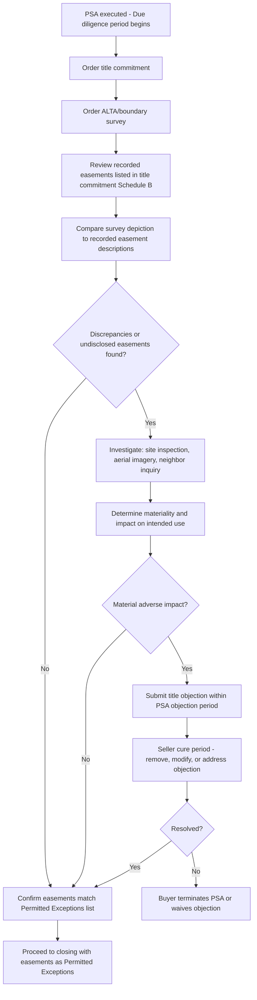

## Easements in Purchase and Sale Agreements

### Overview and Purpose

Purchase and sale agreements (PSAs) for real property must expressly address existing and anticipated easements because easements directly affect the value, usability, and marketability of the property being conveyed. Improper handling of easement disclosure, title review, and allocation of risk in a PSA is one of the most common sources of post-closing litigation in real estate transactions. This topic addresses how easements are identified, disclosed, negotiated, and allocated within the PSA lifecycle — from due diligence through closing.

### Why Easements Matter in a PSA

**Key Points**

- An easement burdening the property (servient estate) can restrict development, limit building footprint, or require the buyer to accommodate ongoing third-party use — directly affecting value and financing.
- An easement benefiting the property (dominant estate) may be essential to the property's usability (e.g., sole access via a right-of-way over a neighboring parcel) — its absence, invalidity, or unenforceability can render the property unusable or unfinanceable.
- Easements are frequently **not obvious from a site visit alone** — recorded but unbuilt utility easements, prescriptive claims, or implied easements may not manifest as any physical feature, making title and survey review essential.
- Lenders typically require clear identification of all easements affecting the collateral as part of the loan underwriting and title insurance process.

### Categories of Easement-Related Issues Addressed in a PSA

| Category | Description | PSA Mechanism |
| --- | --- | --- |
| Disclosed/recorded easements | Existing, recorded easements of record | Listed as "Permitted Exceptions" in title commitment/PSA exhibit |
| Undisclosed/unrecorded easements | Prescriptive, implied, or unrecorded claims discovered during due diligence | Addressed via representations, survey review, and objection procedures |
| New easements required for closing | Easements the buyer needs created (e.g., new utility or access easement) as a condition of closing | Addressed via closing conditions and post-closing covenants |
| Easement termination/release | Easements the buyer wants extinguished before or at closing | Addressed via seller covenants and closing deliverables |
| Reciprocal easement agreements (REAs) | Complex multi-party easements common in shopping centers/mixed-use | Addressed via assignment and estoppel certificate provisions |

### Due Diligence Process for Easements

### Title Review and the "Permitted Exceptions" Mechanism

The PSA typically incorporates a **title commitment** (issued by a title insurance company) listing all matters of record affecting the property in **Schedule B, Part II** (exceptions to coverage), which commonly includes recorded easements. The PSA then generally provides:

1. A **review/objection period** during which the buyer may examine title and survey and object to any exception, including easements, that materially and adversely affects the intended use.
2. A **seller cure obligation** (often limited to certain "must-cure" items like monetary liens, with easements typically falling into a negotiated "may cure" category).
3. A definition of **"Permitted Exceptions"** — the final, agreed list of title matters (including surviving easements) the buyer accepts and takes title subject to.
4. A **buyer's remedy** if unresolved objections remain — typically the right to terminate the PSA and receive a refund of earnest money, or to waive the objection and proceed to closing.

**Example**

> "Permitted Exceptions" shall mean (a) real property taxes not yet due and payable; (b) the Utility Easement recorded as Instrument No. 2015-004521; (c) the Access Easement Agreement recorded as Instrument No. 2018-011203; and (d) any other matters approved or deemed approved by Buyer pursuant to Section 4.2 (Title Review).

### Key PSA Provisions Addressing Easements

#### 1. Representations and Warranties

Sellers typically represent (subject to negotiated knowledge qualifiers and survival periods):

- No easements exist other than those disclosed in the title commitment or a schedule attached to the PSA.
- Seller has not granted, and has no knowledge of, any unrecorded easements, licenses, or rights of use affecting the property.
- Seller is not in default under any recorded easement or REA affecting the property (e.g., maintenance/cost-sharing obligations).
- To Seller's knowledge, no party is asserting a prescriptive or adverse easement claim against the property.

#### 2. Covenants

- Seller covenants not to grant new easements or modify existing ones between execution and closing without buyer's consent.
- Seller covenants to deliver estoppel certificates from counterparties to any REA or shared-easement agreement, confirming no defaults and current obligations (see below).
- In transactions requiring a new easement (e.g., buyer needs an access or utility easement over an adjacent parcel retained by seller or a third party), the PSA includes a covenant to execute and record the new easement instrument at or before closing.

#### 3. Closing Conditions

- Delivery of a title policy with easement-related exceptions limited to Permitted Exceptions.
- Delivery of any new easement agreements, releases, or subordination agreements required as a condition precedent.
- Delivery of estoppel certificates confirming the status of REAs or reciprocal easements.

#### 4. Closing Deliverables

- **Deed** — typically conveys "subject to" the Permitted Exceptions, incorporating surviving easements by reference to their recording information.
- **New/amended easement instruments** — recorded concurrently with or immediately after the deed.
- **Easement releases** — recorded to extinguish an easement being terminated as part of the transaction.
- **Assignment of easement rights** — where the seller holds a dominant estate easement benefiting the property, an express assignment (or confirmation that the easement runs with the land and passes automatically) should be addressed.

### Easement Estoppel Certificates

Where a property is subject to a reciprocal easement agreement (REA) — common in shopping centers, office parks, and mixed-use developments — buyers typically require **estoppel certificates** from each REA party, confirming:

- The REA is in full force and effect, with no unrecorded amendments
- No defaults exist by either party (or, if defaults exist, specifying them)
- The current status of any cost-sharing, common area maintenance (CAM), or reciprocal parking obligations
- Confirmation of the exact scope of easement rights and any restrictions (e.g., use restrictions, exclusivity/radius restrictions tied to the easement)

**Key Points**

- REA estoppels are frequently a **closing condition**, and failure to obtain them from key counterparties (especially anchor tenants in retail developments) can delay or derail closing.
- PSAs should specify a **deemed-approval or "seller certificate" fallback mechanism** if a third party refuses or fails to deliver an estoppel, allowing the seller to certify the same matters to bridge the gap (often with a shorter post-closing survival/indemnity period).

### New Easements as a Condition of the Transaction

Many transactions require creation of a **new easement** as part of the deal structure — for example:

- A **land-locked parcel** being purchased requires a new access easement across the seller's retained land.
- A **subdivided parcel** requires new utility or drainage easements to serve the newly created lot.
- A **build-to-suit or ground lease transaction** requires cross-easements for shared parking, signage, or access between the purchased parcel and retained land.

**Example**

> As a condition to Closing, Seller shall grant and record, concurrently with the Deed, a perpetual, non-exclusive Access and Utility Easement Agreement in the form attached as Exhibit C, granting Buyer and Buyer's successors and assigns the right of ingress, egress, and utility installation over the 30-foot strip depicted on Exhibit D, burdening Seller's Retained Parcel.

In these transactions, the PSA should specify:

- The exact form of easement agreement (often attached as an exhibit and negotiated concurrently with the PSA itself)
- Who bears the cost of drafting, negotiating, and recording the new easement
- Whether the new easement's creation is a condition precedent to closing (allowing termination if it cannot be obtained) or a post-closing covenant
- Coordination with any lender requirements, since a lender financing either the buyer's acquisition or a seller's retained parcel will typically require review and, often, subordination or joinder in the new easement

### Easement Termination/Release as Part of the Transaction

Where a buyer wants to eliminate an existing easement (e.g., an obsolete utility easement, or an old access easement no longer needed following a road relocation), the PSA should address:

- Whether termination/release is a **closing condition** (transaction does not close unless the easement is released) or a **post-closing covenant** (buyer accepts the risk and pursues release after closing, often via a quiet title or negotiated release with the easement holder).
- Identification of **all parties** whose signature/release is required — which may include the original grantee, its successors, or, if the easement benefits multiple lots in a subdivision, potentially all benefited lot owners.
- Title insurance implications — a title company may be unwilling to insure over an unreleased easement, or may require an indemnity, escrow holdback, or affirmative "unreleased easement" endorsement.

### Comparative Table: Easement Risk Allocation Approaches in a PSA

| Approach | Description | When Used |
| --- | --- | --- |
| Accept as Permitted Exception | Buyer takes title subject to the easement as-is | Easement is immaterial or already reflected in purchase price |
| Objection and seller cure | Buyer objects; seller must remove/modify before closing | Easement materially impairs intended use and seller has ability to cure |
| Negotiated price adjustment | Parties adjust purchase price to reflect easement's impact | Easement cannot be removed but buyer proceeds anyway |
| Closing condition (new easement) | Closing conditioned on creation of a needed new easement | Property requires additional access/utility rights to be usable |
| Post-closing covenant/holdback | Seller agrees to pursue resolution after closing, often secured by escrow | Resolution likely but cannot be completed by closing date |
| Title insurance endorsement | Title company insures over the risk (e.g., ALTA 28 series easement endorsements) | Risk is insurable and acceptable to buyer/lender |

### Title Insurance Endorsements Relevant to Easements

Buyers and lenders commonly request specific **ALTA endorsements** addressing easement-related risk, including (naming conventions vary by title insurer and state):

- **Access endorsement** — insures that the property has legal and physical access to a public street, whether via direct frontage or an insured easement.
- **Encroachment endorsement** — insures against loss from encroachments of improvements onto or off of easement areas.
- **Easement endorsements (ALTA 28 series)** — insure specific matters such as no violation of covenants within an easement, or that the easement is appurtenant and insurable as depicted.

[Unverified] Specific endorsement forms, numbering, and availability vary by title insurer and state regulatory approval; confirm current forms with the issuing title company for the specific transaction.

### Illustrative Diagram: Easement Risk Allocation in the PSA Lifecycle

<svg xmlns="http://www.w3.org/2000/svg" viewBox="0 0 640 340">
<text x="320" y="24" text-anchor="middle" font-size="15" font-weight="bold" fill="#1f2937">Easement Handling Across PSA Lifecycle (svg_diagram)</text>
<rect x="20" y="60" width="140" height="55" rx="8" fill="#e0e7ff" stroke="#4338ca" stroke-width="1.5" />
<text x="90" y="83" text-anchor="middle" font-size="11" fill="#312e81">PSA Execution</text>
<text x="90" y="99" text-anchor="middle" font-size="10" fill="#312e81">Initial disclosure schedule</text>
<line x1="160" y1="87" x2="200" y2="87" stroke="#374151" stroke-width="1.5" marker-end="url(#arrow5)" />
<rect x="200" y="60" width="140" height="55" rx="8" fill="#fef9c3" stroke="#a16207" stroke-width="1.5" />
<text x="270" y="83" text-anchor="middle" font-size="11" fill="#713f12">Due Diligence</text>
<text x="270" y="99" text-anchor="middle" font-size="10" fill="#713f12">Title + survey review</text>
<line x1="340" y1="87" x2="380" y2="87" stroke="#374151" stroke-width="1.5" marker-end="url(#arrow5)" />
<rect x="380" y="60" width="140" height="55" rx="8" fill="#fee2e2" stroke="#b91c1c" stroke-width="1.5" />
<text x="450" y="83" text-anchor="middle" font-size="11" fill="#7f1d1d">Objection/Cure</text>
<text x="450" y="99" text-anchor="middle" font-size="10" fill="#7f1d1d">Negotiate Permitted Exceptions</text>
<line x1="450" y1="115" x2="450" y2="150" stroke="#374151" stroke-width="1.5" marker-end="url(#arrow5)" />
<rect x="380" y="150" width="140" height="55" rx="8" fill="#dcfce7" stroke="#15803d" stroke-width="1.5" />
<text x="450" y="173" text-anchor="middle" font-size="11" fill="#14532b">Closing Conditions</text>
<text x="450" y="189" text-anchor="middle" font-size="10" fill="#14532b">New easements, estoppels, releases</text>
<line x1="380" y1="177" x2="200" y2="177" stroke="#374151" stroke-width="1.5" marker-end="url(#arrow5)" />
<rect x="60" y="150" width="140" height="55" rx="8" fill="#dbeafe" stroke="#1d4ed8" stroke-width="1.5" />
<text x="130" y="173" text-anchor="middle" font-size="11" fill="#1e3a8a">Closing</text>
<text x="130" y="189" text-anchor="middle" font-size="10" fill="#1e3a8a">Deed subject to exceptions</text>
<line x1="130" y1="205" x2="130" y2="240" stroke="#374151" stroke-width="1.5" marker-end="url(#arrow5)" />
<rect x="60" y="240" width="140" height="55" rx="8" fill="#f3f4f6" stroke="#374151" stroke-width="1.5" />
<text x="130" y="263" text-anchor="middle" font-size="11" fill="#111827">Post-Closing</text>
<text x="130" y="279" text-anchor="middle" font-size="10" fill="#111827">Recording, title claims, covenants</text>
</svg>

### Post-Closing Risk and Survival Provisions

- **Survival period** — PSA representations regarding easements (e.g., "no undisclosed easements") typically survive closing for a negotiated period (commonly 6–18 months in commercial deals), after which claims are time-barred absent fraud.
- **Indemnification caps and baskets** — post-closing claims related to undisclosed easements are often subject to negotiated caps (maximum liability) and baskets/deductibles (minimum threshold before a claim can be made).
- **Title insurance as primary recourse** — for most easement-related title defects discovered post-closing, the buyer's primary remedy is a claim against the title insurance policy rather than a direct claim against the seller, particularly once survival periods for seller representations have expired.

### Strategic Considerations for Practitioners

**Key Points**

- Order the survey and title commitment **early** in the due diligence period — easement issues often require the longest lead time to resolve (locating and negotiating with third-party easement holders, obtaining estoppels).
- For properties within REAs or shopping center developments, build in **sufficient time** for estoppel certificate collection, as anchor tenants and unrelated third parties often respond slowly and may require multiple follow-ups.
- Where a new easement is a closing condition, negotiate the **form of easement agreement concurrently with the PSA**, not left for later — post-PSA-execution negotiation over new easement terms is a common source of closing delay.
- Confirm whether **lender consent or subordination** is required for any new or modified easement, particularly where either party's parcel is encumbered by an existing mortgage.
- For buyers, request an **access endorsement** whenever the property's legal access depends on an easement rather than direct public road frontage — lenders frequently require this as a condition of financing.
- Address **maintenance and cost-sharing obligations** tied to easements (e.g., shared driveway maintenance) explicitly in the PSA/closing documents to avoid ambiguity about which party bears ongoing costs post-closing.

[Unverified] Specific title objection timelines, survival periods, indemnification structures, and endorsement availability are heavily negotiated and vary by transaction, region, and title insurer; confirm current market practice and applicable state law for the specific deal.

**Related Topics**

- Title Commitments and Schedule B Exceptions
- ALTA/NSPS Land Title Surveys
- Reciprocal Easement Agreements (REAs) in Commercial Development
- Easement Estoppel Certificates: Drafting and Negotiation
- Title Insurance Endorsements for Access and Encroachment Risk
- Deed Drafting: Conveying Subject to Permitted Exceptions
- Post-Closing Indemnification and Survival Provisions
- Easement Creation, Assignment, and Termination Mechanics
- Lender Requirements for Easement Subordination and Joinder
- Land-Locked Parcels and Easement by Necessity in Transactions