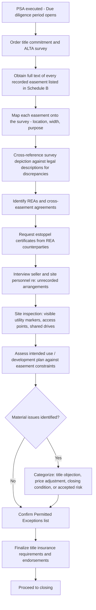

## Easement Due Diligence in Commercial Transactions

### Overview and Purpose

Easement due diligence is the systematic investigation process by which a buyer, lender, or their counsel identifies, verifies, and assesses the impact of all easements affecting a commercial property before closing. Unlike residential transactions, commercial deals typically involve higher-value assets, more complex layered easement structures (utility, access, parking, signage, drainage, cross-easements), multiple stakeholders (anchor tenants, co-owners, municipalities, utility providers), and materially greater consequences if an easement issue surfaces post-closing (lost development rights, financing failures, tenant defaults). This topic covers the structured process, key documents, and analytical framework for commercial easement due diligence.

### Objectives of Easement Due Diligence

**Key Points**

- Confirm the property has **legally sufficient and insurable access**, utilities, and any other rights necessary for its intended use.
- Identify all **burdens** on the property (easements benefiting third parties) and assess their impact on development, expansion, or redevelopment plans.
- Verify all **benefits** the property depends on (easements benefiting the property) are valid, enforceable, properly recorded, and will survive the transaction.
- Confirm **compliance** with any existing REAs, cross-easement agreements, or covenants, including maintenance/cost-sharing obligations and use restrictions.
- Surface any **unrecorded or prescriptive claims** that could cloud title or impair development.

### Core Due Diligence Document Set

| Document | Purpose | Source |
| --- | --- | --- |
| Title commitment (current, updated) | Lists all recorded easements and other exceptions | Title insurance company |
| ALTA/NSPS Land Title Survey | Physically depicts easements, encroachments, and improvements | Licensed surveyor |
| Underlying easement instruments | Full text of each recorded easement (not just the title commitment summary) | County recorder/register of deeds |
| Zoning report / municipal letter | Confirms compliance and identifies public right-of-way dedications | Municipality/zoning consultant |
| Reciprocal Easement Agreements (REAs) | Governs shared access, parking, utilities, signage in multi-parcel developments | Prior transaction records/title company |
| Estoppel certificates | Confirms current status/compliance under REAs and shared easements | Counterparties to the REA |
| Utility company records/letters | Confirms location and capacity of utility easements | Utility providers |
| Environmental Phase I report | May reveal easements related to remediation, monitoring wells, or conservation restrictions | Environmental consultant |
| Prior title policies and exception history | Reveals historical exceptions that may have been removed, added, or modified | Seller/prior title company |

### Due Diligence Process Flow

### Step 1: Title Commitment Analysis

The title commitment's Schedule B, Part II lists recorded exceptions, but commercial due diligence requires going beyond the summary language:

- **Obtain and review the full recorded instrument** for every easement — title commitment summaries are often abbreviated and can omit material scope limitations, maintenance obligations, or termination conditions.
- **Check for superseding or amending instruments** — easements are frequently modified, partially released, or assigned over time; confirm the commitment reflects the current, operative version.
- **Verify the chain of title for the easement itself** — confirm the grantor had authority to grant the easement at the time (i.e., held fee title or a sufficient interest) and that any assignment to current holders is properly recorded.
- **Identify exceptions that are "blanket" or imprecisely located** — older easements (especially utility easements) are sometimes described only by general reference ("an easement for utility purposes over the rear 10 feet") without a precise survey-locatable description, which can complicate development planning.

### Step 2: Survey Review and Reconciliation

The ALTA/NSPS Land Title Survey is the primary tool for translating recorded legal descriptions into physical, mappable reality. Key reconciliation tasks:

1. **Plot every easement from Schedule B onto the survey** and confirm the surveyor has certified its location (Table A Item 19 under current ALTA/NSPS standards addresses easement plotting).
2. **Identify discrepancies** between the recorded legal description and physical evidence of use (e.g., a driveway that has shifted from its originally platted location over time — relevant to practical location/acquiescence doctrines).
3. **Flag encroachments** — improvements (buildings, parking, signage) that extend into an easement area, or easement uses that extend beyond their platted boundaries.
4. **Identify unrecorded but visible evidence of use** — worn paths, utility poles, manholes, or drainage improvements not matched to any recorded instrument, which may indicate prescriptive or unrecorded implied easements.
5. **Confirm access** — verify the property has confirmed legal access to a public right-of-way, whether via direct frontage or an insurable easement, since lenders typically require this as a threshold financing condition.

**Key Points**

- Request **Table A optional survey items** relevant to easements specifically: Item 11 (utility location), Item 13 (names of adjoining owners), Item 19 (easement plotting), and Item 20 (offsite easements benefiting the property, if applicable to access).
- For large or complex commercial sites, consider requesting the surveyor prepare a **separate easement exhibit/matrix** cross-referencing each recorded instrument number to its plotted location, to accompany the standard survey drawing.

### Step 3: Reciprocal Easement Agreement (REA) Review

REAs are especially significant in shopping centers, mixed-use developments, and office parks with shared infrastructure. Due diligence should extract and analyze:

- **Scope of reciprocal rights** — parking, ingress/egress, utility corridors, signage/pylon rights, common area maintenance (CAM) access
- **Cost-sharing formulas** — how maintenance, repair, and CAM costs are allocated among parties, and the property's proportionate share
- **Use restrictions and exclusivity/radius clauses** — REAs in retail developments frequently contain use restrictions (e.g., no competing pharmacy) or exclusivity provisions tied to easement rights that can constrain future leasing
- **Approval rights** — many REAs grant counterparties consent/approval rights over site plan changes, expansions, or new construction within defined areas, which can materially affect redevelopment feasibility
- **Default and termination provisions** — confirm no existing defaults and understand the consequences of a future default (which could affect the seller's or buyer's easement rights)
- **Assignment mechanics** — confirm the REA rights and obligations automatically run with the land or require an express assignment at transfer

**Example**

> Due diligence review of the REA for a shopping center reveals that the anchor tenant holds approval rights over any modification to the shared parking field's layout, and that the property's CAM contribution is calculated as a percentage of total gross leasable area across all REA parcels — both material facts affecting a buyer's redevelopment or outparcel-sale plans.

### Step 4: Estoppel Certificates

Estoppel certificates from REA counterparties, adjacent easement holders, or co-tenants confirm the current factual status of easement-related obligations and protect the buyer against later claims inconsistent with the certified facts. Key content to request:

- Confirmation the governing instrument (REA, easement agreement) is unmodified except as disclosed
- No known defaults by either party
- Current CAM/cost-sharing figures and payment status
- Confirmation of any pending disputes, notices, or claims
- Confirmation of the precise scope of easement rights as understood by the certifying party (useful where instrument language is ambiguous)

**Key Points**

- Estoppels should be dated as close to closing as practicable; stale estoppels (issued early in a long due diligence period) may not reflect intervening defaults or disputes.
- Where a counterparty refuses to issue an estoppel, negotiate a **seller-certified estoppel** as a fallback, often paired with a post-closing indemnity or shortened survival period specific to that item.

### Step 5: Municipal and Utility Verification

- **Zoning/municipal compliance letters** — confirm whether any easements correspond to required public dedications (e.g., road right-of-way, sidewalk, or drainage easements mandated by site plan approval) and whether the property remains in compliance.
- **Utility provider confirmation** — request letters or as-built records from electric, gas, water/sewer, and telecom providers confirming the location, capacity, and any unrecorded utility arrangements serving the site — unrecorded utility easements are common, particularly for older infrastructure installed under informal permission.
- **Public right-of-way encroachment check** — confirm no improvements (signage, canopies, parking) encroach into a public right-of-way, which is treated differently from private easement encroachment and often subject to revocable permit regimes rather than durable property rights.

### Step 6: Development and Use Impact Analysis

Commercial due diligence must translate easement findings into **development feasibility analysis**:

| Easement Impact Category | Analysis Focus |
| --- | --- |
| Buildable area reduction | Does the easement corridor reduce usable/buildable square footage below what is needed for the planned improvement? |
| Setback/height interaction | Does the easement interact with zoning setbacks to create a further-restricted building envelope? |
| Access/circulation constraints | Does a shared access or parking easement limit the buyer's ability to redesign site circulation or add curb cuts? |
| Utility corridor conflicts | Do utility easements conflict with planned foundation, underground parking, or landscaping locations? |
| Expansion/outparcel restrictions | Do REA approval rights or use restrictions limit future outparcel development or tenant mix flexibility? |
| Signage/visibility rights | Do reciprocal signage easements affect the buyer's branding or pylon sign plans? |

**Example**

> A buyer planning a 40,000-square-foot expansion discovers during due diligence that a 25-foot drainage easement bisects the only feasible expansion footprint. The buyer negotiates with the seller to either relocate the easement (requiring the utility/drainage authority's consent and a recorded relocation agreement) as a closing condition, or adjusts the purchase price to reflect the reduced developable area.

### Illustrative Diagram: Layered Easement Analysis on a Commercial Site

<svg xmlns="http://www.w3.org/2000/svg" viewBox="0 0 640 320">
<text x="320" y="24" text-anchor="middle" font-size="15" font-weight="bold" fill="#1f2937">Layered Commercial Easement Review (svg_diagram)</text>
<rect x="60" y="55" width="520" height="230" fill="#f9fafb" stroke="#9ca3af" stroke-width="1.5" />
<text x="320" y="75" text-anchor="middle" font-size="11" fill="#374151">Subject Parcel</text>
<rect x="90" y="90" width="460" height="30" fill="#bfdbfe" stroke="#1d4ed8" stroke-width="1" />
<text x="320" y="110" text-anchor="middle" font-size="10" fill="#1e3a8a">Utility Easement (recorded, 20ft)</text>
<rect x="90" y="130" width="200" height="60" fill="#fde68a" stroke="#a16207" stroke-width="1" />
<text x="190" y="155" text-anchor="middle" font-size="10" fill="#713f12">Shared Access</text>
<text x="190" y="170" text-anchor="middle" font-size="10" fill="#713f12">Easement (REA)</text>
<rect x="340" y="130" width="210" height="60" fill="#fecaca" stroke="#b91c1c" stroke-width="1" />
<text x="445" y="155" text-anchor="middle" font-size="10" fill="#7f1d1d">Drainage Easement</text>
<text x="445" y="170" text-anchor="middle" font-size="10" fill="#7f1d1d">(unrecorded evidence found)</text>
<rect x="90" y="200" width="460" height="60" fill="#bbf7d0" stroke="#15803d" stroke-width="1" />
<text x="320" y="225" text-anchor="middle" font-size="10" fill="#14532b">Remaining Developable Area</text>
<text x="320" y="242" text-anchor="middle" font-size="10" fill="#14532b">(after easement/setback overlay)</text>

<text x="320" y="305" text-anchor="middle" font-size="11" fill="`#374151`">Each layer verified against title, survey, REA, and utility records</text>

</svg>

### Environmental and Conservation Easement Overlaps

Commercial due diligence should also confirm whether any **conservation easements**, **remediation/monitoring easements**, or **environmental deed restrictions** affect the property, particularly for former industrial sites:

- Conservation easements permanently restrict development within their area and typically run with the land in perpetuity, often held by a land trust or governmental conservation authority.
- Environmental remediation easements (granting access for ongoing groundwater monitoring, vapor mitigation systems, or capped contamination areas) can impose significant restrictions and ongoing third-party access rights.
- These easements are sometimes recorded outside the standard chain of title review scope (e.g., filed with an environmental agency rather than solely the county recorder), requiring coordination between real estate and environmental counsel.

### Lender-Driven Due Diligence Requirements

Commercial lenders typically impose additional easement-related requirements beyond what a cash buyer might independently pursue:

- **Access endorsement** to the loan policy confirming insurable access via public road or insured easement
- **Survey certification** naming the lender and confirming no encroachments affecting the collateral's value
- **Subordination, Non-Disturbance, and Attornment (SNDA)** style confirmations where REAs affect tenant operations
- **Zoning endorsement** cross-referencing easement locations against required setbacks and parking ratios

### Comparative Table: Residential vs. Commercial Easement Due Diligence

| Factor | Residential | Commercial |
| --- | --- | --- |
| Typical easement complexity | Single utility/access easement | Multiple layered easements, REAs, cross-easements |
| Survey standard | Often a simple boundary survey or none | ALTA/NSPS survey standard, multiple Table A items |
| Estoppel certificates | Rarely required | Frequently required (REA counterparties, co-tenants) |
| Development impact analysis | Minimal | Central to feasibility and underwriting |
| Lender requirements | Basic title insurance | Extensive endorsements, SNDA, zoning reports |
| Environmental easement overlap | Uncommon | Common on industrial/former industrial sites |

### Strategic Considerations for Practitioners

**Key Points**

- Build a **due diligence matrix/tracker** cross-referencing every recorded easement instrument number against its survey location, purpose, and impact assessment — critical for larger sites with numerous overlapping instruments.
- Request the **full recorded text**, not just title commitment summaries, for every easement — summary descriptions frequently omit maintenance obligations, use restrictions, or termination triggers material to the analysis.
- Engage **environmental counsel** early when the site has industrial history, since remediation/monitoring easements may not surface through a standard title/survey process alone.
- Coordinate **survey Table A item selection** with the transaction's specific risk profile — omitting Item 19 (easement plotting) or Item 11 (utility location) on a complex commercial site can leave material easement risks unmapped.
- For REA-encumbered properties, begin the **estoppel certificate request process immediately** upon PSA execution, as counterparties (especially large anchor tenants) often have slow, multi-department internal approval processes.
- Translate every material easement finding into a **quantifiable development impact** (buildable area lost, redesign cost, approval risk) to support informed objection, pricing, or closing-condition negotiation decisions.

[Unverified] Specific ALTA/NSPS Table A item numbering, survey standards, and lender endorsement requirements are periodically updated and vary by title insurer and jurisdiction; confirm current standards and forms applicable to the specific transaction.

**Related Topics**

- Easements in Purchase and Sale Agreements
- ALTA/NSPS Land Title Surveys and Table A Items
- Reciprocal Easement Agreements (REAs) in Commercial Development
- Title Insurance Endorsements for Access and Encroachment Risk
- Conservation and Environmental Remediation Easements
- Estoppel Certificates: Drafting and Negotiation
- Lender Due Diligence and SNDA Requirements
- Development Feasibility Analysis and Easement Impact
- Utility Easement Verification and Provider Coordination
- Encroachment Disputes and the Relative Hardship Doctrine