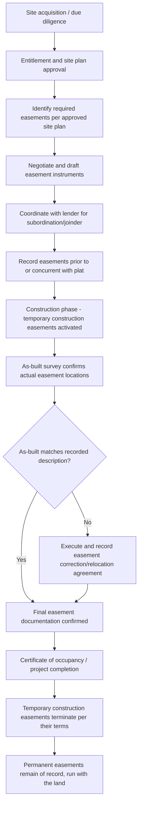

## Easements in Development and Construction Projects

### Overview and Purpose

Development and construction projects generate a distinct set of easement issues compared to standard acquisition transactions, because the developer is not merely accepting existing easements but actively **creating, relocating, subordinating, and coordinating** easements as part of horizontal and vertical construction. This spans raw land development, subdivision platting, infrastructure installation, phased mixed-use projects, and construction financing. Easement planning errors at the development stage tend to be far costlier to correct than at a simple resale transaction, since they can halt vertical construction, trigger lender defaults, or require costly relocation of installed infrastructure.

### Categories of Easements Arising in Development Projects

| Category | Purpose | Typical Grantee/Beneficiary |
| --- | --- | --- |
| Utility easements | Electric, gas, water, sewer, telecom infrastructure | Utility companies/municipalities |
| Access/ingress-egress easements | Roadway, driveway, and pedestrian connectivity between parcels or to public roads | Adjacent parcels, outparcels, public |
| Drainage/stormwater easements | Detention, retention, and conveyance of stormwater per site plan requirements | Municipality, downstream owners |
| Construction/temporary easements | Staging, crane swing, shoring, scaffolding access during construction | Contractor, adjacent developer |
| Cross-easements | Shared parking, signage, access among parcels within a single master development | Co-developers, outparcel owners |
| Conservation/open space easements | Permanent preservation required by zoning or environmental approval | Land trust, municipality, agency |
| Easements for shared facilities | Detention ponds, lift stations, clubhouse access, shared walls | HOA, master association, adjacent owners |

### The Development Easement Lifecycle

### Easements Required at the Entitlement Stage

Municipal approval processes (site plan review, subdivision approval, planned unit development (PUD) approval) frequently **mandate** specific easements as a condition of approval:

- **Public right-of-way dedications** — required road frontage, sidewalk, and utility strip dedications to the municipality.
- **Stormwater/drainage easements** — required to accommodate detention/retention facilities and conveyance systems sized per municipal stormwater ordinances.
- **Utility easements to serving utilities** — standard-form easements required by the local electric, gas, water, and sewer providers as a precondition to service connection, often using the utility's own template agreement.
- **Sidewalk/pedestrian access easements** — increasingly required under complete-streets and walkability ordinances, particularly in mixed-use and urban infill projects.
- **Emergency/fire access easements** — required by fire marshal review to ensure adequate turning radius and access for emergency vehicles, sometimes overlapping with or distinct from general access easements.

**Key Points**

- Entitlement-driven easements are typically **non-negotiable** as to their existence (the project cannot receive approval without them) but the **precise location, width, and design** are often subject to negotiation with the reviewing agency during plan review.
- Developers should confirm whether required easements must be recorded **before** plat approval/recording, or may be recorded concurrently — sequencing errors can delay closing on construction financing.

### Subdivision Plats and Easement Creation

In platted subdivisions, easements are frequently created **by the plat itself** rather than through a separate recorded instrument:

- Most subdivision statutes allow utility, drainage, and access easements to be depicted directly on the recorded plat, with plat recordation serving as the operative act of creation (no separate grant deed required).
- Plat-created easements typically run in favor of the **public generally** (for right-of-way dedications) or specifically named utility providers, and automatically burden each lot as conveyed by reference to the plat.
- Developers should distinguish between **dedicated** easements (offered to and accepted by the public/municipality, and thus binding regardless of individual lot owner consent) and **reserved** easements (retained by the developer/declarant for future use, common in master-planned communities where the developer reserves rights to install future utility or access infrastructure across lots not yet sold).

**Example**

> The recorded Plat of Sunset Ridge Subdivision depicts a 10-foot utility easement along the rear lot line of each lot, labeled "10' U.E.," together with a note stating: "All utility easements shown hereon are dedicated to the perpetual use of the applicable utility providers for installation and maintenance of utility infrastructure." This plat language, once recorded, creates the easement without need for a separate instrument from each lot owner.

### Temporary Construction Easements (TCEs)

Construction activity frequently requires access onto adjacent parcels not otherwise burdened by a permanent easement — for staging, equipment access, crane swing radius, shoring, or temporary utility connections. These are documented via **Temporary Construction Easements (TCEs)**, which should specify:

1. **Defined term** — a fixed expiration date or the earlier of a stated date and substantial completion/certificate of occupancy, since TCEs are inherently time-limited and should not survive indefinitely.
2. **Precise scope of permitted activity** — staging, material storage, equipment operation, temporary fencing, dewatering, or specific construction methods (e.g., tieback/anchor installation beneath an adjacent property).
3. **Restoration obligations** — an affirmative covenant to restore the burdened property to its pre-construction condition (or better) upon termination, often backed by a bond or security deposit.
4. **Insurance and indemnification** — the developer/contractor typically indemnifies the adjacent owner and carries specified liability coverage naming the adjacent owner as an additional insured for the TCE term.
5. **Coordination/notice provisions** — advance notice requirements before entry, and coordination protocols to minimize disruption to the adjacent owner's ongoing operations.

**Key Points**

- TCEs should be recorded (or at minimum, referenced in a memorandum recorded against title) to bind successors if the adjacent property changes ownership during the construction period.
- Because TCEs are self-terminating by their own terms, best practice includes recording a **termination/release** or a sunset provision that self-executes without requiring further action, to avoid a stale TCE clouding the adjacent title indefinitely.

### Underground Encroachment and Support Easements

Vertical construction on urban infill or tightly-bounded sites frequently requires easements addressing:

- **Subterranean encroachment easements** — permitting foundation elements (tiebacks, caissons, underpinning) to extend beneath an adjacent parcel where site constraints require it.
- **Lateral and subjacent support easements** — addressing the mutual right to support between adjacent buildings, particularly relevant where excavation on one parcel could affect the structural stability of an adjacent building's foundation.
- **Party wall agreements** — governing shared walls between attached buildings, addressing construction, maintenance, cost-sharing, and modification rights (functionally related to but often treated as a distinct instrument from a standard easement).
- **Crane swing and hoisting easements** — temporary easements permitting a construction crane's boom to swing over adjacent airspace during specified hours, common in dense urban development.

**Example**

> Developer requires a permanent subterranean easement extending 3 feet beneath the adjacent parcel's surface to accommodate tieback anchors supporting the shoring wall for a below-grade parking structure. The easement agreement specifies the anchors will be de-tensioned and, where feasible, removed or abandoned in place upon completion, with Developer retaining responsibility for any future structural issues attributable to the anchors.

### Coordination with Construction Lenders

Construction financing introduces additional easement-related requirements:

- **Subordination of existing easements** — where a permanent easement (e.g., pre-existing access or utility easement) predates the construction loan, the lender may require the easement holder to subordinate, or may accept the easement as a permitted title exception if subordination is unavailable.
- **Lender joinder in new easements** — where new easements are being created and the developer's parcel is already encumbered by a construction loan deed of trust/mortgage, the lender typically must join in or consent to the new easement grant to ensure it is not extinguished by a future foreclosure.
- **Draw schedule coordination** — utility easement recordation is frequently a condition precedent to specific construction draws (e.g., utility service connection draws), requiring the developer to sequence easement recording ahead of the applicable draw request.
- **Title insurance date-down requirements** — lenders typically require an updated title date-down at each draw or milestone, confirming no new unpermitted easements or encumbrances have been recorded against the collateral.

### Master-Planned Community and Multi-Phase Development Easements

For multi-phase or master-planned developments, easement planning must account for **future phases not yet constructed**:

- **Blanket/floating easements** — some development declarations grant the developer a "floating" easement right over undeveloped portions of the property for future utility or access infrastructure, with the exact location to be fixed by a subsequent recorded instrument or as-built survey once installed.
- **Declarant reservation rights** — master declarations for planned communities commonly reserve broad easement rights to the developer/declarant for construction access, model home operations, sales office access, and infrastructure installation across all phases, including phases already sold to individual lot owners.
- **Phased cross-easement activation** — cross-easements for shared amenities (clubhouse, shared parking structures) are often drafted to activate incrementally as each phase is completed and conveyed, requiring careful drafting to avoid triggering obligations before the relevant infrastructure exists.

**Key Points**

- Floating easements should be converted to **fixed, surveyed easements** as soon as the actual utility/infrastructure location is finalized — a floating easement left unconverted can create title uncertainty for individual lot buyers and complicate their future financing or resale.
- Declarant reservation rights should have a clear **expiration mechanism** (e.g., upon sale of the last lot, or a stated outside date) to avoid perpetual uncertainty for homeowners regarding the developer's ongoing access rights.

### As-Built Reconciliation and Easement Correction

Construction rarely proceeds in exact accordance with pre-construction plans; utility lines, in particular, are frequently installed in locations that deviate from the originally platted or recorded easement corridor. Post-construction due diligence and correction should address:

1. **As-built survey** — prepared after installation to document actual utility and infrastructure locations.
2. **Comparison against recorded easements** — identifying any installed infrastructure located outside its platted/recorded easement boundary.
3. **Corrective easement or relocation agreement** — where discrepancies exist, the parties execute and record a correction instrument realigning the legal description to match as-built conditions, or, less commonly, physically relocate the infrastructure to match the recorded easement.
4. **Coordination with all affected parties** — correction instruments often require signatures from the utility provider, adjacent lot owners (if infrastructure crosses into neighboring lots), and any mortgagee with a recorded lien.

### Illustrative Diagram: Development-Stage Easement Coordination

<svg xmlns="http://www.w3.org/2000/svg" viewBox="0 0 640 320">
<text x="320" y="24" text-anchor="middle" font-size="15" font-weight="bold" fill="#1f2937">Development Easement Coordination Map (svg_diagram)</text>
<rect x="240" y="50" width="160" height="50" rx="8" fill="#e0e7ff" stroke="#4338ca" stroke-width="1.5" />
<text x="320" y="80" text-anchor="middle" font-size="12" fill="#312e81">Site Plan Approval</text>
<line x1="320" y1="100" x2="320" y2="130" stroke="#374151" stroke-width="1.5" marker-end="url(#arrow6)" />
<rect x="80" y="130" width="140" height="50" rx="8" fill="#fef9c3" stroke="#a16207" stroke-width="1.5" />
<text x="150" y="160" text-anchor="middle" font-size="11" fill="#713f12">Utility Easements</text>
<rect x="250" y="130" width="140" height="50" rx="8" fill="#fee2e2" stroke="#b91c1c" stroke-width="1.5" />
<text x="320" y="160" text-anchor="middle" font-size="11" fill="#7f1d1d">Drainage Easements</text>
<rect x="420" y="130" width="140" height="50" rx="8" fill="#dcfce7" stroke="#15803d" stroke-width="1.5" />
<text x="490" y="160" text-anchor="middle" font-size="11" fill="#14532b">Access/TCEs</text>
<line x1="150" y1="180" x2="280" y2="220" stroke="#374151" stroke-width="1" marker-end="url(#arrow6)" />
<line x1="320" y1="180" x2="320" y2="220" stroke="#374151" stroke-width="1" marker-end="url(#arrow6)" />
<line x1="490" y1="180" x2="360" y2="220" stroke="#374151" stroke-width="1" marker-end="url(#arrow6)" />
<rect x="230" y="220" width="180" height="50" rx="8" fill="#dbeafe" stroke="#1d4ed8" stroke-width="1.5" />
<text x="320" y="242" text-anchor="middle" font-size="11" fill="#1e3a8a">Lender Joinder /</text>
<text x="320" y="258" text-anchor="middle" font-size="11" fill="#1e3a8a">Subordination</text>
<line x1="320" y1="270" x2="320" y2="295" stroke="#374151" stroke-width="1.5" marker-end="url(#arrow6)" />
<rect x="220" y="295" width="200" height="20" rx="4" fill="#f3f4f6" stroke="#374151" stroke-width="1" />
<text x="320" y="309" text-anchor="middle" font-size="10" fill="#111827">As-Built Reconciliation</text>
</svg>

### Comparative Table: Permanent vs. Temporary Development Easements

| Feature | Permanent Easement | Temporary Construction Easement |
| --- | --- | --- |
| Duration | Perpetual (typically) | Fixed term or milestone-based |
| Recording | Always recorded | Recorded or memorandum recorded |
| Survives construction completion | Yes | No — terminates per its terms |
| Common examples | Utility, access, drainage | Staging, crane swing, shoring access |
| Restoration obligation | Not typically applicable | Standard requirement |
| Insurance/indemnity emphasis | Lower (ongoing use) | Higher (active construction risk) |
| Runs with the land | Yes | Generally not intended to (self-terminating) |

### Risk Areas Specific to Development Projects

**Key Points**

- **Sequencing risk** — recording easements out of order relative to plat recordation, lender closing, or construction commencement can create gaps in title or delay financing.
- **Scope creep** — construction activity exceeding the defined scope of a TCE (e.g., staging materials outside the agreed boundary) exposes the developer to trespass claims from the adjacent owner, independent of any construction defect liability.
- **Utility relocation cost disputes** — where as-built utility locations deviate from platted easements, cost responsibility for relocation or correction (developer vs. utility provider vs. future lot owner) should be addressed in the original utility agreement to avoid post-construction disputes.
- **Successor lot owner disputes** — individual lot buyers in a subdivision are often unaware of declarant-reserved or floating easement rights; inadequate disclosure at the point of sale can generate consumer-protection or non-disclosure claims against the developer/declarant.
- **Environmental/conservation easement conflicts** — construction staging or grading that inadvertently encroaches into a permanently protected conservation easement area can trigger significant regulatory and third-party enforcement exposure, including under federal or state conservation easement enforcement statutes.

### Strategic Considerations for Practitioners

**Key Points**

- Map all required and anticipated easements **at the entitlement stage**, before finalizing the site plan, to avoid late-stage redesign when an agency or utility mandates an easement location that conflicts with planned building footprint.
- Draft TCEs with **precise term limits and automatic termination mechanics** to avoid stale temporary rights clouding adjacent title after construction completes.
- Coordinate easement recording sequencing explicitly with **construction lender counsel**, since draw conditions frequently hinge on specific easements being recorded and insured.
- For master-planned communities, build a **conversion mechanism** from floating/blanket declarant easement rights to fixed, surveyed easements as each phase's infrastructure is finalized.
- Commission an **as-built survey** promptly after infrastructure installation and reconcile against recorded easements before the certificate of occupancy is issued, when correction is administratively and practically easiest.
- For underground encroachment and support easements on tight urban sites, engage a structural engineer alongside real estate counsel to ensure the easement's technical scope (anchor depth, load parameters) matches the recorded legal description.

[Unverified] Specific municipal entitlement requirements, plat-based easement creation rules, and construction lender practices vary significantly by jurisdiction and by lender; confirm current local subdivision regulations and lender requirements for the specific project.

**Related Topics**

- Easement Due Diligence in Commercial Transactions
- Subdivision Plats and Dedication of Public Rights-of-Way
- Reciprocal Easement Agreements (REAs) in Commercial Development
- Party Wall Agreements and Shared Structure Disputes
- Conservation and Environmental Remediation Easements
- Construction Lender Requirements and Draw Schedule Coordination
- Master Declarations and Declarant Reservation Rights
- Lateral and Subjacent Support Rights in Urban Construction
- Easement Creation, Assignment, and Termination Mechanics
- As-Built Survey Reconciliation and Corrective Instruments