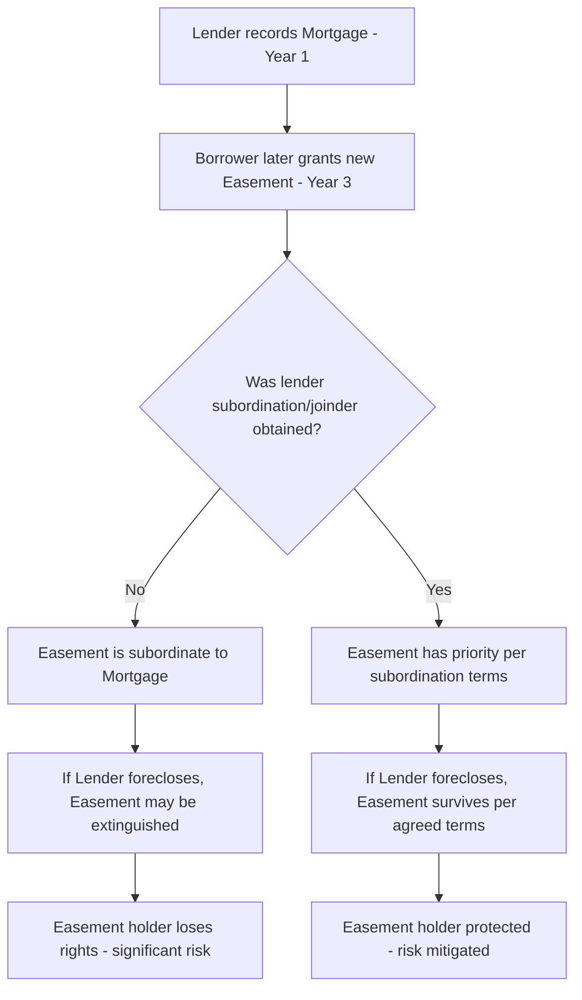

## Lender Considerations and Easement Subordination

### Overview and Purpose

Lender considerations regarding easements address how mortgage and deed-of-trust lenders evaluate, negotiate, and secure their collateral position when easements affect a property — whether the borrower's property is burdened by (servient to) an easement, benefits from (dominant to) an easement, or requires a new easement as part of the financed project. Easement subordination is the specific mechanism by which priority between a lender's lien and an easement is negotiated and documented. Because lien priority determines what happens to an easement (or a mortgage) in foreclosure, subordination analysis is central to both loan underwriting and title insurance in any transaction involving easements.

### Why Lien Priority Matters for Easements

**Key Points**

- Under the general "first in time, first in right" priority rule, an interest recorded **before** a mortgage generally has priority over that mortgage and would **survive foreclosure**; an interest recorded **after** the mortgage is generally **subordinate** and can be extinguished by foreclosure of the senior lien unless the parties agree otherwise.
- A lender financing a servient estate wants to confirm whether a pre-existing easement will survive its foreclosure (as a permitted encumbrance it must accept) or can be eliminated (increasing collateral value/flexibility).
- A lender financing a dominant estate wants confirmation that the easement the borrower relies on for access or utilities will **survive** any foreclosure of the servient estate's own financing — otherwise the borrower's collateral could lose legally required access if the servient lender forecloses.
- New easements created **after** a mortgage is recorded are, absent lender subordination or joinder, generally subordinate to that mortgage and vulnerable to extinguishment upon the lender's foreclosure — a significant risk where the new easement is essential to the property's use (e.g., a newly granted access easement).

### The Subordination Problem Illustrated

### Common Lender-Easement Scenarios

| Scenario | Lender Concern | Typical Resolution |
| --- | --- | --- |
| Pre-existing easement burdens the collateral (servient) | Confirm insurability and impact on collateral value | Accept as Permitted Exception; require title insurance |
| Pre-existing easement benefits the collateral (dominant) | Confirm the easement will survive if servient property is separately financed and foreclosed | Require non-disturbance agreement or confirm priority |
| New easement to be granted post-closing | New easement may be subordinate to the mortgage, creating risk for the grantee | Lender executes subordination/joinder agreement |
| New easement required for the financed project itself | Lender needs assurance the easement won't be stripped by its own future foreclosure | Lender joins in the grant, or a subordination is unnecessary since lender is a party |
| Existing mortgage on adjacent parcel affects a needed cross-easement | Cross-easement's survivability depends on the adjacent lender's cooperation | Negotiate subordination/non-disturbance with adjacent lender |
| REA rights intertwined with multiple mortgaged parcels | Complex multi-party priority web across a shopping center/mixed-use project | Master subordination, non-disturbance, and attornment (SNDA) framework |

### Subordination Agreements — Structure and Key Terms

A **subordination agreement** is executed by the lender (or lienholder) whose interest would otherwise have priority, agreeing that a specified easement (or other interest) will have priority over the lender's lien, notwithstanding the mortgage's earlier recording date. Key provisions typically include:

1. **Identification of the subordinated lien** — precise reference to the mortgage/deed of trust by recording information.
2. **Identification of the easement being elevated** — precise reference to the easement instrument, or the agreement may be executed concurrently with and incorporated into the easement grant itself.
3. **Scope of subordination** — whether the lender subordinates as to the **entire** mortgage lien or only as to the specific easement area/rights (a full subordination is broader and riskier for the lender than a limited, area-specific subordination).
4. **Recording** — the subordination agreement must be recorded to provide constructive notice of the altered priority to future parties, including subsequent purchasers of the mortgage/note.
5. **Lender's continuing rights** — confirmation that, apart from the specific subordinated easement rights, the lender's lien otherwise retains its original priority and all other loan documents remain in full force.

**Example**

> Lender, as holder of that certain Deed of Trust recorded as Instrument No. 2020-008812, hereby subordinates its lien, solely as to the 20-foot Utility Easement Area described in Exhibit A, to the Utility Easement Agreement recorded concurrently herewith, such that the Utility Easement shall survive and remain unaffected by any foreclosure or trustee's sale under the Deed of Trust, notwithstanding the Deed of Trust's earlier recording date.

### Non-Disturbance Agreements

Related to, but distinct from, a full subordination, a **non-disturbance agreement** provides that even though the lender's lien retains priority, the lender agrees **not to disturb** or extinguish the easement (or other subordinate right) if the lender forecloses — effectively achieving similar practical protection for the easement holder without a full priority-flip.

**Key Points**

- Non-disturbance agreements are common where a lender is unwilling to grant full subordination (which could affect the marketability of its loan to secondary market purchasers or rating agencies) but is willing to make a narrower, more targeted commitment not to terminate a specific easement in foreclosure.
- Frequently seen in the REA context, structured similarly to (and sometimes combined with) Subordination, Non-Disturbance, and Attornment (SNDA) agreements more commonly associated with commercial leases, but adapted to protect reciprocal easement rights among shopping center or mixed-use parcels with separate financing.

### Lender Joinder vs. Subordination

Two related but distinct mechanisms address lender cooperation with new easements:

| Mechanism | When Used | Effect |
| --- | --- | --- |
| **Lender joinder** | New easement being created on property already encumbered by an existing mortgage | Lender signs the easement instrument itself as a joining party, confirming the mortgage is made expressly subject to the easement from inception — avoids a separate subordination step |
| **Subordination agreement** | Easement already exists or is being created independently; lender's lien predates or would otherwise have priority | Lender executes a separate document altering priority between the pre-existing lien and the (new or existing) easement |
| **Estoppel/confirmation** | Lender's existing loan already covers a scenario where priority is not in question | Lender simply confirms understanding/status without altering legal priority |

**Key Points**

- Joinder is generally simpler and more commonly used when the easement is being created **concurrently** with the transaction and the lender is a known, cooperative party to the closing (e.g., a construction lender financing the very project that requires the new easement).
- A separate subordination agreement becomes necessary when the mortgage **already exists** and the easement is a **later, distinct transaction** — for example, a servient property owner refinances years after granting an easement, and the new refinance lender is asked to subordinate to the pre-existing easement to preserve its priority position (relevant where the easement was itself junior to a prior, now-refinanced loan and the parties want to preserve the easement's original priority through the refinance).

### Title Insurance Interaction with Subordination

- Title insurers evaluate lien and easement priority when issuing both **owner's** and **lender's (loan) policies** — an unresolved subordination issue can result in the title company taking an exception for the risk rather than insuring over it.
- Lenders typically require the title policy to affirmatively insure that **specified easements have the priority the transaction contemplates** (e.g., insuring that a newly granted access easement is not subject to a prior, unsubordinated mortgage) — this is often achieved through specific endorsements rather than relying solely on the underlying legal documents.
- Where subordination cannot be obtained from a senior lienholder, the parties may instead seek a **title insurance endorsement** insuring the easement's practical usability despite the technical priority gap, though this shifts risk to the title insurer rather than eliminating the underlying legal exposure — some title insurers will decline to insure over an unresolved priority gap for a truly essential access or utility easement.

### Foreclosure Consequences When Subordination Is Absent

If a junior (subordinate) easement is not protected by a subordination or non-disturbance agreement and the senior lender forecloses:

- The foreclosing lender (or the foreclosure sale purchaser) generally takes title **free of** the subordinate easement, which is extinguished as a matter of lien priority law.
- The easement holder's recourse is typically limited — they may have a claim against the grantor for breach of covenants of title (if applicable) but generally cannot enforce the easement against the foreclosure purchaser.
- This risk is particularly acute for **access and utility easements essential to a property's usability** — an unsubordinated access easement holder could find their property landlocked if the servient property's senior lender forecloses and the purchaser refuses to honor the (legally extinguished) easement.

[Inference: some jurisdictions apply doctrines (e.g., easement by necessity re-arising, or equitable estoppel against a foreclosure purchaser with actual knowledge) that may provide limited relief even absent formal subordination, but these are fact-specific and not a reliable substitute for obtaining proper subordination — confirm controlling law in the relevant jurisdiction.]

### Illustrative Diagram: Subordination vs. Non-Disturbance vs. Joinder

<svg xmlns="http://www.w3.org/2000/svg" viewBox="0 0 640 340">
<text x="320" y="24" text-anchor="middle" font-size="15" font-weight="bold" fill="#1f2937">Lender Cooperation Mechanisms (svg_diagram)</text>
<rect x="30" y="60" width="180" height="90" rx="8" fill="#e0e7ff" stroke="#4338ca" stroke-width="1.5" />
<text x="120" y="85" text-anchor="middle" font-size="12" fill="#312e81">Subordination</text>
<text x="120" y="105" text-anchor="middle" font-size="10" fill="#312e81">Priority formally</text>
<text x="120" y="119" text-anchor="middle" font-size="10" fill="#312e81">reordered; easement</text>
<text x="120" y="133" text-anchor="middle" font-size="10" fill="#312e81">elevated above lien</text>
<rect x="230" y="60" width="180" height="90" rx="8" fill="#fef9c3" stroke="#a16207" stroke-width="1.5" />
<text x="320" y="85" text-anchor="middle" font-size="12" fill="#713f12">Non-Disturbance</text>
<text x="320" y="105" text-anchor="middle" font-size="10" fill="#713f12">Priority unchanged;</text>
<text x="320" y="119" text-anchor="middle" font-size="10" fill="#713f12">lender covenants not</text>
<text x="320" y="133" text-anchor="middle" font-size="10" fill="#713f12">to disturb on foreclosure</text>
<rect x="430" y="60" width="180" height="90" rx="8" fill="#dcfce7" stroke="#15803d" stroke-width="1.5" />
<text x="520" y="85" text-anchor="middle" font-size="12" fill="#14532b">Lender Joinder</text>
<text x="520" y="105" text-anchor="middle" font-size="10" fill="#14532b">Lender signs the new</text>
<text x="520" y="119" text-anchor="middle" font-size="10" fill="#14532b">easement itself -</text>
<text x="520" y="133" text-anchor="middle" font-size="10" fill="#14532b">no priority conflict arises</text>
<line x1="120" y1="150" x2="320" y2="220" stroke="#374151" stroke-width="1" stroke-dasharray="4,3" />
<line x1="320" y1="150" x2="320" y2="220" stroke="#374151" stroke-width="1" stroke-dasharray="4,3" />
<line x1="520" y1="150" x2="320" y2="220" stroke="#374151" stroke-width="1" stroke-dasharray="4,3" />
<rect x="200" y="220" width="240" height="50" rx="8" fill="#f3f4f6" stroke="#374151" stroke-width="1.5" />
<text x="320" y="242" text-anchor="middle" font-size="11" fill="#111827">Goal: easement survives</text>
<text x="320" y="258" text-anchor="middle" font-size="11" fill="#111827">lender's foreclosure</text>
<line x1="320" y1="270" x2="320" y2="295" stroke="#374151" stroke-width="1.5" marker-end="url(#arrow7)" />
<rect x="220" y="295" width="200" height="30" rx="6" fill="#dbeafe" stroke="#1d4ed8" stroke-width="1" />
<text x="320" y="315" text-anchor="middle" font-size="10" fill="#1e3a8a">Record to bind successors</text>
</svg>

### REA and Multi-Parcel Priority Complexity

Shopping centers and mixed-use developments with separately financed parcels present the most complex subordination scenarios:

- Each parcel owner within the REA may have its **own separate lender**, each with its own lien recorded at a different time relative to the REA and any amendments.
- A comprehensive project requires **subordination or non-disturbance from every lender** whose lien could otherwise take priority over the reciprocal easement rights essential to the project's function (shared parking, access, utility corridors).
- REAs commonly include a provision **requiring** each party to obtain lender subordination/non-disturbance from its own lender as a condition of that party's participation, and to provide such agreements to other REA parties upon request or refinancing.
- Failure to secure subordination from even one parcel's lender can create a "weak link" — if that lender forecloses without having subordinated, the reciprocal rights affecting that parcel could be extinguished, disrupting the shared infrastructure for the entire project.

**Key Points**

- Master developers should require, as a matter of REA drafting practice, that each parcel owner's future lenders execute subordination/non-disturbance agreements as a **condition of the lender's own loan closing**, rather than attempting to retrofit cooperation after the fact.
- When acquiring or financing a single parcel within an existing REA, request and review all prior subordination agreements affecting other parcels to confirm the reciprocal rights the subject parcel depends on are properly protected across the entire project, not just as to the subject parcel's own lender.

### Comparative Table: Priority Outcomes by Scenario

| Scenario | Result Without Subordination | Result With Subordination |
| --- | --- | --- |
| Easement recorded before mortgage | Easement has priority; survives foreclosure automatically | N/A - subordination unnecessary |
| Easement recorded after mortgage, no cooperation | Easement is junior; may be extinguished by foreclosure | N/A - risk remains |
| Easement recorded after mortgage, with subordination | Easement remains junior/at risk | Easement elevated to survive foreclosure |
| New easement created with lender as joining party | N/A - lender is bound from inception | Priority conflict avoided entirely |
| Multi-parcel REA, one lender uncooperative | That parcel's reciprocal rights at risk in foreclosure | Full protection only if all lenders cooperate |

### Strategic Considerations for Practitioners

**Key Points**

- Always confirm the **relative recording dates** of the mortgage and any related easement early in due diligence — this single fact drives whether subordination is even necessary.
- When a new easement is essential to project viability (access, utilities) and the servient property is already mortgaged, treat **lender subordination or joinder as a closing condition**, not a post-closing cleanup item — obtaining it after the fact often requires renewed lender underwriting and can be slow or unsuccessful.
- For construction financing, prefer **lender joinder** over subordination where feasible, since the lender is already a transaction party and joinder avoids the priority conflict from arising at all.
- In REA-governed developments, insist on a **contractual obligation** requiring each parcel owner to deliver lender subordination/non-disturbance agreements, both at REA formation and upon any future refinancing, to prevent weak links in the reciprocal rights structure.
- Request a specific title insurance endorsement confirming easement priority where subordination has been obtained, rather than relying solely on the recorded subordination agreement — this provides an additional layer of financial protection if a priority dispute later arises.
- For dominant estate buyers/lenders, verify not only the borrower's own loan documents but also the **servient property's** financing and priority status, since the easement's survivability depends on facts outside the immediate transaction.

[Unverified] Specific state recording/priority statutes, foreclosure extinguishment rules, and secondary mortgage market requirements for subordination documentation vary by jurisdiction and lender; confirm current requirements with the applicable lender and local recording statutes for the specific transaction.

**Related Topics**

- Easements in Purchase and Sale Agreements
- Easement Due Diligence in Commercial Transactions
- Reciprocal Easement Agreements (REAs) in Commercial Development
- Title Insurance Endorsements for Access and Encroachment Risk
- Foreclosure Priority Rules and Lien Extinguishment
- Subordination, Non-Disturbance, and Attornment (SNDA) Agreements
- Construction Lender Requirements and Draw Schedule Coordination
- Easement Creation, Assignment, and Termination Mechanics
- Easement by Necessity: Re-Arising Rights After Foreclosure
- Recording Statutes and Constructive Notice Principles