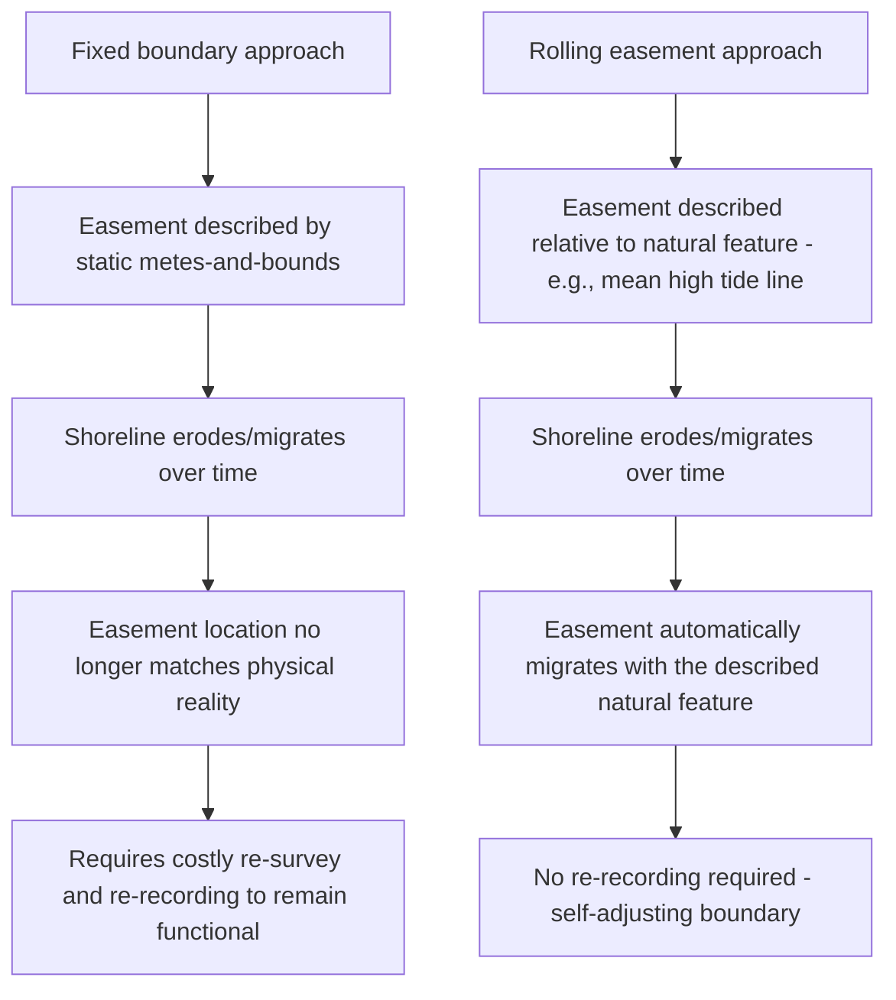

## Climate Change and Land Use Adaptation

### Overview and Purpose

Climate change is generating new categories of land rights and easement issues as coastlines erode, flood risk zones expand, wildfire exposure increases, and jurisdictions adopt regulatory responses such as managed retreat, rolling easements, and resilience-focused land use overlays. This topic addresses how easement and property law doctrines are being applied, extended, and reshaped to address climate-driven land use adaptation, including emerging instruments not fully settled in traditional property law.

### Why Climate Change Intersects with Easement and Land Rights Law

**Key Points**

- Traditional easements assume relatively **static physical boundaries**; climate-driven phenomena (erosion, sea level rise, wildfire buffer zones) introduce **dynamic, shifting boundaries** that strain doctrines built around fixed metes-and-bounds descriptions.
- Regulatory responses to climate risk (setback requirements, floodplain restrictions, wildfire defensible-space mandates) increasingly function as **de facto easements or use restrictions** even when not labeled as such, raising takings and compensation questions.
- Adaptation infrastructure (seawalls, levees, managed retreat corridors, stormwater retention for increased precipitation intensity) requires **new easement categories** not contemplated by historic easement law, which developed primarily around access, utilities, and light/air.
- Insurance and financing markets are increasingly conditioning coverage/lending on documented climate resilience measures, indirectly driving demand for new easement and covenant structures (e.g., conservation buffers, floodplain easements).

### Categories of Climate-Driven Land Rights Issues

| Category | Description | Primary Legal Mechanism |
| --- | --- | --- |
| Rolling/migrating easements | Easements whose location shifts with a moving natural boundary (e.g., mean high tide line) | Rolling conservation easements, public trust doctrine |
| Managed retreat and buyout programs | Voluntary or incentivized relocation from high-risk zones | Government buyout programs, deed restrictions, conservation easements |
| Coastal armoring restrictions | Regulation or prohibition of seawalls/bulkheads that interfere with natural shoreline migration | State coastal management statutes, permitting easement conditions |
| Wildfire defensible space and access easements | Required vegetation clearance and emergency access corridors in wildfire-prone areas | Local fire code easements, utility right-of-way expansion |
| Floodplain and stormwater easements | Expanded detention/conveyance capacity to address increased precipitation intensity | Municipal stormwater ordinances, drainage easements |
| Renewable energy and grid resilience easements | Transmission, solar, and wind easements supporting decarbonization and grid hardening | Utility easements, wind/solar lease-easement hybrids |
| Carbon offset and conservation easements | Permanent land use restriction in exchange for carbon credit or mitigation banking value | Conservation easement statutes, carbon registry program requirements |

### Rolling Easements — Concept and Legal Mechanics

A **rolling easement** (sometimes called a "rolling conservation easement" or "migrating easement") is designed to automatically shift its physical location as a natural boundary — most commonly the mean high tide line or a riparian/wetland boundary — moves over time due to erosion, accretion, or sea level rise, rather than remaining fixed at a static metes-and-bounds description.

**Key Points**

- Rolling easements are used primarily in **coastal states** to preserve public beach access or wetland/conservation areas as the shoreline naturally migrates inland, without requiring repeated re-surveying and re-recording of a fixed easement location.
- They are conceptually related to, and sometimes implemented through, the **public trust doctrine**, which in many coastal states holds that land below the mean high tide line (or an equivalent boundary) is held in trust for public use regardless of private upland ownership, and that this boundary — and the associated public access rights — naturally migrates with the water's edge.
- Implementation mechanisms include: (a) statutory rolling easement programs enacted by state coastal management agencies, (b) privately negotiated rolling conservation easements tied to a described natural feature rather than a fixed survey line, and (c) permit conditions imposed on new coastal construction, requiring the landowner to accept that future shoreline retreat will not be resisted through hard armoring, effectively creating a rolling restriction on future development rights.

[Unverified] The doctrinal basis, statutory adoption, and enforceability of rolling easements vary significantly by coastal state; some jurisdictions have express statutory rolling easement programs while others rely on common law public trust doctrine application, and the degree of judicial acceptance remains unsettled in several jurisdictions — confirm current state-specific statutes and recent appellate treatment.

### Rolling Easement Mechanics Illustrated

### Coastal Armoring Restrictions and the "No Retreat" Problem

A significant tension in coastal adaptation law involves **hard armoring structures** (seawalls, bulkheads, revetments) that protect a specific upland property but interfere with natural beach/wetland migration, potentially eliminating public beach access or wetland habitat over time as the water continues to rise against a fixed barrier ("coastal squeeze").

- Many coastal states now **restrict or condition permits** for new armoring structures, sometimes requiring the landowner to record a covenant acknowledging that future retreat (rather than re-armoring) will be required if the structure fails or reaches the end of its permitted life.
- Some jurisdictions require **rolling easement acknowledgments** as a permit condition for new coastal construction — the landowner accepts, as a condition of building, that the property will be subject to a public access/conservation easement that migrates inland as erosion progresses, effectively limiting the landowner's ability to armor against that migration in the future.
- This intersects directly with **regulatory takings analysis** (see below), since a permit condition requiring acceptance of a rolling easement or armoring prohibition can be challenged as an unconstitutional condition if it lacks an adequate nexus and rough proportionality to the permitted development's impacts, under the *Nollan/Dolan* framework.

### Managed Retreat and Buyout Programs

**Managed retreat** refers to the planned, often government-facilitated relocation of development away from high-risk areas (repetitive flood loss zones, eroding coastlines, extreme wildfire interface areas). Key legal mechanisms include:

- **Voluntary buyout programs** — government acquisition of at-risk properties (frequently funded through FEMA's Hazard Mitigation Grant Program or similar state/federal sources), typically followed by **deed restrictions permanently prohibiting future structures**, converting the parcel to open space, floodway, or conservation use — functionally similar to a permanent negative easement or restrictive covenant running with the land.
- **Conservation easement acquisition** as an alternative to fee acquisition — rather than purchasing full title, the government or a land trust acquires a conservation easement restricting development while leaving residual ownership (and reduced value) with the original landowner, often paired with compensation reflecting the diminished value.
- **Transfer of development rights (TDR) programs** — allowing a landowner in a high-risk or environmentally sensitive "sending zone" to sell unused development rights to a developer in a designated "receiving zone," preserving the sending parcel through an easement or deed restriction while still providing the original landowner some compensation for lost development value.

**Example**

> Following repetitive flood losses, a coastal municipality's buyout program acquires a residential parcel in the floodway using FEMA Hazard Mitigation Grant funds. As a condition of the buyout, the deed is recorded with a permanent restriction prohibiting any future structure on the parcel, and the land is dedicated to open space/floodway use in perpetuity — functioning as a permanent restrictive covenant that binds all future owners of the parcel.

### Regulatory Takings Considerations

Climate adaptation regulations that significantly restrict land use raise recurring takings questions under both federal and state constitutional law:

- **Categorical/per se takings** — a regulation that denies all economically beneficial use of land (under *Lucas v. South Carolina Coastal Council*, 505 U.S. 1003 (1992)) may constitute a taking requiring compensation, relevant where coastal or floodplain restrictions effectively prohibit any development.
- **Penn Central balancing** — for regulations falling short of a categorical taking, courts apply the multi-factor balancing test from *Penn Central Transportation Co. v. New York City*, 438 U.S. 104 (1978), weighing economic impact, interference with investment-backed expectations, and the character of the government action.
- **Exactions and unconstitutional conditions** — where a permit is conditioned on dedicating an easement (e.g., a rolling public access easement) in exchange for development approval, the *Nollan v. California Coastal Commission*, 483 U.S. 825 (1987), and *Dolan v. City of Tigard*, 512 U.S. 374 (1994), framework requires an essential nexus and rough proportionality between the condition and the development's impact.
- **Background principles defense** — governments increasingly argue that certain climate-driven restrictions (e.g., prohibiting new construction in a rapidly eroding zone) merely reflect pre-existing background principles of state property and nuisance law (an argument recognized in *Lucas* itself), rather than constituting a new regulatory taking, though this defense is fact-intensive and contested.

**Key Points**

- Climate adaptation takings litigation is a rapidly developing area; outcomes are highly fact-specific and jurisdiction-dependent, and practitioners should expect continued doctrinal development as more regulations and enforcement actions are challenged. [Speculation: given current trends, expect increased litigation volume in this area over the coming decade as adaptation regulations become more common and more restrictive, though the direction of doctrinal development cannot be reliably predicted.]

### Wildfire-Driven Easement and Access Issues

Increasing wildfire risk has generated distinct land rights issues, particularly in the wildland-urban interface (WUI):

- **Defensible space requirements** — many jurisdictions now mandate vegetation clearance zones around structures, which can extend onto or require easement rights over adjacent parcels where property lines are close together, creating new categories of mandatory maintenance easements or cost-sharing obligations between neighbors.
- **Emergency access and evacuation route easements** — fire codes increasingly require secondary access/egress easements for new development in high-risk areas, beyond the single-access driveways historically common in rural and exurban development.
- **Utility easement expansion for grid hardening** — utilities are expanding easement footprints to accommodate undergrounding of power lines, wider vegetation clearance buffers around above-ground lines, and new fire-detection/monitoring infrastructure, sometimes requiring renegotiation of decades-old, narrower utility easements.
- **Post-fire rebuilding and setback changes** — after a wildfire event, updated hazard mapping can impose new setback or defensible-space requirements on rebuilding, effectively altering the usable building envelope of previously developed lots.

### Floodplain and Stormwater Adaptation Easements

Increased precipitation intensity associated with climate change is driving expansion of traditional drainage/stormwater easement frameworks:

- **Larger detention/retention easement footprints** — municipal stormwater ordinances are increasingly requiring larger detention capacity, expanding the easement area required on new development compared to historical standards.
- **Green infrastructure easements** — easements specifically dedicated to bioswales, rain gardens, permeable pavement maintenance, and other green stormwater infrastructure, often paired with maintenance obligations running with the land.
- **Floodway/floodplain conveyance easements** — some jurisdictions require dedicated conveyance easements to preserve floodwater flow paths as part of updated floodplain management, which can affect previously buildable areas identified in older flood maps now considered outdated given updated climate-adjusted precipitation modeling.

### Renewable Energy and Grid Resilience Easements

The transition to renewable energy and grid modernization is generating substantial new easement activity relevant to land rights practice:

| Easement Type | Purpose | Key Negotiation Points |
| --- | --- | --- |
| Solar easements | Protect access to sunlight for solar installations against future shading development | Duration, height/setback restrictions on burdened parcel, compensation |
| Wind easements | Protect wind flow/turbine access and may restrict nearby development | Setback distances, noise/shadow flicker buffers, turbine siting rights |
| Transmission line easements | Support new/expanded transmission for renewable generation and grid hardening | Width, vegetation clearance, compensation, undergrounding requirements |
| Battery storage site easements | Access and safety buffer for grid-scale battery storage facilities | Fire/safety setbacks, access road easements, decommissioning obligations |
| Microgrid/distributed generation easements | Support community solar, microgrids, and resilience hubs | Shared infrastructure cost allocation, access for multiple beneficiaries |

**Key Points**

- **Solar easement statutes** exist in a growing number of states, authorizing landowners to create enforceable easements protecting solar access — a category of easement that did not meaningfully exist prior to modern solar energy adoption and required specific statutory authorization in many jurisdictions because traditional common law was often reluctant to recognize a right to light/air absent express agreement.
- Renewable energy easements frequently involve **hybrid lease-easement structures**, combining periodic lease payments with easement-like access and exclusivity rights, requiring careful drafting to clarify which body of law (landlord-tenant vs. real property easement law) governs specific disputes.

### Conservation Easements and Carbon Markets

Climate mitigation strategies are increasingly intersecting with conservation easement law:

- **Carbon offset conservation easements** — landowners grant a conservation easement restricting development or requiring specific forest/land management practices in exchange for carbon credits sold into voluntary or compliance carbon markets, adding a new valuation and monitoring dimension to traditional conservation easement practice.
- **Additionality and permanence requirements** — carbon market program standards typically require conservation easements underlying carbon credits to be **permanent** (or for a very long minimum term) and to demonstrate the restricted activity would not have occurred "additionally" absent the program, raising drafting and enforcement considerations distinct from traditional habitat-focused conservation easements.
- **Stacking issues** — landowners and practitioners must carefully analyze whether a single parcel can support multiple overlapping easements or credit programs (e.g., a conservation easement plus a wetland mitigation bank plus a carbon credit program) without creating conflicting obligations or invalidating credit eligibility under program-specific rules.

### Illustrative Diagram: Climate Adaptation Instrument Selection

<svg xmlns="http://www.w3.org/2000/svg" viewBox="0 0 640 340">
<text x="320" y="24" text-anchor="middle" font-size="15" font-weight="bold" fill="#1f2937">Climate Adaptation Legal Toolkit (svg_diagram)</text>
<rect x="30" y="55" width="170" height="70" rx="8" fill="#dbeafe" stroke="#1d4ed8" stroke-width="1.5" />
<text x="115" y="80" text-anchor="middle" font-size="11" fill="#1e3a8a">Coastal erosion /</text>
<text x="115" y="95" text-anchor="middle" font-size="11" fill="#1e3a8a">sea level rise</text>
<text x="115" y="112" text-anchor="middle" font-size="10" fill="#1e3a8a">Rolling easements</text>
<rect x="235" y="55" width="170" height="70" rx="8" fill="#fee2e2" stroke="#b91c1c" stroke-width="1.5" />
<text x="320" y="80" text-anchor="middle" font-size="11" fill="#7f1d1d">Repetitive flood loss</text>
<text x="320" y="112" text-anchor="middle" font-size="10" fill="#7f1d1d">Buyouts / deed restrictions</text>
<rect x="440" y="55" width="170" height="70" rx="8" fill="#fef9c3" stroke="#a16207" stroke-width="1.5" />
<text x="525" y="80" text-anchor="middle" font-size="11" fill="#713f12">Wildfire interface</text>
<text x="525" y="112" text-anchor="middle" font-size="10" fill="#713f12">Defensible space easements</text>
<rect x="130" y="160" width="170" height="70" rx="8" fill="#dcfce7" stroke="#15803d" stroke-width="1.5" />
<text x="215" y="185" text-anchor="middle" font-size="11" fill="#14532b">Increased precipitation</text>
<text x="215" y="217" text-anchor="middle" font-size="10" fill="#14532b">Stormwater easements</text>
<rect x="340" y="160" width="170" height="70" rx="8" fill="#e0e7ff" stroke="#4338ca" stroke-width="1.5" />
<text x="425" y="185" text-anchor="middle" font-size="11" fill="#312e81">Grid resilience need</text>
<text x="425" y="217" text-anchor="middle" font-size="10" fill="#312e81">Transmission/solar easements</text>
<rect x="200" y="260" width="240" height="55" rx="8" fill="#f3f4f6" stroke="#374151" stroke-width="1.5" />
<text x="320" y="283" text-anchor="middle" font-size="11" fill="#111827">Common thread: takings analysis,</text>
<text x="320" y="299" text-anchor="middle" font-size="11" fill="#111827">compensation, and evolving statutes</text>
</svg>

### Comparative Table: Traditional vs. Climate-Adapted Easement Approaches

| Feature | Traditional Easement | Climate-Adapted Easement |
| --- | --- | --- |
| Boundary definition | Fixed metes-and-bounds | Often relative to a migrating natural feature |
| Duration assumption | Perpetual, static conditions assumed | May require periodic reassessment as conditions change |
| Primary purpose | Access, utilities, light/air | Public trust preservation, hazard mitigation, resilience infrastructure |
| Compensation framework | Established (eminent domain, negotiated purchase) | Evolving (buyout programs, TDR, carbon credit markets) |
| Statutory foundation | Well-established common law and statutes | Patchwork of newer, state-specific statutes; less uniform |
| Takings litigation exposure | Relatively settled doctrine | Active, evolving litigation area |

### Strategic Considerations for Practitioners

**Key Points**

- When advising clients on coastal or flood-prone property, review **current state coastal management and floodplain statutes** directly rather than relying on general common law easement principles, since climate adaptation frameworks are frequently codified separately and updated more often than traditional property statutes.
- For new coastal or high-hazard development, carefully review **permit conditions** for embedded rolling easement acknowledgments or armoring restrictions, which can significantly affect long-term property rights and resale value even when not labeled as a traditional easement.
- In wildfire-prone areas, proactively assess whether **defensible space compliance** requires formal easement rights over neighboring land, rather than assuming informal neighbor cooperation will suffice long-term.
- For renewable energy projects, confirm whether the applicable state has a **specific solar/wind easement statute**, since enforceability and required formalities can differ materially from general easement law absent such statutory authorization.
- When structuring conservation easements tied to carbon credit programs, engage **carbon market program specialists** alongside real estate counsel, since program-specific permanence, additionality, and stacking rules can differ significantly from traditional land trust conservation easement practice.
- Monitor **regulatory takings litigation** in the relevant jurisdiction, as this remains one of the most actively litigated and doctrinally unsettled areas intersecting climate adaptation and land rights law.

[Unverified] This is a rapidly evolving area of law; specific statutes, regulatory programs, and case law addressing climate adaptation and land rights vary significantly by state and continue to develop. Practitioners should conduct current legal research and monitor recent legislative and appellate developments in the specific jurisdiction before advising on any climate-adaptation-related land rights matter.

**Related Topics**

- Quiet Title Actions
- Conservation and Environmental Remediation Easements
- Regulatory Takings Doctrine (Lucas, Penn Central, Nollan/Dolan)
- Public Trust Doctrine and Coastal Access Rights
- Transfer of Development Rights (TDR) Programs
- Solar and Wind Easement Statutes
- Floodplain Management and Stormwater Easement Requirements
- FEMA Hazard Mitigation Grant Program and Buyout Mechanics
- Carbon Offset Markets and Conservation Easement Permanence
- Wildland-Urban Interface (WUI) Fire Code Easement Requirements