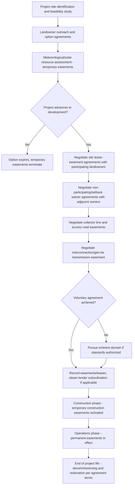

## Renewable Energy Development and Easement Demand

### Overview and Purpose

The rapid expansion of utility-scale and distributed renewable energy — solar, wind, battery storage, and the transmission infrastructure connecting them to the grid — has created substantial new demand for specialized easements distinct from traditional access and utility easements. This topic addresses the legal structures, drafting considerations, and disputes arising from wind, solar, transmission, and storage easements, including their hybrid lease-easement character and the land use conflicts they generate.

### Why Renewable Energy Drives Distinct Easement Categories

**Key Points**

- Renewable generation is inherently **land-intensive relative to output** compared to conventional generation, requiring large contiguous or corridor-based land rights (solar arrays, wind turbine spacing, transmission rights-of-way) that traditional utility easement forms were not originally designed to address at this scale.
- Renewable projects frequently require rights over **multiple, non-contiguous parcels** owned by different landowners, necessitating coordinated easement portfolios rather than a single grant.
- Unlike traditional utility easements (typically narrow corridors for buried or overhead lines), wind and solar easements often involve **negative easements** — restricting a neighboring landowner's ability to build structures or plant vegetation that would obstruct wind flow or sunlight — a category historically disfavored or unrecognized at common law absent express statutory authorization.
- Grid interconnection and transmission buildout to support renewable generation is driving **new and expanded transmission easement corridors**, frequently the subject of eminent domain and voluottary negotiation disputes given the scale of new infrastructure required.

### Categories of Renewable Energy Easements

| Easement Type | Function | Distinguishing Legal Feature |
| --- | --- | --- |
| Solar access/solar easement | Protects sunlight access for panels against future shading | Negative easement; requires statutory authorization in most states |
| Wind easement | Protects unobstructed wind flow and turbine siting rights | Negative easement; height/setback restrictions on burdened land |
| Turbine/facility site lease-easement | Grants exclusive-use rights to install and operate generation equipment | Hybrid lease-easement; often includes exclusivity |
| Collector line/gen-tie easement | Underground or overhead cabling connecting generation to substation | Similar to traditional utility easement but project-specific routing |
| Transmission easement | High-voltage lines connecting substations to broader grid | Often subject to eminent domain; wide corridor and vegetation clearance |
| Access road easement | Construction and maintenance vehicle access to remote generation sites | Similar to traditional access easement, often heavier-duty specifications |
| Battery storage site easement | Access and safety buffer for grid-scale storage facilities | Fire/safety setback emphasis; decommissioning obligations |
| Substation/interconnection easement | Land rights for substation siting and grid tie-in infrastructure | Often includes fencing, security, and utility company operational control |

### Solar and Wind Easements — Legal Foundation

#### The Common Law Problem

At common law, a right to light and air across a neighboring property (the "ancient lights" doctrine) was generally **not recognized** in most U.S. jurisdictions, unlike some other common law systems. This means a landowner traditionally had no automatic protection against a neighbor's construction blocking sunlight or wind, even where a solar installation or wind turbine depended on that unobstructed exposure.

#### Statutory Solar/Wind Easement Enabling Acts

To address this gap, many states have enacted **solar (and in some states, wind) easement enabling statutes**, which:

- Expressly authorize landowners to create enforceable, recordable easements protecting solar or wind access across a burdened neighboring parcel.
- Specify required contents for an enforceable instrument — commonly including the physical dimensions or angles of the protected access (e.g., a defined solar skyspace or a wind flow corridor), duration, and terms for termination or modification.
- Address the interaction between the easement and the burdened landowner's future development rights, since a solar/wind easement inherently restricts building height, tree planting, or similar activity on the servient parcel.

**Key Points**

- Where no specific enabling statute exists, parties can generally still create a **negative easement by express private agreement**, but its enforceability against successors and its scope of protection may be less certain than under a purpose-built statutory framework, and drafting counsel should confirm the recognized easement categories in the applicable jurisdiction before relying solely on general common law negative easement principles.
- Solar/wind easements are typically **appurtenant** (benefiting a specific dominant parcel with the generation equipment) rather than in gross, though large commercial wind/solar developers sometimes seek easements in gross given the scale and separate corporate ownership structure of the generation project relative to any single benefited parcel.

**Example**

> Grantor, owner of the adjacent northerly parcel, grants to Grantee a perpetual Solar Easement over the airspace described in Exhibit A, restricting Grantor from constructing any structure or maintaining vegetation exceeding 15 feet in height within the described skyspace, in order to preserve unobstructed solar access to Grantee's rooftop photovoltaic array.

### Utility-Scale Wind Development Easements

Utility-scale wind projects typically require a **portfolio of easement and lease rights** across many landowners within a project area, commonly structured as:

1. **Turbine site easements/leases** — exclusive-use rights for the specific footprint of each turbine foundation and immediate operational area.
2. **Setback and non-obstruction easements** — restricting neighboring (often non-participating) landowners from constructing structures within a specified setback distance of turbines, addressing safety (ice throw, blade failure risk) and regulatory setback compliance.
3. **Noise/shadow flicker buffer easements or covenants** — in some jurisdictions or project agreements, non-participating neighboring landowners receive compensation in exchange for accepting noise or shadow flicker impacts within a defined buffer, sometimes documented as a covenant or easement rather than a simple lease.
4. **Collector line easements** — underground or overhead cabling connecting individual turbines to a project substation, typically following field edges or existing corridors to minimize agricultural disruption.
5. **Access road easements** — heavy-duty roads sized for construction crane and turbine component delivery, often requiring wider and more robust specifications than typical agricultural or residential access easements.
6. **Met tower and temporary study easements** — short-term easements for meteorological towers and wind resource assessment equipment during the development/feasibility phase, preceding full project commitment.

**Key Points**

- Wind easement agreements frequently combine **lease payments** (per-turbine or per-acre) with easement-like exclusivity and access rights, and the agreements are typically drafted as hybrid "Wind Energy Lease and Easement Agreements" to capture both bodies of law.
- **Non-participating landowner agreements** — landowners within the project's setback or impact zone but without a turbine on their own land are increasingly asked to sign separate, more limited easement/waiver agreements (sometimes called "good neighbor agreements") in exchange for smaller payments, addressing setback waivers and impact acknowledgments without full project participation.

### Utility-Scale Solar Development Easements

Utility-scale solar projects present somewhat different easement dynamics than wind, given the more compact and contiguous footprint typically required:

- **Ground lease-easement hybrids** — the dominant structure for utility-scale solar, typically a long-term (20–40 year) ground lease combined with easement rights for access, collector lines, and interconnection infrastructure extending beyond the leased parcel itself.
- **Interconnection and gen-tie easements** — easements for the transmission line connecting the solar facility to the nearest substation or grid interconnection point, which may cross multiple intervening parcels not otherwise part of the project.
- **Decommissioning and restoration obligations** — increasingly required (by statute, local ordinance, or negotiated agreement) as a condition of the easement/lease, requiring the developer to remove infrastructure and restore the land (including underlying easement areas) at the end of the project's useful life, often secured by a bond or letter of credit.
- **Agrivoltaics and dual-use easements** — an emerging structure where the easement/lease explicitly preserves limited agricultural use (grazing, pollinator habitat, certain crops) beneath or between solar arrays, requiring careful drafting to allocate liability and access rights between the solar operator and any continuing agricultural user.

### Transmission Easements and Grid Buildout

The scale of new transmission infrastructure required to connect renewable generation to load centers has intensified transmission easement acquisition activity and associated disputes:

- **Voluntary negotiation vs. eminent domain** — transmission developers (often regulated utilities or, in some states, merchant transmission developers) typically attempt voluntary easement acquisition first, but many jurisdictions grant **eminent domain authority** for transmission projects meeting certain public utility or public convenience and necessity findings, allowing condemnation where voluntary negotiation fails.
- **Corridor width and vegetation clearance** — transmission easements for high-voltage lines require substantially wider corridors and more aggressive vegetation clearance than distribution-level utility easements, generating recurring maintenance access disputes with landowners over trimming/removal practices.
- **Valuation disputes in condemnation** — just compensation disputes for transmission easements frequently turn on **severance damages** (diminution in value to the remainder of the parcel beyond the easement strip itself) and **highest and best use** analysis, particularly for agricultural or potential development land bisected by a new corridor.
- **Multi-state and federal siting complexity** — interstate transmission projects can implicate federal siting authority (in limited circumstances under the Federal Power Act) alongside state condemnation and easement law, creating layered regulatory review beyond a typical single-state easement negotiation.

**Key Points**

- Transmission easement negotiations increasingly include **renewable-specific terms** — for example, provisions addressing curtailment coordination, interconnection queue timing, and the interaction between the easement's term and the useful life of the generation facility it serves.
- Landowners facing transmission easement negotiation (voluntary or condemnation-driven) should engage **appraisal expertise specific to easement/severance valuation**, as compensation frameworks differ materially from a simple fee-title sale.

### Development and Easement Acquisition Process Flow

### Land Use Conflicts and Neighboring Landowner Disputes

**Key Points**

- **Viewshed and aesthetic objections** — neighboring landowners frequently object to wind turbine or large-scale solar visibility, though most jurisdictions do not recognize a general common law right to an unobstructed view absent an express easement, making these objections primarily a land use/permitting battleground rather than a private easement law claim.
- **Setback and safety disputes** — non-participating landowners near turbine sites may dispute whether project setbacks (from property lines or occupied structures) comply with applicable ordinances or previously negotiated easement/waiver terms, particularly where ordinance requirements change between permitting and construction.
- **Glare and reflectivity complaints** — solar installations near airports or residential areas can generate glare complaints, sometimes addressed through project design (anti-reflective coating, panel orientation) rather than easement mechanisms, but occasionally implicating easement or covenant negotiations with specifically affected neighbors.
- **Agricultural operation conflicts** — collector lines, access roads, and turbine pad easements can fragment agricultural fields, complicate irrigation systems, and affect aerial application (crop dusting) operations, generating disputes over easement routing and compensation for operational disruption beyond the easement's physical footpr.
- **Decommissioning enforcement gaps** — where decommissioning bonds are inadequate or a project developer becomes insolvent, landowners and local governments may face disputes over who bears removal costs for abandoned infrastructure remaining within easement areas after a project's useful life ends.

### Interaction with Existing Easements and Land Rights

Renewable energy development frequently must be reconciled with **pre-existing easements and land rights** already burdening or benefiting the project site:

- **Existing utility easements** — solar/wind facilities must avoid interfering with pre-existing utility, pipeline, or access easements crossing the project area, sometimes requiring project layout redesign or negotiated relocation agreements with the existing easement holder.
- **Agricultural and conservation easements** — land already subject to a conservation easement may restrict or entirely prohibit renewable energy development, depending on the specific terms of the conservation easement and whether the holding land trust or agency will consent to an amendment (conservation easement amendment standards are typically strict, particularly for easements tied to public funding or tax-deductible donation requirements).
- **Mineral rights severance** — in areas with historically severed mineral estates, renewable energy developers must confirm whether the mineral owner's surface access rights could conflict with planned surface improvements, requiring surface use agreements analogous to those used in oil and gas development.
- **Prior recorded restrictive covenants** — subdivision or agricultural preservation covenants may restrict industrial-type use, height, or noise, requiring covenant amendment or waiver processes before a renewable project can proceed even where individual landowner consent has been obtained.

### Comparative Table: Wind vs. Solar vs. Transmission Easement Characteristics

| Feature | Wind Easements | Solar Easements | Transmission Easements |
| --- | --- | --- | --- |
| Typical footprint | Small pad + large setback/non-obstruction area | Large contiguous acreage | Narrow, long linear corridor |
| Eminent domain availability | Rarely (private generation project) | Rarely (private generation project) | Common for regulated utility projects |
| Negative easement component | Significant (setback, non-obstruction) | Significant (solar access/shading) | Minimal (primarily affirmative use rights) |
| Typical term | 20–40+ years, often with extension options | 20–40+ years, often with extension options | Perpetual (common for major transmission) |
| Decommissioning obligation | Increasingly standard | Increasingly standard | Rare (infrastructure often treated as permanent) |
| Non-participating neighbor impact | High (setback, noise, shadow flicker) | Lower (primarily visual/glare) | Moderate (visual, severance damages) |

### Illustrative Diagram: Renewable Project Easement Portfolio

<svg viewBox="0 0 640 320" xmlns="http://www.w3.org/2000/svg">
<text x="320" y="24" text-anchor="middle" font-size="15" font-weight="bold" fill="#1f2937">Renewable Project Easement Portfolio (svg_diagram)</text>
<rect x="60" y="55" width="520" height="230" fill="#f9fafb" stroke="#9ca3af" stroke-width="1.5"/>
<text x="320" y="75" text-anchor="middle" font-size="11" fill="#374151">Project Area (multiple landowner parcels)</text>
<rect x="90" y="90" width="120" height="60" fill="#bfdbfe" stroke="#1d4ed8" stroke-width="1"/>
<text x="150" y="115" text-anchor="middle" font-size="10" fill="#1e3a8a">Turbine/Panel</text>
<text x="150" y="130" text-anchor="middle" font-size="10" fill="#1e3a8a">Site Lease-Easement</text>
<rect x="230" y="90" width="120" height="60" fill="#fde68a" stroke="#a16207" stroke-width="1"/>
<text x="290" y="115" text-anchor="middle" font-size="10" fill="#713f12">Setback / Non-</text>
<text x="290" y="130" text-anchor="middle" font-size="10" fill="#713f12">Obstruction Easement</text>
<rect x="370" y="90" width="120" height="60" fill="#bbf7d0" stroke="#15803d" stroke-width="1"/>
<text x="430" y="115" text-anchor="middle" font-size="10" fill="#14532b">Collector Line</text>
<text x="430" y="130" text-anchor="middle" font-size="10" fill="#14532b">Easement</text>
<rect x="90" y="170" width="180" height="60" fill="#fecaca" stroke="#b91c1c" stroke-width="1"/>
<text x="180" y="195" text-anchor="middle" font-size="10" fill="#7f1d1d">Access Road Easement</text>
<text x="180" y="210" text-anchor="middle" font-size="10" fill="#7f1d1d">(construction + O&M)</text>
<rect x="290" y="170" width="200" height="60" fill="#e0e7ff" stroke="#4338ca" stroke-width="1"/>
<text x="390" y="195" text-anchor="middle" font-size="10" fill="#312e81">Interconnection / Gen-Tie</text>
<text x="390" y="210" text-anchor="middle" font-size="10" fill="#312e81">Transmission Easement</text>

<text x="320" y="260" text-anchor="middle" font-size="10" fill="`#374151`">Each instrument separately negotiated, drafted, and recorded</text>

</svg>

### Strategic Considerations for Practitioners

**Key Points**

- Confirm whether the relevant state has a **solar and/or wind easement enabling statute** before drafting negative easements protecting light/air/wind access — reliance on general common law negative easement principles alone carries greater enforceability risk absent statutory authorization.
- Draft renewable energy site agreements as explicit **hybrid lease-easement instruments**, clearly specifying which provisions are governed by landlord-tenant law versus real property easement law, since remedies and default provisions can differ meaningfully between the two frameworks.
- For multi-parcel projects, build a **coordinated easement acquisition strategy** early, since a single uncooperative landowner along a critical collector line or access route can delay or reroute an entire project.
- Include robust **decommissioning and restoration obligations**, secured by a bond or letter of credit, in every generation-site easement/lease to protect landowners and local governments against abandoned infrastructure risk at end of project life.
- Review all **pre-existing easements, conservation restrictions, and mineral severances** affecting the project footprint early in development, since conflicts with prior recorded interests can require costly redesign or amendment negotiations late in the development timeline.
- For transmission projects with eminent domain exposure, advise landowners to obtain **independent appraisal expertise** specific to easement and severance damage valuation, rather than relying solely on the condemning authority's initial offer.
- Address **non-participating neighbor impacts** (setback waivers, noise/shadow flicker, glare) proactively through negotiated agreements rather than relying solely on permitting-stage mitigation, since these relationships often persist for decades alongside the project.

[Unverified] Solar/wind easement enabling statutes, eminent domain authority for transmission and generation projects, and decommissioning requirements vary significantly by state and are subject to ongoing legislative change as renewable energy policy evolves; confirm current statutory authority and local ordinance requirements for the specific project location.

**Related Topics**

- Climate Change and Land Use Adaptation
- Easements in Development and Construction Projects
- Lender Considerations and Easement Subordination
- Eminent Domain and Just Compensation for Easement Takings
- Conservation Easement Amendment Standards
- Mineral Rights Severance and Surface Use Agreements
- Decommissioning Bonds and Restoration Obligations
- Agrivoltaics and Dual-Use Land Agreements
- Transmission Siting Authority Under the Federal Power Act
- Restrictive Covenants and Renewable Energy Project Conflicts