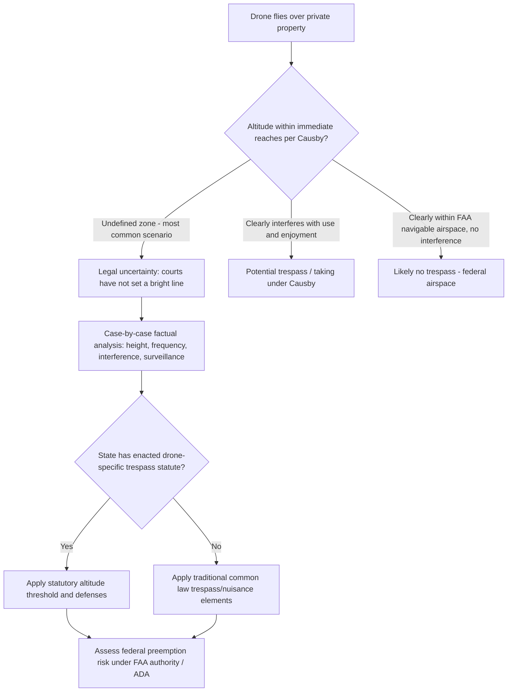

## Drones, Airspace, and Emerging Technology Questions

### Overview and Purpose

The proliferation of unmanned aircraft systems (UAS/drones) for delivery, surveying, agriculture, and recreation has created an unsettled and actively developing intersection between traditional real property airspace rights and federal aviation regulation. This topic addresses how courts and legislatures are applying (and struggling to apply) trespass, nuisance, and easement doctrines to low-altitude drone operations, the emerging concept of "avigation easements" for drone corridors, and the federal preemption questions that complicate state and local regulatory responses.

### The Foundational Legal Tension

**Key Points**

- Traditional common law held that a landowner's rights extended "usque ad coelum" (to the heavens) — an unlimited vertical column of ownership. This maxim was abrogated for aviation purposes by federal law and Supreme Court precedent in the mid-20th century.
- In United States v. Causby (1946), the U.S. Supreme Court established that landowners own the airspace in the "immediate reaches" above their land, creating a compensable taking where government aircraft flew low enough to interfere with the landowner's use and enjoyment of the property (in that case, a chicken farm). [fedsoc](https://fedsoc.org/commentary/fedsoc-blog/developments-on-drones-air-rights-and-takings)
- Critically, courts have never precisely defined "immediate reaches," leaving a legally ambiguous zone between ground level and the floor of clearly "navigable airspace" regulated by the FAA — precisely the altitude band in which most drone operations occur. [fedsoc](https://fedsoc.org/commentary/fedsoc-blog/developments-on-drones-air-rights-and-takings)
- The unmanned aircraft industry has taken the position that property owners have no possessory rights in any airspace, a direct conflict with the traditional property law view and with public sentiment. [mondaq](https://mondaq.com/unitedstates/landlord-tenant-leases/752372/private-property-owners-and-drones)

### Current Federal Regulatory Landscape

- In August 2025, the Department of Transportation and FAA proposed a new rule easing altitude and visual-line-of-sight restrictions for drone operations, permitting flight without line-of-sight at altitudes of 400 feet or less for a range of commercial purposes. [abc11](https://abc11.com/post/federal-aviation-administration-looks-expand-drone-package-delivery/17444508/)
- This proposed rule would broadly enable drone use nationwide for package delivery, agriculture, aerial surveying, and civil applications including public safety and recreation. [abc11](https://abc11.com/post/federal-aviation-administration-looks-expand-drone-package-delivery/17444508/)
- Under longstanding FAA regulation (14 C.F.R. Part 107), commercial drone operators have generally been permitted to fly up to 400 feet, which is the altitude band most likely to overlap with the "immediate reaches" landowners claim under *Causby*.
- The FAA has issued interpretive guidance on preemption: the 2023 FAA Fact Sheet lists state/local laws likely preempted as including designating aerial "highways" or specified routes for drones, selling or leasing drone-related air rights above roadways, mandating geofencing, and imposing licensing or safety/efficiency regulations. [jonesday](https://www.jonesday.com/en/insights/2023/07/faa-updates-stance-on-preemption-of-drone-laws)
- However, the FAA has clarified that state and local regulations not involving aviation safety or efficient airspace use are not preempted so long as they don't impair reasonable airspace use — this includes regulating where drones take off and land, and laws against voyeurism, trespass, and other criminal activity. [jonesday](https://www.jonesday.com/en/insights/2023/07/faa-updates-stance-on-preemption-of-drone-laws)
- Restrictions on how drones are used, rather than where they operate within the airspace, are more likely to survive preemption analysis; a blanket privacy ban over an entire city is likely preempted, while a ban applied only to lower altitudes over privacy-sensitive facilities like parks or schools likely would not be. [jonesday](https://www.jonesday.com/en/insights/2023/07/faa-updates-stance-on-preemption-of-drone-laws)
- State or local laws affecting commercial operators such as delivery drones face an additional preemption risk under the Airline Deregulation Act, which expressly bars states from regulating an air carrier's prices, routes, or services — a significant complication for any state attempting to regulate drone delivery corridors. [jonesday](https://www.jonesday.com/en/insights/2023/07/faa-updates-stance-on-preemption-of-drone-laws)

### Trespass Doctrine Applied to Drones

**Key Points**

- Absent a specific statute, courts applying traditional trespass doctrine to drones must determine whether the incursion falls within the "immediate reaches" zone that remains a landowner's private property, versus federally-regulated navigable airspace — an analysis with no settled, generally-applicable altitude threshold.
- Some courts (notably outside the U.S., but reflecting a similar common law approach) have found that trespass can occur when a drone invades the airspace above land, subject to the limitation that the property owner's rights extend only to such height as is necessary for the ordinary use and enjoyment of the land — meaning a drone flying high enough to avoid interfering with ordinary use and enjoyment may not trigger trespass liability even if technically over the parcel. [burges-salmon](https://burges-salmon.com/news-and-insight/legal-updates/the-rise-of-agricultural-drones-in-the-uk)
- Beyond trespass, a landowner aggrieved by a drone overflight may have claims under several other legal theories, including private nuisance, data protection/privacy rights in any collected images, and breach of privacy or confidentiality depending on the circumstances — meaning drone disputes often present overlapping trespass, nuisance, privacy, and surveillance claims rather than a single clean cause of action. [riaabarkergillette](https://www.riaabarkergillette.com/uk/wp-content/uploads/2022/01/Article-Drones-keep-them-out-of-my-air-space.pdf)

### The Uniform Law Commission's Aerial Trespass Proposal

- The Uniform Law Commission considered and debated a proposed "Tort Law Relating to Drones Act" at its 2018 annual meeting, section by section. [mondaq](https://mondaq.com/unitedstates/landlord-tenant-leases/752372/private-property-owners-and-drones)
- The first draft provided that a person intentionally operating a drone below 200 feet above the surface of another's property, without the owner's consent, would be liable for trespass, subject to exceptions for conduct protected under the First and Fourth Amendments, first responders, law enforcement, utilities, and similar categories. [mondaq](https://mondaq.com/unitedstates/landlord-tenant-leases/752372/private-property-owners-and-drones)
- This model legislation would assign the lower 200 feet of airspace to state governments for purposes of creating an aerial trespass offense, given that "navigable airspace" under federal law (49 U.S.C.) was never precisely defined, and the FAA's Part 107 rules generally restrict commercial drone operators to 400 feet or below. [unmannedairspace](https://unmannedairspace.info/?p=2614)
- Under the proposed legislation, a drone operator flying over a yard at 199 feet would be committing trespass, mirroring traditional land-trespass doctrine by making the operator liable irrespective of whether actual harm resulted to any legally protected interest. [unmannedairspace](https://unmannedairspace.info/?p=2614)
- Aviation attorneys have warned that if such legislation were enacted by a state, the federal government would likely challenge it as an unlawful preemption of FAA authority, reflecting the unresolved federal-state tension underlying this entire area. [ainonline](https://backend.ainonline.com/aviation-news/business-aviation/2018-08-16/drone-overflights-could-be-labeled-aerial-trespass)

[Unverified] The Uniform Law Commission proposal's current status, and whether any state has enacted a comparable 200-foot aerial trespass threshold into binding law, requires current verification — legislative proposals in this area have moved slowly and unevenly across states.

### Avigation Easements — An Emerging Instrument

**Avigation easements** (a term combining "aviation" and "navigation") are a distinct category of easement historically used near airports (to protect against noise/overflight liability claims from adjacent landowners) that is now being proposed and adapted for drone corridor purposes.

- An avigation easement is an easement or right of overflight in the airspace above or in the vicinity of a particular property, including the right to create noise or other effects resulting from lawful aircraft operation in that airspace, and the right to remove obstructions. [uavcoach](https://uavcoach.com/avigation-easement/)
- Several states have considered legislation extending property rights for landowners into the airspace above their land, so that landowners would also own the airspace over it and could charge drone operators to fly over that airspace — effectively monetizing avigation easement rights for commercial drone traffic. [uavcoach](https://uavcoach.com/avigation-easement/)
- Under this model, large landowners, including state governments, could potentially institute aerial "toll roads," charging a fee for each drone entering the airspace to conduct business. [uavcoach](https://uavcoach.com/avigation-easement/)
- Mercatus Center policy analysis frames "airspace lease law" as a key factor in state drone-industry preparedness, on the theory that drone highways must be demarcated by regulators and safely separated from airports, homes, schools, and other sensitive locations, and that leasing airspace above public roads and property could accelerate drone services by avoiding the property-taking issues raised by routing flight paths over backyards and private land. [mercatus](https://www.mercatus.org/how-state-policymakers-can-encourage-drone-delivery-services-and-aviation-innovation-their-states)
- Proponents argue that implementing the right state policies — including airspace leasing — can help establish drone highways that protect operators from trespass, nuisance, and takings lawsuits, reducing legal uncertainty for the industry. [mercatus](https://www.mercatus.org/how-state-policymakers-can-encourage-drone-delivery-services-and-aviation-innovation-their-states)

**Key Points**

- Avigation easements for drone corridors are conceptually similar to traditional airport avigation easements (a landowner grants or is compensated for accepting overflight rights and associated noise/interference) but are being newly adapted for the much lower-altitude, higher-frequency, commercial delivery context.
- The "toll road in the sky" model remains largely proposed/emerging rather than a settled, widely-adopted legal framework; the FAA's own 2023 preemption guidance specifically lists "selling or leasing UAS-related air rights above roadways" as an example of a state/local approach likely preempted by federal authority — creating direct tension between state legislative proposals and the FAA's stated preemption position. [jonesday](https://www.jonesday.com/en/insights/2023/07/faa-updates-stance-on-preemption-of-drone-laws)

### "Drone Highway" Case Study — Practical Tension Illustrated

At a drone-delivery testing area in Arizona, a resident discovered her home sits below a planned "drone highway" for delivery drones, and a representative of the drone operator told her she had essentially no legal rights — that drones could operate wherever they wanted on her property, including over her front yard, back yard, above her roof, and in front of her windows. A January 2023 survey found nearly 85% of Americans believe they have a right to exclude drones from the airspace above their land, reflecting a significant gap between the drone industry's stated legal position and public expectations of traditional property rights. [fedsoc](https://fedsoc.org/commentary/fedsoc-blog/developments-on-drones-air-rights-and-takings)[fedsoc](https://fedsoc.org/commentary/fedsoc-blog/developments-on-drones-air-rights-and-takings)

**Key Points**

- This gap between industry practice, public expectation, and unsettled case law is a central driver of the current legislative and litigation activity in this area — practitioners advising either landowners or drone operators should expect continued volatility rather than settled doctrine.
- [Speculation: given the FAA's 2025 proposed rule easing beyond-visual-line-of-sight restrictions, commercial drone traffic volume at low altitudes is likely to increase materially in the near term, which may accelerate both state legislative activity and trespass/nuisance litigation — the direction and outcome of that litigation cannot be reliably predicted from current information.]

### Comparative Table: Doctrinal Approaches to Low-Altitude Drone Overflight

| Approach | Description | Current Status |
| --- | --- | --- |
| Traditional common law trespass | Any physical intrusion into airspace within "immediate reaches" is actionable | Unsettled altitude threshold; fact-intensive |
| Causby "immediate reaches" taking | Compensable taking where overflight interferes with use/enjoyment | Established framework, undefined altitude boundary |
| ULC-style statutory aerial trespass (200 ft threshold) | Bright-line statutory trespass below a defined altitude | Proposed model legislation; uneven state adoption; federal preemption risk |
| Avigation easement / airspace leasing | Landowner grants or is compensated for overflight rights, potentially with a toll/fee structure | Emerging, contested; FAA guidance flags as likely preempted |
| Federal navigable airspace exclusivity | All FAA-regulated airspace is federal domain; no state role | Industry-favored position; conflicts with public/landowner expectations |
| Use-based (not location-based) state regulation | States regulate takeoff/landing sites, privacy, criminal conduct rather than flight corridors | FAA guidance suggests this approach is less likely to be preempted |

### Drafting and Practice Considerations for Easement/Property Practitioners

**Key Points**

- When representing landowners near proposed drone delivery hubs, testing corridors, or "drone highway" routes, advise on the **current absence of a settled altitude threshold** for trespass claims and the practical difficulty of enforcing exclusion rights against low-altitude commercial drone traffic absent state-specific legislation.
- When representing drone operators or delivery companies, factor in **jurisdiction-specific trespass and nuisance exposure risk** as a real (if currently uncertain) legal cost, particularly in states that have enacted or are considering aerial trespass statutes, and monitor the interaction between such statutes and the FAA's preemption position.
- For clients considering **avigation easement agreements** with drone operators (whether to grant clear rights in exchange for compensation, or to formally document a restriction/exclusion), draft with awareness that the enforceability of such agreements against non-signatory third-party drone operators, and their interaction with FAA preemption doctrine, remains legally untested in most jurisdictions.
- Monitor the **FAA's pending beyond-visual-line-of-sight rulemaking** and its eventual final form, since the scope of federally-authorized low-altitude operations will directly shape the practical stakes of any state trespass or avigation easement framework.
- For property developers and site planners, consider whether **crane easements and other traditional temporary airspace easements** (see Easements in Development and Construction Projects) offer a useful drafting template for negotiated, time-limited drone access agreements, even though the underlying legal footing for enforcing such agreements against third parties is less settled than for construction-related airspace use.

[Unverified] This is one of the most doctrinally unsettled areas addressed in this course; the described statutes, proposals, and FAA guidance are subject to rapid change, and practitioners should verify the current status of any specific state's drone trespass or avigation easement legislation, as well as the final form and effective date of any pending FAA rulemaking, before advising a client on a specific matter.

**Related Topics**

- Climate Change and Land Use Adaptation
- Renewable Energy Development and Easement Demand
- Easements in Development and Construction Projects (Crane Swing/Airspace Easements)
- Federal Preemption Doctrine in Aviation and Land Use Law
- United States v. Causby and the "Immediate Reaches" Doctrine
- Regulatory Takings Analysis for Aerial Intrusion Claims
- Privacy and Surveillance Law Intersecting with Drone Overflight
- Uniform Law Commission Model Acts in Property Law
- Airport Avigation Easements and Historical Noise/Overflight Precedent
- State Legislative Trends in Unmanned Aircraft System Regulation