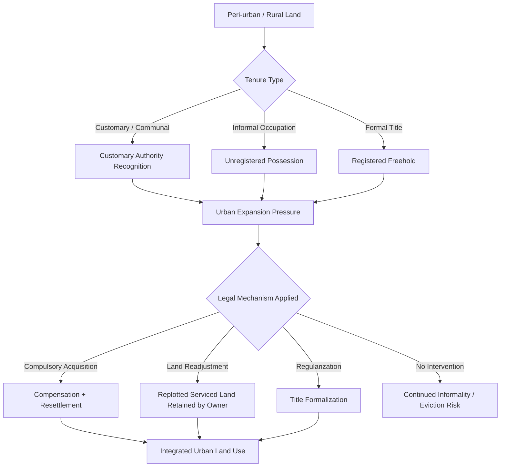

## Land Rights in the Context of Urbanization

### Overview

Urbanization pressures traditional land rights frameworks by compressing rural-to-urban land use transitions, intensifying competition over tenure, and exposing gaps between customary, statutory, and informal land systems. As agricultural and peri-urban land is absorbed into expanding metropolitan boundaries, legal systems must reconcile pre-existing rights (customary, communal, or long-held informal occupation) with formal urban planning, zoning, infrastructure development, and real estate markets.

### Core Legal Tensions

#### Formal vs. Informal Tenure Systems

- **Formal tenure**: Registered title, cadastral mapping, statutory deeds recognized by land registries.
- **Informal tenure**: Occupation-based claims, customary use rights, or unregistered long-term possession common in peri-urban and slum settlements.
- Urban expansion frequently overtakes informal settlements that predate formal registration, creating legal ambiguity over whether occupants hold enforceable rights or are subject to eviction as "unauthorized occupants."

#### Customary Land Conversion

In many jurisdictions (particularly across Sub-Saharan Africa, South and Southeast Asia, and parts of Latin America), peri-urban land is held under customary or communal tenure systems administered by traditional authorities. Urban expansion triggers conversion processes where:

- Customary land is compulsorily acquired or "regularized" into statutory title.
- Compensation frameworks often undervalue customary rights relative to formal freehold, since customary interests may lack a clear market comparator.
- Conversion can extinguish communal or usufructuary rights held by women, tenants, or secondary right-holders who lacked recognized standing under the customary system itself.

### Key Legal Mechanisms

#### Compulsory Acquisition / Eminent Domain

Urbanization projects (transit corridors, housing developments, utility expansion) commonly rely on compulsory acquisition powers. Core doctrinal elements:

1. **Public purpose requirement** — acquisition must serve a legitimate public interest (infrastructure, housing, sanitation).
2. **Due process** — notice, hearing, and appeal rights for affected landholders.
3. **Just compensation** — valuation standard, typically market value at the time of taking, though "market value" is contested where no formal market exists (informal or customary land).
4. **Resettlement and rehabilitation** — increasingly codified as a distinct legal obligation, separate from monetary compensation, covering physical relocation, livelihood restoration, and social infrastructure.

**Example**: A peri-urban community farming under customary tenure is served notice of acquisition for a ring-road project. Absent a formal title, compensation is often calculated only for standing crops or improvements, not for the underlying land interest — a recurring source of litigation and reform advocacy.

#### Land Readjustment / Land Pooling

An alternative to compulsory acquisition, used to convert peri-urban or agricultural land into serviced urban plots without displacing original owners:

- Landowners pool parcels into a single project area.
- The implementing authority replots the land, reserving portions for roads, infrastructure, and public use, and sometimes a portion for cost recovery (sale or auction).
- Owners receive a smaller but higher-value serviced plot in return, retaining ownership continuity rather than being displaced.
- Used in India (Town Planning Schemes, notably Gujarat), Japan, South Korea, and parts of Germany.

#### Regularization and Titling Programs

Formal legal processes to convert informal occupation into recognized title:

- **Adverse possession / prescription** — long-term, open, continuous possession may ripen into title under some legal systems, though many jurisdictions have narrowed or abolished this against registered land.
- **Slum/informal settlement regularization** — statutory schemes granting occupancy certificates or freehold title to long-term informal occupants, often tied to minimum infrastructure standards (Brazil's *usucapião especial urbano*, South Africa's upgrading of informal settlements programs).
- Regularization raises distributive questions: which occupants qualify (cutoff dates, proof of occupation), and whether regularization entrenches unequal access by rewarding earlier, often better-resourced, informal occupants.

### Easement Issues Specific to Urbanization

- **Right-of-way conflicts**: Urban densification frequently overlays new infrastructure (roads, utility corridors, transit lines) onto land already burdened by private easements (access, drainage, light and air), requiring either negotiated modification or statutory extinguishment.
- **Utility easements**: Rapid urban growth requires new easements for water, power, and telecommunications infrastructure, often acquired under statutory utility easement powers rather than negotiated grants.
- **Prescriptive easements in dense settings**: Long-standing informal access paths in unplanned urban areas can mature into prescriptive easements, complicating later formal subdivision or redevelopment.
- **Extinguishment on redevelopment**: Urban renewal projects often require formal extinguishment or relocation of existing easements — a legal and administrative bottleneck if easement holders are numerous or unregistered.

### Illustration: Land Rights Transition Under Urban Expansion

### Valuation and Compensation Challenges

| Issue | Formal Landholder | Customary/Informal Landholder |
| --- | --- | --- |
| Basis of valuation | Market comparables | Often absent; improvised methods used |
| Legal standing | Clear, registered | Contested, may require proof of occupation |
| Secondary rights (tenants, grazing, gathering) | Rarely present | Common, often unrecognized in compensation |
| Appeal mechanisms | Established | Frequently inaccessible (cost, distance, literacy) |

[Inference] The undervaluation of customary and informal interests relative to formal title is widely documented in land governance literature, though the magnitude varies significantly by jurisdiction and valuation methodology.

### Gender and Vulnerable Group Dimensions

Urbanization-driven land conversion disproportionately affects women and marginalized groups who often hold secondary or derivative rights (e.g., use rights through a male relative under customary law) rather than primary title. Compensation and resettlement frameworks that only recognize primary rights-holders can result in these secondary rights being extinguished without recognition or compensation.

### Comparative Regulatory Approaches

- **India**: Right to Fair Compensation and Transparency in Land Acquisition, Rehabilitation and Resettlement Act, 2013 (LARR Act) mandates Social Impact Assessment, consent requirements for private/PPP projects, and resettlement entitlements beyond cash compensation.
- **Ethiopia**: Urban land is state-owned under a leasehold system; urbanization triggers conversion from rural landholding certificates to urban leasehold, with contested compensation formulas for improvements versus land value.
- **Brazil**: *Estatuto da Cidade* (City Statute) and *usucapião especial urbano* provide constitutional pathways for regularizing informal urban occupation into ownership.
- **European urban fringe**: Land readjustment and planning-led compensation mechanisms are more common than compulsory acquisition, reflecting stronger baseline tenure security.

### Practical Considerations for Practitioners

- Verify whether the applicable jurisdiction distinguishes "land" from "improvements" in compensation formulas — this materially affects informal occupants who may only be compensated for structures, not underlying land interest.
- Check for statutory cutoff dates in regularization schemes; occupation after a stated date is typically excluded regardless of duration.
- Identify overlapping easements or rights-of-way before initiating land assembly for urban projects — undocumented prescriptive easements are a common source of post-acquisition litigation.
- Assess resettlement and livelihood restoration obligations as a distinct compliance track from compensation payment, particularly under development-finance-linked projects (e.g., World Bank/IFC involuntary resettlement standards).

**Related Topics**

- Compulsory Acquisition and Eminent Domain Doctrine
- Customary Land Tenure and Statutory Conversion
- Land Readjustment and Town Planning Schemes
- Informal Settlement Regularization Frameworks
- Resettlement and Rehabilitation Law
- Utility and Infrastructure Easements in Urban Redevelopment
- Gender and Secondary Land Rights
- Comparative Compensation Valuation Methods