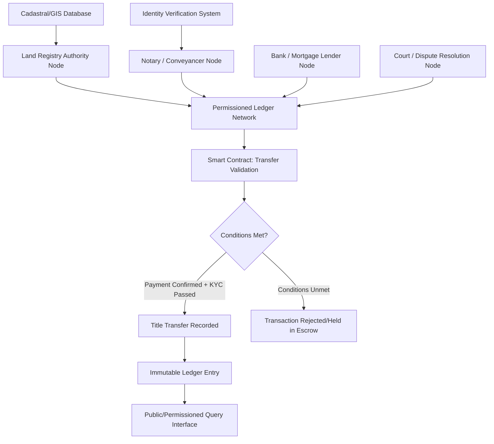

## Digital Recording and Blockchain Land Registries

### Overview

Digital land registries replace or supplement paper-based deed and title systems with electronic records, while blockchain-based registries extend this further by using distributed ledger technology (DLT) to record land transactions in a cryptographically verifiable, append-only structure. The legal significance lies not in the technology itself but in whether a jurisdiction's law recognizes the digital or blockchain record as legally dispositive of title (a "title registration" system) versus merely evidentiary (a "deeds recording" system).

### Foundational Distinction: Recording vs. Registration

- **Deeds recording system**: The registry stores a chronological record of executed instruments (deeds, mortgages, liens). Recording provides public notice and priority (often "first in time, first in right" or "race-notice" rules) but does not itself guarantee validity of title — a title search and chain-of-title analysis is required.
- **Title registration system (Torrens-style)**: The state registry itself is the source of legal title. Registration, not the underlying deed, confers ownership, and the register is generally conclusive ("mirror principle"), subject to limited statutory exceptions.

Digitizing a deeds system automates search and retrieval but does not change underlying legal risk (forged or defective instruments can still enter the chain). Digitizing or blockchain-enabling a Torrens-style system raises the possibility of the ledger itself functioning as the conclusive title record, which is legally more consequential.

### Why Blockchain Is Proposed for Land Registries

| Property | Relevance to Land Registration |
| --- | --- |
| Immutability (append-only) | Resists retroactive alteration of historical title records |
| Distributed consensus | Reduces single-point-of-failure/corruption risk in centralized registries |
| Cryptographic timestamping | Provides verifiable, tamper-evident sequencing of transactions |
| Smart contracts | Can automate conditional transfers (e.g., escrow release on payment confirmation) |
| Transparency | Enables public verifiability of the chain of transactions (where the ledger is public/permissioned-readable) |

[Inference] These properties address record-integrity risks (tampering, unauthorized alteration) more directly than they address title-validity risks (fraud at the point of entry, competing claims, boundary disputes), which remain dependent on the accuracy of the initial data entered onto the ledger — a limitation frequently described in land governance literature as the "garbage in, immutable garbage out" problem.

### Core Legal and Technical Architecture

#### Ledger Type Selection

- **Public permissionless** (e.g., Ethereum mainnet): Maximum transparency and censorship-resistance, but poor fit for land registries requiring identity-linked accountability, regulatory compliance, and the ability to correct entries via legally sanctioned processes (court orders, statutory correction).
- **Permissioned/consortium ledger** (e.g., Hyperledger Fabric, Corda): Access and write privileges restricted to authorized nodes (land registry authority, notaries, banks, courts). This is the dominant architecture in actual government pilots, since it preserves state control over who can register title while retaining tamper-evidence and multi-party verification.
- **Hybrid**: Public ledger anchors periodic cryptographic hashes of a permissioned registry's state (a "proof of existence" checkpoint), combining state control with public auditability.

#### Typical System Components

#### Integration Requirements

1. **Cadastral integration**: The ledger must reference authoritative parcel boundary data (GIS/cadastral survey); blockchain does not resolve boundary disputes or surveying accuracy issues.
2. **Digital identity layer**: Reliable KYC/identity verification of parties is a prerequisite — a cryptographically secure but identity-unverified transaction is legally meaningless for title purposes.
3. **Legal recognition layer**: Statutory amendment is typically required so that a blockchain entry satisfies "writing" and "signature" requirements under existing land transfer, statute of frauds, or registration statutes.
4. **Interoperability**: APIs or oracles connecting the ledger to external systems (tax records, court judgments, mortgage registries) to keep encumbrance data current.
5. **Correction/reversal mechanism**: A legally compliant process for correcting erroneous entries (court order, registrar override) that does not violate the ledger's immutability property — typically implemented as a compensating new entry rather than deletion, preserving the historical record while updating current status.

### Smart Contracts in Land Transactions

Smart contracts can automate parts of a conveyance:

- **Escrow automation**: Funds release automatically upon on-chain confirmation of registered transfer.
- **Conditional transfers**: Transfer executes only when specified conditions (payment, regulatory clearance, lien satisfaction) are cryptographically verified.
- **Automated encumbrance flagging**: A smart contract can block a purported transfer where the ledger shows an existing mortgage or lien has not been discharged.

**Limitations**: Smart contracts execute code deterministically but cannot independently assess legal validity of consent, capacity, fraud, or undue influence — issues central to real property law. [Inference] Most legal scholarship treats smart contracts in this domain as automation of a settlement/escrow layer sitting atop a still-necessary legal instrument, rather than a full substitute for it, though the degree of substitution varies by jurisdiction and pilot design.

### Notable Real-World Implementations

- **Sweden (Lantmäteriet)**: Piloted a blockchain-based system to digitize the conveyancing process (contract, bank verification, registration) with legally binding digital signatures, in partnership with ChromaWay, though full production rollout has been incremental rather than complete replacement of the existing system.
- **Georgia (country)**: Partnered with Bitfury to anchor land title hashes to the Bitcoin blockchain, using blockchain as a tamper-evidence layer atop the existing state registry rather than replacing it.
- **India (Andhra Pradesh, Telangana)**: Piloted blockchain land record systems targeting land fraud reduction, in some cases in partnership with technology vendors, integrated with existing Dharani/land record digitization programs.
- **Ghana, Honduras**: Explored blockchain land titling primarily to address weak baseline land administration and reduce corruption/fraud risk in contexts with limited institutional trust, with mixed reported outcomes on full implementation.

[Unverified] Public reporting on the scale, permanence, and measured fraud-reduction outcomes of several of these pilots is inconsistent between government announcements and independent evaluation; claims of full production-scale replacement of legacy registries should be treated cautiously absent primary-source verification.

### Legal Risks and Open Questions

- **Legal recognition gap**: In many jurisdictions, statutes governing deeds, conveyances, and registration predate blockchain and do not clearly address whether a distributed ledger entry satisfies statutory formalities (writing, execution, registration).
- **Immutability vs. correction**: Land law has long-standing mechanisms for correcting registry errors (rectification, court-ordered amendment); a purely immutable ledger is in tension with this unless a governance layer for authorized correction is designed in from the outset.
- **Private key loss/theft**: Loss of a cryptographic key controlling a registered interest raises novel questions absent from paper-based systems — courts have limited precedent on remedies.
- **Jurisdictional conflict-of-laws**: Where nodes or validators are distributed across jurisdictions, questions arise as to which jurisdiction's law governs a disputed entry.
- **Data protection**: Immutable, potentially public ledgers conflict with data protection frameworks (e.g., GDPR's "right to erasure") when personal data is embedded on-chain; standard mitigation is storing only hashes on-chain with underlying personal data off-chain.
- **Fraud at data entry**: Blockchain secures the record after entry; it does not prevent fraudulent documents or false claims from being the first entry accepted onto the ledger (the "first registration" problem), meaning due diligence obligations at the initial digitization/registration stage remain unchanged in substance.

### Comparative Table: Traditional vs. Digital vs. Blockchain Registry

| Feature | Paper Deeds Registry | Digital (Centralized DB) Registry | Blockchain (Permissioned) Registry |
| --- | --- | --- | --- |
| Tamper resistance | Low | Moderate (admin access risk) | High (requires ledger consensus to alter) |
| Search/retrieval speed | Slow | Fast | Fast |
| Single point of failure | High (physical loss/damage) | High (server/admin compromise) | Reduced (distributed nodes) |
| Correction mechanism | Established legal process | Established legal process | Requires purpose-built governance layer |
| Legal recognition maturity | Well-established | Well-established in most jurisdictions | Often requires new/amended legislation |
| Initial fraud prevention | Depends on registrar diligence | Depends on registrar diligence | Depends on registrar/oracle diligence (unchanged) |

### Practical Considerations for Practitioners

- Confirm whether the relevant jurisdiction has amended its land registration or evidence statutes to recognize distributed ledger entries as valid written instruments before relying on a blockchain record as dispositive of title.
- In cross-border or pilot-stage systems, verify whether the blockchain layer is authoritative (title-conferring) or merely an integrity/audit layer atop a still-authoritative traditional registry — the practical legal risk differs substantially between the two.
- Assess key management and succession planning for blockchain-recorded interests, particularly for individual (non-institutional) titleholders, as most jurisdictions lack established probate/succession procedures for cryptographic key transfer.
- Treat vendor and government claims of "fraud elimination" or "immutable title" with caution absent independent audit — immutability secures the ledger, not the underlying legal facts entered onto it.

**Related Topics**

- Torrens Title Registration Systems
- Cadastral Survey and GIS Integration with Land Records
- Smart Contracts and Automated Escrow in Conveyancing
- Digital Identity and KYC in Property Transactions
- Data Protection Conflicts in Immutable Ledgers (GDPR and Right to Erasure)
- Comparative Government Blockchain Land Registry Pilots
- Cryptographic Key Loss and Succession in Digital Property Rights
- Legal Recognition of Electronic Signatures in Real Property Transfers