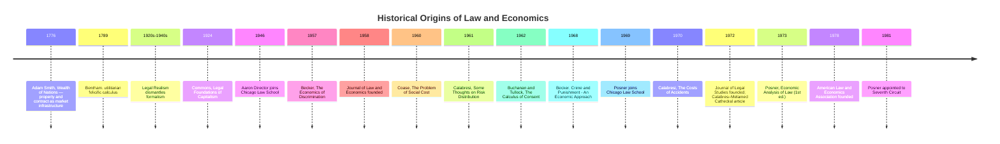

## Historical Origins of the Law and Economics Movement

### Overview and Definitional Scope

The law and economics movement refers to the application of microeconomic theory, particularly price theory and welfare economics, to the analysis of legal rules, institutions, and processes. As a distinct intellectual movement, it is conventionally dated to the mid-20th century, though its intellectual antecedents reach back considerably further. The movement is distinguished from mere "economics of law" scholarship by its programmatic ambition: not simply to describe how legal rules affect economic outcomes, but to use economic reasoning as a unifying analytical framework for understanding and evaluating law across virtually every doctrinal area — property, contracts, torts, crime, procedure, family law, and constitutional design.

Two broad strands are typically distinguished in the historiography of the field:

- **Old Law and Economics**: Predominantly concerned with the direct regulation of explicitly economic activity — antitrust, public utility regulation, labor law, taxation. This tradition dates to the late 19th and early 20th centuries and treated "economics" and "law" as overlapping only where legal rules governed markets directly.
- **New Law and Economics**: Emerging primarily from the University of Chicago beginning in the late 1950s and early 1960s, this strand extended economic analysis to *all* areas of law, including those with no obvious market character, such as tort liability, criminal punishment, marriage, and litigation procedure. This is the tradition most commonly meant when scholars refer to "Law and Economics" as a movement.

### Pre-20th Century Intellectual Antecedents

**Classical Political Economy and Law**

Economic reasoning about legal institutions did not originate in the 20th century. Adam Smith's *Wealth of Nations* (1776) contains extended discussion of property rights, contract enforcement, and the role of law in enabling market exchange, treating legal infrastructure as a precondition for the "invisible hand" mechanism to function. Smith's *Lectures on Jurisprudence* more directly analyzed the economic functions of property and contract law.

Jeremy Bentham's utilitarianism, developed in works such as *An Introduction to the Principles of Morals and Legislation* (1789), supplied a normative framework — the maximization of aggregate utility — that would later underpin welfarist approaches to legal evaluation. Bentham explicitly argued that legal rules, including criminal punishment, should be calibrated according to a felicific calculus weighing costs and benefits. This utilitarian-consequentialist orientation toward law is a direct conceptual ancestor of modern efficiency-based legal analysis, even though Bentham's own apparatus lacked the formal marginalist tools of later economics.

**Legal Realism**

American Legal Realism, flourishing roughly from the 1920s through the 1940s and associated with figures such as Karl Llewellyn and Jerome Frank, challenged the formalist view that legal doctrine was a self-contained, logically deducible system. Realists insisted that judicial decisions were shaped by social and economic context and that legal scholarship should draw on social-scientific methods, including economics, to understand how law actually functioned and to evaluate its consequences. Legal Realism did not itself produce a systematic economic theory of law, but it dismantled the formalist orthodoxy and created intellectual space for social-scientific — including economic — analysis of doctrine. Many historians treat Legal Realism as a necessary precondition for the later law and economics movement, since it normalized the idea that legal rules should be assessed by their real-world consequences rather than their internal doctrinal coherence.

**Institutional Economics**

Early 20th-century institutional economists, including John R. Commons and Robert Lee Hale, examined how legal rules — particularly property and contract rules — structured bargaining power and economic outcomes. Commons's *Legal Foundations of Capitalism* (1924) argued that the legal system was constitutive of economic relations rather than a neutral background against which markets operated. Hale's work on bargaining power under formally "voluntary" contracts anticipated later law and economics concerns with transaction costs and the allocation of legal entitlements, though institutionalists were generally skeptical of the free-market conclusions that the Chicago School would later derive from similar starting observations.

### The Old Law and Economics: Regulatory Economics

Before the 1960s, "law and economics" scholarship (to the extent the label was used at all) concentrated on fields where the economic character of the subject matter was self-evident: antitrust, rate regulation of public utilities, and labor relations. Scholars associated with this tradition, often centered at Columbia and other institutions, analyzed how legal rules shaped market structure and competitive conduct. This work was doctrinally significant but methodologically limited — it did not claim that economic analysis could illuminate contract formation doctrine, tort negligence standards, or criminal sentencing, areas that were regarded as the province of moral and doctrinal reasoning rather than price theory.

### The Chicago School and the Emergence of the "New" Law and Economics

**Aaron Director and the Antitrust Foundations**

The immediate institutional origin of the modern movement is usually traced to Aaron Director, an economist who joined the University of Chicago Law School faculty in 1946 and co-founded the *Journal of Law and Economics* in 1958. Director applied price-theoretic reasoning to antitrust doctrine, arguing that many business practices condemned by courts as anticompetitive — such as tying arrangements and resale price maintenance — could be explained as efficient responses to transaction costs and information problems rather than as exercises of monopoly power. Director did not publish extensively himself, but his influence on colleagues and students at Chicago Law School was foundational to the school's distinctive approach: skepticism toward regulatory intervention grounded in rigorous price-theoretic analysis rather than ideological presumption alone.

**Ronald Coase and "The Problem of Social Cost" (1960)**

The single most influential article in the movement's founding period is Ronald Coase's "The Problem of Social Cost," published in the *Journal of Law and Economics* in 1960. Coase challenged the prevailing Pigouvian view that externalities (such as pollution) required corrective government intervention — taxes or direct regulation — to align private and social costs. Coase argued that in a world of zero transaction costs, the initial legal assignment of property rights or liability would not affect the efficiency of the ultimate resource allocation, because parties would bargain to the efficient outcome regardless of which party initially bore the legal entitlement. This proposition was later termed the **Coase Theorem** by George Stigler.

Coase's deeper and arguably more important point — often overshadowed by the zero-transaction-cost theorem — was that *because transaction costs are never actually zero in the real world*, the assignment of legal rights and liabilities by courts and legislatures has first-order efficiency consequences. This reframed the central question of legal analysis: rather than asking who is at "fault," courts should ask which assignment of rights minimizes the sum of transaction costs and the costs of the externality-generating activity. This insight is widely regarded as the founding theoretical move of modern law and economics because it gave economists a rigorous, general reason why legal rules matter for allocative efficiency across all fields, not merely explicitly regulatory ones.

$$\text{Coase Theorem (informal statement)}: \quad TC = 0 \implies \text{Efficient outcome is independent of initial legal entitlement}$$

where $TC$ denotes aggregate transaction costs of bargaining among affected parties.

**Guido Calabresi and the Economics of Torts**

Contemporaneously, Guido Calabresi at Yale published "Some Thoughts on Risk Distribution and the Law of Torts" (1961), applying economic reasoning to accident law. Calabresi analyzed tort liability rules in terms of their capacity to minimize the sum of accident costs, the costs of accident prevention, and the administrative costs of the liability system — a framework that paralleled Coase's transaction-cost logic but was developed largely independently and applied specifically to torts. Calabresi's later book *The Costs of Accidents* (1970) extended this into a comprehensive economic theory of tort law, distinguishing primary cost avoidance (reducing the number/severity of accidents), secondary cost avoidance (spreading losses), and tertiary cost avoidance (minimizing administrative costs).

Calabresi is also credited, together with A. Douglas Melamed, with the later and highly influential "Cathedral" framework (1972) distinguishing property rules, liability rules, and inalienability rules as alternative mechanisms for protecting legal entitlements — a taxonomy that became a staple analytical tool throughout the field.

**Guido Calabresi vs. Chicago: Two Founding Traditions**

It is a standard point in the historiography that the movement had two largely independent points of origin that later converged: the Chicago tradition (Director, Coase, and subsequently Posner), oriented toward price theory and generally skeptical of regulatory intervention, and the Yale tradition (Calabresi), more explicitly concerned with distributive justice and loss-spreading alongside efficiency, and more open to regulatory correction of market failures. Both traditions shared the core methodological commitment to analyzing legal rules through the lens of costs, incentives, and resource allocation, but they differed in normative orientation and in their assessment of when markets versus legal intervention was the superior efficiency-producing mechanism.

**Gary Becker and the Economics of Crime and Discrimination**

Gary Becker, also at Chicago, extended price-theoretic analysis into domains previously considered entirely outside the reach of economics: crime, punishment, discrimination, and the family. Becker's "Crime and Punishment: An Economic Approach" (1968) modeled criminal behavior as a rational response to the expected costs and benefits of offending, treating the probability of detection and the severity of punishment as prices that could be optimized to deter crime efficiently. Becker's earlier *The Economics of Discrimination* (1957) had already demonstrated his willingness to apply economic modeling to social phenomena outside conventional market transactions. Becker's work exemplified the "economic imperialism" characteristic of the Chicago approach — the claim that rational-choice economic modeling could illuminate virtually any domain of human behavior, including behavior nominally governed by legal and moral rules rather than market prices.

### Richard Posner and the Systematization of the Field

Richard Posner, who joined the University of Chicago Law School in 1969 after a period at Stanford, is generally credited with synthesizing the scattered insights of Coase, Calabresi, Becker, and Director into a comprehensive, systematic treatment of the entire legal system through the lens of economic efficiency. His treatise *Economic Analysis of Law* (first edition 1973) was the first work to apply economic analysis methodically across the full range of legal doctrine — property, contracts, torts, criminal law, family law, procedure, and constitutional law — and remains the field's most widely used textbook, having gone through many subsequent editions.

Posner's central and most controversial theoretical claim was the **efficiency thesis of the common law**: the proposition that many rules of Anglo-American common law, as they had evolved through case-by-case adjudication, tend systematically toward economic efficiency (wealth maximization), even though the judges who created these rules were rarely explicitly reasoning in economic terms. Posner offered several candidate explanations for this pattern, including the possibility that inefficient rules generate more litigation (because they leave larger unrealized gains from bargaining or rule change on the table) and are therefore more likely to be challenged and overturned than efficient rules, which tend to be more stable — an argument developed further by Paul Rubin and George Priest in the "efficiency of the common law" hypothesis literature of the late 1970s.

Posner also proposed **wealth maximization** as a normative standard for legal decision-making, distinguishing it from the Kaldor-Hicks efficiency criterion economics more commonly relies upon. This normative claim proved especially controversial among legal philosophers, generating a substantial critical literature (see below).

### Institutionalization of the Field

The movement's transition from a set of scattered insights to an organized academic field is marked by several institutional milestones:

- **1958**: Founding of the *Journal of Law and Economics* at the University of Chicago, under the editorship of Aaron Director, providing the first dedicated publication outlet for the field.
- **1960**: Publication of Coase's "The Problem of Social Cost" in the *Journal of Law and Economics*.
- **1972**: Founding of the *Journal of Legal Studies* at the University of Chicago Law School, broadening the field's publication venues beyond explicitly economic journals.
- **1973**: Publication of the first edition of Posner's *Economic Analysis of Law*.
- **1978**: Founding of the American Law and Economics Association (ALEA), providing an institutional and conference infrastructure for the field's growing membership.
- Throughout the 1970s and 1980s: Spread of law and economics courses and dedicated faculty positions to law schools beyond Chicago, including Yale, Harvard, Stanford, Virginia, and George Mason, each developing somewhat distinct emphases (e.g., George Mason's closer alignment with Austrian and public choice economics).
- **1980s onward**: Posner's appointment to the U.S. Court of Appeals for the Seventh Circuit (1981) gave the movement unusual practical influence, as Posner's judicial opinions frequently employed explicit economic reasoning, demonstrating the framework's applicability to actual adjudication rather than purely academic analysis.

### The Public Choice and Constitutional Economics Tributary

A related but analytically distinct tributary to the broader law and economics movement is public choice theory, associated with James Buchanan and Gordon Tullock, whose *The Calculus of Consent* (1962) applied economic reasoning to collective decision-making and constitutional design, treating legislators, bureaucrats, and voters as self-interested rational actors rather than disinterested servants of the public good. While public choice theory developed somewhat independently of the Coase-Calabresi-Becker-Posner tradition, it became closely associated with law and economics scholarship on legislation, regulation, and constitutional structure, particularly at George Mason University, which became a distinct institutional center for public-choice-inflected law and economics from the 1980s onward.

### Timeline of Key Developments

### Conceptual Map of Founding Contributions (svg_diagram)

<svg xmlns="http://www.w3.org/2000/svg" viewBox="0 0 900 560">
<text x="450" y="30" text-anchor="middle" font-size="20" font-weight="bold" fill="#222">Founding Contributions to Law and Economics (svg_diagram)</text>

<rect x="30" y="60" width="180" height="70" rx="8" fill="#e8eef7" stroke="#3a5a8c" stroke-width="1.5" />
<text x="120" y="85" text-anchor="middle" font-size="13" font-weight="bold" fill="#1f3350">Antecedents</text>
<text x="120" y="103" text-anchor="middle" font-size="11" fill="#333">Smith, Bentham,</text>
<text x="120" y="118" text-anchor="middle" font-size="11" fill="#333">Legal Realism, Commons</text>

<rect x="330" y="60" width="180" height="70" rx="8" fill="#fdf1e0" stroke="#b5772f" stroke-width="1.5" />
<text x="420" y="85" text-anchor="middle" font-size="13" font-weight="bold" fill="#5c3d15">Aaron Director</text>
<text x="420" y="103" text-anchor="middle" font-size="11" fill="#333">Antitrust price theory</text>
<text x="420" y="118" text-anchor="middle" font-size="11" fill="#333">JLE founded 1958</text>

<rect x="30" y="180" width="220" height="80" rx="8" fill="#e6f4ea" stroke="#2f7a45" stroke-width="1.5" />
<text x="140" y="205" text-anchor="middle" font-size="13" font-weight="bold" fill="#1e4d2b">Ronald Coase (1960)</text>
<text x="140" y="223" text-anchor="middle" font-size="11" fill="#333">Problem of Social Cost</text>
<text x="140" y="238" text-anchor="middle" font-size="11" fill="#333">Transaction costs +</text>
<text x="140" y="252" text-anchor="middle" font-size="11" fill="#333">entitlement assignment</text>

<rect x="300" y="180" width="220" height="80" rx="8" fill="#f4e9f7" stroke="#7a3f8c" stroke-width="1.5" />
<text x="410" y="205" text-anchor="middle" font-size="13" font-weight="bold" fill="#4a2258">Guido Calabresi (1961+)</text>
<text x="410" y="223" text-anchor="middle" font-size="11" fill="#333">Tort cost-minimization</text>
<text x="410" y="238" text-anchor="middle" font-size="11" fill="#333">Yale tradition;</text>
<text x="410" y="252" text-anchor="middle" font-size="11" fill="#333">property/liability rules</text>

<rect x="570" y="180" width="220" height="80" rx="8" fill="#fdeaea" stroke="#a63b3b" stroke-width="1.5" />
<text x="680" y="205" text-anchor="middle" font-size="13" font-weight="bold" fill="#5c1f1f">Gary Becker (1968)</text>
<text x="680" y="223" text-anchor="middle" font-size="11" fill="#333">Crime as rational choice</text>
<text x="680" y="238" text-anchor="middle" font-size="11" fill="#333">Economic imperialism</text>
<text x="680" y="252" text-anchor="middle" font-size="11" fill="#333">into non-market domains</text>

<rect x="570" y="60" width="220" height="70" rx="8" fill="#eaf3f7" stroke="#2f6b7a" stroke-width="1.5" />
<text x="680" y="85" text-anchor="middle" font-size="13" font-weight="bold" fill="#1c3e47">Buchanan &amp; Tullock</text>
<text x="680" y="103" text-anchor="middle" font-size="11" fill="#333">Calculus of Consent (1962)</text>
<text x="680" y="118" text-anchor="middle" font-size="11" fill="#333">Public choice tributary</text>

<rect x="280" y="330" width="280" height="90" rx="8" fill="#fff6da" stroke="#8c6d1f" stroke-width="2" />
<text x="420" y="358" text-anchor="middle" font-size="14" font-weight="bold" fill="#4d3b0f">Richard Posner (1973)</text>
<text x="420" y="378" text-anchor="middle" font-size="11" fill="#333">Economic Analysis of Law</text>
<text x="420" y="393" text-anchor="middle" font-size="11" fill="#333">Systematizes field across all doctrine</text>
<text x="420" y="408" text-anchor="middle" font-size="11" fill="#333">Common-law efficiency thesis</text>

<rect x="230" y="460" width="380" height="80" rx="8" fill="#eef2f5" stroke="#555" stroke-width="1.5" />
<text x="420" y="485" text-anchor="middle" font-size="13" font-weight="bold" fill="#222">Institutionalization</text>
<text x="420" y="503" text-anchor="middle" font-size="11" fill="#333">Journal of Legal Studies (1972)</text>
<text x="420" y="518" text-anchor="middle" font-size="11" fill="#333">ALEA (1978); spread to law schools nationwide</text>

<line x1="120" y1="130" x2="140" y2="180" stroke="#555" stroke-width="1.5" marker-end="url(#arrow)" />
<line x1="420" y1="130" x2="180" y2="180" stroke="#555" stroke-width="1.5" marker-end="url(#arrow)" />
<line x1="140" y1="260" x2="380" y2="330" stroke="#555" stroke-width="1.5" marker-end="url(#arrow)" />
<line x1="410" y1="260" x2="420" y2="330" stroke="#555" stroke-width="1.5" marker-end="url(#arrow)" />
<line x1="680" y1="260" x2="470" y2="330" stroke="#555" stroke-width="1.5" marker-end="url(#arrow)" />
<line x1="680" y1="130" x2="500" y2="330" stroke="#555" stroke-width="1.5" marker-end="url(#arrow)" />
<line x1="420" y1="420" x2="420" y2="460" stroke="#555" stroke-width="1.5" marker-end="url(#arrow)" />
</svg>

### Contemporaneous Critiques and Rival Traditions

The movement's emergence provoked significant contemporaneous and subsequent critique, which is itself part of the historical record of the field's development:

- **Critical Legal Studies (CLS)**, emerging in the late 1970s, challenged the notion that legal rules could be evaluated by a supposedly neutral efficiency criterion, arguing that "efficiency" itself embeds contestable distributive and political assumptions.
- **Ronald Dworkin** and other legal philosophers criticized Posner's wealth-maximization thesis on the grounds that wealth (measured by willingness-to-pay, which presupposes an existing distribution of resources) cannot serve as a defensible foundation for justice independent of that prior distribution.
- Institutionalist economists, the intellectual descendants of Commons and Hale, continued to argue that the Chicago approach naturalized existing property-rights distributions rather than treating them as themselves contestable and historically contingent.
- Behavioral law and economics, emerging significantly later (from the 1990s onward, associated with scholars such as Cass Sunstein, Christine Jolls, and Richard Thaler), challenged the rational-actor assumptions underlying the Beckerian and Chicago tradition, though this is generally treated as a later evolution of the field rather than part of its historical origins.

[Inference] The precise causal weight to assign to Legal Realism versus Institutional Economics versus classical political economy in "producing" the Chicago School synthesis is a matter of ongoing historiographical debate rather than settled consensus; different intellectual historians of the field emphasize these antecedents differently.

**Related Topics**

- The Coase Theorem: formal statement, assumptions, and critiques
- Chicago School versus Yale School approaches to law and economics
- Posner's wealth-maximization norm and its philosophical critics
- Public choice theory and constitutional political economy
- The efficiency-of-the-common-law hypothesis (Rubin, Priest, Goodman)
- Legal Realism as a precursor movement
- Institutional economics (Commons, Hale) and the "bargaining power" critique
- Behavioral law and economics as a later methodological challenge to rational-choice foundations
- Property rules, liability rules, and inalienability rules (Calabresi-Melamed framework)
- Institutional history: founding of the Journal of Law and Economics, Journal of Legal Studies, and ALEA