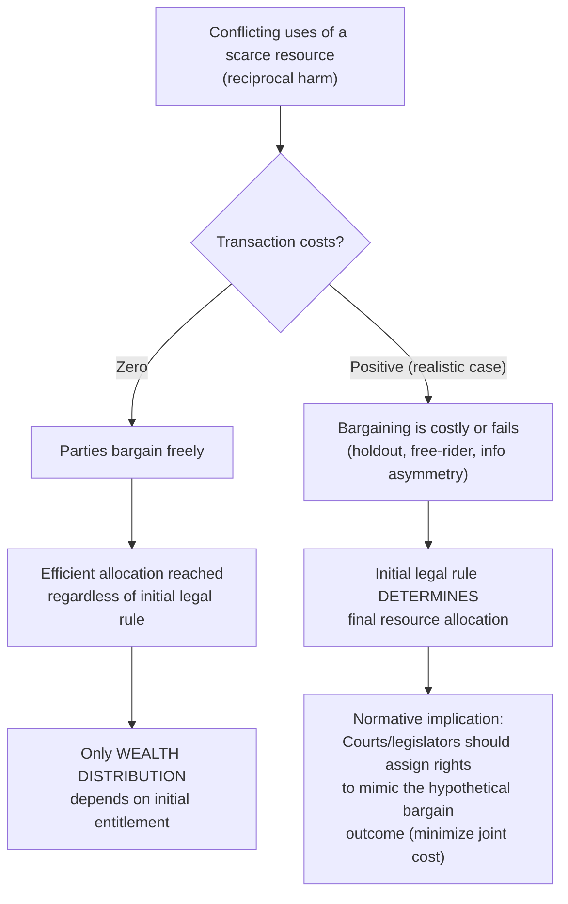

## Ronald Coase and the Founding Insights of the Field

### Biographical and Institutional Context

Ronald H. Coase (1910–2013) was a British-American economist who spent the formative and most influential part of his academic career at the University of Chicago Law School, where he joined the faculty in 1964 and edited the *Journal of Law and Economics* from 1964 to 1982. Coase's two most consequential articles — "The Nature of the Firm" (1937) and "The Problem of Social Cost" (1960) — were written decades apart but share a common analytical thread: both interrogate what happens to economic organization and legal doctrine once the classical assumption of *costless transacting* is abandoned. Coase was awarded the Nobel Memorial Prize in Economic Sciences in 1991 explicitly for having "discovered and clarified the significance of transaction costs and property rights for the institutional structure and functioning of the economy."

### "The Nature of the Firm" (1937): The Prequel Insight

Although predating the law and economics movement proper by over two decades, "The Nature of the Firm" contains the conceptual seed of Coase's later work and is properly treated as foundational to the field's methodology. Coase posed a deceptively simple question: if markets are the efficient mechanism for allocating resources through the price system, why do firms — internal hierarchies that allocate resources by managerial fiat rather than price signals — exist at all?

Coase's answer was that using the market is not costless. There are costs of discovering relevant prices, negotiating and concluding separate contracts for each transaction, and enforcing those contracts. Firms emerge and expand up to the point where the cost of organizing an additional transaction internally (through managerial direction) equals the cost of carrying out that same transaction via the market. This was the first rigorous introduction of what would later be termed **transaction costs** into mainstream economic analysis, and it established the methodological template Coase would apply to law in 1960: institutional form (whether firm vs. market, or one legal rule vs. another) is explained by comparative transaction costs, not by technology or preferences alone.

### "The Problem of Social Cost" (1960): Structure of the Argument

Published in the inaugural years of the *Journal of Law and Economics*, this article is the single most cited work in modern legal scholarship and is conventionally treated as the founding text of the law and economics movement. Its argument proceeds in several distinct analytical stages.

**Stage 1 — Critique of the Pigouvian Tradition**

Coase began by attacking the standard treatment of externalities inherited from Arthur Pigou's *The Economics of Welfare* (1920). The Pigouvian approach treated externalities (e.g., a factory's smoke damaging a neighboring laundry) as a *unilateral* harm inflicted by an injurer on a victim, correctable by taxing the injurer an amount equal to the marginal external cost, thereby forcing the injurer to internalize the harm.

Coase reframed the problem as fundamentally **reciprocal**. Harm, in his framing, is not a one-directional imposition but the joint product of two conflicting uses of a scarce resource: the factory wants to emit smoke, and the laundry wants clean air; both cannot be satisfied simultaneously, and asking "who caused the harm" is analytically confused, since the question is symmetric — the laundry, by locating adjacent to the factory, "causes" the harm to the factory's ability to emit smoke just as much as the factory causes harm to the laundry. This reframing is one of the article's most durable conceptual contributions: it displaced the intuitive, causally unilateral notion of harm with an economic notion centered on the incompatibility of competing resource uses.

**Stage 2 — The Zero-Transaction-Cost Case (The "Coase Theorem")**

Coase then constructed a thought experiment: suppose transaction costs are zero (no cost of identifying the relevant parties, negotiating, or enforcing agreements) and property rights are clearly defined and enforced (though not necessarily allocated efficiently at the outset). Under these conditions, Coase showed — through worked examples involving straying cattle damaging a neighboring farmer's crops — that the parties will bargain to whichever allocation of resources maximizes their joint (aggregate) value, *regardless* of which party is initially assigned the legal entitlement.

If the entitlement is assigned inefficiently at the outset (e.g., the rancher has a legal right to let cattle stray even though the crop damage exceeds the value of the extra grazing), the party who values the resource more highly (the farmer) will simply pay the party who holds the entitlement (the rancher) to change behavior, so long as the payment is less than the farmer's loss avoided and more than the rancher's gain forgone. The final allocation of resources converges to the efficient outcome, and only the *distribution* of wealth between the parties differs depending on the initial legal rule.

This result was later formalized and named by George Stigler in his 1966 textbook *The Theory of Price*, where it was labeled the **Coase Theorem**. Coase himself never used this term and later expressed some discomfort with how the "theorem" was popularized in isolation from the article's broader argument, which he regarded as primarily about the pervasive reality of positive transaction costs, not their absence.

$$\text{If } TC = 0 \text{ and property rights are well-defined,} \quad \text{then} \quad \text{efficient allocation is achieved regardless of initial entitlement assignment}$$

A simplified numerical illustration of the bargaining logic:

| Scenario | Rancher's gain from straying cattle | Farmer's crop loss | Efficient outcome | Result under "rancher has right to graze" | Result under "farmer has right to be free of damage" |
| --- | --- | --- | --- | --- | --- |
| A | $100 | $150 | Cattle fenced | Farmer pays rancher between $100–150 to fence cattle → fenced | Rancher must fence (no bargain needed) → fenced |
| B | $150 | $100 | Cattle allowed to stray | No bargain needed → cattle stray | Rancher pays farmer between $100–150 for right to stray → cattle stray |

In both scenarios, the efficient outcome (whichever maximizes joint value) is reached under either initial rule — only the direction of the compensating payment, and hence the distribution of wealth, changes. [Inference] This table is a standard pedagogical illustration used throughout the secondary literature to convey Coase's argument; the specific numbers are illustrative constructs rather than a reproduction of Coase's own worked example, which used different figures.

**Stage 3 — The Positive-Transaction-Cost World: The Article's Actual Point**

Coase devoted the majority of the article — and regarded this as its central contribution — to the realistic case in which transaction costs are *positive* and often prohibitively high. Where transacting is costly (due to the number of parties involved, information asymmetries, holdout and free-rider problems, or enforcement costs), private bargaining will not reliably correct an inefficient initial assignment of rights. In this world, the initial legal rule chosen by courts or legislatures **does** determine the ultimate allocation of resources, because the parties cannot costlessly bargain around a "wrong" assignment.

This yields Coase's central *positive* prescription for legal decision-making: since transaction costs are typically positive, courts and legislators — when assigning liability, structuring property rights, or designing regulation — should assign the entitlement to the party who would have acquired it through bargaining had transaction costs been zero. That is, legal rules should be designed to **mimic the market outcome that costless bargaining would have produced**, thereby minimizing the welfare loss attributable to the fact that actual bargaining is costly. This is sometimes summarized as assigning rights to the "least-cost avoider" or structuring liability to minimize the sum of the costs of the harmful interaction, a formulation later developed with greater analytical precision by Guido Calabresi in the tort context.

### Diagrammatic Summary of the Coasean Argument

### Why This Reframed the Central Question for Legal Analysis

Coase's article performed a decisive reorientation of the analytical question legal decision-makers should ask. The pre-Coasean, Pigouvian framing asked: *who caused the harm, and how do we make the injurer pay for it?* Coase's framing asks instead: *given that harm is reciprocal and bargaining is costly, which assignment of the legal entitlement minimizes the total social cost of the conflicting resource uses, inclusive of transaction costs?*

This reorientation had several downstream consequences that structured the subsequent development of the entire field:

- **Property law** could be reanalyzed as a mechanism for defining entitlements so as to minimize the transaction costs of subsequent bargaining (giving rise to later literature on the choice between "property rules" and "liability rules," developed by Calabresi and Melamed in 1972).
- **Tort law** could be reanalyzed not as a search for moral fault but as a mechanism for minimizing the joint costs of accidents and accident avoidance — the direct ancestor of the Learned Hand negligence formula's later economic reinterpretation and of Calabresi's cost-minimization framework.
- **Regulatory economics** was reoriented away from a presumption that externalities automatically justified Pigouvian taxation, toward a comparative-institutional inquiry asking whether markets, courts (via tort/property rules), or direct regulation would minimize costs given the transaction-cost environment of the specific externality at issue.
- The general lesson — that **institutions matter because transacting is costly**, and that comparative institutional analysis (not idealized market benchmarks) should guide legal and regulatory design — became the methodological core of the Chicago tradition in law and economics and is often described as **comparative institutional analysis**, a term later developed explicitly by Coase's intellectual successors, including Harold Demsetz and, in a related vein, Oliver Williamson's transaction cost economics of contracting.

### Key Points

- Coase's contribution is properly understood as two linked insights, separated by 23 years: transaction costs explain the boundary of the firm (1937), and transaction costs explain why the initial legal assignment of rights matters for resource allocation (1960).
- The "Coase Theorem" (zero-transaction-cost invariance result) is frequently mischaracterized as Coase's main point; Coase himself treated it as an analytical stepping stone toward the article's real argument about the positive-transaction-cost world.
- The reciprocal-causation reframing of externalities — replacing "who caused the harm" with "which use of the resource should prevail" — is arguably as significant a conceptual contribution as the transaction-cost analysis itself, since it strips moralized fault language from the initial economic analysis of harm (though Coase did not argue that fault-based reasoning is irrelevant to legal doctrine generally, only that it is not the right starting point for identifying the efficient allocation).
- Coase's prescriptive upshot — assign entitlements to mimic the zero-transaction-cost bargain — became a template economic criterion for evaluating common law rules across property, tort, and contract doctrine.

### Related Topics

- The Coase Theorem: formal conditions, critiques (Regan, Cooter, Coleman), and empirical tests
- "The Nature of the Firm" and the theory of the boundaries of organizations
- Calabresi and Melamed's property rules/liability rules/inalienability framework as a direct extension of Coase
- Pigouvian taxation versus Coasean bargaining as alternative externality solutions
- Transaction cost economics (Oliver Williamson) and its relationship to Coase's framework
- The efficiency-of-the-common-law hypothesis as a possible mechanism realizing Coasean outcomes
- Holdout problems, free-rider problems, and other sources of positive transaction costs
- Demsetz's theory of property rights emergence as a parallel transaction-cost account