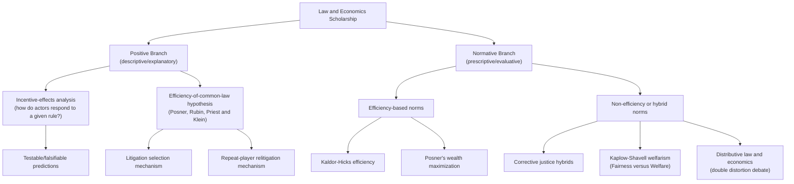

## Positive versus Normative Law and Economics

### Overview of the Distinction

The distinction between positive and normative analysis is foundational to economics generally and takes on particular significance in law and economics, where the object of study — legal rules — is itself typically understood as a normative enterprise (rules about what people *ought* to do, backed by state sanction). Law and economics scholarship operates on both sides of this divide, and confusion between the two modes is a recurring source of both scholarly error and cross-disciplinary miscommunication between economists and lawyers.

- **Positive law and economics** is descriptive and explanatory. It asks: what *are* the effects of a given legal rule on behavior, resource allocation, and welfare? Does the common law, as it has actually developed, tend to promote efficiency? What incentives does a particular liability rule create? These are empirical or theoretical claims about cause and effect, in principle verifiable or falsifiable, that make no claim about what the law *should* be.
- **Normative law and economics** is prescriptive and evaluative. It asks: what legal rule *should* be adopted, given some evaluative criterion (typically efficiency, though not exclusively)? Should courts adopt a negligence rule or a strict liability rule for a given class of accidents? Should a jurisdiction recognize a given contract defense? These claims necessarily import a value judgment about which outcomes are desirable.

### The Positive Branch

**Explanatory Positive Analysis**

The most basic form of positive law and economics uses microeconomic theory (rational choice, incentive analysis, price theory) to predict how legal actors will respond to legal rules. For example, positive analysis of tort law asks how the standard of care imposed by negligence doctrine affects the level of precaution injurers and victims actually take, holding the legal rule fixed and treating actors as responding to the incentives the rule creates. This branch of the field is continuous with mainstream applied microeconomics — it treats law as one more parameter in an optimization or game-theoretic model of behavior, alongside prices, taxes, and other constraints.

**The Positive Theory of the Common Law (The "Efficiency Hypothesis")**

A more ambitious and historically distinctive branch of positive law and economics, associated principally with Richard Posner, Paul Rubin, and George Priest, advances the empirical/theoretical claim that the substantive rules of Anglo-American common law — as they have evolved through centuries of case-by-case adjudication — tend systematically toward economic efficiency, even though the judges who decided these cases were rarely reasoning explicitly in economic terms.

Several distinct mechanisms have been proposed to explain why judge-made law might converge on efficient rules absent any judicial intent to produce efficiency:

- **Litigation selection hypothesis** (Priest and Klein, 1984): Parties are more likely to litigate (rather than settle) disputes governed by inefficient rules, because such rules create larger stakes and greater uncertainty about outcomes, generating more opportunities for the rule to be challenged and revised; efficient rules, by contrast, tend to be settled out of court more often because their consequences are more predictable and the stakes of deviation are lower, insulating them from relitigation and revision.
- **Rubin's evolutionary hypothesis** (1977): Parties with a repeat-player interest in a given legal rule (e.g., an industry facing recurring liability questions) have stronger incentives to invest in relitigating inefficient rules that harm them than one-shot litigants do, producing selective pressure toward efficient rules in areas where repeat players are common.
- **Judicial preference hypothesis**: Some scholars have argued more directly that judges, particularly in commercial contexts, may have historically preferred efficient outcomes as a matter of professional norms or economic intuition, even without formal economic training.

This positive efficiency hypothesis is a testable (and heavily tested and contested) empirical claim. It should be sharply distinguished from the normative claim that courts *should* pursue efficiency — the positive claim asserts only that they *have*, as a matter of historical and doctrinal fact, tended to do so, for reasons that need not involve any judge's conscious efficiency-seeking.

### The Normative Branch

**Efficiency as a Normative Criterion**

Normative law and economics evaluates legal rules against an efficiency benchmark, most commonly one of the following formal welfare criteria, since Pareto superiority (a change that makes at least one person better off and no one worse off) is almost never achievable for real legal rules, which typically create both winners and losers:

$$\text{Kaldor-Hicks efficiency}: \quad \text{A change is efficient if the winners could, in principle, compensate the losers and still be better off}$$

$$\sum_i \Delta W_i > 0 \quad \text{(aggregate wealth or welfare increases, even without actual compensation)}$$

Kaldor-Hicks efficiency (also called potential Pareto improvement) does not require that compensation actually be paid, only that it be hypothetically possible — a feature that has made it both analytically tractable (it does not require interpersonal utility comparisons in the strong sense Pareto superiority avoids) and normatively controversial (critics note that a change satisfying Kaldor-Hicks can leave real, uncompensated losers worse off).

**Posner's Wealth Maximization Norm**

Richard Posner proposed a related but distinct normative criterion: **wealth maximization**, under which legal rules should be chosen to maximize the aggregate value of resources in society, as measured by what individuals are willing to pay for entitlements (rather than utility as such). Posner argued this criterion had several advantages over utilitarian welfare maximization, including greater administrability (willingness-to-pay is more directly observable than utility) and a closer fit with actual market-based valuation. The wealth maximization norm generated substantial philosophical controversy — most prominently from Ronald Dworkin — because willingness-to-pay is itself a function of the existing distribution of wealth, making the criterion arguably circular or question-begging as a foundation for evaluating the fairness of that same distribution.

**Alternative Normative Criteria within Law and Economics**

Not all normative law and economics scholarship treats efficiency as the sole or even primary criterion:

- **Distributive/redistributive concerns**: Scholars in the Calabresian tradition, and later distributive law and economics scholars (e.g., work following Louis Kaplow and Steven Shavell's *double distortion* argument), have debated whether legal rules should pursue distributive goals directly or whether redistribution should be left entirely to the tax-and-transfer system, with legal rules optimized purely for efficiency.
- **Corrective justice and efficiency hybrids**: Some scholars (e.g., in the Calabresi tradition and subsequent work) integrate efficiency analysis with corrective-justice or fairness considerations rather than treating efficiency as exhaustive of the relevant normative criteria.
- **Welfare economics more broadly**: Kaplow and Shavell's influential *Fairness versus Welfare* (2002) argues on normative-theoretic grounds that legal policy should be evaluated exclusively by its effects on individual welfare (broadly conceived, not limited to wealth), explicitly rejecting notions of fairness that are not ultimately reducible to welfare effects — itself a controversial normative position within the field, illustrating that "efficiency-oriented" law and economics is not monolithic even on its normative side.

### The Kaplow-Shavell Double Distortion Argument (Illustrative Normative Debate)

A canonical example of normative law and economics reasoning is the Kaplow-Shavell argument regarding whether legal rules (e.g., tort or property rules) should be used to redistribute income, as opposed to relying exclusively on the tax-and-transfer system for redistribution. The argument holds that using legal rules for redistribution, in addition to using them for efficiency, typically imposes two distortionary costs rather than one: the standard distortion from income taxation (affecting labor-supply incentives) plus an additional distortion from departing from the efficient legal rule, whereas the tax system alone can achieve equivalent redistribution with only the first distortion. This has become a standard reference point in debates over whether legal rules should be "redistribution-neutral," optimized solely for efficiency, with distributive goals left to tax policy.

### Diagram: The Positive/Normative Divide in Practice

### Common Points of Confusion

A recurring methodological error, particularly in interdisciplinary exchanges between economists and legal scholars, is treating a positive claim as though it settled a normative question, or vice versa. Two illustrative confusions:

- Demonstrating that a legal rule is efficient (positive/descriptive) does not by itself establish that the rule is desirable (normative), unless one has independently defended efficiency as the appropriate normative criterion — a further argumentative step that is not automatic.
- Conversely, arguing that a rule *should* be adopted because it is efficient (normative) does not establish that courts *will* in fact adopt it, or that existing law already reflects it — that is a separate positive/empirical question about legal institutions and judicial behavior.

[Inference] The relative weight the field assigns to positive versus normative work has shifted over time, with early Chicago-era scholarship (1960s–1980s) more heavily weighted toward the positive efficiency-of-the-common-law thesis, and later scholarship (particularly post-1990s, including behavioral law and economics and welfare economics approaches such as Kaplow-Shavell) engaging more explicitly and self-consciously with normative foundations; this characterization reflects a general disciplinary trend documented in secondary/historiographical literature on the field rather than a precise quantitative claim.

### Key Points

- Positive law and economics describes and predicts the effects of legal rules; normative law and economics prescribes which rules ought to be adopted given a stated evaluative criterion.
- The efficiency-of-the-common-law hypothesis is a positive claim about historical/institutional fact, not a normative endorsement of efficiency as a goal courts should pursue.
- Kaldor-Hicks efficiency and Posner's wealth maximization are the two most prominent efficiency-based normative criteria in the field, and they are conceptually distinct from one another.
- Not all normative law and economics is efficiency-exclusive; distributive and welfarist alternatives (Kaplow-Shavell) represent significant normative departures within the field itself.

### Related Topics

- Kaldor-Hicks efficiency versus Pareto efficiency: formal definitions and critiques
- Posner's wealth maximization thesis and Dworkin's critique
- The Priest-Klein litigation selection model
- Kaplow and Shavell, *Fairness versus Welfare*, and the double distortion argument
- Behavioral law and economics as a challenge to both positive predictive models and normative efficiency prescriptions
- Empirical testing strategies for the efficiency-of-the-common-law hypothesis
- Distributive justice and the choice between legal rules and tax-and-transfer redistribution