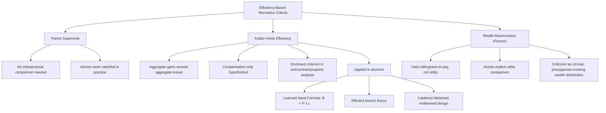

## Efficiency as a Normative Criterion in Law

### The Basic Claim

The proposition at the core of normative law and economics is that legal rules should be evaluated, and where possible chosen, according to their tendency to promote allocative efficiency — the maximization of the aggregate value of resources or welfare available to a society, given the resources it has. This is a substantive normative commitment, not a neutral or purely technical standard, and its adoption as a criterion for legal evaluation requires independent philosophical defense, since law has traditionally been evaluated by criteria such as corrective justice, retribution, fairness, autonomy, and rights that do not reduce straightforwardly to aggregate value maximization.

### Formal Efficiency Concepts Used in Legal Evaluation

**Pareto Efficiency and Pareto Superiority**

The strictest efficiency concept, drawn from Vilfredo Pareto, defines an allocation as Pareto efficient if no reallocation could make any individual better off without making at least one other individual worse off. A change is Pareto superior (a Pareto improvement) if it makes at least one person better off and no one worse off.

$$\text{Pareto superiority}: \quad \exists i : U_i(\text{after}) > U_i(\text{before}) \quad \text{and} \quad \forall j \neq i : U_j(\text{after}) \geq U_j(\text{before})$$

Pareto superiority is normatively attractive because it requires no interpersonal comparison of utility and no judgment about whose gains matter more — it is a criterion nearly everyone can accept, since no one is made worse off. Its central practical limitation is that almost no real-world legal rule change satisfies it: virtually every legal rule that benefits some class of persons imposes a cost on some other class (e.g., a rule favoring tenants over landlords, or victims over injurers), so the Pareto criterion is too demanding to guide most actual legal decision-making.

**Kaldor-Hicks Efficiency (Potential Pareto Improvement)**

Because Pareto superiority is so rarely satisfied, law and economics scholarship has relied predominantly on the Kaldor-Hicks criterion, under which a change is efficient if the aggregate gains to winners exceed the aggregate losses to losers, such that winners could *hypothetically* compensate losers and still remain better off — whether or not that compensation is actually paid.

$$\text{Kaldor-Hicks efficiency}: \quad \sum_i \Delta W_i > 0, \quad \text{compensation is hypothetical, not required}$$

This relaxation makes the criterion far more usable for evaluating legal rules (most efficiency-based analysis of tort, contract, and property law implicitly or explicitly relies on Kaldor-Hicks reasoning) but reintroduces exactly the interpersonal-comparison problem Pareto superiority was designed to avoid, and tolerates the possibility that real, uncompensated individuals are made worse off by an "efficient" rule change, so long as aggregate value rises.

**Posner's Wealth Maximization**

Richard Posner proposed wealth maximization as a related but distinct criterion, under which the correct measure of value is not utility (satisfaction of preferences generally) but wealth as measured by willingness-to-pay in a market or hypothetical market — the amount an individual would actually offer, constrained by their existing resources, rather than the intensity of their preference. Posner argued this had administrative advantages (willingness-to-pay is more observable than subjective utility) and better tracked the kind of value courts could plausibly assess through evidence of market transactions and hypothetical bargains.

### Comparative Table of Efficiency Criteria

| Criterion | Requires actual compensation? | Requires interpersonal utility comparison? | Typical use in legal analysis | Principal criticism |
| --- | --- | --- | --- | --- |
| Pareto superiority | N/A (no one is worse off) | No | Rare in practice; theoretical benchmark | Almost never satisfied by real legal rules |
| Kaldor-Hicks efficiency | No (only hypothetical) | Implicitly, via aggregation | Dominant efficiency criterion in tort/contract/property analysis | Tolerates uncompensated losers; aggregation masks distribution |
| Wealth maximization (Posner) | No | Avoided by using willingness-to-pay instead of utility | Posner's *Economic Analysis of Law*; some judicial reasoning | Willingness-to-pay presupposes the existing wealth distribution being evaluated (circularity charge) |

### Applications of Efficiency Analysis to Doctrinal Areas

**Tort Law: The Learned Hand Formula**

The most frequently cited doctrinal illustration of efficiency-based legal reasoning is Judge Learned Hand's negligence formula from *United States v. Carroll Towing Co.* (1947), which — though decided well before the law and economics movement's formal emergence — was subsequently reinterpreted by Posner and others as an implicit efficiency test for negligence liability. The formula holds that an actor is negligent if the burden of precaution ($B$) is less than the probability of harm ($P$) multiplied by the magnitude of the loss if harm occurs ($L$):

$$\text{Negligence exists if} \quad B < P \times L$$

This is directly interpretable as a cost-benefit efficiency test: precaution should be taken whenever its cost is less than the expected reduction in harm it produces, and a legal rule imposing liability precisely when $B < PL$ induces efficient precaution-taking by potential injurers, since it makes injurers bear the cost of failing to take precautions that would have been cheaper than the expected harm.

**Contract Law: Efficient Breach**

Efficiency reasoning has also structured analysis of contract remedies, most prominently through the theory of **efficient breach** — the proposition that expectation damages (rather than specific performance) are often the efficient remedy for breach of contract, because they allow a promisor to breach and pay damages whenever doing so, and reallocating the resource to a higher-value use, produces more value than performing the original contract, while still leaving the promisee no worse off than if the contract had been performed (since expectation damages are calibrated to make the promisee whole).

**Property Law: Minimizing Transaction Costs via Entitlement Design**

Following directly from Coase, efficiency analysis of property law asks how legal rules can be designed to minimize the transaction costs of achieving efficient resource use — for example, by choosing between property rules (requiring voluntary transactions at a price the entitlement holder sets) and liability rules (permitting non-consensual takings at a court-determined price) depending on which mechanism will produce lower transaction costs in a given context, per the Calabresi-Melamed framework.

### Diagram: Efficiency Criteria and Their Relationships

### Philosophical Critiques of Efficiency as a Normative Standard

**The Distributive Objection**

Because Kaldor-Hicks efficiency tolerates uncompensated losers so long as aggregate value rises, critics argue it is indifferent to the distribution of gains and losses — a rule that transfers large amounts of value from a poor and numerous class to a wealthy and small class can register as "efficient" even though it substantially worsens inequality, since willingness-to-pay is itself a function of ability to pay, which is a function of existing wealth.

**Dworkin's Critique of Wealth Maximization**

Ronald Dworkin argued that wealth maximization cannot serve as an independent foundation for legal or political morality because wealth, measured as willingness-to-pay, presupposes a prior distribution of holdings and entitlements; using wealth maximization to justify that same distributive starting point is circular. Dworkin further argued that wealth, so defined, has no intrinsic value independent of the utility or welfare it produces for actual persons, making it a poor proxy for whatever it is that ultimately matters morally.

**The Incommensurability and Interpersonal Comparison Objections**

Some philosophers of law object that aggregating gains and losses across persons treats fundamentally distinct individual interests as commensurable on a single scale, obscuring morally relevant differences between, for example, a loss of physical safety and a loss of profit, or a wealthy party's marginal dollar and a poor party's marginal dollar (which plausibly have different marginal utility, a distinction Kaldor-Hicks efficiency, defined over wealth or willingness-to-pay rather than utility, does not capture).

**Corrective Justice and Rights-Based Alternatives**

Scholars in the corrective justice tradition (e.g., Ernest Weinrib) argue that tort law in particular is better understood as vindicating a bipolar relationship of right and duty between injurer and victim, rather than as an instrument for minimizing aggregate social cost; on this view, efficiency analysis mischaracterizes the basic structure of what tort law is doing, treating a matter of corrective justice between two specific parties as though it were a policy instrument for society-wide cost minimization.

**The Welfarist Response (Kaplow and Shavell)**

Louis Kaplow and Steven Shavell responded to fairness-based critiques of efficiency analysis by arguing, in *Fairness versus Welfare* (2002), that any notion of "fairness" that is not ultimately reducible to its effects on individual welfare should be rejected as a legal-policy criterion, on the ground that non-welfarist fairness principles can, in some circumstances, require legal rules that make every single person worse off relative to some welfare-superior alternative — a result they regard as decisive against relying on such principles independent of welfare. This is itself best understood as a normative move within the broader efficiency/welfare-oriented camp, addressing the distributive and fairness critiques on their own terms rather than dismissing them.

[Inference] The relative persuasiveness of these critiques and the welfarist responses to them remains a genuinely contested question in legal philosophy and normative economics; the field has not converged on a single resolution, and characterizing one side as having "won" the debate would overstate the state of scholarly consensus.

### Key Points

- Pareto superiority, Kaldor-Hicks efficiency, and wealth maximization are three distinct formal criteria, not interchangeable synonyms for "efficiency," and they differ in their treatment of compensation and interpersonal comparison.
- Kaldor-Hicks efficiency is the dominant working criterion in applied law and economics scholarship because Pareto superiority is too demanding to apply to most real legal rules.
- The Learned Hand formula, efficient breach theory, and the Calabresi-Melamed entitlement framework are the three most commonly cited doctrinal illustrations of efficiency-based legal reasoning.
- Efficiency as a normative criterion faces sustained philosophical objections centered on distribution, circularity (in the wealth-maximization variant), and incommensurability, to which welfarist scholars such as Kaplow and Shavell have offered systematic responses.

### Related Topics

- The Learned Hand formula and its economic reinterpretation of negligence
- Efficient breach theory and the choice between expectation damages and specific performance
- The Calabresi-Melamed property rules/liability rules/inalienability framework
- Dworkin's critique of wealth maximization
- Kaplow and Shavell, *Fairness versus Welfare*, and welfarism in legal policy analysis
- Corrective justice theory as an alternative to efficiency-based tort analysis
- Interpersonal utility comparison problems in welfare economics