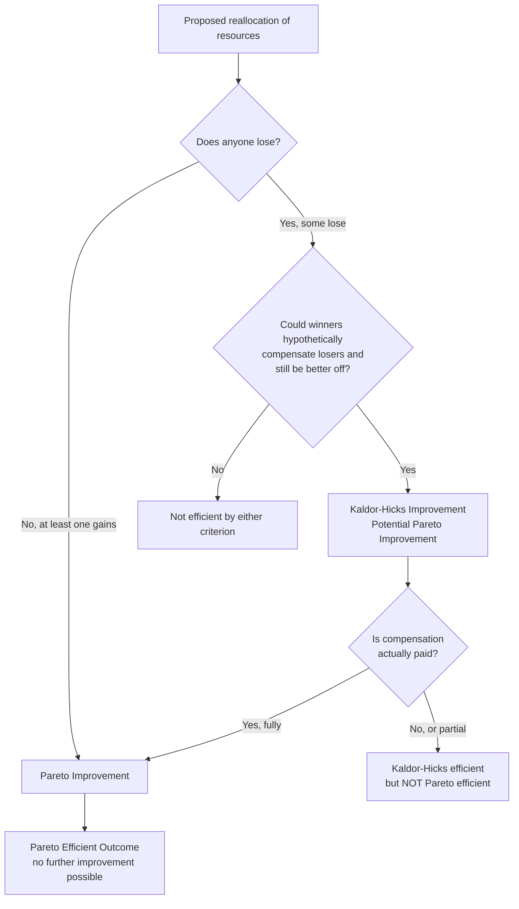

## Pareto Efficiency and Kaldor-Hicks Efficiency

### Definitions and Conceptual Origins

**Pareto Efficiency**

A resource allocation is Pareto efficient (or Pareto optimal) if no reallocation exists that can make at least one person better off without making anyone else worse off. Formally, an allocation $x$ is Pareto efficient if there is no alternative allocation $x'$ such that $u_i(x') \geq u_i(x)$ for all individuals $i$, with strict inequality for at least one individual.

A related but distinct concept is **Pareto improvement**: a change from allocation $x$ to $x'$ is a Pareto improvement if $u_i(x') \geq u_i(x)$ for all $i$, with at least one strict inequality. Pareto efficiency is the state reached when no further Pareto improvements are possible.

The concept originates from Vilfredo Pareto's work in welfare economics (*Manual of Political Economy*, 1906), where he sought a criterion for social welfare that did not require interpersonal comparisons of utility — a persistent methodological problem in economics, since utility is not directly measurable or comparable across individuals.

**Kaldor-Hicks Efficiency**

Kaldor-Hicks efficiency (also called the Kaldor-Hicks criterion or "potential Pareto improvement") relaxes the Pareto standard. A reallocation is Kaldor-Hicks efficient if the winners from the change could, in principle, compensate the losers and still remain better off — regardless of whether compensation actually occurs.

Formally, a move from $x$ to $x'$ satisfies the Kaldor-Hicks criterion if the aggregate gains exceed the aggregate losses:

$$\sum_{i \in \text{winners}} \Delta u_i > \sum_{j \in \text{losers}} |\Delta u_j|$$

expressed in monetary or willingness-to-pay terms, since the criterion requires a common metric to sum gains and losses across individuals.

The criterion was developed independently by Nicholas Kaldor (1939) and John Hicks (1939) as a response to the impasse the Pareto criterion created for policy analysis: almost every real-world policy change (tariffs, regulations, infrastructure projects) creates both winners and losers, so almost no policy change is a Pareto improvement. Kaldor-Hicks provided a workable efficiency test for economists advising on policy without requiring unanimous consent or actual compensation.

### Key Points

- **Pareto efficiency is a strict, weak-comparison standard** — it makes no claims about the size of gains or losses, only their direction. A highly unequal allocation can be Pareto efficient if no further reallocation could help someone without harming another.
- **Pareto efficiency does not imply fairness or equity.** There are typically infinitely many Pareto-efficient allocations (the "Pareto set" or contract curve), ranging from highly equal to highly unequal distributions.
- **Kaldor-Hicks does not require actual compensation.** This is the criterion's most contested feature: it authorizes efficiency judgments about policies that make identifiable people worse off, so long as the winners' gains are hypothetically large enough to cover the losses.
- **Every Pareto improvement is a Kaldor-Hicks improvement, but not vice versa.** Kaldor-Hicks is a strictly weaker (broader) criterion — it is a necessary but not sufficient condition derived from relaxing Pareto's unanimity requirement.
- **Kaldor-Hicks depends on a cardinal, interpersonally comparable measure of value** — typically money or willingness-to-pay — reintroducing exactly the interpersonal utility comparison problem Pareto's criterion was designed to avoid. [Inference] Whether monetary willingness-to-pay is a valid proxy for utility is a substantive normative assumption rather than a settled fact, since willingness-to-pay is constrained by ability to pay.
- **The Scitovsky reversal paradox**: Tibor Scitovsky (1941) showed that a move from $x$ to $x'$ can satisfy the Kaldor-Hicks criterion, while the reverse move from $x'$ back to $x$ can *also* satisfy it — making the criterion potentially inconsistent unless supplemented (the "Scitovsky double criterion").

### Application in Law and Economics

Kaldor-Hicks efficiency is the dominant welfare criterion used in law and economics, largely because Pareto efficiency is almost never satisfied by any legal rule, judicial decision, or regulation that redistributes rights or liabilities.

**Coase Theorem and the Efficiency Baseline**

Ronald Coase's analysis (*The Problem of Social Cost*, 1960) is often read as showing that, absent transaction costs, private bargaining will drive parties to the Pareto-efficient outcome regardless of the initial legal assignment of rights — because any inefficient allocation leaves unexploited gains from trade that self-interested parties will capture through bargaining. Under this zero-transaction-cost condition, the initial allocation of legal entitlements affects only the distribution of wealth, not the efficiency of the final outcome.

In the realistic case of positive transaction costs — where bargaining is costly, parties are numerous, or information is asymmetric — Coase's analysis implies that the initial legal assignment *does* affect efficiency, because bargaining to the efficient outcome may not occur. This is where Kaldor-Hicks becomes operationally central: courts and legislators cannot verify that a rule change is a Pareto improvement (since compensation to every affected party is rarely paid), so legal economists evaluate rules by whether they maximize aggregate wealth or welfare, i.e., by the Kaldor-Hicks standard.

**Judge Posner and Wealth Maximization**

Richard Posner's law and economics framework explicitly substitutes "wealth maximization" for Pareto efficiency as the normative criterion for legal rules, on the grounds that wealth maximization (closely related to Kaldor-Hicks) is administrable — it does not require unanimous consent, only that a rule produce a larger aggregate surplus, measured through hypothetical market transactions or willingness-to-pay. [Inference] Posner's wealth-maximization criterion has been criticized as not fully equivalent to Kaldor-Hicks in every formal respect, but the two are treated as closely aligned in most law-and-economics literature.

**Cost-Benefit Analysis in Regulation**

Government cost-benefit analysis — required for major U.S. federal regulations under Executive Order 12866 and its successors — operationalizes the Kaldor-Hicks criterion directly: a regulation is justified if its quantified/monetized benefits exceed its quantified/monetized costs, without regard to whether the specific individuals who bear the costs are compensated by those who receive the benefits.

**Tort Law**

The Hand Formula (from *United States v. Carroll Towing Co.*, 1947) for determining negligence — liability attaches if the burden of precaution $B$ is less than the probability of harm $P$ times the magnitude of loss $L$ ($B < PL$) — is a direct application of Kaldor-Hicks logic: a legal standard that minimizes the sum of accident costs and precaution costs maximizes aggregate wealth, even though the injurer and victim are not brought to a Pareto improvement relative to each other.

**Contract Law**

The doctrine of efficient breach holds that a party should be permitted to breach a contract and pay expectation damages when the gains from breach (e.g., reselling goods to a higher-value buyer) exceed the loss to the counterparty — a Kaldor-Hicks-style justification, since the breaching party's gain is not necessarily distributed to fully compensate the non-breaching party beyond expectation damages, and non-pecuniary losses are typically uncompensated.

### Worked Example

**Pareto Improvement Example**

Two neighboring farmers, A and B, share an irrigation ditch. Farmer A currently uses 60% of the water flow and Farmer B uses 40%, but Farmer B's land is more water-intensive and would produce far more value per unit of water. If Farmer B pays Farmer A a sum both agree to (say, based on their respective marginal values of water) in exchange for a larger share of the water, and both parties consent and both end up better off (A receives compensation exceeding their loss in water value; B gains more from added water than the payment made), this is a Pareto improvement — no one is worse off, and both are better off.

**Kaldor-Hicks (Without Compensation) Example**

A city government approves construction of a highway bypass that reduces regional commute times, generating estimated aggregate benefits (time savings, fuel savings, commerce) of $50 million per year. The bypass requires demolishing 30 homes, whose owners suffer estimated losses (property value, relocation costs, disruption) of $8 million total. The government pays statutory "just compensation" (fair market value) to the homeowners but does not compensate for subjective/sentimental losses, which economic surveys might estimate as an *additional* $3 million in uncompensated harm.

- Aggregate gains: $50 million
- Aggregate losses (compensated + uncompensated): $11 million
- Net social gain: $39 million

The project passes the Kaldor-Hicks test because the winners (commuters, businesses) *could* fully compensate the losers (homeowners, including their sentimental losses) and still be better off by $39 million — but since the $3 million in uncompensated sentimental loss is never actually paid, the project is **not** a Pareto improvement. The 30 homeowners are worse off in a dimension the compensation scheme does not reach.

### Diagram: Relationship Between the Two Criteria

<svg xmlns="http://www.w3.org/2000/svg" viewBox="0 0 700 420">
\<style\>
.title { font: bold 16px sans-serif; fill: #1a1a1a; }
.label { font: 13px sans-serif; fill: #1a1a1a; }
.small { font: 11px sans-serif; fill: #444; }
\</style\>
<text x="350" y="28" text-anchor="middle" class="title">Pareto vs. Kaldor-Hicks Efficiency (svg_diagram)</text>

<circle cx="350" cy="230" r="170" fill="#eaf2fb" stroke="#3b6fa0" stroke-width="2" />
<text x="350" y="80" text-anchor="middle" class="label" fill="#3b6fa0" font-weight="bold">Kaldor-Hicks Improvements</text>
<text x="350" y="98" text-anchor="middle" class="small">(winners' gains &gt; losers' losses,</text>
<text x="350" y="112" text-anchor="middle" class="small">compensation hypothetical)</text>

<circle cx="350" cy="260" r="85" fill="#d7ecd9" stroke="#3f8a4a" stroke-width="2" />
<text x="350" y="235" text-anchor="middle" class="label" fill="#2e6b38" font-weight="bold">Pareto</text>
<text x="350" y="252" text-anchor="middle" class="label" fill="#2e6b38" font-weight="bold">Improvements</text>
<text x="350" y="270" text-anchor="middle" class="small">(no one worse off,</text>
<text x="350" y="284" text-anchor="middle" class="small">at least one better off)</text>

<line x1="470" y1="180" x2="520" y2="130" stroke="#3b6fa0" stroke-width="1" />
<text x="525" y="128" class="small">Gains exceed losses,</text>
<text x="525" y="142" class="small">but some individuals are</text>
<text x="525" y="156" class="small">left uncompensated</text>
<line x1="380" y1="330" x2="430" y2="380" stroke="#2e6b38" stroke-width="1" />
<text x="435" y="382" class="small">Every Pareto improvement</text>
<text x="435" y="396" class="small">is also Kaldor-Hicks efficient</text>
</svg>

### Formal Relationship and Compensation Tests

### Critiques and Limitations

- **Distributive blindness**: Both criteria are silent on distributive justice. A Kaldor-Hicks-efficient policy can transfer wealth from poor to rich as long as the aggregate surplus is positive, since the criterion aggregates gains and losses without weighting by the marginal utility of income to different individuals.
- **Interpersonal comparability problem**: Kaldor-Hicks requires converting individual utility changes into a common unit (money) to sum them, which reintroduces the interpersonal utility comparison problem that Pareto's ordinal approach was explicitly designed to avoid.
- **Diminishing marginal utility of money**: A dollar is not of equal value to all individuals — a $1,000 loss to a low-income household plausibly represents a greater utility loss than a $1,000 gain represents to a high-income household. Kaldor-Hicks, using dollar-denominated willingness-to-pay, does not account for this asymmetry. [Inference] This is a widely cited objection in welfare economics, though its practical significance depends on the empirical magnitude of the disparity in any given case.
- **Scitovsky paradox**: as discussed above, sequential Kaldor-Hicks tests can produce inconsistent rankings between two states.
- **Hicks vs. Kaldor formulations differ slightly**: Kaldor's version asks whether winners *could* compensate losers from the post-change position; Hicks's version asks whether losers *could* profitably bribe winners to prevent the change from the pre-change position. These need not coincide, which is part of what generates the Scitovsky reversal.
- **Legal-philosophical critique**: Scholars such as Ronald Dworkin have challenged wealth maximization (and by extension Kaldor-Hicks) as a normative foundation for law, arguing that willingness-to-pay is not a coherent proxy for value or rights, since it is constrained by pre-existing (and possibly unjust) distributions of wealth.

### Related Topics

- Coase Theorem and transaction costs
- Posner's wealth-maximization principle in law and economics
- Cost-benefit analysis and regulatory impact assessment
- The Hand Formula and economic analysis of negligence
- Efficient breach theory in contract law
- Social welfare functions and interpersonal utility comparisons
- The Edgeworth box and the Pareto set/contract curve
- Compensation principles: Scitovsky reversal and the double criterion
- Public choice theory and rent-seeking as departures from efficiency
- Behavioral law and economics critiques of rational-actor welfare models