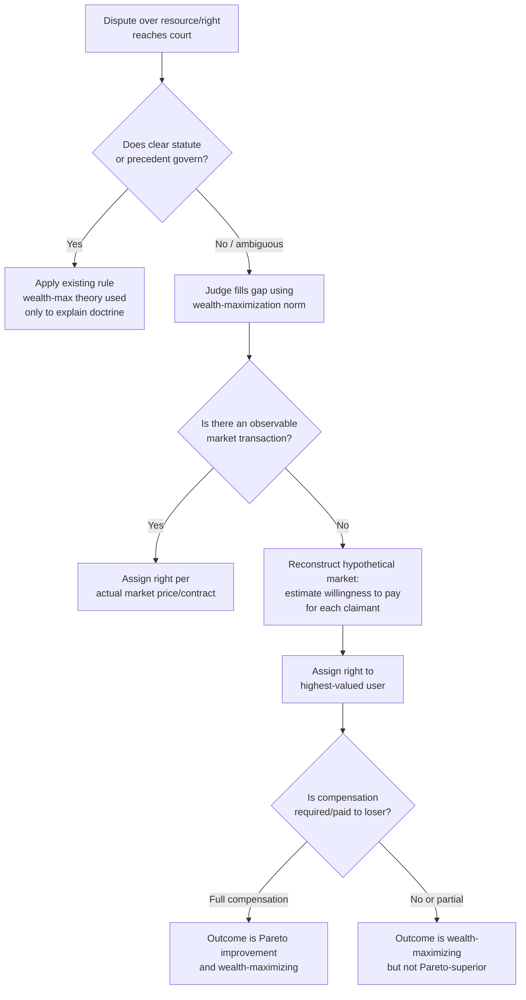

## Wealth Maximization as a Legal Norm

### Definitions and Conceptual Origins

**Wealth maximization** is the normative thesis, most closely associated with Judge Richard Posner, that legal rules, judicial decisions, and institutions should be structured to maximize the aggregate wealth of society, where "wealth" is defined not merely as the sum of monetary assets but as the total value of all goods and services, weighted by prices people are *willing and able to pay* for them.

Posner distinguishes wealth maximization from simple utilitarianism. Utilitarianism aggregates raw utility (pleasure/pain, happiness/suffering) across individuals — a measure Posner regards as unmeasurable and prone to counterintuitive implications (e.g., justifying the enslavement of a minority whose suffering is outweighed by the majority's pleasure). Wealth maximization instead aggregates value as revealed through *willingness to pay*, constrained by each person's actual purchasing power, which Posner presents as an administrable, court-usable proxy for social value.

Formally, social wealth $W$ under this framework is the sum, across all goods and resources $k$, of each good's value at its highest-valued use, as measured by willingness to pay:

$$W = \sum_{k} p_k^{*} \cdot q_k$$

where $p_k^{*}$ is the price the highest-valued user is willing to pay for good $k$ and $q_k$ is the quantity allocated to that use. A legal rule is wealth-maximizing if it allocates rights and resources to their highest-valued uses, as measured by this willingness-to-pay metric, and thereby maximizes $W$.

The doctrine emerged principally from Posner's *Economic Analysis of Law* (1973) and was elaborated as an explicit ethical theory in his article "Utilitarianism, Economics, and Legal Theory" (1979) and further defended in *The Economics of Justice* (1981). It sits within the broader Chicago School law and economics tradition (Posner, along with intellectual precursors Ronald Coase, Guido Calabresi, and Gary Becker), which treats efficiency as a central — and for Posner, the central — normative criterion for evaluating law.

### Key Points

- **Wealth maximization is meant to solve a measurement problem.** Utility is not observable or comparable across persons; willingness to pay (constrained by ability to pay) is observable via market behavior, actual transactions, or hypothetical-market reconstruction by courts. This administrability is Posner's core practical argument for the norm.
- **It is closely related to, but not strictly identical to, the Kaldor-Hicks criterion.** Both permit outcomes where identifiable individuals are made worse off, so long as aggregate value increases. [Inference] Posner at times treated the two as effectively interchangeable, but critics (notably Ronald Dworkin and Jules Coleman) have argued the formal relationship is more contested than Posner's exposition suggests, particularly regarding whether wealth maximization requires a Kaldor-Hicks-style hypothetical compensation test at all, or simply maximizes the value sum outright.
- **Wealth maximization is explicitly *not* Pareto efficiency.** A wealth-maximizing legal rule may leave some parties worse off in absolute terms, since it optimizes the aggregate willingness-to-pay-weighted value of resources, not a unanimity-consent standard.
- **Willingness to pay is a function of both preference intensity and ability to pay.** This is the doctrine's most persistent point of criticism: a poor person's low willingness to pay for a resource (e.g., safety, clean air, healthcare) may reflect budget constraints rather than lower genuine valuation, so wealth maximization risks systematically undervaluing the interests of the poor relative to the rich.
- **Posner offered both a positive (descriptive) and a normative claim.** The *positive* claim is that much of Anglo-American common law (property, contract, tort, criminal law) can be explained as if judges, especially in the 19th century, were implicitly pursuing wealth maximization or efficiency. The *normative* claim is that judges *should* continue to do so, particularly in areas where legislative guidance is absent or ambiguous (gap-filling in common law adjudication).
- **Posner grounded a further ethical defense in consent-based reasoning.** He argued wealth maximization has a claim to moral legitimacy insofar as market transactions (real or hypothetical, ex ante) represent a form of consent — since in a system of general wealth-maximizing rules, each person's *ex ante* expected wealth position may be improved by the rule even if a specific transaction leaves them worse off *ex post*. [Speculation] This "ex ante consent" argument was one of Posner's most heavily contested moves and is widely regarded in the secondary literature as underdeveloped relative to standard social contract theory.

### Application in Law and Economics

**Common Law as Implicitly Wealth-Maximizing**

Posner's positive thesis holds that doctrines across multiple fields of common law adjudication track wealth maximization:

- **Property law**: Rules favoring clear title, alienability, and the reduction of transaction costs (e.g., the doctrine against unreasonable restraints on alienation) are said to maximize the wealth-generating potential of resources by facilitating their movement to higher-valued uses.
- **Tort law**: The Hand Formula for negligence ($B < PL$) is presented by Posner as a wealth-maximizing rule — it induces potential injurers to invest in precaution up to the point where the marginal cost of precaution equals the marginal reduction in expected accident costs, maximizing the aggregate value of activity net of accident costs.
- **Contract law**: The doctrine of expectation damages (rather than specific performance in most cases) and the doctrine of efficient breach are justified on wealth-maximization grounds — a breaching party who can generate greater value by reallocating a good to a third party, while paying compensatory damages to the original counterparty, increases aggregate wealth.
- **Criminal law**: Posner extended the framework to argue that criminal sanctions function economically as a mechanism to force "market bypassing" transactions (theft, assault) back through consensual channels, since coerced transfers do not reliably move resources to higher-valued users the way voluntary exchange does.

**Judicial Gap-Filling**

Wealth maximization is presented as a decision rule for judges in cases where statutory or precedential guidance is silent or ambiguous. Rather than relying on notions of "fairness" that Posner regarded as indeterminate, a judge applying wealth maximization asks which of the available rules would allocate the disputed resource, liability, or right to its highest-valued use, using a hypothetical-market/willingness-to-pay reconstruction where no actual market transaction is observable (e.g., in nuisance or trespass disputes where a market for the relevant right does not readily exist).

**Regulatory and Legislative Application**

Beyond judge-made law, the wealth-maximization norm underlies much regulatory cost-benefit analysis, in which a rule or regulation is evaluated by comparing its monetized costs and monetized benefits (including "willingness to pay" surveys, hedonic pricing, and value-of-statistical-life calculations) — an approach structurally identical to asking whether the regulation increases aggregate wealth as Posner defines it.

### Worked Example

**Example: Water Rights Dispute (Hypothetical-Market Reconstruction)**

A river runs past two riparian landowners. Landowner A operates a small fishing operation valuing continuous river flow at $40,000/year. Landowner B wants to divert a portion of the flow to irrigate farmland, which would generate $150,000/year in additional crop value, but the diversion would reduce A's fishing revenue to $10,000/year (a $30,000 loss to A).

No prior market transaction exists between A and B, and no statute governs the specific allocation. A court applying a wealth-maximization approach reconstructs a hypothetical market: since B's gain ($150,000 − existing baseline) exceeds A's loss ($30,000) by a wide margin, and since — absent prohibitive transaction costs — A would hypothetically be willing to sell the right to divert for any sum between $30,000 and $150,000, the wealth-maximizing rule assigns the diversion right to B. Aggregate wealth calculation:

- Pre-diversion aggregate value: $40,000 (A) + $0 (B, no current irrigation) = $40,000
- Post-diversion aggregate value: $10,000 (A) + $150,000 (B) = $160,000
- Net wealth gain from reallocation: $120,000

A wealth-maximizing court assigns the right to B (with or without a damages payment to A) because this allocation maximizes $W$. Note that unless B is required to fully compensate A for the $30,000 loss, this outcome is Kaldor-Hicks efficient (and wealth-maximizing) but not a Pareto improvement, since A ends up strictly worse off.

### Diagram: Wealth Maximization Decision Logic in Adjudication

### Critiques and Limitations

- **The Dworkin critique**: Ronald Dworkin ("Is Wealth a Value?", 1980) argued that wealth, as Posner defines it, has no independent value apart from the satisfaction of preferences that are themselves shaped by a pre-existing (and potentially unjust) distribution of entitlements — so using wealth maximization to *justify* legal rules is circular, since the willingness-to-pay figures used to measure wealth are themselves generated by the very distribution of rights the rule is supposed to justify.
- **The ability-to-pay problem**: Because willingness to pay is bounded by wealth, a wealth-maximizing rule structurally favors outcomes that serve wealthier parties' preferences over poorer parties' preferences of equal or greater intensity, raising a distributive-justice objection central to most critiques of the norm.
- **The Coleman critique**: Jules Coleman argued that wealth maximization fails as an independent moral theory because it cannot explain *why* aggregate wealth (rather than utility, autonomy, or some other value) is what law should maximize, and that Posner's ex ante consent argument does not adequately establish wealth as a terminal value rather than an instrumental one.
- **Indeterminacy in hypothetical-market reconstruction**: Critics note that when courts must estimate willingness to pay in the absence of an actual market (as in the nuisance/water-rights example above), the resulting figures are themselves highly manipulable estimates, undermining the administrability advantage Posner claimed for the theory relative to vaguer "fairness" standards.
- **Retreat and revision by Posner**: [Unverified] In later work, Posner himself moderated the strong normative claims of wealth maximization as an independent foundational ethical theory, increasingly emphasizing pragmatic and instrumental justifications for efficiency-oriented adjudication rather than wealth maximization as a freestanding first principle of justice; the precise scope and timing of this shift is a matter of interpretation across his later writings (e.g., *The Problems of Jurisprudence*, 1990) rather than a single clean doctrinal reversal.
- **Relationship to legal positivism and natural law**: Wealth maximization has been criticized from both natural-law perspectives (for subordinating rights and justice to an economic metric) and from within positive economics (for smuggling normative content into a purportedly descriptive/positive analytic framework).

### Related Topics

- Kaldor-Hicks efficiency and the compensation principle
- Posner's Chicago School law and economics methodology
- The Coase Theorem and transaction-cost analysis
- The Hand Formula and economic analysis of negligence
- Efficient breach theory in contract law
- Dworkin's rights-based critique of law and economics
- Cost-benefit analysis and value-of-statistical-life methodology
- Utilitarianism vs. wealth maximization as normative theories of law
- Distributive justice objections to efficiency-based legal norms
- Ex ante vs. ex post analysis in legal rule design