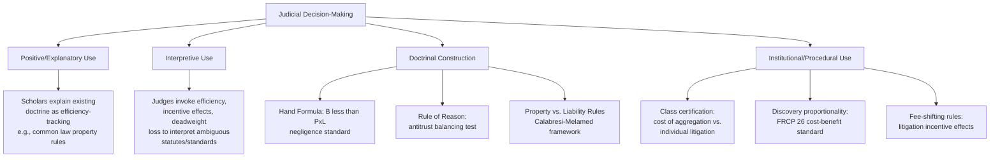

## The Role of Economic Reasoning in Judicial Decision-Making

### Definitions and Conceptual Scope

Economic reasoning in judicial decision-making refers to the use of economic concepts — efficiency, cost-benefit analysis, incentive effects, transaction costs, risk allocation, and market-behavior modeling — as tools for interpreting legal rules, filling gaps in the common law, and predicting or evaluating the consequences of judicial rulings. This is distinct from economics *as an academic discipline studying legal institutions from the outside*; here the focus is on economic reasoning *as a mode of judicial argument and decision procedure* used by judges themselves, or urged upon them by litigants and amici.

Economic reasoning enters judicial decisions through several distinct channels:

1. **Positive/explanatory use** — courts (or scholars analyzing courts) treat existing doctrine as if it tracks efficiency, without judges necessarily invoking economics explicitly.
2. **Interpretive use** — judges explicitly invoke economic concepts (foreseeability, cost of precaution, deadweight loss, incentive effects) to interpret statutes or common law standards.
3. **Doctrinal construction** — economic formulas or frameworks (e.g., the Hand Formula) become part of the black-letter legal test itself.
4. **Institutional/procedural use** — courts assess litigation incentives, settlement dynamics, and enforcement costs when designing procedural rules (class certification, discovery scope, fee-shifting).

### Key Points

- **The Hand Formula is the paradigmatic instance of explicit economic reasoning embedded directly into legal doctrine.** In *United States v. Carroll Towing Co.* (1947), Judge Learned Hand articulated negligence as a function of three variables: the burden of adequate precautions ($B$), the probability of the injury occurring ($P$), and the gravity of the resulting injury ($L$). A defendant is negligent if:

$$B < P \times L$$

This formula operationalizes efficient deterrence: it assigns liability whenever the cost of precaution is less than the expected cost of the harm, aligning legal liability with the economically efficient level of care.

- **Judicial economic reasoning is not limited to explicit formulas.** Much of it operates through concepts absorbed into doctrine without formal quantification — "least-cost avoider" reasoning in tort and contract law, "foreseeability" as a proxy for efficient risk allocation, and antitrust's "rule of reason" analysis, which requires courts to weigh a challenged practice's procompetitive efficiencies against its anticompetitive effects.
- **The rise of economic reasoning in U.S. courts is closely tied to the Chicago School's influence on the judiciary**, particularly through scholars-turned-judges such as Richard Posner (7th Circuit) and Frank Easterbrook (7th Circuit), and through organized judicial education efforts (e.g., programs historically associated with the Law and Economics Center) that trained sitting federal judges in economic analysis, especially in antitrust adjudication.
- **Antitrust law is the area of U.S. law most thoroughly reshaped by economic reasoning.** Courts moved from structural/formalistic approaches (treating certain conduct as automatically, or "per se," illegal) toward efficiency-based "rule of reason" analysis, substantially influenced by Chicago School economists (e.g., Robert Bork's *The Antitrust Paradox*, 1978) who argued that consumer welfare, defined in efficiency terms, should be antitrust law's exclusive goal.
- **Economic reasoning also operates predictively/consequentially**, where courts consider the likely behavioral response of future parties to a given rule (an incentive-effects or "ex ante" perspective), rather than focusing solely on corrective justice between the litigants before the court (an "ex post" perspective). This ex ante/ex post distinction is a recurring methodological fault line in judicial and scholarly debate over how courts should reason.
- **Economic reasoning is not judicially universal or uncontested.** Many judges and scholars reject efficiency as a primary interpretive touchstone, preferring rights-based, textualist, formalist, or corrective-justice frameworks; the extent of economic reasoning's influence varies substantially by legal area (heavy in antitrust, contracts, and torts; comparatively lighter in constitutional and criminal procedure adjudication, though even there some economic analysis appears, e.g., in Fourth Amendment cost-benefit-style reasoning about search and seizure).

### Application in Law and Economics

**Torts: The Hand Formula and Least-Cost Avoider**

Beyond the formal Hand Formula, courts frequently apply an implicit "least-cost avoider" principle: liability is assigned to whichever party could have prevented the harm at the lowest cost, since assigning liability there creates the most efficient incentive structure for future precaution-taking. This reasoning appears across products liability, premises liability, and comparative negligence doctrines, even where courts do not cite Hand or explicit economic authority.

**Contract Law: Efficient Breach and Damages Measurement**

Courts computing expectation damages (rather than specific performance) implicitly apply economic reasoning about efficient resource allocation: expectation damages are designed to place the non-breaching party in the position they would have occupied had the contract been performed, while permitting the breaching party to reallocate the good or service to a higher-valued use if the gains from breach exceed the compensable losses. Judicial reluctance to award specific performance except for unique goods (e.g., real property, art) reflects an implicit judgment about when market substitutes make monetary damages an economically adequate remedy.

**Antitrust: Rule of Reason and Consumer Welfare**

Modern antitrust adjudication under the Sherman Act, particularly for vertical restraints and mergers, requires courts to conduct an explicit economic balancing test: assessing market definition, market power, and the net competitive effect (procompetitive efficiencies vs. anticompetitive foreclosure) of the challenged conduct. Landmark cases such as *Continental T.V., Inc. v. GTE Sylvania Inc.* (1977) shifted vertical restraint analysis from per se illegality toward rule-of-reason economic balancing, reflecting direct doctrinal absorption of Chicago School economic analysis.

**Property Law: Transaction Costs and Rule Selection**

Guido Calabresi and A. Douglas Melamed's framework ("Property Rules, Liability Rules, and Inalienability," 1972) gave courts an economically grounded taxonomy for choosing legal remedies: protecting an entitlement with a *property rule* (requiring voluntary negotiated transfer, e.g., an injunction) is preferable when transaction costs are low and bargaining is feasible, while protecting it with a *liability rule* (requiring only payment of court-determined damages) is preferable when transaction costs are high (e.g., numerous parties, holdout problems), since a liability rule allows an efficient forced transfer without requiring costly negotiation. This framework has been explicitly cited and applied by courts in nuisance, eminent domain, and injunction-scope decisions.

**Procedural and Institutional Design**

Economic reasoning also shapes courts' analysis of procedural rules themselves: class action certification standards weigh the costs of individual litigation against the efficiency gains of aggregation; fee-shifting rules are evaluated for their effect on parties' incentives to litigate versus settle; and discovery-scope rulings often invoke proportionality standards that are explicitly cost-benefit in structure (Federal Rule of Civil Procedure 26(b)(1) requires discovery to be "proportional to the needs of the case," weighing the burden/expense against likely benefit).

### Worked Example

**Example: Applying the Hand Formula**

A shipping company docks barges along a pier without a bargee (watchman) present. A barge breaks loose during a storm, damaging other vessels. The court must determine whether failing to station a bargee constituted negligence.

- Estimated cost of stationing a bargee for the relevant period: $B = \$500$
- Probability that, absent a bargee, a mooring failure causing damage would occur during a storm event: $P = 0.20$
- Estimated damage if the failure occurs: $L = \$4,000$

Expected cost of the harm:

$$P \times L = 0.20 \times \$4{,}000 = \$800$$

Since $B (\$500) < P \times L (\$800)$, the Hand Formula indicates the shipping company was negligent — the cost of the precaution was lower than the expected harm it would have prevented, so a reasonable (efficient) actor would have taken the precaution. This mirrors the actual reasoning in *United States v. Carroll Towing Co.*, where Judge Hand found the barge owner negligent for failing to have an attendant aboard during business hours in a busy harbor.

### Diagram: Channels of Economic Reasoning in Adjudication

### Critiques and Limitations

- **Democratic legitimacy objection**: Critics argue that unelected judges applying efficiency criteria to fill statutory or common-law gaps risk substituting their own policy judgments (dressed in economic language) for legislative choices, raising separation-of-powers and democratic-accountability concerns.
- **Rights-based critique**: Scholars in the corrective-justice and rights-based traditions (e.g., Ernest Weinrib, Jules Coleman) argue that tort and contract law are structured around bilateral relationships of right and duty between the specific litigants, not aggregate social-welfare maximization, and that economic reasoning mischaracterizes the normative structure of private law.
- **Measurement and administrability limits**: Even where courts nominally apply frameworks like the Hand Formula, the inputs ($B$, $P$, $L$) are frequently estimated qualitatively rather than quantitatively, since precise probability and cost data are often unavailable at trial — meaning the "formula" often functions more as an analytical heuristic than a literal calculation. [Inference] The degree to which the Hand Formula is applied with genuine numerical rigor versus qualitative analogy varies substantially by case and jurisdiction and is not fully standardized.
- **Distributive-justice critique**: As with wealth maximization generally, efficiency-oriented judicial reasoning has been criticized for being indifferent to the distribution of gains and losses among litigants, potentially privileging economically powerful parties whose losses/gains are more easily monetized or whose "least-cost avoider" status is asymmetrically burdened.
- **Selection and confirmation concerns in positive analysis**: Efforts to show that historical common-law doctrines "track" efficiency have been criticized for selection bias — emphasizing doctrines that fit the efficiency narrative while explaining away or downplaying counterexamples (e.g., strict liability regimes, certain equitable doctrines) that do not fit as neatly.
- **Variance in judicial economic literacy**: [Unverified] The sophistication and accuracy with which economic reasoning is applied is understood to vary considerably across judges and courts, though the extent of this variance is difficult to measure systematically and is typically discussed anecdotally in the secondary literature rather than through comprehensive empirical study.

### Related Topics

- The Hand Formula and negligence analysis
- Calabresi and Melamed's property rules vs. liability rules framework
- Antitrust rule of reason and Chicago School influence on competition law
- Efficient breach and damages measurement in contract law
- Coase Theorem and transaction-cost-based judicial reasoning
- Wealth maximization as a judicial decision norm
- Corrective justice and rights-based critiques of law and economics
- Behavioral law and economics challenges to rational-actor judicial reasoning
- Cost-benefit analysis in procedural rule design (class actions, discovery)
- Judicial education and the institutional diffusion of economic analysis