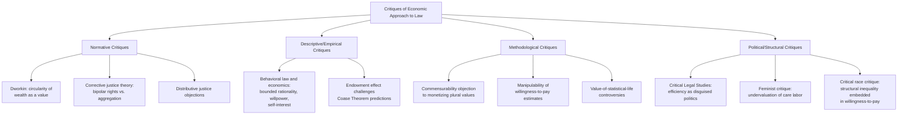

## Critiques and Limits of the Economic Approach to Law

### Overview and Scope

The economic approach to law — encompassing efficiency analysis, Kaldor-Hicks and wealth-maximization criteria, rational-choice modeling of legal actors, and cost-benefit reasoning in adjudication — has drawn sustained critique from multiple, often independent, intellectual traditions since its rise to prominence in the 1960s-1980s. These critiques target the approach at different levels: its foundational normative assumptions, its descriptive/positive claims about how law actually functions, its methodological tools (rational-choice modeling), and its distributive and political implications. This entry surveys the principal critique families and their core arguments.

### Key Points

- **Critiques of law and economics are not a single unified position** — they emerge from rights-based philosophy, corrective justice theory, behavioral economics, critical legal studies, feminist and critical race theory, and internal disputes within economics itself (e.g., welfare economics' own limitations).
- **A recurring structural distinction in the critique literature separates *normative* objections** (efficiency/wealth maximization is the wrong goal for law) **from *descriptive* objections** (even granting efficiency as a goal, the economic approach's behavioral and empirical assumptions are inaccurate) **from *methodological* objections** (the tools used — cost-benefit analysis, rational-actor modeling — are unreliable or manipulable in practice).
- **The distributive-neutrality critique is the single most common objection** across nearly all schools: both Pareto and Kaldor-Hicks efficiency, and wealth maximization, are indifferent to *who* holds resources, only to whether resources are allocated to willingness-to-pay-weighted highest-valued uses — a framework that treats an initial distribution of wealth and entitlements as a given rather than as itself subject to justice-based scrutiny.
- **Behavioral law and economics represents an internal, empirically-grounded critique** rather than a wholesale rejection: it accepts the broad project of using social-science tools to analyze law but argues that the rational-actor assumptions of neoclassical law and economics (perfect information, stable preferences, expected-utility maximization) are systematically falsified by decades of experimental evidence, requiring the substitution of more psychologically realistic models.
- **Critical Legal Studies (CLS) offers a more radical rejection**, arguing that economic analysis of law obscures rather than illuminates the political and power-laden character of legal doctrine by presenting contestable value judgments (about property, contract freedom, and market allocation) as neutral, technical, scientific findings.

### Normative Critiques

**The Rights-Based Critique (Dworkin)**

Ronald Dworkin's critique, developed most directly in "Is Wealth a Value?" (1980) and *A Matter of Principle* (1985), makes two connected arguments. First, wealth as Posner defines it (willingness-to-pay-weighted value) has no value independent of the satisfaction of preferences, and preferences are themselves shaped by the pre-existing distribution of rights and resources the legal rule is supposed to be justifying — a circularity problem. Second, wealth maximization cannot account for rights that function as "trumps" over aggregate welfare calculations (e.g., a right against torture is not properly analyzed as a cost-benefit tradeoff against aggregate social gains from permitting it in extreme cases).

**Corrective Justice Theory (Weinrib, Coleman, Fletcher)**

Ernest Weinrib (*The Idea of Private Law*, 1995) and, in a more economics-engaged register, Jules Coleman and George Fletcher, argue that private law fields — especially torts — are structured around a bipolar relationship of right and correlative duty between a specific plaintiff and a specific defendant, not aggregate social-welfare maximization across society. On this view, economic analysis mischaracterizes the very phenomenon it purports to explain: tort law's requirement that *this* defendant compensate *this* plaintiff cannot be reduced to a claim about aggregate deterrence efficiency, since corrective justice is a relational, not aggregative, concept.

**Distributive Justice and Egalitarian Critiques**

A broad family of critiques — from law-and-economics-adjacent scholars like Louis Kaplow and Steven Shavell (who partially defend efficiency but argue redistribution should occur exclusively through the tax-and-transfer system rather than through legal rules) to more thoroughgoing egalitarian critics — argues that using legal rules (rather than taxation) to redistribute is inefficient, but also that the "double distortion" argument itself assumes away legitimate reasons legal rules might properly incorporate distributive concerns (e.g., when tax-and-transfer systems are politically constrained or administratively imperfect, a premise increasingly contested in public economics).

### Descriptive and Methodological Critiques

**Behavioral Law and Economics**

Drawing on the experimental findings of Daniel Kahneman, Amos Tversky, Richard Thaler, and others, behavioral law and economics (notably Christine Jolls, Cass Sunstein, and Thaler's foundational 1998 article "A Behavioral Approach to Law and Economics") documents systematic departures from the rational-actor model that underlies neoclassical law and economics:

- **Bounded rationality**: decision-makers use heuristics that produce predictable errors rather than performing expected-utility calculations.
- **Bounded willpower**: individuals exhibit time-inconsistent preferences (e.g., hyperbolic discounting), undermining models that assume stable, consistent intertemporal preferences — relevant to contract default rules, consumer protection, and criminal deterrence theory.
- **Bounded self-interest**: experimental evidence (e.g., ultimatum game and dictator game studies) shows people exhibit fairness concerns and reciprocity that depart from pure wealth-maximizing self-interest, complicating models of contractual behavior and litigation/settlement dynamics.
- **Endowment effect and loss aversion**: individuals value a good more once they possess it than they would pay to acquire it, undermining the Coase Theorem's prediction that initial entitlement allocation is efficiency-irrelevant under zero transaction costs — since the *identity* of the initial rights-holder can itself affect final valuations. [Inference] The magnitude and robustness of the endowment effect across different goods and market contexts remains an area of active empirical dispute rather than a fully settled quantitative finding.

**Critiques of Cost-Benefit Analysis as a Judicial/Regulatory Tool**

- **Commensurability objection**: critics (e.g., Elizabeth Anderson, Cass Sunstein in some contexts) argue that reducing plural, qualitatively distinct values (health, dignity, environmental integrity, aesthetic goods) to a single monetary metric for cost-benefit comparison is a category error that misrepresents the nature of the values being weighed.
- **Manipulability of inputs**: because willingness-to-pay estimates for non-market goods (clean air, statistical lives, ecosystem services) must be constructed through proxy methods (contingent valuation surveys, hedonic pricing, revealed-preference inference), the resulting figures are highly sensitive to methodological choices, raising concerns that cost-benefit conclusions can be reverse-engineered to fit predetermined policy outcomes.
- **Value-of-statistical-life controversies**: regulatory cost-benefit analyses that assign different monetary values to statistical lives based on age, nationality, or income (on the grounds that willingness to pay varies with these factors) have drawn sharp ethical objections for embedding distributive inequities directly into a supposedly neutral calculation.

**Critical Legal Studies (CLS)**

CLS scholars (e.g., Duncan Kennedy, Morton Horwitz) argue more radically that the entire framing of "efficiency" as a neutral, apolitical criterion is itself an ideological move: the baseline against which efficiency is measured (existing property rights, contract freedom, market structures) already encodes contestable political choices, so presenting legal rules as efficient "discoveries" rather than political choices obscures the real distributive and power stakes of legal doctrine.

**Feminist and Critical Race Critiques**

Feminist legal scholars have argued that economic analysis, by modeling household and family relations, caregiving labor, and reproductive decisions through market-transaction frameworks, tends to undervalue non-market labor (disproportionately performed by women) and can naturalize existing gendered divisions of labor as the product of efficient, freely-chosen bargains rather than products of unequal bargaining power or social constraint. Related critical race scholarship raises parallel concerns about how facially neutral efficiency criteria can reproduce or obscure the effects of historical and structural discrimination on wealth, credit access, and bargaining power — all of which directly affect willingness-to-pay-based valuations.

### Diagram: Map of Critique Traditions

### Worked Example: A Single Case Through Multiple Critique Lenses

**Scenario**: A regulatory cost-benefit analysis evaluates a workplace safety rule requiring costly protective equipment in a manufacturing sector, estimating the rule's cost at $200 million/year against an estimated $150 million/year in monetized benefits (using a value-of-statistical-life figure applied to the reduced injury/fatality rate). The rule fails the cost-benefit test and is not adopted.

- **Efficiency/wealth-maximization view**: the rule should not be adopted, since its costs exceed its monetized benefits — adopting it would reduce aggregate social wealth.
- **Rights-based critique**: worker safety may implicate a right against being subjected to unreasonable risk of bodily harm in the course of employment, a claim not properly reducible to a cost-benefit tradeoff against manufacturers' compliance costs.
- **Behavioral critique**: workers' revealed "acceptance" of workplace risk (e.g., through wage premiums implicitly used to estimate value of statistical life) may reflect bounded rationality about low-probability, high-severity risks rather than a considered, stable valuation — undermining the reliability of the benefit-side estimate itself.
- **Distributive critique**: the manufacturing workforce affected may be lower-income relative to the shareholders who bear the compliance cost as a business expense, meaning a purely aggregate wealth calculation could mask a regressive distributive effect of rejecting the rule.
- **Methodological critique**: the specific value-of-statistical-life figure used is highly sensitive to which underlying wage-risk studies were selected and how they were adjusted, meaning the $150 million benefit estimate carries far more uncertainty than the point estimate conveys.

### Defenses and Responses from Within Law and Economics

Proponents of the economic approach have not left these critiques unanswered:

- **Kaplow and Shavell's "double distortion" argument** contends that using legal rules for redistribution (rather than efficiency) is generally inferior to redistributing through the income tax system, because legal-rule-based redistribution distorts behavior in the targeted legal domain *and* fails to redistribute as precisely as a tax system calibrated to income; this is offered as a rebuttal to distributive critiques, though it has itself been challenged as resting on idealized assumptions about tax-system responsiveness and political feasibility.
- **Posner and others have responded to behavioral critiques** by arguing that, notwithstanding individual-level deviations from rationality documented in laboratory settings, market and institutional selection pressures (competition, learning, arbitrage) may cause aggregate real-world behavior to approximate rational-actor predictions more closely than individual psychology experiments suggest. [Inference] The strength of this "market discipline corrects individual irrationality" response is contested and its empirical support is regarded as mixed across different market contexts in the behavioral economics literature.
- **Some law and economics scholars have themselves incorporated behavioral findings** rather than resisting them, giving rise to the "behavioral law and economics" subfield as a refinement of, rather than a rejection of, the broader economic-analysis project.

### Related Topics

- Behavioral law and economics: bounded rationality, willpower, and self-interest
- Dworkin's "Is Wealth a Value?" and rights-based legal theory
- Corrective justice theory (Weinrib, Coleman, Fletcher)
- Kaplow and Shavell's double-distortion argument for tax-based redistribution
- Critical Legal Studies and the politics of legal doctrine
- Value-of-statistical-life methodology and its ethical controversies
- Feminist and critical race critiques of market-based legal analysis
- The endowment effect and its implications for the Coase Theorem
- Contingent valuation and non-market goods in cost-benefit analysis
- Posner's evolving defense of wealth maximization across his body of work