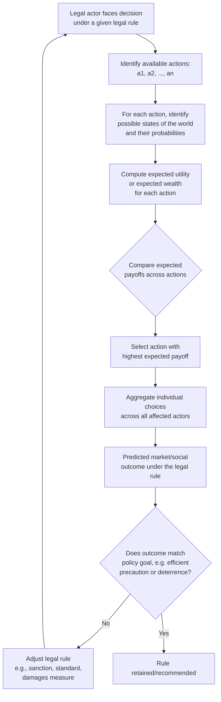

## Rational Choice Theory and Modeling Legal Behavior

### Definitions and Conceptual Foundations

Rational choice theory, as applied to law, models legal actors — potential tortfeasors, contracting parties, criminals, litigants, regulators, and judges — as agents who maximize expected utility (or, in the standard law-and-economics simplification, expected wealth) subject to constraints, given their available information and the incentives created by legal rules. The theory provides the behavioral microfoundation for nearly all neoclassical law and economics: predictions about how legal rules affect behavior (deterrence, precaution-taking, contracting, litigation) are derived by modeling the relevant actor as solving a constrained optimization problem.

**Core Assumptions**

The standard rational-actor model in law and economics rests on several assumptions:

1. **Complete and transitive preferences**: an actor can rank all available outcomes consistently, such that if outcome $A$ is preferred to $B$, and $B$ to $C$, then $A$ is preferred to $C$.
2. **Expected utility maximization under uncertainty**: when outcomes are probabilistic, actors choose the option maximizing expected utility, formally:

$$EU(a) = \sum_{s} \pi(s) \cdot u(x_{a,s})$$

where $a$ is an available action, $s$ indexes possible states of the world, $\pi(s)$ is the probability of state $s$, and $u(x_{a,s})$ is the utility of the outcome resulting from action $a$ in state $s$.

3. **Stable, exogenous preferences**: preferences do not change based on how choices are framed or presented, and are not themselves objects of legal or economic analysis (taken as given inputs).
4. **Self-interest**: actors are modeled as primarily motivated by their own payoffs (wealth, utility), though the model can incorporate altruism or fairness concerns as arguments in the utility function if specified.
5. **Responsiveness to marginal incentives**: actors adjust behavior at the margin in response to changes in expected costs and benefits — the foundational assumption underlying all deterrence-based and incentive-based legal analysis.

### Key Points

- **Rational choice modeling in law and economics typically simplifies "utility" to "wealth" or monetary payoff** for tractability, treating legal actors as risk-neutral wealth-maximizers unless risk aversion is explicitly modeled — a simplification that is analytically convenient but empirically contestable, especially for individuals (as opposed to diversified firms) facing large, low-probability losses.
- **The model is used both positively (to predict/explain behavior) and normatively (to design legal rules that produce efficient incentives)** — the same expected-utility framework underlies both "how will potential injurers respond to a change in the negligence standard?" (positive) and "what negligence standard should a court adopt to induce efficient precaution?" (normative).
- **Risk attitudes matter significantly for legal-rule design.** A risk-neutral actor is indifferent between a certain outcome and an uncertain outcome of equal expected value; a risk-averse actor prefers the certain outcome. This distinction underlies insurance markets, liquidated damages doctrine, and the economic rationale for tort damages caps or punitive damages multipliers.
- **Expected-sanction models of deterrence** (originating with Gary Becker's "Crime and Punishment: An Economic Approach," 1968) model a potential offender's decision to commit a crime as a comparison between the expected benefit of the offense and the expected cost of punishment, formalized as:

$$E[\text{cost of offending}] = p \cdot f$$

where $p$ is the probability of detection and conviction and $f$ is the magnitude of the sanction (fine, imprisonment converted to a disutility measure, etc.). This yields the well-known implication that a lower probability of detection can, in principle, be offset by a higher sanction magnitude to maintain equivalent expected deterrence — though this "probability-magnitude tradeoff" has been qualified by risk-aversion and marginal-deterrence considerations in later literature.

- **Litigation and settlement models** apply rational choice theory to predict when parties will settle versus litigate, based on each side's estimate of the probability of prevailing at trial, the stakes, and litigation costs — the foundational Landes (1971) and Gould (1973) / Priest-Klein (1984) framework for the economics of litigation.
- **Rational choice models generate testable comparative-statics predictions** — e.g., raising the expected sanction for an offense should (holding other factors constant) reduce its incidence; increasing the standard of care required for non-negligence should increase precaution-taking by potential injurers up to the point where marginal precaution cost equals marginal expected-harm reduction.

### Application in Law and Economics

**Torts: Precaution-Taking Under Alternative Liability Rules**

Rational choice modeling is used to compare the incentive effects of different tort liability regimes. Under a **negligence rule**, a rational injurer takes precaution exactly up to the legally-defined due-care standard (assuming the standard is set at the efficient level, per the Hand Formula) because taking less precaution creates liability exposure while taking more precaution imposes unnecessary cost. Under **strict liability**, a rational injurer internalizes the full expected cost of harm regardless of precaution level, inducing precaution up to the point where marginal precaution cost equals marginal expected-harm reduction — the same efficient outcome as an optimally-set negligence rule, but achieved through a different incentive channel (this equivalence result, under standard assumptions, is a canonical finding in law and economics, though it breaks down once *activity-level* choices, not just *care-level* choices, are considered, since strict liability but not negligence induces efficient activity-level reduction as well).

**Contract Law: Efficient Reliance and Breach**

Rational choice models are used to analyze how different damages measures (expectation, reliance, restitution) affect a contracting party's incentive to invest in reliance on the contract being performed, and a potential breaching party's incentive to breach only when doing so is efficient (efficient breach theory). Under expectation damages, a rational promisor breaches if and only if the gain from breach (e.g., reselling to a higher-value buyer) exceeds the expectation damages owed — aligning private incentives with the socially efficient breach decision under standard assumptions, though scholars have noted this alignment can break down when reliance investment, renegotiation costs, or information asymmetries are introduced.

**Criminal Law: Becker's Economic Model of Crime**

Becker's framework treats criminal activity as a rational response to expected costs and benefits, generating policy implications about the relative deterrent efficiency of increasing detection probability ($p$) versus increasing sanction severity ($f$). Since increasing $p$ (more enforcement resources — police, prosecutors, surveillance) is typically more costly to the state than increasing $f$ (which is comparatively cheap to legislate, at least for fines), the model implies enforcement-cost-minimizing societies might rely more heavily on severe sanctions applied with low probability — a conclusion qualified by concerns about **marginal deterrence** (the need to preserve an incentive gradient so offenders are not indifferent between committing a lesser and a greater offense once already exposed to a severe sanction) and by risk-aversion and fairness considerations not captured in the risk-neutral baseline model.

**Litigation Behavior: Settlement Bargaining Models**

The standard divergent-expectations model of litigation posits that settlement occurs when the plaintiff's minimum acceptable settlement (their expected trial outcome minus litigation costs) is less than the defendant's maximum acceptable settlement (the defendant's expected trial loss plus their own litigation costs) — i.e., when there exists a settlement "bargaining range." Cases proceed to trial primarily when parties have sufficiently divergent estimates of the probability of the plaintiff prevailing (optimism on both sides) or when stakes are large relative to litigation costs, or due to asymmetric information about case merits that a settlement offer cannot credibly resolve.

### Worked Example: Deterrence Model for a Regulatory Offense

A firm considers whether to comply with an environmental disposal regulation. Non-compliance saves the firm $100,000 in disposal costs. Regulatory enforcement detects violations with probability $p = 0.30$, and the fine upon detection is $f = \$400,000$.

Expected cost of non-compliance:

$$E[\text{cost}] = p \times f = 0.30 \times \$400{,}000 = \$120{,}000$$

Since the expected cost of non-compliance ($120,000) exceeds the savings from non-compliance ($100,000), a rational, risk-neutral firm is predicted to comply. If regulators wished to induce compliance while reducing enforcement costs (e.g., lowering detection probability to $p = 0.15$ to save on inspection resources), the fine would need to rise to at least:

$$f \geq \frac{\$100{,}000}{0.15} \approx \$666{,}667$$

to maintain equivalent expected deterrence — illustrating the probability-sanction tradeoff central to Becker's framework, subject to the caveat that a risk-averse firm (or one with limited assets, raising judgment-proof concerns) may respond differently than this risk-neutral calculation predicts.

### Diagram: Rational Choice Decision Structure

### Limitations and Refinements

- **Risk neutrality is a simplifying assumption, not a universal empirical claim.** Individuals (unlike diversified firms) are frequently risk-averse, particularly regarding low-probability, high-severity losses — a fact incorporated into insurance-law and-economics analysis and into arguments for damages caps or structured settlements, but often abstracted away in baseline deterrence models for tractability.
- **The judgment-proof problem**: rational-actor deterrence models assume the offending party can actually pay the calculated sanction; when potential injurers or offenders have assets below the efficient sanction level (are "judgment-proof"), the simple $p \times f$ deterrence calculus breaks down, since the effective expected sanction is capped by the actor's assets — a significant qualification for models applied to individuals, small firms, or entities that can strategically undercapitalize (e.g., through limited liability structures) to reduce their exposure.
- **Behavioral economics critique**: as documented extensively in behavioral law and economics, actual human decision-making systematically departs from the expected-utility framework via bounded rationality, hyperbolic discounting, loss aversion, and probability-weighting distortions (e.g., overweighting small probabilities, as modeled in Kahneman and Tversky's prospect theory) — casting doubt on the precision of quantitative predictions derived from strict rational-actor models, particularly for low-probability events central to deterrence theory. [Inference] The practical magnitude of this gap between rational-choice predictions and observed behavior varies by context and remains an active empirical research question rather than a uniformly settled finding.
- **Strategic and game-theoretic extensions**: many legal contexts (litigation, plea bargaining, regulatory compliance, contract negotiation) involve strategic interaction between multiple rational actors, requiring game-theoretic models (rather than single-agent decision theory) to capture equilibrium behavior — since one party's optimal action depends on the anticipated action of the other party.
- **Heterogeneity and aggregation concerns**: rational choice models often predict aggregate/average behavioral responses to legal rules, but individual-level heterogeneity in risk preferences, discount rates, and private information can produce distributional effects (some actors over-deterred, others under-deterred) not captured by representative-agent modeling.

### Related Topics

- Becker's economic model of crime and deterrence theory
- The Hand Formula and efficient precaution under negligence vs. strict liability
- Game theory in legal analysis: strategic interaction and equilibrium concepts
- Behavioral law and economics: bounded rationality and prospect theory
- Settlement bargaining models: Priest-Klein and asymmetric information in litigation
- Efficient breach theory and reliance investment incentives
- Risk aversion, insurance, and the design of damages remedies
- The judgment-proof problem and limited liability
- Marginal deterrence in criminal sanction design
- Expected utility theory and its axiomatic foundations