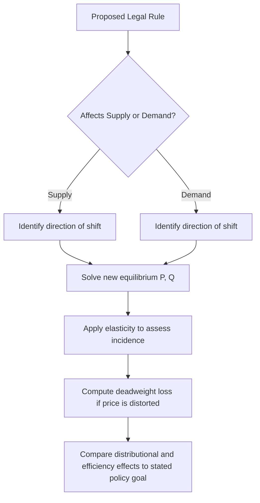

## Supply, Demand, and Market Equilibrium in Legal Contexts


### Overview

Supply and demand analysis is the foundational tool of price theory that law and economics scholars use to predict how legal rules affect market outcomes. Legal rules — liability standards, price controls, licensing requirements, taxes, subsidies, mandatory contract terms — function economically as shifts in supply or demand curves, or as constraints on the price mechanism itself. Understanding equilibrium analysis allows lawyers and policymakers to move beyond intuitions about fairness and predict the actual behavioral and distributional consequences of legal interventions.

### The Basic Model

**Demand** represents the quantity of a good or service that buyers are willing and able to purchase at various prices, holding other factors constant. The **Law of Demand** states that, ceteris paribus, quantity demanded falls as price rises, producing a downward-sloping demand curve.

**Supply** represents the quantity that sellers are willing and able to offer at various prices. The **Law of Supply** states that, ceteris paribus, quantity supplied rises as price rises, producing an upward-sloping supply curve.

**Market equilibrium** occurs at the price-quantity pair where quantity demanded equals quantity supplied — the intersection of the two curves. At this point, there is no inherent pressure for price to change: no surplus (excess supply) and no shortage (excess demand) exists.

Formally, given a demand function $Q_d = D(P)$ and a supply function $Q_s = S(P)$, equilibrium price $P^*$ solves:

$$D(P^*) = S(P^*)$$

**Example**

Suppose the market for a standardized legal service (e.g., uncontested residential closings in a metropolitan area) has:

- Demand: $Q_d = 1000 - 10P$
- Supply: $Q_s = 200 + 5P$

Setting $Q_d = Q_s$:

$$1000 - 10P = 200 + 5P$$


$$800 = 15P$$


$$P^* = 53.33, \quad Q^* = 466.7$$

At any price above $53.33, quantity supplied exceeds quantity demanded (surplus), pushing price down. At any price below $53.33, quantity demanded exceeds quantity supplied (shortage), pushing price up. Only $P^*$ is stable.

### Determinants of Supply and Demand: Shifts vs. Movements

A critical distinction for legal analysis is between a **movement along** a curve (caused by a price change) and a **shift of** the curve itself (caused by a change in a non-price determinant).

**Demand shifters** include:

- Income (normal vs. inferior goods)
- Prices of substitutes and complements
- Consumer preferences and expectations
- Number of buyers
- **Legal rules**: mandatory disclosure requirements, liability defaults that affect perceived product safety, tax incidence falling nominally on buyers

**Supply shifters** include:

- Input costs (labor, capital, raw materials)
- Technology
- Number of sellers
- Expectations
- **Legal rules**: licensing and entry barriers, safety/compliance mandates, tort liability exposure, taxes on production, subsidies

This distinction matters enormously in legal argument. A claim that "a new regulation raised prices" is a testable proposition about whether the regulation shifted supply (or demand) and by how much — not a matter of assertion.

### Diagram: Standard Equilibrium



```
Price
|
|\\                    /
| \\                  /
|  \\                /
|   \\              /   S (Supply)
P*|----\\------------/
|     \\  E        
|      \\●        
|      / \\
|     /   \\
|    /     \\
|   /       \\  D (Demand)
|  /         \\
|_/___________\\_______________ Quantity
        Q*
```

The following SVG renders this more precisely:

<svg xmlns="http://www.w3.org/2000/svg" viewBox="0 0 500 400">
<text x="250" y="25" text-anchor="middle" font-size="16" font-weight="bold" fill="#1a1a1a">Market Equilibrium (svg_diagram)</text>
<line x1="60" y1="340" x2="60" y2="50" stroke="#333" stroke-width="2" />
<line x1="60" y1="340" x2="460" y2="340" stroke="#333" stroke-width="2" />
<text x="30" y="55" font-size="13" fill="#333">Price</text>
<text x="430" y="365" font-size="13" fill="#333">Quantity</text>
<line x1="90" y1="80" x2="420" y2="320" stroke="#c0392b" stroke-width="2.5" />
<text x="425" y="325" font-size="13" fill="#c0392b" font-weight="bold">S</text>
<line x1="90" y1="320" x2="420" y2="80" stroke="#2980b9" stroke-width="2.5" />
<text x="425" y="80" font-size="13" fill="#2980b9" font-weight="bold">D</text>
<circle cx="255" cy="200" r="5" fill="#1a1a1a" />
<text x="265" y="195" font-size="13" fill="#1a1a1a">E (Equilibrium)</text>
<line x1="255" y1="200" x2="255" y2="340" stroke="#666" stroke-width="1" stroke-dasharray="4,3" />
<line x1="60" y1="200" x2="255" y2="200" stroke="#666" stroke-width="1" stroke-dasharray="4,3" />
<text x="35" y="204" font-size="12" fill="#333">P*</text>
<text x="248" y="358" font-size="12" fill="#333">Q*</text>
</svg>

### Applications in Legal Analysis

#### 1. Price Ceilings and Floors

A **price ceiling** (maximum lawful price) set below equilibrium — e.g., rent control statutes — creates a persistent shortage: quantity demanded exceeds quantity supplied at the mandated price. Standard microeconomic prediction: reduced quantity supplied over time, non-price rationing (waiting lists, key money, discrimination by landlords), quality deterioration, and black markets.

A **price floor** (minimum lawful price) set above equilibrium — e.g., minimum wage laws, agricultural price supports — creates a persistent surplus: quantity supplied exceeds quantity demanded. In labor markets, this predicts involuntary unemployment among workers whose marginal product falls below the floor. [Inference: the magnitude of employment effects from minimum wage floors remains empirically contested across studies; the qualitative surplus/shortage prediction from the basic model is standard, but real-world elasticity estimates vary and monopsony models complicate the simple competitive prediction.]

$$\text{Deadweight Loss from Price Control} = \frac{1}{2} \times |Q^* - Q_{controlled}| \times |P_d - P_s|$$

#### 2. Taxation and Legal Incidence

A crucial lesson from supply-demand analysis for legal drafters: **statutory incidence (who is legally obligated to remit a tax) does not determine economic incidence (who actually bears the burden).** Economic incidence depends on the relative elasticities of supply and demand, not on which party the statute names.

For a per-unit tax $t$, the burden borne by buyers relative to sellers is:

$$\frac{\text{Buyer's share}}{\text{Seller's share}} = \frac{E_s}{E_d}$$

where $E_s$ and $E_d$ are elasticities of supply and demand (in absolute value). The side of the market that is more inelastic (less able to adjust quantity) bears more of the tax burden, regardless of which side writes the check to the government.

**Example**: A jurisdiction imposes a $1 excise tax on cigarette sellers. Because demand for cigarettes is highly inelastic (addictive good, few substitutes) relative to supply, sellers pass most of the tax forward to consumers via higher prices — even though the statute obligates only the seller to remit payment.

#### 3. Licensing and Occupational Entry Barriers

Occupational licensing requirements (bar admission, medical licensure, taxi medallions, cosmetology licenses) function as **supply restrictions**: they raise the cost of entry, shifting the supply curve leftward (or imposing a fixed maximum quantity, as with medallion caps). Predicted effects:

- Higher equilibrium price for the licensed service
- Lower equilibrium quantity
- Economic rents captured by incumbent license holders
- Potential quality improvements (if licensing solves genuine information asymmetries) versus pure rent-seeking (if licensing serves only to restrict competition)

This tension is central to law and economics debates over occupational licensing reform and is frequently litigated under state constitutional "right to earn a living" theories and antitrust doctrines addressing state-action immunity.

#### 4. Tort Liability Rules as Supply Shifters

Liability rules (negligence, strict liability, no liability) affect the expected cost of production for injurers, functioning as an implicit tax or subsidy that shifts supply. Under strict liability, injurers internalize expected accident costs $p \cdot L$ (probability of harm times magnitude of loss), raising marginal cost and shifting supply leftward relative to a no-liability regime. This is the microeconomic mechanism underlying the **Learned Hand Formula** and Calabresi's cheapest-cost-avoider analysis: liability rules are supply-side instruments for internalizing externalities (see Coase Theorem and externalities topics).

#### 5. Antitrust: Market Definition and Monopoly Pricing

Supply-demand analysis underlies antitrust market definition (the **SSNIP test** — Small but Significant Non-transitory Increase in Price) and monopoly pricing analysis. A monopolist restricts output below the competitive equilibrium quantity $Q^*$ to a profit-maximizing quantity $Q_m$ where marginal revenue equals marginal cost, charging a supracompetitive price $P_m > P^*$. This creates:

- **Allocative inefficiency**: deadweight loss from the gap between price and marginal cost
- **Wealth transfer**: from consumers to the monopolist (not itself inefficient, but distributionally relevant)

$$\text{Deadweight Loss}_{monopoly} = \frac{1}{2}(Q^* - Q_m)(P_m - MC)$$

### Elasticity: The Key Predictive Parameter

**Price elasticity of demand** measures responsiveness of quantity demanded to price changes:

$$E_d = \frac{\%\Delta Q_d}{\%\Delta P}$$

- $|E_d| > 1$: elastic (quantity highly responsive; luxury goods, goods with close substitutes)
- $|E_d| < 1$: inelastic (quantity unresponsive; necessities, addictive goods, goods with few substitutes)
- $|E_d| = 1$: unit elastic

Elasticity determines the practical bite of nearly every legal intervention discussed above: tax incidence, deadweight loss from price controls, and the revenue/output tradeoffs monopolists and regulators face. Legal analysis that ignores elasticity — asserting, for instance, that "the seller will just pay the tax" or "the buyer will bear the whole cost of the mandate" — is incomplete without reference to relative elasticities on each side of the market.

### Comparative Statics: A Framework for Legal Rule Analysis

When analyzing a proposed or existing legal rule, the standard method is:

1. Identify which curve (supply or demand) the rule affects, and the direction of the shift
2. Determine the new equilibrium price and quantity
3. Assess distributional consequences (who gains, who loses, by how much) using elasticity
4. Assess efficiency consequences (deadweight loss, if any) relative to the undistorted competitive equilibrium
5. Compare against the rule's stated policy objective to evaluate whether the legal instrument is well-targeted



### Limitations of the Basic Model

- **Perfect competition assumptions**: the basic model assumes many buyers/sellers, homogeneous goods, perfect information, and free entry/exit — assumptions frequently violated in markets subject to legal regulation (healthcare, utilities, labor markets with search frictions)
- **Static analysis**: the model is a snapshot; dynamic effects (entry/exit over time, innovation responses to regulation) require extensions
- **General vs. partial equilibrium**: supply-demand analysis as presented is *partial equilibrium* (one market in isolation); legal rules with economy-wide effects (e.g., broad tax reform) may require general equilibrium analysis accounting for cross-market feedback
- **Behavioral departures**: bounded rationality, present bias, and cognitive biases can cause actual demand/supply behavior to diverge from the rational-actor predictions embedded in the standard curves — a foundational critique from behavioral law and economics

### Related Topics

- Elasticity of supply and demand and tax incidence analysis
- Deadweight loss and the measurement of allocative inefficiency
- The Coase Theorem and transaction costs
- Externalities and Pigouvian taxation
- Market failure typologies (monopoly, public goods, information asymmetry)
- Antitrust economics: market power, SSNIP test, merger analysis
- Behavioral law and economics: departures from rational-actor demand models
- General equilibrium analysis and its legal applications