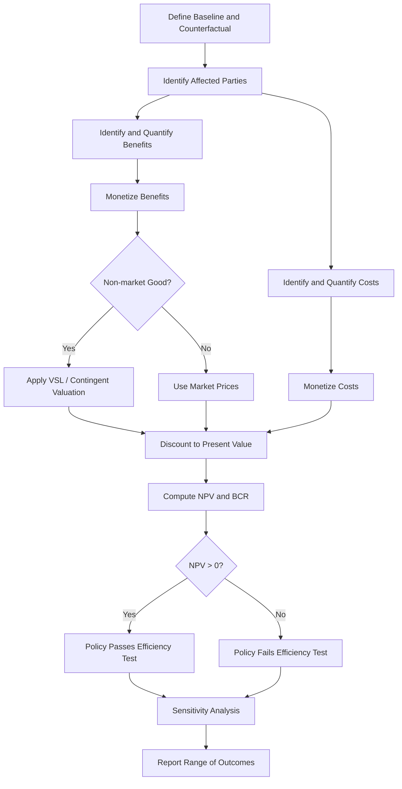

## Cost-Benefit Analysis for Legal Policy

### Definition and Purpose

Cost-benefit analysis (CBA) is a systematic framework for evaluating legal rules, regulations, and policy interventions by quantifying and comparing their total costs against their total benefits, typically expressed in monetary terms. In the law and economics tradition, CBA operationalizes the efficiency criterion: a policy is deemed desirable if it generates a net increase in social welfare, measured as aggregate benefits minus aggregate costs.

CBA serves several functions in legal analysis:

- Screening proposed regulations before enactment (ex ante analysis)
- Evaluating existing legal rules or enforcement regimes (ex post analysis)
- Ranking alternative policy instruments (e.g., a tax versus a quantity restriction versus a liability rule)
- Providing courts and agencies with a defensible, transparent methodology for discretionary decisions

### Theoretical Foundations

**Welfare Economics Basis**

CBA is grounded in welfare economics, specifically the Kaldor-Hicks efficiency criterion rather than strict Pareto efficiency. Under Kaldor-Hicks, a policy is efficient if the winners could hypothetically compensate the losers and still be better off, even if no actual compensation occurs. This distinguishes CBA from Pareto improvements, which require that no one be made worse off.

$$\text{Net Social Benefit} = \sum_{i=1}^{n} B_i - \sum_{i=1}^{n} C_i$$

where $B_i$ represents benefits accruing to affected party $i$ and $C_i$ represents costs borne by party $i$.

**Relationship to the Coase Theorem**

CBA is conceptually linked to Coasean reasoning. In a zero-transaction-cost world, private bargaining would allocate resources efficiently without need for CBA-driven regulation. CBA becomes analytically necessary precisely because transaction costs prevent private renegotiation, requiring the legal system to approximate efficient outcomes administratively.

**Consumer and Producer Surplus**

Benefits and costs are frequently derived from surplus concepts:

$$\text{Consumer Surplus} = \int_{0}^{Q^*} (D(q) - P^*) \, dq$$

$$\text{Producer Surplus} = \int_{0}^{Q^*} (P^* - S(q)) \, dq$$

where $D(q)$ is the inverse demand function, $S(q)$ is the inverse supply function, $P^*$ is equilibrium price, and $Q^*$ is equilibrium quantity. Policy-induced shifts in these curves (e.g., from a safety regulation) generate the surplus changes that CBA attempts to measure.

### Core Components of Legal CBA

**1. Defining the Baseline and Counterfactual**

The analysis requires a clearly specified "no-action" baseline against which the proposed legal rule is compared. Errors in baseline specification are among the most common sources of CBA distortion, since costs and benefits are only meaningful relative to what would have occurred absent the intervention.

**2. Identifying Affected Parties and Standing**

Legal CBA must decide *whose* costs and benefits count — a normatively loaded question. Standard practice includes:

- Directly regulated parties (compliance costs)
- Third-party beneficiaries (e.g., public health gains)
- Government administrative costs (enforcement, monitoring)
- Sometimes explicitly excluded: costs to parties engaged in illegal activity (e.g., lost profits from restricting fraud) — a normative choice, not a technical requirement

**3. Monetization of Costs**

Direct compliance costs (capital expenditure, labor, materials) are typically the most straightforward to monetize using market prices. Administrative and enforcement costs to government agencies are added separately.

**4. Monetization of Benefits**

This is typically the most contested step, especially where benefits are non-market goods such as health, safety, or environmental quality.

**Value of a Statistical Life (VSL)**

For regulations affecting mortality risk (e.g., safety standards, environmental rules), economists use the Value of a Statistical Life rather than attempting to value an identified individual's life:

$$VSL = \frac{\Delta w}{\Delta p}$$

where $\Delta w$ is the wage premium workers require to accept an incremental increase in fatality risk $\Delta p$. VSL is derived from revealed-preference studies (typically hedonic wage studies) or stated-preference (contingent valuation) surveys. [Inference] The specific VSL figure used varies significantly by agency and jurisdiction and is subject to periodic revision, so any numeric figure cited should be treated as illustrative rather than current.

**Contingent Valuation**

For non-market goods lacking revealed-preference proxies (e.g., existence value of a wilderness area), analysts use stated-preference surveys asking respondents their willingness to pay (WTP) or willingness to accept (WTA) compensation. This method is controversial due to hypothetical bias, embedding effects, and the WTP-WTA divergence documented in behavioral economics.

**5. Discounting Future Costs and Benefits**

Because legal policies often generate costs and benefits over different time horizons, CBA requires converting future values to present value:

$$PV = \sum_{t=0}^{T} \frac{B_t - C_t}{(1+r)^t}$$

where $r$ is the discount rate and $t$ indexes time periods. The choice of discount rate is one of the most consequential and contested parameters in legal CBA:

- Higher discount rates favor policies with front-loaded costs and back-loaded benefits (e.g., they disfavor stringent climate regulation)
- Lower discount rates favor long-horizon investments in future welfare
- Agencies commonly report results across a range of discount rates (e.g., 3% and 7%) rather than a single rate, precisely because the selection is normatively contested

### Standard Decision Rules

**Net Present Value (NPV)**

$$NPV = PV(\text{Benefits}) - PV(\text{Costs})$$

A policy passes the CBA test if $NPV > 0$.

**Benefit-Cost Ratio (BCR)**

$$BCR = \frac{PV(\text{Benefits})}{PV(\text{Costs})}$$

A ratio greater than 1 indicates the policy is efficient by the CBA criterion. BCR is useful for ranking mutually exclusive projects under a budget constraint but can be misleading when comparing projects of different scale.

**Break-Even Analysis**

Where benefit monetization is too uncertain to produce a reliable point estimate, analysts sometimes invert the problem: calculate the minimum monetized benefit required for $NPV = 0$, then assess whether that threshold is plausible given qualitative evidence. This is common in judicial and regulatory contexts where full monetization is politically or epistemically infeasible.

### Application to Legal Rulemaking

**Regulatory Impact Analysis (RIA)**

In the U.S. administrative law context, CBA is institutionalized through Executive Order 12866 (and predecessor/successor orders), which requires federal agencies to prepare a Regulatory Impact Analysis for economically significant rules, generally including a formal CBA. [Unverified] The specific dollar threshold defining "economically significant" and the precise current executive order in force should be confirmed against current Office of Management and Budget guidance, as these thresholds and directives are periodically revised.

**Judicial Use of CBA**

CBA logic appears in judicial reasoning even without an explicit monetized analysis, most famously in the Hand Formula from *United States v. Carroll Towing Co.* (1947), which frames negligence as a comparison of the burden of precaution ($B$) against the probability of harm ($P$) multiplied by the magnitude of loss ($L$):

$$\text{Negligence if } B < PL$$

This is a doctrinal cousin of CBA: it asks whether the cost of an additional unit of care is justified by the expected reduction in harm, applying marginal reasoning rather than a full social CBA.

### Critiques and Limitations

**Distributional Blindness**

Standard CBA aggregates costs and benefits without regard to who bears them, treating a dollar of benefit to a wealthy party as equivalent to a dollar of benefit to a poor party. This has drawn sustained criticism from scholars who argue that legal policy should weight distributional effects, not just aggregate efficiency.

**Commensurability Problems**

Critics argue that reducing values such as human life, ecological integrity, or dignity to monetary terms is either conceptually incoherent or morally objectionable, since it treats incommensurable goods as though they lie on a single cardinal scale.

**Uncertainty and Manipulability**

Because monetization involves numerous discretionary judgment calls (discount rate, VSL estimate, baseline specification, scope of standing), CBA outcomes can be sensitive to analyst choices, raising concerns about strategic manipulation to justify predetermined conclusions. [Speculation] Some critics contend this sensitivity is severe enough to undermine CBA's claimed objectivity as a decision procedure, though defenders respond that transparency requirements and sensitivity analysis mitigate this risk.

**Risk and Uncertainty Treatment**

Basic CBA often uses expected values, which can understate the importance of low-probability, high-magnitude harms (catastrophic or irreversible risks). Extensions incorporating risk aversion, option value, and the precautionary principle attempt to address this gap.

### Sensitivity Analysis

Given the contested parameters described above, rigorous legal CBA reports results under multiple assumptions rather than a single point estimate:

- **One-way sensitivity analysis**: varying one parameter (e.g., discount rate) while holding others fixed
- **Monte Carlo simulation**: treating uncertain parameters as probability distributions and simulating the range of possible NPV outcomes
- **Scenario analysis**: presenting best-case, worst-case, and central-case estimates side by side

### Illustrative Numerical Example

Consider a proposed workplace safety regulation with the following parameters over a 10-year horizon, discounted at $r = 3\%$:

| Category | Annual Value |
| --- | --- |
| Compliance cost (firms) | $50 million |
| Enforcement cost (agency) | $5 million |
| Reduced fatalities (VSL-based) | $80 million |
| Reduced injuries (medical + productivity) | $20 million |

Annual net benefit: $(\$80M + \$20M) - (\$50M + \$5M) = \$45M$

$$PV = \sum_{t=1}^{10} \frac{45{,}000{,}000}{(1.03)^t} \approx \$383.9 \text{ million}$$

This positive NPV suggests the regulation passes the CBA efficiency test under these assumptions. [Inference] Reversing the discount rate to 7% would lower this present value substantially, illustrating why regulatory analyses commonly report a range rather than a single figure.

### Process Flow Diagram

### Conceptual Diagram: Surplus Change from Regulation (svg_diagram)

<svg xmlns="http://www.w3.org/2000/svg" viewBox="0 0 640 420">
<text x="200" y="24" font-size="16" font-weight="bold" text-anchor="middle">Surplus Change from Regulation (svg_diagram)</text>
<line x1="70" y1="360" x2="590" y2="360" stroke="black" stroke-width="1.5" />
<line x1="70" y1="360" x2="70" y2="40" stroke="black" stroke-width="1.5" />
<text x="580" y="378" font-size="12">Quantity</text>
<text x="35" y="45" font-size="12">Price</text>
<line x1="70" y1="80" x2="590" y2="340" stroke="steelblue" stroke-width="2" />
<text x="560" y="335" font-size="12" fill="steelblue">Demand D(q)</text>
<line x1="70" y1="340" x2="590" y2="100" stroke="darkorange" stroke-width="2" />
<text x="500" y="120" font-size="12" fill="darkorange">Supply S(q)</text>
<line x1="70" y1="300" x2="590" y2="140" stroke="darkorange" stroke-width="2" stroke-dasharray="6,4" />
<text x="450" y="180" font-size="12" fill="darkorange">Supply after regulation S'(q)</text>
<line x1="330" y1="360" x2="330" y2="220" stroke="gray" stroke-width="1" stroke-dasharray="3,3" />
<line x1="70" y1="220" x2="330" y2="220" stroke="gray" stroke-width="1" stroke-dasharray="3,3" />
<circle cx="330" cy="220" r="4" fill="black" />
<text x="335" y="215" font-size="11">Original Equilibrium</text>
<line x1="280" y1="360" x2="280" y2="255" stroke="gray" stroke-width="1" stroke-dasharray="3,3" />
<line x1="70" y1="255" x2="280" y2="255" stroke="gray" stroke-width="1" stroke-dasharray="3,3" />
<circle cx="280" cy="255" r="4" fill="black" />
<text x="150" y="248" font-size="11">New Equilibrium</text>
<polygon points="70,80 330,220 70,220" fill="lightblue" opacity="0.5" />
<text x="140" y="170" font-size="11">Consumer Surplus</text>
<polygon points="70,220 330,220 70,340" fill="navajowhite" opacity="0.6" />
<text x="130" y="290" font-size="11">Producer Surplus</text>
<polygon points="280,255 330,220 280,300" fill="crimson" opacity="0.4" />
<text x="220" y="330" font-size="11" fill="crimson">Deadweight/Compliance Cost Wedge</text>
</svg>

### Related Topics

- The Kaldor-Hicks efficiency criterion versus Pareto optimality in legal theory
- Value of a Statistical Life: derivation, controversies, and cross-agency variation
- Discount rate selection in intergenerational and environmental policy
- Regulatory Impact Analysis under U.S. administrative law (Executive Order framework)
- The Hand Formula and negligence as marginal cost-benefit reasoning
- Distributionally weighted cost-benefit analysis
- Contingent valuation methodology and the WTP-WTA gap
- Risk-adjusted CBA: option value, irreversibility, and the precautionary principle
- Cost-effectiveness analysis as an alternative to full monetization
- Behavioral law and economics critiques of rational-actor assumptions in CBA