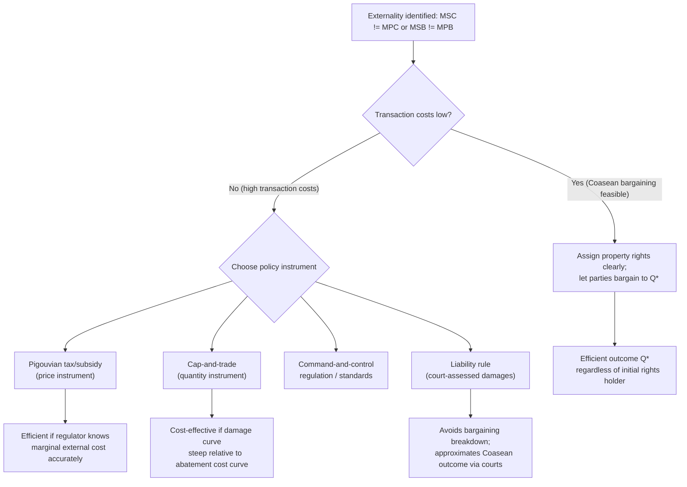

## Externalities and Market Failure

### Definition and Conceptual Foundations

An externality exists when the action of one party imposes a cost or confers a benefit on a third party who is not party to the transaction generating that cost or benefit, and this effect is not reflected in market prices. Externalities are a canonical form of market failure because the price mechanism, which is supposed to aggregate all relevant costs and benefits, fails to capture the spillover effect. The core problem is a divergence between **private cost/benefit** and **social cost/benefit**.

- **Marginal Private Cost (MPC):** the cost borne directly by the producer of a good or activity.
- **Marginal External Cost (MEC):** the uncompensated cost imposed on third parties.
- **Marginal Social Cost (MSC):** $MSC = MPC + MEC$

Analogously for benefits:

- **Marginal Private Benefit (MPB):** benefit captured by the consumer/actor.
- **Marginal External Benefit (MEB):** uncompensated benefit to third parties.
- **Marginal Social Benefit (MSB):** $MSB = MPB + MEB$

Efficient resource allocation, in the Pigouvian welfare-economics tradition, requires production or consumption at the level where $MSB = MSC$. When externalities are present, private actors equate $MPB = MPC$ instead, producing a divergence from the social optimum.

### Typology of Externalities

**Negative production externality:** A factory emits pollution while manufacturing steel. $MSC > MPC$, so the market, left alone, overproduces relative to the efficient quantity $Q^*$.

**Positive production externality:** A firm's R&D generates knowledge spillovers that benefit rival firms. $MSB > MPB$ from the standpoint of social value, leading to underinvestment relative to $Q^*$.

**Negative consumption externality:** Secondhand smoke, loud music, or antibiotic resistance from overuse. $MSC > MPC$ from the consumer's viewpoke; overconsumption results.

**Positive consumption externality:** Vaccination confers herd-immunity benefits on non-vaccinated third parties; education generates informed-citizenry spillovers. $MSB > MPB$; underconsumption results.

**Network externalities** (a related but distinct concept): the value of a good to one user depends on the number of other users (e.g., communication platforms, standards). These can be positive (network effects) or, in cases of congestion, negative.

**Pecuniary vs. technological externalities:** This distinction matters greatly for legal-economic analysis. A *pecuniary* externality operates through prices (e.g., a new firm entering a market lowers the price faced by rivals) and does **not** constitute market failure — it reflects normal competitive reallocation and is welfare-neutral in efficiency terms, though it has distributive effects. A *technological* (real) externality operates outside the price system, directly affecting a third party's production or utility function (e.g., pollution damaging a neighboring firm's crops). Only technological externalities justify corrective intervention on efficiency grounds; conflating the two is a common analytical error, including in some case law and regulatory impact analyses.

### The Standard Graphical Model (Negative Externality)

The diagram below shows a negative production externality: the market equilibrium $Q_m$ (where $MPC = MPB$) exceeds the socially efficient quantity $Q^*$ (where $MSC = MSB$). The shaded region between $Q^*$ and $Q_m$ represents the deadweight loss (DWL) — the excess of social cost over social benefit for units produced beyond $Q^*$.

<svg xmlns="http://www.w3.org/2000/svg" viewBox="0 0 640 420" font-family="Helvetica, Arial, sans-serif">
<text x="320" y="24" text-anchor="middle" font-size="16" font-weight="bold">Negative Externality: Deadweight Loss (svg_diagram)</text>

<line x1="80" y1="360" x2="580" y2="360" stroke="black" stroke-width="1.5" />
<line x1="80" y1="360" x2="80" y2="50" stroke="black" stroke-width="1.5" />
<text x="580" y="378" font-size="13">Quantity</text>
<text x="55" y="55" font-size="13">Price</text>

<line x1="120" y1="80" x2="520" y2="340" stroke="#1f77b4" stroke-width="2" />
<text x="530" y="345" font-size="12" fill="#1f77b4">MPB = MSB (Demand)</text>

<line x1="120" y1="330" x2="480" y2="90" stroke="#2ca02c" stroke-width="2" />
<text x="485" y="88" font-size="12" fill="#2ca02c">MPC (Supply)</text>

<line x1="120" y1="260" x2="420" y2="90" stroke="#d62728" stroke-width="2" />
<text x="425" y="88" font-size="12" fill="#d62728">MSC = MPC + MEC</text>

<line x1="410" y1="360" x2="410" y2="180" stroke="black" stroke-dasharray="4,3" stroke-width="1" />
<circle cx="410" cy="180" r="4" fill="black" />
<text x="400" y="378" font-size="13">Qm</text>

<line x1="300" y1="360" x2="300" y2="210" stroke="black" stroke-dasharray="4,3" stroke-width="1" />
<circle cx="300" cy="210" r="4" fill="black" />
<text x="292" y="378" font-size="13">Q*</text>

<polygon points="300,210 410,180 410,255" fill="#d62728" opacity="0.35" />
<text x="330" y="240" font-size="12" fill="#7f0000" font-weight="bold">DWL</text>

<text x="90" y="345" font-size="11">O</text>

</svg>

**Reading the diagram:** the unregulated market clears at $Q_m$, where private supply (MPC) meets demand. Because MSC lies above MPC by the amount of the marginal external cost, the socially efficient quantity $Q^*$ is smaller. Every unit between $Q^*$ and $Q_m$ generates social cost exceeding social benefit, and the accumulated excess is the deadweight loss triangle.

### The Pigouvian Correction

A. C. Pigou's classical solution is a **corrective tax** (or subsidy, for positive externalities) set equal to the marginal external cost/benefit at the efficient quantity, internalizing the externality into the private decision-maker's calculus.

$$t^* = MEC(Q^*)$$

Imposing $t^*$ on the polluting activity shifts the effective private marginal cost curve upward to coincide with MSC, so that the firm's private optimization (equating price to $MPC + t$) reproduces the socially efficient outcome $Q^*$. For positive externalities, a Pigouvian subsidy of $s^* = MEB(Q^*)$ shifts MPB upward to meet MSB.

**Key Points**

- The Pigouvian tax need not equal the *average* damage; it must equal the *marginal* damage evaluated at the efficient output level, which requires the regulator to know the shape of the MEC curve — an informationally demanding requirement.
- Revenue from a Pigouvian tax can, in principle, be used to compensate victims, though efficiency only requires the tax rate be correct, not that revenue be earmarked to victims (compensation and efficiency are analytically separable).
- Pigouvian instruments assume a benevolent, well-informed regulator able to estimate MEC — an assumption subsequent theory challenges (see Coase, below).

### The Coase Theorem

Ronald Coase's 1960 article "The Problem of Social Cost" reframed externalities as a *reciprocal* problem: pollution harms the neighbor, but restricting the polluter harms the polluter, so asking "who caused the harm" is not analytically decisive. Coase's central proposition, subsequently formalized by George Stigler as the **Coase Theorem**, holds that:

> If property rights are clearly defined and transaction costs are zero, private parties will bargain to the efficient allocation of resources regardless of the initial assignment of legal rights, and the initial assignment of rights will affect only the distribution of wealth, not the efficiency of the outcome.

**Formal illustration:** Suppose a factory's production generates smoke damaging a laundry's business. Let $\pi_f(Q)$ be factory profit and $D(Q)$ be damage to the laundry, both functions of output $Q$. Total social surplus is $S(Q) = \pi_f(Q) - D(Q)$, maximized at $Q^*$ where $\pi_f'(Q^*) = D'(Q^*)$.

- If the factory has the right to pollute, the laundry can pay the factory to reduce output; the laundry's willingness to pay up to $D'(Q)$ per unit reduction meets the factory's willingness to accept $\pi_f'(Q)$ compensation, and bargaining converges to $Q^*$.
- If the laundry has the right to be free from pollution, the factory can pay the laundry for the right to pollute up to $Q^*$, since beyond that point the marginal profit from further output is less than the marginal damage, extra pollution isn't worth purchasing.

Either assignment yields $Q^*$; only the direction of the payment (and hence the wealth distribution) differs.

**Key Points**

- The theorem is *not* a claim that bargaining always occurs costlessly in the real world — it is precisely a diagnostic device: **transaction costs are the reason law matters**. Where transaction costs are zero, legal rules are allocatively irrelevant; where transaction costs are positive (the empirically normal case), the initial assignment of the entitlement (and the choice of legal remedy) determines the efficiency outcome, which is the foundation of the *Coasean* approach to legal design (Calabresi & Melamed's property/liability rule framework builds directly on this insight).
- Corollary for legal design: when transaction costs are prohibitively high, courts/legislatures should assign the entitlement to the party who would have purchased it in a hypothetical costless-bargaining world (mimicking the market) — sometimes called "efficient" or "hypothetical-market" assignment of rights.

### Transaction Costs and Why the Coase Theorem Fails in Practice

Transaction costs include search and information costs, bargaining costs, free-rider problems among numerous affected parties, and enforcement costs. Their presence is the standard justification for legal and regulatory intervention:

- **Large-numbers problems:** with many polluters and/or many victims (e.g., air pollution affecting an entire city), organizing collective bargaining is prohibitively costly, and strategic holdout/free-riding behavior undermines voluntary agreement.
- **Asymmetric information:** parties may not know the true magnitude of damages or abatement costs, and each has an incentive to misrepresent them strategically during bargaining.
- **Missing or ambiguous property rights:** open-access resources (see below) have no definable rights-holder with whom to bargain.

This is why, notwithstanding the Coase Theorem's zero-transaction-cost benchmark, real-world legal and economic policy responses to externalities rely on Pigouvian taxes/subsidies, command-and-control regulation, tradable permit systems, and liability rules.

### Market-Based Instruments: Cap-and-Trade

An alternative to Pigouvian taxation is a **quantity-based** instrument: the regulator sets an aggregate cap on total emissions ($\bar{E}$), issues tradable permits summing to that cap, and allows firms to trade permits. Firms with low abatement costs sell permits to firms with high abatement costs, and in equilibrium, all firms' marginal abatement costs equalize — achieving the cap at least aggregate cost, a property known as **static cost-effectiveness**.

**Prices vs. quantities (Weitzman, 1974):** Under uncertainty about abatement costs, the choice between a Pigouvian tax (price instrument) and cap-and-trade (quantity instrument) is not welfare-equivalent. If the marginal damage curve is relatively flat and marginal abatement cost curve is steep (uncertain, volatile costs), a price instrument (tax) minimizes expected welfare loss because it avoids costly quantity constraints, since firms retains flexibility to overshoot/undershoot at a known cost. If the marginal damage curve is steep (e.g., risk of a catastrophic threshold, as in some accounts of climate tipping points) relative to a flat marginal abatement cost curve, a quantity instrument (cap) is preferable because it guarantees the environmental target is met regardless of cost realization.

### Liability Rules, Property Rules, and Calabresi–Melamed

Guido Calabresi and A. Douglas Melamed's 1972 framework ("Property Rules, Liability Rules, and Inalienability") extends Coasean analysis to legal remedy design, asking: once an entitlement is assigned (e.g., the right to be free from pollution), how should the law protect it?

- **Property rule:** the entitlement can only be transferred by voluntary, negotiated agreement (e.g., injunctive relief against a polluter). Appropriate when transaction costs are low, since it forces bargaining and lets private valuations determine efficient transfer.
- **Liability rule:** the entitlement can be taken by another party who then pays objectively-determined (court-assessed) compensation (e.g., damages instead of injunction). Appropriate when transaction costs are high, since it avoids the paralysis of a bargaining requirement (e.g., bilateral monopoly holdout) while still pricing the externality.
- **Inalienability rule:** the entitlement cannot be transferred at all, even voluntarily (e.g., prohibitions on selling certain body parts or votes), typically justified by paternalism, severe externalities to non-parties, or moral/distributive concerns beyond simple efficiency.

This taxonomy directly informs the choice between nuisance injunctions (property rule) versus damages remedies (liability rule) in tort and environmental law, and it is a central analytical tool for law-and-economics treatment of pollution litigation, eminent domain, and takings law.

### The Tragedy of the Commons and Open-Access Resources

A related and legally significant class of externality problems arises with **common-pool resources** (rivalrous but non-excludable): fisheries, groundwater aquifers, grazing land, and congested public roads. Garrett Hardin's 1968 "tragedy of the commons" describes how, absent well-defined property rights or regulation, each user internalizes the full private benefit of extraction/use but only a fractional share of the cost (resource depletion), since that cost is spread across all users. The individually rational strategy is over-extraction, leading to resource exhaustion even though every participant would be better off under a cooperative restraint.

**Formal condition:** with $N$ symmetric users each extracting $q_i$ from a resource whose average product declines with total extraction $Q = \sum q_i$, individual optimization sets $MPB_i = MPC_i$ using only the *private* share of marginal depletion cost, whereas social efficiency requires equating $MSB$ to the *full* marginal cost of depletion borne by all $N$ users — the wedge between the two grows with $N$, meaning tragedy-of-the-commons distortions become more severe as the number of resource users increases (open-access congestion is a limiting case of a negative consumption externality with $N \to \infty$).

**Legal-institutional responses:** these mirror the general externality toolkit — assigning private property rights (individual transferable quotas in fisheries), regulatory extraction limits (command-and-control), Pigouvian extraction taxes, and Elinor Ostrom's empirically documented category of **polycentric, community-based governance** institutions, which show that well-designed common-property (not open-access) regimes with monitoring and graduated sanctions can sustain resources without full privatization or top-down state control — an important qualification to the stark "tragedy" narrative.

### Public Goods as a Limiting Case of Positive Externalities

Public goods (non-rivalrous, non-excludable — e.g., national defense, basic research, lighthouse services in the classical economics example) can be understood as an extreme case of positive externality: because non-payers cannot be excluded from consuming the benefit, private markets systematically undersupply public goods relative to the social optimum, since each potential provider captures only a fraction of total social value and free-riding is rational for consumers. This underpins the standard law-and-economics justification for state provision or subsidization of public goods, and it is analytically continuous with (though distinct from) externality theory — the market failure mechanism (divergence between private and social marginal benefit) is the same.

### Legal Doctrines Mapped to Externality Theory

**Nuisance law:** Private and public nuisance doctrines are the common-law analogue of Pigouvian/Coasean correction for negative externalities between neighboring land users, historically predating formal economic theory but analyzable through the same MSC/MPC framework. Courts balancing "reasonableness" of interfering conduct against harm caused implicitly perform a cost-benefit comparison akin to the efficient-externality-level calculation.

**Tort law generally:** The Learned Hand negligence formula ($B < PL$, i.e., liability attaches when the burden of precaution $B$ is less than the probability-weighted loss $PL$) is structurally a marginal-cost-internalization rule: it forces injurers to account for expected harm to victims (an externality) in choosing their level of care, analogous to a Pigouvian tax on insufficient precaution.

**Environmental statutes:** The Clean Air Act's cap-and-trade programs (e.g., the historic SO₂ Acid Rain Program) and modern carbon-pricing schemes (EU ETS, California cap-and-trade) are direct legislative implementations of the quantity-instrument solution described above.

**Zoning and land-use law:** Zoning ordinances function as ex ante, categorical (command-and-control) responses to anticipated negative externalities between incompatible land uses (e.g., separating industrial from residential zones), substituting administrative rules for case-by-case Coasean bargaining or nuisance litigation, on the theory that transaction costs among numerous, dispersed landowners are prohibitively high.

**Antitrust and network externalities:** In platform and technology-market antitrust analysis, positive network externalities can justify economies of scale that raise standard market-power concerns, requiring courts and agencies to distinguish efficiency-driven scale from anticompetitive exclusion — a live and contested area of doctrine. [Inference: contemporary antitrust treatment of network effects in digital markets remains an evolving and jurisdiction-specific area; specific doctrinal tests vary and should be verified against current case law.]

### Worked Numerical Example

Suppose demand for a chemical product is $P = 100 - Q$ (inverse demand, so $MPB = MSB = 100 - Q$), and marginal private cost is $MPC = 10 + Q$. Production generates pollution with marginal external cost $MEC = 20$ (constant, for simplicity).

**Unregulated market equilibrium:** set $MPB = MPC$:

$$100 - Q = 10 + Q \implies 90 = 2Q \implies Q_m = 45,\ P_m = 55$$

**Socially efficient quantity:** $MSC = MPC + MEC = 10 + Q + 20 = 30 + Q$. Set $MSB = MSC$:

$$100 - Q = 30 + Q \implies 70 = 2Q \implies Q^{*} = 35$$

**Optimal Pigouvian tax:** $t^{*} = MEC = 20$ per unit, levied on the producer. This shifts effective private marginal cost to $10 + Q + 20 = 30 + Q$, and firms then equate this to $MPB$, reproducing $Q^{*} = 35$.

**Deadweight loss from the unregulated outcome:**

$$DWL = \frac{1}{2} \times (Q_m - Q^{*}) \times MEC = \frac{1}{2} \times 10 \times 20 = 100$$

This numerical structure (linear demand, linear MPC, constant MEC) is standard in law-and-economics casebooks and problem sets, and it generalizes readily to non-constant $MEC(Q)$ functions requiring calculus-based optimization of $S(Q) = \int_0^Q [MSB(x) - MSC(x)]\,dx$.

### Critiques and Extensions

- **Public choice critique of Pigouvian taxation:** regulators may lack the informational capacity to estimate $MEC$ accurately, and tax/subsidy design is subject to political-economy distortions (rent-seeking, regulatory capture), potentially producing outcomes worse than the uncorrected externality — a caution associated with the "government failure" literature responding to naive market-failure-implies-intervention reasoning. [Inference: the magnitude of this risk is context- and institution-dependent and is a matter of ongoing empirical and theoretical debate rather than settled consensus.]
- **Behavioral law and economics:** where externalities interact with internalities (self-control problems, present bias — e.g., sugar or tobacco consumption), the case for corrective taxation can rest partly on paternalistic grounds distinct from classical externality theory, a distinction increasingly emphasized in the "behavioral Pigouvian tax" literature (e.g., soda taxes justified on both externality and internality grounds).
- **Distributive concerns:** efficiency-focused externality correction (Pigouvian tax, cap-and-trade) can have regressive distributive effects (e.g., carbon taxes' burden on lower-income households), which is a distinct normative dimension from allocative efficiency and often requires supplementary redistribution mechanisms (rebates, dividends) to be politically and ethically viable.

### Comparative Summary of Correction Instruments

| Instrument | Mechanism | Informational requirement | Typical legal context |
| --- | --- | --- | --- |
| Pigouvian tax/subsidy | Price adjustment equal to $MEC$/$MEB$ at $Q^*$ | Regulator must know marginal damage function | Carbon taxes, excise taxes on demerit goods |
| Cap-and-trade | Quantity cap with tradable permits | Regulator must set aggregate cap; market discovers price | SO₂ Acid Rain Program, EU ETS |
| Command-and-control | Direct technology/output standards | Regulator must know efficient standard per source | Emissions standards, zoning ordinances |
| Property rule (injunction) | Bargaining required for entitlement transfer | Requires low transaction costs among parties | Nuisance injunctions |
| Liability rule (damages) | Court-assessed compensation after the fact | Requires courts to estimate damages accurately | Tort damages, nuisance damages |
| Coasean private bargaining | Voluntary negotiation given defined rights | Requires zero/low transaction costs | Easements, private contractual covenants |

**Next Steps**

- Coase Theorem and transaction cost economics (deeper formal treatment)
- Calabresi–Melamed property/liability/inalienability rule framework
- Pigouvian taxation: theory and applied carbon-pricing design
- Cap-and-trade mechanism design and permit market efficiency
- Public goods theory and free-rider problems
- Common-pool resource governance (Ostrom's design principles)
- Nuisance law and the economic analysis of tort remedies
- Weitzman "Prices vs. Quantities" and instrument choice under uncertainty
- Behavioral law and economics: internalities and paternalistic justifications for correction
- Network externalities and platform antitrust analysis