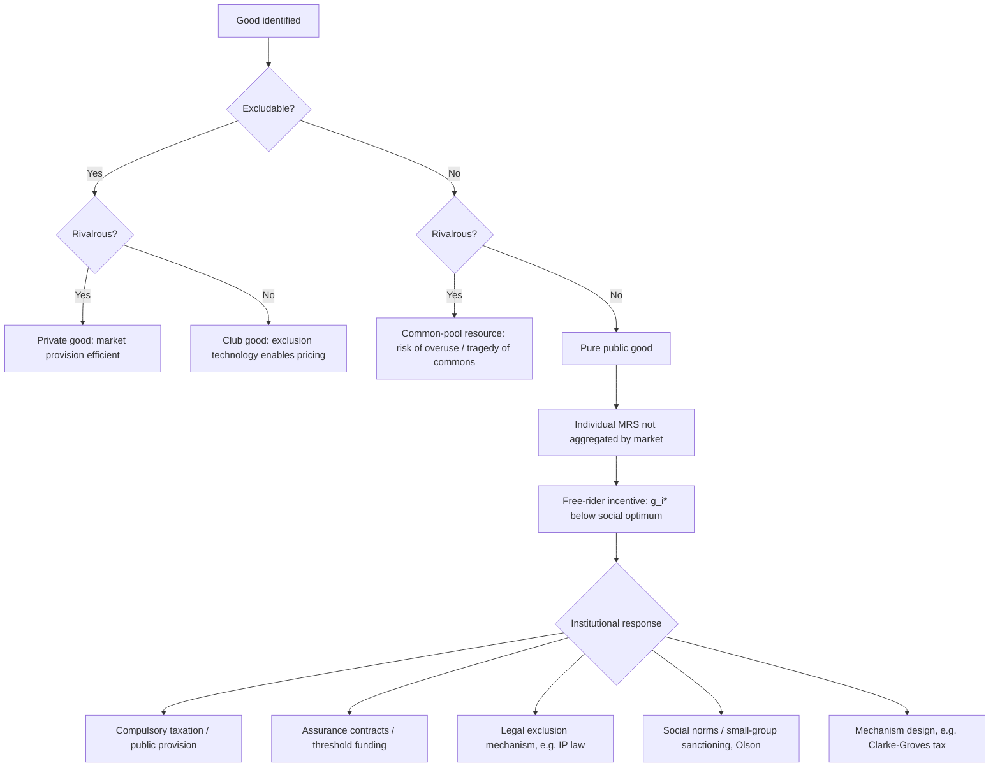

## Public Goods and the Free-Rider Problem

### Definitional Framework

#### Excludability and Rivalry

Goods are classified along two independent dimensions that jointly determine their economic character.

**Excludability** refers to whether a supplier can feasibly prevent non-payers from consuming a good. **Rivalry** (or subtractability) refers to whether one person's consumption diminishes the amount available to others.

|  | Excludable | Non-Excludable |
| --- | --- | --- |
| **Rivalrous** | Private goods (food, clothing) | Common-pool resources (fisheries, groundwater) |
| **Non-Rivalrous** | Club goods (cable TV, toll roads) | Public goods (national defense, clean air) |

A **pure public good** is simultaneously non-excludable and non-rivalrous. Non-excludability means the supplier cannot practically bar a non-paying individual from enjoying the good; non-rivalry means one person's enjoyment does not reduce what remains for others. Most real-world goods labeled "public goods" are **impure**, exhibiting these properties only partially or under congestion (e.g., a public road is non-rivalrous until traffic congestion sets in, at which point it acquires rivalrous characteristics).

#### Formal Conditions

For a good $G$ consumed by $n$ individuals:

- **Non-rivalry**: $x_i = G$ for all $i$, where $x_i$ is individual $i$'s consumption — everyone consumes the *same* quantity, unlike private goods where $\sum_i x_i = G$.
- **Non-excludability**: There exists no feasible technology such that the marginal cost of excluding an additional consumer, $MC_{exclusion}$, is less than the benefit of exclusion, or exclusion is prohibitively costly relative to the good's value.

### The Free-Rider Problem

#### Mechanism

Because non-payers cannot be excluded from consumption, and because one person's consumption does not diminish another's, each rational, self-interested individual has an incentive to under-report their true valuation or to consume without contributing to provision costs, anticipating that others will supply the good regardless. This is the **free-rider problem**.

The free-rider problem is a direct application of game-theoretic collective action logic: individually rational strategies (non-contribution) produce a collectively irrational outcome (underprovision or non-provision), even when the aggregate benefit of provision exceeds the aggregate cost.

#### Formal Model: Private Provision of a Public Good

Consider $n$ individuals, each choosing a contribution $g_i \geq 0$ toward a public good $G = \sum_i g_i$. Individual $i$ maximizes utility:

$$U_i(x_i, G) = x_i + b_i(G)$$

subject to the budget constraint $x_i + g_i = w_i$, where $w_i$ is initial wealth, $x_i$ is private consumption, and $b_i(G)$ is individual $i$'s benefit function from the total public good level.

The individually rational first-order condition (Nash equilibrium in contributions) sets:

$$b_i'(G^*) = 1$$

Each individual contributes only until their **own marginal benefit** equals the marginal cost of contribution (normalized to 1). This ignores the externality — the benefit that $i$'s contribution confers on all other $n-1$ individuals.

The **social optimum** (Samuelson condition, discussed below) requires:

$$\sum_{i=1}^n b_i'(G^{**}) = 1$$

Since $b_i'(G^*) = 1 < \sum_i b_i'(G^{**})$ at any positive contribution level, and benefit functions are typically assumed concave ($b_i'' < 0$), it follows that $G^* < G^{**}$: **private provision systematically underproduces the public good relative to the social optimum.**

**[Inference]** In the simplest linear model with identical agents, this framework can produce the stark "neutrality result" (Warr, 1983; Bergstrom, Blume & Varian, 1986) where redistributing income among contributors leaves total public good provision unchanged — a theoretical result sensitive to assumptions of interior solutions and quasi-linear utility that often fails to hold empirically.

#### The Samuelson Condition

Paul Samuelson's (1954) canonical efficiency condition for public goods provision requires that the **sum** of individual marginal rates of substitution (MRS) between the public good and a private numeraire good equal the marginal rate of transformation (MRT, i.e., marginal cost):

$$\sum_{i=1}^n MRS_i = MRT$$

This contrasts sharply with the efficiency condition for private goods, where each individual's MRS equals MRT separately (since consumption is rivalrous, prices equilibrate individual marginal valuations, not the sum). For public goods, because everyone consumes the same unit simultaneously, efficient provision requires **summing** willingness-to-pay vertically across consumers rather than aggregating demand horizontally.

**Key Points**

- Private markets, which rely on price signals reflecting individual MRS, cannot achieve the Samuelson condition because no mechanism aggregates the *sum* of valuations.
- This is the formal source of market failure for public goods — not merely an empirical regularity but a structural property of the preference-aggregation problem.

### Diagrammatic Illustration: Vertical vs. Horizontal Summation

<svg xmlns="http://www.w3.org/2000/svg" viewBox="0 0 700 420" font-family="sans-serif">
<text x="350" y="24" text-anchor="middle" font-size="16" font-weight="bold">Vertical Summation of Demand for Public Goods (svg_diagram)</text>

<line x1="80" y1="370" x2="620" y2="370" stroke="#333" stroke-width="2" />
<line x1="80" y1="370" x2="80" y2="50" stroke="#333" stroke-width="2" />
<text x="620" y="392" font-size="13">Quantity of Public Good (G)</text>
<text x="30" y="55" font-size="13">Price / MRS ($)</text>

<line x1="80" y1="330" x2="480" y2="90" stroke="#2166ac" stroke-width="2" />
<text x="490" y="90" font-size="12" fill="#2166ac">MRS_A (Demand A)</text>

<line x1="80" y1="300" x2="480" y2="180" stroke="#b2182b" stroke-width="2" />
<text x="490" y="180" font-size="12" fill="#b2182b">MRS_B (Demand B)</text>

<path d="M 80 250 Q 280 130 480 60" stroke="#2ca25f" stroke-width="3" fill="none" />
<text x="330" y="70" font-size="12" fill="#2ca25f" font-weight="bold">Sum MRS_A + MRS_B (Social Demand)</text>

<line x1="80" y1="150" x2="620" y2="150" stroke="#555" stroke-width="2" stroke-dasharray="6,4" />
<text x="560" y="145" font-size="12" fill="#555">MRT = MC</text>

<line x1="300" y1="370" x2="300" y2="150" stroke="#000" stroke-width="1" stroke-dasharray="3,3" />
<text x="290" y="388" font-size="12" font-weight="bold">G**</text>
<circle cx="300" cy="150" r="4" fill="#000" />
<text x="310" y="145" font-size="11">Efficient provision point</text>

<line x1="150" y1="370" x2="150" y2="330" stroke="#999" stroke-width="1" stroke-dasharray="3,3" />
<text x="130" y="388" font-size="12">G*</text>
<text x="30" y="410" font-size="11" fill="#666">G* (private, free-rider outcome) &lt;&lt; G** (social optimum)</text>
</svg>

The efficient quantity $G^{**}$ is found where the **vertically summed** marginal willingness-to-pay curve intersects marginal cost — not where any single individual's demand intersects marginal cost. Private, voluntary contribution mechanisms tend to converge near a single high-demander's preferred quantity ($G^*$), producing systematic underprovision.

### Free-Riding Taxonomy

#### Strong vs. Weak Free-Riding

- **Strong free-riding**: An individual contributes zero despite having positive valuation for the good, relying entirely on others' contributions.
- **Weak free-riding**: An individual contributes a positive but suboptimal amount — less than their true marginal valuation would justify at the social optimum — because they are not compelled to internalize the externality of their contribution decision.

#### Preference Revelation Problem

A closely related but conceptually distinct issue is the **preference revelation problem**: even a benevolent social planner attempting to compute $G^{**}$ cannot directly observe individual $MRS_i$ values, because agents have a strategic incentive to misstate (typically understate) their true valuation to reduce their assessed tax share while still enjoying provision. This is the informational half of the free-rider problem, distinguished from the contribution-strategy half described above.

### Legal and Institutional Responses

#### Coercive Provision (Taxation)

The standard legal/economic response is public provision financed through **compulsory taxation**, which converts the voluntary contribution game into a mandatory funding mechanism, thereby eliminating the individual's option to free-ride on the contribution margin (though not necessarily on the *consumption* margin, since non-excludability persists regardless of financing method).

**[Inference]** The choice of tax instrument (Lindahl pricing, uniform taxation, benefit taxation) reflects an unresolved tension between efficiency (charging each taxpayer their true marginal benefit) and practical administrability (since true marginal benefits are unobservable — see preference revelation, above).

##### Lindahl Equilibrium

A theoretical solution proposed by Erik Lindahl (1919): each individual is charged a personalized "Lindahl price" $p_i$ equal to their marginal benefit at the efficient quantity, such that $\sum_i p_i = MC$ at $G^{**}$. This satisfies the Samuelson condition by construction, but is not incentive-compatible — rational agents still have an incentive to understate their $MRS_i$ to lower their assessed price, so Lindahl equilibrium is a normative benchmark rather than an implementable market mechanism absent a truthful preference-revelation device.

##### Mechanism Design Solutions

The **Vickrey-Clarke-Groves (VCG) mechanism**, and its public-goods-specific variant the **Clarke-Groves (pivot) mechanism**, are designed to induce truthful preference revelation through a tax scheme where each individual's payment depends on the externality they impose on others, structured so that truth-telling is a dominant strategy.

**[Unverified]** In practice, VCG-type mechanisms for public goods face significant implementation barriers, including budget non-balance (the mechanism may not self-fund, requiring external subsidy or generating unspent surplus) and vulnerability to coalition manipulation, which limits real-world legal/administrative adoption despite theoretical elegance.

#### Property Rights Solutions (Coasean Approaches)

Following Coase (1960), where transaction costs are low and property rights can be feasibly assigned and enforced, private bargaining may internalize the externality without government intervention. However, public goods characteristically involve **large numbers of affected parties**, and transaction costs (organizing, negotiating, and enforcing agreements among many dispersed individuals) typically rise with group size — a point emphasized by Mancur Olson (see below) — making Coasean bargaining solutions largely infeasible for genuine public goods, even though they may work for smaller-scale externalities or club goods.

#### Legal Rules Facilitating Private Collective Action

Legal and economic scholarship identifies several institutional mechanisms that mitigate (without fully solving) free-riding absent direct government provision:

- **Assurance contracts / threshold mechanisms**: Contributions are only collected (and the good only provided) if a pre-specified threshold is met, reducing the risk that an individual's contribution is "wasted" on an underfunded project (e.g., crowdfunding platforms, street performer "street performer problem" solutions).
- **Club formation and exclusion technology**: Where partial excludability is technologically or legally feasible (encryption, membership gates, gated communities), goods can be converted from pure public goods into club goods, restoring a price mechanism (Buchanan, 1965, theory of clubs).
- **Tie-in and bundling**: Bundling a public good with an excludable private good (e.g., broadcast television historically bundled with advertising, or open-source software bundled with paid support contracts) to fund provision indirectly.
- **Social norms and reciprocity**: Legal scholars (e.g., Ellickson) document how close-knit communities sustain public goods provision through informal sanctioning and reputational mechanisms that substitute for formal legal enforcement, particularly effective in small-group settings.

### Olson's Logic of Collective Action

Mancur Olson's *The Logic of Collective Action* (1965) extended the free-rider analysis to the size and structure of interest groups, arguing that **small groups are more likely to successfully provide collective goods than large groups**, for three interrelated reasons:

1. In small groups, each member's contribution constitutes a non-trivial share of total provision, so free-riding is more readily detected and sanctioned.
2. Small groups face lower organizational and monitoring costs.
3. Small groups are more likely to contain a member whose individual benefit exceeds the total cost of provision — creating a **privileged group** where at least one member has a unilateral incentive to provide the good even without cooperation from others.

**[Inference]** Olson's framework has significant implications for legal analysis of interest-group lobbying and regulatory capture: concentrated, small interest groups (e.g., an industry with few large firms) systematically overcome collective action problems more easily than large, diffuse groups (e.g., consumers or taxpayers), which helps explain asymmetric political influence in regulatory processes — a claim with substantial empirical support in public choice literature but that remains an inference about the *causal mechanism* linking group size to legislative outcomes in any specific case.

### Related Legal Doctrines and Applications

#### Intellectual Property as a Public-Goods Response

Legal scholarship analyzes patents and copyrights as **legally constructed excludability mechanisms** applied to goods (ideas, expressions, inventions) that are naturally non-rivalrous (once created, one person's use of an idea does not diminish another's ability to use it) and would otherwise be difficult to exclude others from (non-excludable in their natural state). IP law artificially imposes excludability via legal sanction (infringement liability) to restore incentives for private provision, at the cost of the deadweight loss associated with monopoly pricing during the protection term.

**Key Points**

- This framing recasts the "optimal patent term/scope" question as a public-goods-provision optimization: balancing underprovision (insufficient incentive to invest in R&D absent protection) against overpricing/underuse (excessive exclusion once created).
- **[Inference]** The economically "optimal" IP term is a function of R&D cost recovery needs versus the deadweight loss of exclusion, and reasonable economists disagree substantially on where this optimum lies for different technology classes.

#### Environmental Law

Non-excludable environmental amenities (clean air, biodiversity, climate stability) are classic public goods (or, in the case of a shared but depletable resource, common-pool resources subject to the related **tragedy of the commons**, per Hardin 1968). Regulatory responses (emissions caps, Pigouvian taxes, tradable permit systems) are best understood as legal mechanisms substituting for the missing market price that would otherwise emerge from Samuelson-condition-consistent aggregation of citizens' willingness to pay for environmental quality.

#### Antitrust and Standard-Setting

Open technical standards and certain forms of pre-competitive research collaboration exhibit public-good characteristics; antitrust law's treatment of standard-setting organizations and research joint ventures reflects an implicit balancing of free-rider mitigation (allowing coordinated investment) against collusion risk.

### Empirical and Experimental Evidence

Laboratory public-goods games (linear VCM — voluntary contribution mechanism — experiments) robustly find that:

- Initial contribution rates average **40–60% of endowment**, substantially above the zero-contribution Nash prediction but below the socially efficient full-contribution level.
- Contributions **decay toward the free-riding Nash equilibrium** over repeated rounds absent intervention.
- Introducing a **costly punishment mechanism** (allowing participants to sanction low contributors at a cost to themselves) restores and sustains higher contribution levels, suggesting norm-enforcement and reciprocity play a behavioral role beyond the pure rational-actor prediction.

**[Unverified]** The precise magnitude and persistence of these effects vary considerably across experimental populations, stake sizes, and cultural contexts, and generalizing laboratory findings to large-scale, real-world public-goods provision (e.g., national tax compliance) requires caution given the scale and anonymity differences.

### Free-Rider Problem: Decision Flow

### Worked Numerical Example

Consider two individuals with quasi-linear benefit functions $b_i(G) = a_i \ln(G+1)$, where $a_A = 10$, $a_B = 6$, and constant marginal cost of provision $MC = 1$.

**Private (Nash) provision**: Each individual sets $b_i'(G) \leq 1$ considering only their own contribution's marginal benefit against their own cost, holding the other's contribution fixed. Solving $b_A'(G) = \frac{10}{G+1} = 1$ gives $G = 9$ from A alone (assuming A is the sole contributor at equilibrium, since A's stand-alone optimum exceeds B's, making A a "privileged" provider in Olson's sense and B a pure free-rider contributing zero).

**Socially efficient provision**: Applying the Samuelson condition, $\sum_i b_i'(G) = \frac{10}{G+1} + \frac{6}{G+1} = \frac{16}{G+1} = 1$, giving $G^{**} = 15$.

**Conclusion**: Private provision ($G^* = 9$) undersupplies the public good by 40% relative to the social optimum ($G^{**} = 15$), even though individual B, who contributes nothing, still consumes the full $G = 9$ units of benefit produced by A — the canonical free-rider outcome.

### Related Topics

- Tragedy of the commons and common-pool resource management (Ostrom's institutional design principles)
- Coase Theorem and transaction cost economics
- Pigouvian taxation and externality correction
- Public choice theory and rent-seeking
- Club theory (Buchanan) and optimal club size
- Mechanism design and incentive compatibility (VCG mechanisms)
- Cost-benefit analysis in regulatory impact assessment
- Antitrust treatment of standard-setting organizations and joint ventures
- Behavioral law and economics: social preferences, reciprocity, and norm enforcement in collective action