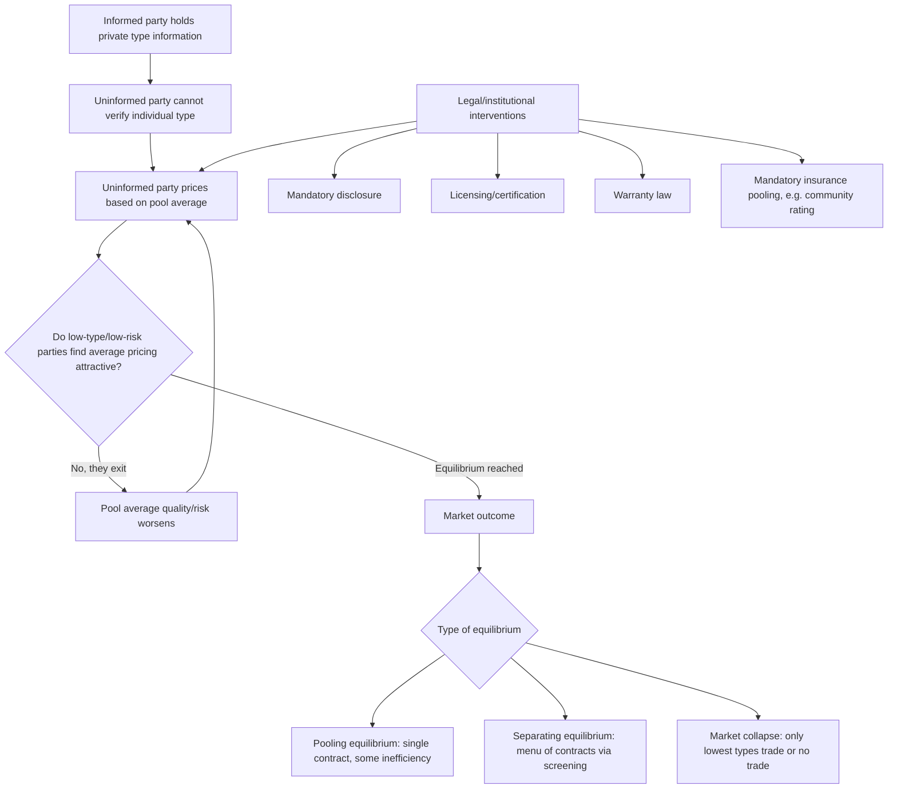

## Asymmetric Information and Adverse Selection

### Definitional Framework

#### Information Asymmetry

**Asymmetric information** describes a transaction environment in which one party possesses materially relevant information that the other party lacks, and where this informational gap cannot be costlessly closed prior to contracting. Asymmetric information is a necessary condition for adverse selection but is not, by itself, sufficient — the asymmetry must also concern a characteristic that affects the *value or riskiness* of the exchange itself (a "hidden characteristic" or "hidden type"), rather than a characteristic irrelevant to contract performance.

#### Adverse Selection Defined

**Adverse selection** is a pre-contractual information problem arising when the informed party's private information about their own type (quality, risk, or characteristics) influences their decision to enter into (or the terms on which they seek to enter into) a transaction, such that the pool of counterparties who actually transact becomes skewed relative to the pool the uninformed party would prefer to attract. The term is sometimes labeled a **"hidden information" problem**, distinguishing it from moral hazard's **"hidden action"** problem (see below).

**Key Points**

- Adverse selection operates on characteristics fixed *before* the contract (type), whereas moral hazard operates on behavior chosen *after* the contract (action).
- Adverse selection is a **screening/sorting failure**; moral hazard is a **monitoring/incentive failure**. The two frequently co-occur in the same market (e.g., insurance) but require analytically distinct legal and contractual responses.

### The Canonical Model: Akerlof's Market for Lemons

George Akerlof's 1970 paper "The Market for 'Lemons': Quality Uncertainty and the Market Mechanism" is the foundational formalization.

#### Setup

- Sellers of used cars know the true quality $q$ of their car, distributed uniformly on $[0, 1]$ (or $[q_{min}, q_{max}]$ in generalized form).
- Buyers cannot observe $q$ for any individual car and can only observe the market average quality, $E[q]$.
- Sellers value their own car at $q$ (reservation price); buyers value any car of quality $q$ at $k \cdot q$, where $k > 1$ represents a valuation premium buyers place on quality (buyers value cars more than sellers, which is what would ordinarily make trade mutually beneficial).

#### Mechanism of Unraveling

Because buyers cannot distinguish quality, they will only pay a price $p$ reflecting the **average quality of cars actually offered for sale** — not the average quality of all cars in existence. But the price offered determines *which* sellers are willing to sell:

$$p = k \cdot E[q \mid q \leq \bar{q}(p)]$$

where $\bar{q}(p)$ is the marginal quality threshold: sellers with $q > \bar{q}(p)$ withdraw from the market because the offered price is below their reservation value.

As lower-quality cars ("lemons") disproportionately populate the pool of cars actually offered (since high-quality sellers exit first when prices reflect a low average), $E[q \mid \text{offered}]$ falls, which lowers $p$ further, which induces further exit of remaining higher-quality sellers — an **unraveling** or **death spiral** dynamic. In the polar case with linear uniform distributions and no exogenous quality floor, this process can unravel completely, leaving only the lowest-quality goods traded, or eliminating the market entirely (**market collapse**), even though mutually beneficial trades exist at every quality level in the absence of the informational asymmetry.

#### Formal Unraveling Condition

For the uniform-distribution case with $q \sim U[0,1]$ and buyer valuation $k \cdot q$:

$$E[q \mid q \leq \bar{q}] = \frac{\bar{q}}{2}$$

Equilibrium requires $p = k \cdot \frac{\bar{q}}{2}$ and, since only sellers with $q \leq p$ participate, $\bar{q} = p$ in equilibrium, giving:

$$p = \frac{kp}{2} \implies p(1 - \frac{k}{2}) = 0$$

**[Inference]** For $k < 2$, the only equilibrium is $p^* = 0$, $\bar{q}^* = 0$: complete market unraveling. For $k \geq 2$, positive-quality trading equilibria can be sustained, illustrating that the severity of adverse-selection-driven unraveling is sensitive to the specific parameterization of buyer valuation relative to seller valuation — a modeling detail rather than a universal prediction of total market collapse in every asymmetric-information market.

### Diagrammatic Illustration: The Unraveling Spiral

<svg xmlns="http://www.w3.org/2000/svg" viewBox="0 0 700 420" font-family="sans-serif">
<text x="350" y="24" text-anchor="middle" font-size="16" font-weight="bold">Adverse Selection: Market Unraveling (svg_diagram)</text>

<line x1="80" y1="370" x2="620" y2="370" stroke="#333" stroke-width="2" />
<line x1="80" y1="370" x2="80" y2="50" stroke="#333" stroke-width="2" />
<text x="600" y="392" font-size="13">Quality threshold offered (q̄)</text>
<text x="30" y="55" font-size="13">Price ($)</text>

<line x1="80" y1="330" x2="560" y2="90" stroke="#2166ac" stroke-width="2" />
<text x="440" y="100" font-size="12" fill="#2166ac">Buyer WTP = k·E[q|offered]</text>

<line x1="80" y1="330" x2="560" y2="70" stroke="#b2182b" stroke-width="2" stroke-dasharray="5,3" />
<text x="440" y="65" font-size="12" fill="#b2182b">Seller reservation price = q̄</text>

<path d="M 400 200 L 340 230" stroke="#555" stroke-width="1.5" marker-end="url(#arrow)" />
<path d="M 340 230 L 280 260" stroke="#555" stroke-width="1.5" marker-end="url(#arrow)" />
<path d="M 280 260 L 220 290" stroke="#555" stroke-width="1.5" marker-end="url(#arrow)" />
<path d="M 220 290 L 160 320" stroke="#555" stroke-width="1.5" marker-end="url(#arrow)" />
<text x="230" y="220" font-size="11" fill="#555">Successive rounds of</text>
<text x="230" y="235" font-size="11" fill="#555">high-quality seller exit</text>
<circle cx="120" cy="345" r="5" fill="#000" />
<text x="90" y="392" font-size="11" font-weight="bold">q*≈0</text>
<text x="130" y="345" font-size="11">Collapsed equilibrium</text>
</svg>

### Adverse Selection Across Legal-Economic Domains

#### Insurance Markets

The archetypal legal application. Individuals possess private information about their own risk type (health status, driving habits, likelihood of loss) unknown to the insurer. If an insurer prices a policy at the **average** risk of the applicant pool, low-risk individuals find the premium unattractive relative to their true expected loss and exit (self-select out), while high-risk individuals find it attractive and select in — raising the average risk of the remaining pool, which forces premium increases, which induces further low-risk exit.

**[Inference]** In the polar Rothschild-Stiglitz (1976) model, this dynamic can preclude the existence of a **pooling equilibrium** (a single contract serving all types) in competitive insurance markets; the theoretical prediction is that only a **separating equilibrium** can survive, in which insurers offer a menu of contracts (see Screening, below) — though this remains a stylized theoretical result whose robustness depends on assumptions about market structure and the number of risk types.

#### Credit Markets

Borrowers know their own creditworthiness/repayment probability better than lenders. Raising interest rates to compensate for average default risk can adversely select for **riskier borrowers** (since safer borrowers are more likely to be discouraged by a high rate — a phenomenon Stiglitz and Weiss (1981) term **adverse selection in credit rationing**), leading lenders to ration credit quantity rather than clear the market purely through price, contrary to standard competitive market predictions.

#### Employment/Labor Markets

Job applicants possess private information about their own productivity, work ethic, or fit unknown to employers at the point of hiring, motivating signaling devices (educational credentials, per Spence 1973) as a partial market response (see Signaling, below).

#### Product and Warranty Markets

Sellers of goods/services (especially credence goods, such as professional or repair services) possess private information about quality that buyers cannot verify pre-purchase, motivating legal doctrines including implied warranties, mandatory disclosure regimes, and products liability rules that shift the cost of hidden defects back onto the informed party.

#### Corporate Finance and Securities Law

Firm insiders possess private information about firm value unknown to outside investors. This underlies:

- The **Myers-Majluf (1984) pecking order theory**: firms with positive private information prefer debt or internal financing over equity issuance, because issuing equity to an uninformed market signals (via adverse selection logic) that insiders believe the stock is overvalued, depressing the offer price.
- Mandatory disclosure requirements under securities law (e.g., registration statements, periodic reporting) as legally imposed information-forcing mechanisms designed to narrow the asymmetry.

### Legal and Market Responses to Adverse Selection

#### Signaling

**Signaling** (Spence, 1973) occurs when the **informed party** takes a costly, verifiable action to credibly reveal private information to the uninformed party. For signaling to be effective (a **separating equilibrium**), the signal must satisfy a **single-crossing condition**: the marginal cost of the signal must differ systematically across types, such that it is worthwhile for high-type agents to acquire the signal but not worthwhile for low-type agents to mimic it.

Formally, in the education-signaling model, if $C(e, \theta)$ is the cost of acquiring education level $e$ for a worker of ability $\theta$, single-crossing requires:

$$\frac{\partial}{\partial \theta}\left(\frac{\partial C}{\partial e}\right) < 0$$

— the marginal cost of an additional unit of education falls as ability rises, making it cheaper for high-ability workers to acquire a level of education that would be prohibitively costly for low-ability workers to fake.

**[Inference]** Signaling equilibria are typically **inefficient relative to a full-information benchmark** even when successful, because the signal (e.g., additional years of schooling beyond what is productivity-enhancing) may be privately rational to acquire purely for its sorting value, representing a social cost with no corresponding increase in underlying productivity — a claim that depends on the empirical split between education's signaling versus human-capital-formation value, which is contested in the labor economics literature.

#### Screening

**Screening** occurs when the **uninformed party** designs a menu of contracts such that different types self-select into different contracts, revealing their type through their choice. The Rothschild-Stiglitz insurance model is the canonical screening application: insurers offer a menu of (premium, deductible) pairs such that low-risk types self-select into high-deductible/low-premium contracts and high-risk types self-select into low-deductible/high-premium contracts, using **incentive compatibility constraints** to ensure each type prefers its intended contract:

$$U_i(\text{contract}_i) \geq U_i(\text{contract}_j) \quad \forall j \neq i$$

#### Mandatory Disclosure Regimes

Legal rules compelling the informed party to disclose material information (securities law disclosure mandates, real estate seller disclosure statutes, consumer protection labeling requirements, lender disclosure under truth-in-lending regimes) function as a direct legal substitute for costly private signaling or screening, shifting the cost of information transmission from market mechanisms to regulatory mandate.

**Key Points**

- Disclosure mandates are generally justified on efficiency grounds when private signaling/screening is infeasible or excessively costly, but they carry their own costs: compliance costs, potential over-disclosure/information overload reducing marginal usefulness, and risk of strategic ambiguity in required disclosures.

#### Warranties and Products Liability

Legally mandated or implied warranties shift the cost of hidden defects (a quality-type asymmetry) back onto sellers, who are the informed party, thereby internalizing the cost of quality variation into the seller's own decision-making rather than leaving buyers to bear undiagnosable risk — this can be understood as a **legally imposed signaling substitute**, since only sellers confident in their product quality can profitably offer a strong warranty (weak-quality sellers would face expected warranty payout costs exceeding the premium buyers are willing to pay).

#### Licensing and Certification

Occupational licensing, professional certification, and third-party quality certification (e.g., credit ratings, safety certifications) function as institutionalized screening/signaling mechanisms that substitute a verified, publicly observable credential for otherwise unobservable individual quality.

**[Unverified]** The empirical literature on occupational licensing is mixed regarding whether such regimes primarily solve genuine adverse selection problems or primarily function as rent-extraction devices for incumbent license-holders (a public-choice critique); this remains a genuinely disputed empirical question rather than a settled inference.

### Adverse Selection vs. Moral Hazard: Comparative Framework

| Dimension | Adverse Selection | Moral Hazard |
| --- | --- | --- |
| **Timing** | Pre-contractual (hidden type) | Post-contractual (hidden action) |
| **Information problem** | Hidden characteristic | Hidden behavior |
| **Legal/market response** | Screening, signaling, disclosure mandates | Monitoring, deductibles/co-insurance, incentive contracts |
| **Canonical example** | Insurance risk-pool composition | Reduced care-taking after obtaining insurance |
| **Key model** | Akerlof (1970); Rothschild-Stiglitz (1976) | Holmström (1979); principal-agent theory |

### Process Flow: Adverse Selection Dynamics

### Worked Numerical Example: Insurance Pooling

Consider two risk types in a population, each 50% of the pool:

- **Low-risk**: probability of loss $\pi_L = 0.05$, loss amount $L = \$10{,}000$, so expected loss $= \$500$.
- **High-risk**: probability of loss $\pi_H = 0.20$, loss amount $L = \$10{,}000$, so expected loss $= \$2{,}000$.

**Pooled (community-rated) premium**, if insurer cannot distinguish types and prices at the population average expected loss:

$$\text{Pooled premium} = 0.5(500) + 0.5(2{,}000) = \$1{,}250$$

**Selection dynamic**: Low-risk individuals face a premium ($1,250) far exceeding their true expected loss ($500), creating a strong incentive to decline coverage or seek alternative (self-insurance/uninsured) arrangements if legally permitted. If low-risk individuals exit, the insurer's pool becomes 100% high-risk, and the sustainable premium rises to $2,000 — a discrete jump illustrating how adverse selection forces premiums to track the risk composition of *who remains insured*, not the population as a whole.

**Conclusion**: This example demonstrates why mechanisms such as mandatory universal enrollment (removing the low-risk exit option), medical underwriting/risk-based pricing (screening by type), or subsidized community rating (a legally imposed cross-subsidy) each represent a distinct policy response to the same underlying selection dynamic, with different efficiency and distributional consequences.

### Related Topics

- Moral hazard and principal-agent theory
- Rothschild-Stiglitz screening equilibrium and its non-existence problem
- Spence job-market signaling model
- Mandatory disclosure regulation in securities law
- Community rating and guaranteed issue in health insurance regulation
- Credit rationing (Stiglitz-Weiss model)
- Implied warranties and products liability doctrine
- Behavioral law and economics: bounded rationality in information processing
- Mechanism design and revelation principle