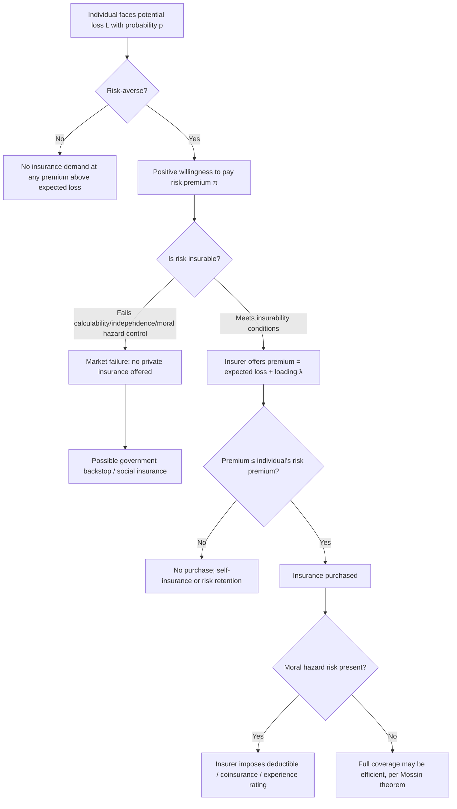

## Risk, Uncertainty, and Insurance Theory

### Definitional Framework

#### Risk vs. Uncertainty

The Knightian distinction (Frank Knight, 1921) separates two conceptually distinct decision environments:

- **Risk**: outcomes are unknown but governed by a known (or objectively estimable) probability distribution. Decision-makers can, at least in principle, compute expected values and variances.
- **Uncertainty** (sometimes termed **Knightian uncertainty** or **ambiguity**): outcomes are unknown and the underlying probability distribution itself is unknown or unknowable, precluding standard expected-utility calculation.

**Key Points**

- Most legal-economic modeling of insurance, tort liability, and contract default risk operationally treats decision environments as risk (assuming an ascertainable probability distribution), because tractable models require it — but courts and regulators frequently confront genuine Knightian uncertainty (novel liability exposures, emerging technologies, systemic financial risk), where this modeling simplification breaks down.
- **[Inference]** The practical legal significance of the risk/uncertainty distinction is greatest in contexts like novel tort claims (e.g., emerging technology harms) or catastrophic/systemic risk regulation, where actuarial history is sparse or nonexistent, making the risk-based expected-utility toolkit of limited direct applicability without substantial extension or reliance on subjective probability assessment.

### Expected Utility Theory

#### The Von Neumann-Morgenstern Framework

Rational choice under risk is standardly modeled via **expected utility theory** (von Neumann & Morgenstern, 1944): an individual facing a lottery over outcomes $x_1, \ldots, x_n$ with probabilities $p_1, \ldots, p_n$ evaluates the lottery according to:

$$EU = \sum_{i=1}^n p_i \, u(x_i)$$

where $u(\cdot)$ is a von Neumann-Morgenstern utility function, unique up to positive affine transformation, provided preferences satisfy the axioms of completeness, transitivity, continuity, and independence.

#### Risk Attitudes

The curvature of $u(\cdot)$ characterizes risk attitude:

- **Risk-averse**: $u''(x) < 0$ (concave utility). The individual prefers the certain expected value of a lottery to the lottery itself.
- **Risk-neutral**: $u''(x) = 0$ (linear utility). Indifferent between a lottery and its expected value.
- **Risk-seeking**: $u''(x) > 0$ (convex utility). Prefers the lottery to its certain expected value.

#### Measures of Risk Aversion

The **Arrow-Pratt coefficient of absolute risk aversion**:

$$A(x) = -\frac{u''(x)}{u'(x)}$$

measures local risk aversion at wealth level $x$. The **coefficient of relative risk aversion**:

$$R(x) = -\frac{x \, u''(x)}{u'(x)} = x \cdot A(x)$$

**Key Points**

- **Decreasing absolute risk aversion (DARA)** — the empirically standard assumption — implies that individuals hold a larger absolute dollar amount in risky assets as wealth increases, a property commonly assumed in insurance demand and portfolio choice modeling.
- These measures are directly used in law-and-economics analysis of optimal insurance coverage, punitive damages calibration, and the efficient allocation of risk in contract default rules.

#### The Certainty Equivalent and Risk Premium

For a lottery with expected value $E[x]$, the **certainty equivalent** $CE$ is the certain amount that yields the same utility as the lottery: $u(CE) = E[u(x)]$. The **risk premium** $\pi$ is the amount a risk-averse individual is willing to forgo to eliminate risk:

$$\pi = E[x] - CE$$

For small risks, a second-order Taylor approximation yields the **Pratt-Arrow approximation**:

$$\pi \approx \frac{1}{2} \sigma^2 A(E[x])$$

where $\sigma^2$ is the variance of the lottery. This formalizes the intuition that risk premiums scale with both the *variance* of the risk and the individual's *degree* of risk aversion.

### Diagrammatic Illustration: Risk Aversion and the Risk Premium

<svg xmlns="http://www.w3.org/2000/svg" viewBox="0 0 700 420" font-family="sans-serif">
<text x="350" y="24" text-anchor="middle" font-size="16" font-weight="bold">Concave Utility, Certainty Equivalent, and Risk Premium (svg_diagram)</text>

<line x1="80" y1="370" x2="620" y2="370" stroke="#333" stroke-width="2" />
<line x1="80" y1="370" x2="80" y2="50" stroke="#333" stroke-width="2" />
<text x="600" y="392" font-size="13">Wealth (x)</text>
<text x="30" y="55" font-size="13">Utility u(x)</text>

<path d="M 100 340 Q 300 120 560 90" stroke="#2166ac" stroke-width="2.5" fill="none" />
<text x="480" y="80" font-size="12" fill="#2166ac">u(x)</text>

<circle cx="180" cy="300" r="4" fill="#000" />
<text x="160" y="392" font-size="11">x_L</text>
<line x1="180" y1="370" x2="180" y2="300" stroke="#999" stroke-dasharray="3,3" />
<circle cx="480" cy="105" r="4" fill="#000" />
<text x="465" y="392" font-size="11">x_H</text>
<line x1="480" y1="370" x2="480" y2="105" stroke="#999" stroke-dasharray="3,3" />

<line x1="180" y1="300" x2="480" y2="105" stroke="#b2182b" stroke-width="1.5" stroke-dasharray="4,3" />

<line x1="330" y1="370" x2="330" y2="202" stroke="#333" stroke-dasharray="2,2" />
<text x="315" y="392" font-size="11" font-weight="bold">E[x]</text>
<circle cx="330" cy="202" r="4" fill="#b2182b" />
<text x="335" y="200" font-size="11" fill="#b2182b">E[u(x)]</text>

<line x1="260" y1="370" x2="260" y2="202" stroke="#2ca25f" stroke-dasharray="2,2" />
<text x="240" y="392" font-size="11" font-weight="bold" fill="#2ca25f">CE</text>
<circle cx="260" cy="202" r="4" fill="#2ca25f" />

<line x1="260" y1="350" x2="330" y2="350" stroke="#000" stroke-width="1.5" />
<text x="270" y="345" font-size="11" font-weight="bold">π (risk premium)</text>
</svg>

Because $u(\cdot)$ is concave, the utility of the expected value, $u(E[x])$, lies **above** the expected utility of the lottery, $E[u(x)]$ (Jensen's inequality). The certainty equivalent $CE < E[x]$, and the gap $\pi = E[x] - CE$ is the maximum amount the individual would pay to convert the uncertain lottery into a certain payment of $CE$ — the theoretical foundation of insurance demand.

### Insurance Theory

#### Demand for Insurance

A risk-averse individual with wealth $W$ facing a potential loss $L$ with probability $p$ will purchase full insurance at any actuarially fair premium $\pi = pL$ (or below), because full insurance eliminates variance entirely while leaving expected wealth unchanged — a first-order welfare improvement for any risk-averse agent, regardless of the specific degree of risk aversion, given fair pricing.

Formally, the individual chooses coverage level $\alpha \in [0,1]$ to maximize:

$$EU(\alpha) = (1-p) \, u(W - \alpha \pi) + p \, u(W - L + \alpha L - \alpha \pi)$$

At an actuarially fair premium ($\pi = pL$), the first-order condition yields $\alpha^* = 1$: **full insurance is optimal** for a risk-averse individual facing fair pricing — the **Mossin (1968) theorem**.

**[Inference]** Real-world insurance markets rarely offer actuarially fair pricing (loading factors, administrative costs, and adverse-selection/moral-hazard-driven markups are standard), which is why the theoretical prediction of full coverage is frequently not observed empirically; optimal coverage under "loaded" (above-fair) premiums is generally *less than full*, with the degree of underinsurance increasing in the loading factor and decreasing in the individual's risk aversion.

#### Optimal Coverage Under Loaded Premiums

With a loading factor $\lambda > 0$ such that $\pi = (1+\lambda)pL$, the first-order condition for optimal coverage $\alpha^*$ becomes:

$$(1-p) \, u'(W - \alpha\pi) \cdot (-\pi) + p \, u'(W - L + \alpha L - \alpha\pi) \cdot (L - \pi) = 0$$

This generally yields an interior solution $0 < \alpha^* < 1$ — partial insurance — with the specific level depending on the interaction of loading, loss probability, loss severity, and the curvature of $u(\cdot)$.

#### Risk Pooling and the Law of Large Numbers

Insurers can profitably offer coverage close to actuarially fair rates because pooling a large number of statistically independent (or weakly correlated) risks reduces the *insurer's* aggregate variance relative to any individual policyholder's variance, per the law of large numbers:

$$\text{Var}\left(\frac{1}{n}\sum_{i=1}^n L_i\right) = \frac{\sigma_L^2}{n} \quad \text{(for i.i.d. losses)}$$

This is the fundamental economic rationale for insurance institutions: risk that is undiversifiable for an individual becomes statistically manageable when pooled across a sufficiently large and sufficiently uncorrelated portfolio.

**Key Points**

- Pooling efficacy depends critically on the **correlation structure** of underlying risks. Catastrophic, systemic, or highly correlated risks (pandemics, widespread natural disasters, systemic financial crises) do not benefit from pooling in the same way as independent idiosyncratic risks (individual auto accidents, individual health events), which is the core actuarial and legal rationale for distinguishing "insurable" from "uninsurable" risk categories and for government backstop mechanisms in catastrophic-risk lines.

#### Insurability Conditions

Standard actuarial/legal criteria for a risk to be commercially insurable include:

1. **Calculable probability**: a statistically estimable loss probability (distinguishing insurable risk from Knightian uncertainty).
2. **Fortuity/randomness**: the loss must be accidental from the insured's perspective, not a certainty or subject to the insured's unilateral control (this is the doctrinal root of the **fortuity doctrine** in insurance law, and the underlying rationale for the moral-hazard-driven exclusion of intentional acts from coverage).
3. **Independence/limited correlation**: losses across the insured pool should not be so highly correlated as to threaten simultaneous, undiversifiable insurer insolvency.
4. **Economically feasible premium**: the actuarially required premium must not exceed what a rational insured is willing to pay, i.e., the risk premium (from expected utility theory above) must exceed the insurer's loading cost.
5. **Absence of adverse selection/moral hazard so severe as to make pricing infeasible** (see below and the companion topic on asymmetric information).

### Moral Hazard in Insurance

Insurance coverage itself alters the insured's incentive to prevent or mitigate loss, since the insured no longer bears the full marginal cost of the loss — the canonical **moral hazard** (hidden action) problem, distinct from adverse selection (hidden type, covered separately).

- **Ex ante moral hazard**: reduced precautionary effort *before* a loss occurs (e.g., reduced fire-safety investment once fire insurance is obtained).
- **Ex post moral hazard**: excessive claiming or loss-inflation *after* a loss occurs (e.g., overconsumption of medical care once health insurance eliminates most of the marginal cost).

#### Contractual Responses to Moral Hazard

- **Deductibles**: a fixed threshold below which the insured bears the full loss, restoring some marginal incentive for loss prevention on small losses.
- **Coinsurance**: the insured bears a fixed percentage $\gamma$ of any loss regardless of size, so marginal incentive to prevent/mitigate loss is preserved proportionally: $\text{insured's marginal cost} = \gamma \cdot \text{marginal loss}$.
- **Policy limits/caps**: bound the insurer's maximum exposure, indirectly limiting the insured's incentive to allow losses to escalate without limit.
- **Experience rating**: premiums adjusted based on the insured's own claims history, partially re-internalizing the cost of risk-increasing behavior over time even within a pooled/community framework.

**[Inference]** The optimal deductible/coinsurance structure trades off moral hazard mitigation (favoring higher deductibles/lower coinsurance rates) against the risk-bearing costs this reimposes on a risk-averse insured (favoring lower deductibles) — the precise optimum is a function of the insured's risk aversion, the elasticity of loss-prevention effort with respect to marginal cost, and the monitoring cost the insurer would otherwise incur to directly observe precaution levels.

### Legal Applications

#### Tort Law and the Learned Hand Formula

Judge Learned Hand's negligence formula in *United States v. Carroll Towing Co.* (1947), $B < PL$ (burden of precaution less than probability of loss times magnitude of loss implies negligence if precaution is not taken), is a direct application of expected-loss/risk analysis to legal liability standards, and interacts with insurance theory insofar as liability insurance shifts the *identity* of the risk-bearer without necessarily changing the socially efficient precaution level (subject to the moral hazard caveat above).

#### Risk Allocation in Contract Law

Default contract rules (e.g., *Hadley v. Baxendale*'s foreseeability limitation on consequential damages, force majeure and impossibility doctrines) function as **default risk-allocation mechanisms** that parties can contract around, and law-and-economics analysis typically evaluates such defaults by asking which party is the **superior risk bearer** — generally, the party that is less risk-averse, better able to self-insure, or has lower-cost access to insurance markets — consistent with the Coasean insight that efficient default rules should minimize transaction costs of reallocating risk via private bargaining.

#### Punitive Damages and Risk-Based Deterrence

Where the probability of detection/enforcement $p < 1$, economically optimal deterrence requires damages scaled by $1/p$ to preserve expected liability equal to actual harm (the **Polinsky-Shavell multiplier principle**), directly applying expected-value reasoning under risk to the calibration of punitive damages.

#### Government as Insurer of Last Resort

Where private insurability conditions fail (severe correlation risk, e.g., flood, terrorism, pandemic, nuclear liability), governments frequently step in as reinsurer or direct insurer (e.g., the U.S. National Flood Insurance Program, the Terrorism Risk Insurance Act, the Price-Anderson Nuclear Industries Indemnity Act), reflecting a policy judgment that market failure in catastrophic-risk insurability justifies public risk-bearing, financed through taxation's own broad risk-pooling capacity across the general population.

### Process Flow: Insurance Decision Architecture

### Worked Numerical Example

An individual has wealth $W = \$100{,}000$ and faces a $p = 0.02$ probability of a loss $L = \$50{,}000$. Utility is $u(x) = \sqrt{x}$ (constant relative risk aversion, $R = 0.5$).

**Expected loss**: $pL = 0.02 \times 50{,}000 = \$1{,}000$.

**Expected utility without insurance**:

$$EU = 0.98 \sqrt{100{,}000} + 0.02\sqrt{50{,}000} = 0.98(316.23) + 0.02(223.61) = 309.90 + 4.47 = 314.37$$

**Certainty equivalent**: solve $\sqrt{CE} = 314.37 \implies CE = 98{,{}728}$ (approximately $98,808 with rounding refinement).

**Risk premium**: $\pi = E[W] - CE = (100{,}000 - 1{,}000) - 98{,}808 \approx \$192$.

**Conclusion**: This individual would be willing to pay up to approximately $1,000 + $192 = $1,192 for full insurance (expected loss plus risk premium), even though the actuarially fair premium is only $1,000 — the $192 gap represents the insurer's maximum sustainable loading margin for this individual before the policy becomes unattractive relative to self-insurance, illustrating the direct link between the Arrow-Pratt risk aversion measure and observed insurance demand elasticity.

### Related Topics

- Adverse selection and asymmetric information in insurance markets
- Moral hazard and principal-agent contract design
- Learned Hand formula and economic analysis of negligence
- Optimal deterrence theory and the Polinsky-Shavell damages multiplier
- Catastrophic risk regulation and government reinsurance programs
- Behavioral economics critiques of expected utility (prospect theory, probability weighting)
- Efficient risk allocation in contract default rules (Hadley v. Baxendale, force majeure)
- Reinsurance markets and risk securitization (catastrophe bonds)